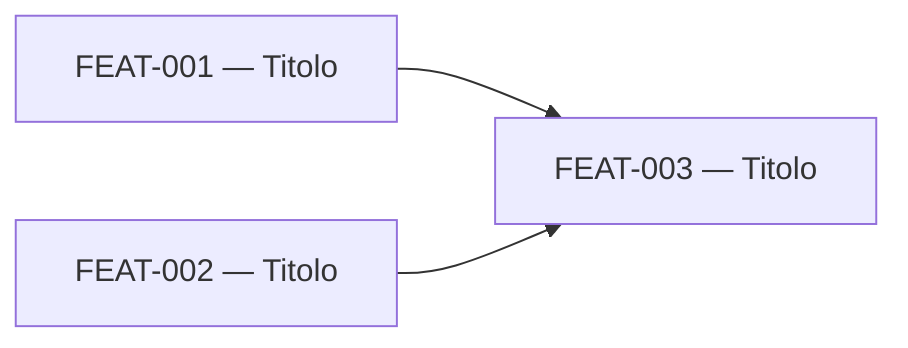

# Modelli del backlog

Usare le sezioni seguenti senza rimuovere quelle obbligatorie. Omettere una sottosezione tecnica soltanto quando non è pertinente e indicare brevemente il motivo.

## Indice `backlog/README.md`

````md
# Backlog — <iniziativa>

## Fonti autorevoli

| Fonte | Percorso | Ruolo |
|---|---|---|
| Analisi funzionale | <path> | Comportamenti, scope e requisiti |
| Architettura | <path> | Confini, responsabilità e vincoli tecnici |
| Istruzioni repository | <path> | Regole di implementazione e Definition of Done |

## Scope protetto

### In scope

- <risultati approvati sintetici>

### Out of scope

- <esclusioni che il backlog deve preservare>

## Gate e verifiche aperte

| ID | Tipo | Domanda o verifica | Feature interessate | Condizione di chiusura |
|---|---|---|---|---|
| GATE-001 | blocking / technical-check | <descrizione> | FEAT-... | <evidenza richiesta> |

Scrivere `Nessuno` quando non esistono gate o verifiche.

## Strategia di scomposizione

Spiegare in poche righe i confini scelti, perché le feature sono vertical slice e dove sono state necessarie feature abilitanti.

## Ordine di esecuzione

| Wave | Feature | Tipo | Risultato | Dipendenze hard | Parallelismo |
|---|---|---|---|---|---|
| 1 | FEAT-001 — <titolo> | product / enabler / operational | <esito> | Nessuna | Con FEAT-... |

### Checkpoint per lavoro parallelo

| Checkpoint | Feature coinvolte | Contratto da congelare | Possibili conflitti |
|---|---|---|---|
| CP-001 | FEAT-..., FEAT-... | <API, schema, componente o convenzione> | <file/area condivisa> |

### Grafo delle dipendenze



Usare frecce dal prerequisito alla feature dipendente. Rappresentare con linea tratteggiata le dipendenze `contract` e aggiungere una legenda.

### Percorso critico

`FEAT-... → FEAT-... → FEAT-...`

Motivare il percorso in base alle dipendenze, non a stime inventate.

## Catalogo feature

| ID | Codice | Titolo | Readiness | Wave | File |
|---|---|---|---|---|---|
| FEAT-001 | <feature-code> | <titolo> | ready / blocked | 1 | features/<feature-code>/feature.md |

## Matrice di tracciabilità

| Requisito o vincolo | Feature primaria | Feature di supporto | Criteri che lo verificano |
|---|---|---|---|
| FR-001 | FEAT-001 | FEAT-... / Nessuna | AC-001, AC-... |

## Verifica di copertura

- Requisiti in scope: <n>
- Requisiti con owner primario: <n>
- Requisiti non coperti: <elenco motivato o Nessuno>
- Feature senza requisito o vincolo sorgente: <elenco motivato o Nessuna>
- Dipendenze cicliche: Nessuna
````

## Scheda `features/<feature-code>/feature.md`

````md
# FEAT-001 — <titolo orientato al risultato>

- **Codice**: `<feature-code>`
- **Tipo**: `product` / `enabler` / `operational`
- **Readiness**: `ready` / `blocked`
- **Wave**: <numero>
- **Risultato**: <una frase osservabile>

## Contesto autonomo

Spiegare il problema, l'attore o trigger, il comportamento attuale rilevante e il risultato atteso. Includere ciò che serve per sviluppare la feature senza leggere altre schede.

## Scope

### Incluso

- <comportamenti e artefatti necessari>

### Escluso

- <confini espliciti e rinvii legittimi>

## Tracciabilità

| Tipo | Riferimenti | Contributo della feature |
|---|---|---|
| Flussi | FLOW-... | <copertura> |
| Requisiti | FR-..., NFR-... | <copertura> |
| Regole/decisioni | BR-..., DEC-..., ASM-... | <copertura> |
| Architettura | ADR-..., sezione/componente | <vincolo applicato> |

## Dipendenze

### Feature prerequisite

| Feature | Tipo | Motivo | Output richiesto | Effetto sul parallelismo |
|---|---|---|---|---|
| FEAT-... — <titolo> | hard / contract | <perché> | <contratto o comportamento> | <blocco o checkpoint> |

Scrivere `Nessuna` se la feature non dipende da altre feature.

### Gate e assunzioni

| ID | Stato | Impatto | Evidenza per chiudere |
|---|---|---|---|
| GATE-... / ASM-... | open / accepted | <impatto> | <decisione, misura o verifica> |

### Parallelismo consentito

Indicare le feature che possono procedere in parallelo, il checkpoint richiesto e le aree che non devono essere modificate senza coordinamento. Scrivere `Nessuno` se non è sicuro.

## Contratto di consegna

### Comportamento

- <input, azione, output ed effetti>
- <stati principali, vuoti, caricamento, successo ed errore pertinenti>

### Touchpoint previsti

- **Dominio/business**: <regole e orchestrazione oppure Non pertinente>
- **Persistenza/migration**: <dati, vincoli e rollback oppure Non pertinente>
- **API/integrazioni**: <contratti, autorizzazione, idempotenza oppure Non pertinente>
- **Frontend/UX**: <route, componenti, responsive, accessibilità e i18n oppure Non pertinente>
- **Infrastruttura/configurazione**: <modifiche minime approvate oppure Nessuna>
- **Documentazione/operazioni**: <guide, help, runbook, release note>

Indicare percorsi reali già noti. Non inventare una struttura incompatibile con l'architettura.

### Errori, sicurezza e osservabilità

- <validazioni e Problem Details/esiti applicabili>
- <autenticazione, autorizzazione, privacy e redazione>
- <log, metriche e trace utili senza PII>

## Criteri di accettazione

### AC-001 — <titolo>

- **Dato** <precondizione>
- **Quando** <azione>
- **Allora** <esito osservabile>
- **Fonte**: FR-... / BR-... / NFR-...

Includere criteri per percorso principale, errori, permessi, concorrenza e casi limite pertinenti. Non creare criteri privi di fonte approvata.

## Strategia di verifica

| Livello | Verifica | Evidenza attesa |
|---|---|---|
| Unitario | <regole pure> | <test> |
| Integrazione | <DB/API/provider> | <test> |
| Frontend/component | <stati e accessibilità> | <test o N/A motivato> |
| End-to-end/manuale | <flusso ad alto rischio> | <evidenza> |
| Validator repository | <comandi applicabili> | <esito> |

## Definition of Done

- Tutti i criteri di accettazione sono verificati.
- Le dipendenze dichiarate sono integrate o i contratti previsti sono congelati.
- Test, documentazione, localizzazione, accessibilità, telemetria, migration e change fragment applicabili sono aggiornati.
- I comandi di qualità richiesti dalle istruzioni del repository sono eseguiti e riportati senza dichiarazioni non verificate.
- Non sono introdotti elementi out of scope, secret o dipendenze architetturali vietate.
- La feature è completa senza richiedere una feature futura per correggere comportamento, sicurezza o documentazione.
````

## Regole di compilazione

- Usare titoli orientati al risultato, non all'attività: `Unirsi a una famiglia con codice`, non `Creare endpoint join`.
- Inserire la dipendenza nella scheda che la subisce, anche se è già visibile nel grafo.
- Mantenere `Readiness: blocked` finché un gate bloccante resta aperto; una dipendenza hard già pianificata non rende da sola la feature `blocked`.
- Trattare una feature come `ready` quando scope e criteri sono definiti e può iniziare appena i prerequisiti pianificati sono disponibili.
- Non usare `TBD` senza un gate, un responsabile della decisione o una prova di chiusura.
- Non assegnare story point, date o persone se non richiesto.
- Non duplicare interi requisiti: citare gli ID e descrivere soltanto il contributo della feature.
