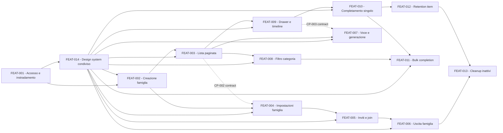

# Backlog - KinList

## Fonti autorevoli

| Fonte | Percorso | Ruolo |
|---|---|---|
| Analisi funzionale | `docs/kinlist/brainstorming/functional-analysis.md` | Fonte primaria per scope, flussi `FLOW-001`-`FLOW-014`, requisiti `FR-001`-`FR-055`, regole `BR-001`-`BR-041`, decisioni `DEC-001`-`DEC-035`, ipotesi e casi limite |
| Architettura | `docs/kinlist/brainstorming/architecture.md` | Fonte primaria per confini, componenti, ADR `ADR-001`-`ADR-017`, sicurezza, dati, integrazioni e test |
| Trascrizione | `docs/kinlist/brainstorming/transcription.txt` | Contesto originario; non prevale sui documenti consolidati, che hanno escluso ruoli/gruppi e astrazioni speculative |
| Istruzioni repository | `AGENTS.md` | Regole autorevoli di implementazione, documentazione, qualità, sicurezza e Definition of Done |
| Template backlog | `.agents/skills/backlog/references/backlog-templates.md` | Struttura obbligatoria di indice e schede feature |
| Backend esistente | `src/backend/`, `tests/` | Stato reale dei layer, composition root, EF Core, Problem Details e test; KinList non è ancora implementato |
| Frontend esistente | `src/frontend/src/`, `src/frontend/public/staticwebapp.config.json`, `src/frontend/vite.config.ts` | Stato reale di routing, Settings, MSAL, API client, i18n, help e PWA |
| Design system condiviso integrato | `src/frontend/src/components/ui/`, `src/frontend/src/components/FloatingBars.tsx`, `src/frontend/src/components/KinPatterns.tsx`, `src/frontend/src/components/Layout.tsx`, `src/frontend/src/styles.css` | Primitive ufficiali, floating navigation, wrapper sottili e token finali riusati nelle pagine reali |
| Infrastruttura esistente | `infra/`, `.github/workflows/`, `docs/operations/database-migrations.md` | Risorse condivise, deployment, migrazioni e differenze da colmare rispetto all'architettura approvata |

I documenti in `docs/kinlist/research/` non sono stati usati come fonte di nuovi requisiti: analisi e architettura ne hanno già consolidato gli esiti approvati.

## Scope protetto

### In scope

- Riconoscimento stabile tramite `(iss, oid)`, profilo applicativo, una sola famiglia attiva e onboarding obbligatorio.
- Creazione famiglia, pagina Famiglia, membri, inviti manuali monouso, join, revoca e uscita.
- Lista familiare condivisa, visibilità server-side, autore, ordine stabile, paginazione e filtro singolo per categoria.
- Registrazione vocale in memoria e generazione sincrona di gruppi Shared tramite Azure AI Foundry.
- Drawer, modifica esplicita, categorie e timeline con concorrenza ottimistica.
- Completamento singolo e bulk atomico con undo entro cinque secondi.
- PWA installabile e mobile-first, sola shell pubblica offline, temi e localizzazione `it`/`en`.
- Design system condiviso KinHub, con sostituzione totale della UI legacy nelle pagine correnti, componenti generici/customizzabili, wrapper specifici quando utili e riuso obbligatorio nelle feature successive.
- Retention degli item completati e cleanup dei dati inattivi come esiti distinti del timer giornaliero.
- Sicurezza, privacy, accessibilità, osservabilità, documentazione e test applicati nelle feature che toccano le relative superfici.

### Out of scope

- Più famiglie attive, selettore famiglia o più liste nominabili.
- Ruoli, amministratori, proprietari, gruppi/permessi predisposti o rimozione di altri membri.
- Eliminazione account self-service o recupero utente di famiglie inattivate.
- Inviti via email, link, notifiche, rubrica o ricerca utenti/famiglie.
- Creazione manuale di item, UI Personal, conversione di visibilità o trasferimento owner.
- Schermata completati, recupero dopo la finestra undo o successo parziale bulk.
- Anteprima/riproduzione audio, conferma trascrizione, storage audio, code o pipeline asincrona.
- Dati personali offline, accodamento operazioni, realtime, analytics di prodotto o gamification.
- Nuove risorse Azure, microservizi, Function App dedicata, CQRS, mediator o event bus.
- Convivenza permanente tra componenti/stili legacy e design system, duplicazione di componenti, stringhe visibili fuori da i18n o boilerplate UI parallelo.

## Requisiti e decisioni approvati

- I 55 requisiti funzionali `FR-001`-`FR-055`, le 41 regole `BR-001`-`BR-041` e le decisioni `DEC-001`-`DEC-035` sono congelati come descritto nell'analisi funzionale.
- Gli ADR `ADR-001`-`ADR-017` definiscono l'implementazione approvata: monolite modulare, schemi PostgreSQL condiviso/kinlist, managed identity, policy `Family`, AI sincrona, keyset pagination e transazioni locali.
- La trascrizione non apre una predisposizione per ruoli o gruppi: `DEC-013`, `ADR-003` e `ADR-011` impongono capacità uniformi senza ruoli.
- La struttura logica proposta dall'architettura va adattata ai layer reali `domains`, `business`, `infrastructure`, `applications`; non autorizza nuovi progetti o rinominazioni non necessarie.

## Vincoli trasversali

- Ogni API su una famiglia esistente usa policy esattamente `Family`, `familyId` in query string e scope ripetuto nel caso d'uso e nel repository.
- Ogni collezione applica filtro, visibilità e ordine prima della keyset pagination; nessun `Get All`; limite lettura massimo 5000 e chunk scrittura massimo 1000.
- API ed errori usano Problem Details con `code`, `traceId` e correlazione; log, metriche e trace non contengono token, audio, codici, nomi, categorie o altri contenuti personali.
- Tutte le UI nuove sono mobile-first, accessibili, compatibili con temi, localizzate in italiano e inglese e conformi a `PageScaffold`, help e route registry quando sono route.
- API autenticate e dati personali sono network-only; la PWA conserva offline soltanto asset pubblici della shell.
- Ogni feature significativa aggiorna change fragment; migration e rollback seguono `docs/operations/database-migrations.md`.
- Il backend resta nei layer esistenti e usa `CancellationToken`; nessuna migration lunga al cold start e nessun lavoro remoto arbitrario in avvio.

## Ipotesi da confermare

| ID | Stato | Impatto | Trattamento nel backlog |
|---|---|---|---|
| ASM-004 | Open, non bloccante | Un nome profilo può permettere iniziali più descrittive | FEAT-003 e FEAT-004 verificano i dati disponibili; il fallback approvato `Membro`/`Member` e `?` mantiene il comportamento completo |
| ASM-007 | Open, bloccante per privacy | Stabilisce se la cancellazione può avvenire dopo la soglia senza garanzia all'istante esatto | Tracciata come GATE-002 su FEAT-012 e FEAT-013; non cambia il divieto assoluto di cancellazione anticipata |

## Decisioni aperte

Nessuna decisione funzionale condivisa è aperta. Le selezioni tecniche non ancora concrete sono classificate sotto, senza riaprire lo scope.

## Gate e verifiche aperte

| ID | Tipo | Domanda o verifica | Feature interessate | Condizione di chiusura |
|---|---|---|---|---|
| GATE-001 | blocking | Quali deployment, modello/versione pinned e regione Azure AI Foundry sono approvati per ogni ambiente, con identità gestita e contratto strict supportato? | FEAT-007 | Decisione tecnica registrata con identificativi non segreti, disponibilità/capacità verificata, RBAC definito e contratto provider eseguibile |
| GATE-002 | blocking | Privacy/prodotto confermano ASM-007: nessuna cancellazione prima di 30 periodi di 24 ore, ma è ammesso completarla in esecuzioni giornaliere successive? | FEAT-012, FEAT-013 | Approvazione registrata della semantica di ritardo; eventuale SLA diverso richiede aggiornamento delle fonti prima dell'implementazione |
| TECH-001 | technical-check | L'issuer atteso emette stabilmente `iss` e `oid` e la configurazione MSAL/JWT usa audience e scope corretti? | FEAT-001 | Test con token rappresentativi e casi claim mancanti fail-closed |
| TECH-002 | technical-check | Quali nomi, regione, rete e principal esistenti vanno riusati e come si migra PostgreSQL da password/Entra disabilitato a managed identity senza interrompere il deploy? | FEAT-001 | Inventario ambienti, piano migration verificabile e preflight della connessione identity-based |
| TECH-003 | technical-check | Quali formato/protezione/durata dei cursori e ordini totali sono adatti a ogni collezione? | FEAT-003, FEAT-004, FEAT-009, FEAT-012, FEAT-013 | Contratti opachi congelati, indici verificati e test avanti/indietro/stale senza dati nel cursore |
| TECH-004 | technical-check | Host, proxy e browser target supportano request end-to-end da 90 secondi e i MIME Opus/MP3/AAC/WAV realmente prodotti? | FEAT-007 | Verifica ambiente/browser documentata; timeout e formati rifiutati in modo esplicito se non approvati |
| TECH-005 | technical-check | La transazione da 5000 item in cinque chunk da 1000 rispetta timeout e contesa accettabili? | FEAT-011 | Test PostgreSQL reale con 5000 item, failure injection e metriche di durata/rollback |
| TECH-006 | technical-check | Quali budget host, ordine foreign key e comportamento backup/PITR si applicano alle cancellazioni? | FEAT-012, FEAT-013 | Runbook e test job definiscono budget, ripresa, ordine sicuro e limiti del dominio applicativo |
| TECH-007 | technical-check | La policy HTTP attuale `microphone=()` deve essere resa compatibile con l'origine KinHub senza ampliare altri permessi. | FEAT-007 | Header deployato consente solo il microfono necessario e mantiene camera/geolocalizzazione negate |
| TECH-008 | technical-check | Dove collocare esattamente voce Famiglia e controlli fissi senza conflitti con layout, focus, microfono e snackbar esistenti? | FEAT-004, FEAT-007, FEAT-010, FEAT-011 | Verifica responsive, safe area, zoom, tastiera e focus sui target primari |

## Dettagli implementativi delegabili

- Nomi di classi, metodi e file nuovi entro i layer esistenti.
- Encoding concreto dei cursori, purché opaco, protetto, non personale e legato a filtro/direzione/ordine.
- Indici PostgreSQL concreti dopo verifica dei piani query, mantenendo i vincoli approvati.
- Misure visuali, component composition e animazioni riducibili entro i requisiti UX.
- Struttura interna del contratto provider e dei DTO HTTP, purché versionata, strict e compatibile con i limiti approvati.
- Soglie di alert operative, purché non cambino cutoff, timeout o comportamento utente approvati.

## Strategia di scomposizione

Le feature sono vertical slice orientate a un risultato utente o operativo e includono i layer necessari. FEAT-001 crea la capacità stabile di identità, autorizzazione e instradamento usata dalle altre slice; FEAT-014 aggiunge la fondazione UI condivisa di KinHub e congela catalogo componenti, token, convenzioni i18n e regole di riuso prima delle slice che estendono l'esperienza utente; FEAT-003 stabilisce poi il modello lista e il contratto di paginazione riusato. Retention e cleanup restano feature distinte perché hanno cutoff, dati ed esiti diversi, mentre FEAT-013 integra il secondo caso nel timer introdotto da FEAT-012.

## Ordine di esecuzione

| Wave | Feature | Tipo | Risultato | Dipendenze hard | Parallelismo |
|---|---|---|---|---|---|
| 1 | FEAT-001 - Entrare nel percorso corretto dopo il login | enabler | Profilo unico, stato onboarding/famiglia e shell offline sicura | Nessuna | Unica fondazione iniziale |
| 2 | FEAT-014 - Usare un design system condiviso in tutta KinHub | enabler | Pagine correnti e contratto UI condiviso senza componenti legacy | FEAT-001 | Nessuno nella wave; congela il contratto frontend |
| 3 | FEAT-002 - Creare la propria famiglia | product | Famiglia e membership del creatore atomiche | FEAT-001, FEAT-014 | Nessuno nella wave |
| 4 | FEAT-003 - Consultare la lista condivisa paginata | product | Lista attiva, visibile, ordinata e limitata | FEAT-002, FEAT-014 | Con FEAT-004 dopo CP-001; migration coordinate |
| 4 | FEAT-004 - Consultare le impostazioni della famiglia | product | Ingranaggio, Settings e pagina membri/inviti | FEAT-002, FEAT-014 | Con FEAT-003 dopo CP-001; route/i18n separati |
| 5 | FEAT-005 - Invitare e unirsi con un codice | product | Ciclo completo invito/join/revoca | FEAT-004, FEAT-014 | Con FEAT-007/008/009 dopo CP-002 |
| 5 | FEAT-007 - Aggiungere un gruppo tramite la voce | product | Registrazione e generazione atomica | FEAT-003, FEAT-014 | Bloccata da GATE-001; con FEAT-005/008/009 dopo CP-002/003 |
| 5 | FEAT-008 - Filtrare la lista per categoria | product | Filtro singolo prima della paginazione | FEAT-003, FEAT-014 | Con FEAT-005/007/009 dopo CP-002 |
| 5 | FEAT-009 - Correggere un item e consultarne la storia | product | Drawer, modifica, categorie e timeline | FEAT-003, FEAT-014 | Con FEAT-005/007/008 dopo CP-002/003 |
| 6 | FEAT-006 - Lasciare la famiglia in sicurezza | product | Revoca accesso e lifecycle ultimo membro | FEAT-005, FEAT-014 | Con FEAT-010; evitare migration concorrenti |
| 6 | FEAT-010 - Completare un item e annullare | product | Completamento idempotente e undo singolo | FEAT-009, FEAT-014 | Con FEAT-006 dopo CP-003 |
| 7 | FEAT-011 - Completare una selezione come unico gruppo | product | Bulk e undo atomici fino a 5000 | FEAT-008, FEAT-010, FEAT-014 | Con FEAT-012 dopo CP-004; migration serializzate |
| 7 | FEAT-012 - Eliminare gli item completati oltre retention | operational | Retention giornaliera limitata e osservabile | FEAT-010 | Bloccata da GATE-002; con FEAT-011 dopo CP-004 |
| 8 | FEAT-013 - Eliminare in sicurezza i dati inattivi | operational | Cleanup lifecycle separato dalla retention | FEAT-006, FEAT-012 | Nessuno sul timer/migration durante l'integrazione |

### Checkpoint per lavoro parallelo

| Checkpoint | Feature coinvolte | Contratto da congelare | Possibili conflitti |
|---|---|---|---|
| CP-DS1 | FEAT-014, FEAT-002-FEAT-011 | Catalogo componenti, token, regole i18n e wrapper specifici consentiti del design system | `src/frontend/src/components/ui`, `Layout.tsx`, `styles.css`, `route-registry.json`, `skills/frontend/*`, `AGENTS.md` |
| CP-001 | FEAT-003, FEAT-004 | Identità interna, membership, policy `Family`, forma `familyId`, schema shared e strategia migration | `Program.cs`, DI, `KinHubDbContext`, migration, API client |
| CP-002 | FEAT-005, FEAT-007, FEAT-008, FEAT-009 | Contratto pagina/cursori, codici Problem Details, predicato visibilità e convenzioni API tipizzate | `src/frontend/src/lib/api.ts`, DbContext, opzioni, traduzioni condivise |
| CP-003 | FEAT-007, FEAT-009, FEAT-010 | Stato item, owner/visibility, versione concorrente, ordine, tipi timeline e idempotency key | Entità/configurazioni item, timeline, riga lista e refresh |
| CP-004 | FEAT-011, FEAT-012 | Semantica `CompletedAt`, eventi, command ID, chunk 1000 e transazioni condizionate | Repository item, migration, metriche e test PostgreSQL |
| CP-005 | FEAT-012, FEAT-013 | Timer `0 0 0 * * *`, acquisizione `nowUtc`, budget, esiti e metriche distinti | Function timer, opzioni, runbook e alert |

### Grafo delle dipendenze

Le frecce continue sono dipendenze `hard`; le tratteggiate indicano coordinamento `contract` senza aggiungere un prerequisito di wave.

### Percorso critico

`FEAT-001 -> FEAT-014 -> FEAT-002 -> FEAT-003 -> FEAT-009 -> FEAT-010 -> FEAT-012 -> FEAT-013`

È il cammino hard più lungo fino alla chiusura del lifecycle: stabilisce accesso, contratto UI condiviso, famiglia, modello item/timeline, completamento, retention e infine cleanup. GATE-002 blocca gli ultimi due nodi; GATE-001 blocca FEAT-007 ma non il resto del grafo.

## Catalogo feature

| ID | Codice | Titolo | Readiness | Wave | File |
|---|---|---|---|---|---|
| FEAT-001 | `accesso-instradamento` | Entrare nel percorso corretto dopo il login | ready | 1 | `features/accesso-instradamento/feature.md` |
| FEAT-014 | `design-system-condiviso` | Usare un design system condiviso in tutta KinHub | ready | 2 | `features/design-system-condiviso/feature.md` |
| FEAT-002 | `creazione-famiglia` | Creare la propria famiglia | ready | 3 | `features/creazione-famiglia/feature.md` |
| FEAT-003 | `lista-condivisa-paginata` | Consultare la lista condivisa paginata | ready | 4 | `features/lista-condivisa-paginata/feature.md` |
| FEAT-004 | `impostazioni-famiglia` | Consultare le impostazioni della famiglia | ready | 4 | `features/impostazioni-famiglia/feature.md` |
| FEAT-005 | `inviti-e-join` | Invitare e unirsi con un codice | ready | 5 | `features/inviti-e-join/feature.md` |
| FEAT-006 | `uscita-famiglia` | Lasciare la famiglia in sicurezza | ready | 6 | `features/uscita-famiglia/feature.md` |
| FEAT-007 | `generazione-vocale` | Aggiungere un gruppo tramite la voce | blocked | 5 | `features/generazione-vocale/feature.md` |
| FEAT-008 | `filtro-categoria` | Filtrare la lista per categoria | ready | 5 | `features/filtro-categoria/feature.md` |
| FEAT-009 | `modifica-item-timeline` | Correggere un item e consultarne la storia | ready | 5 | `features/modifica-item-timeline/feature.md` |
| FEAT-010 | `completamento-singolo` | Completare un item e annullare | ready | 6 | `features/completamento-singolo/feature.md` |
| FEAT-011 | `completamento-multiplo` | Completare una selezione come unico gruppo | ready | 7 | `features/completamento-multiplo/feature.md` |
| FEAT-012 | `retention-item-completati` | Eliminare gli item completati oltre retention | blocked | 7 | `features/retention-item-completati/feature.md` |
| FEAT-013 | `cleanup-dati-inattivi` | Eliminare in sicurezza i dati inattivi | blocked | 8 | `features/cleanup-dati-inattivi/feature.md` |

FEAT-001 ha applicato la correzione architetturale descritta in `features/accesso-instradamento/cr.md`; il piano originario è conservato in `feature.plan.md` e quello correttivo in `cr.plan.md`. La CR `features/accesso-instradamento/cr-login-refresh.md` sostituisce il solo vincolo `memoryStorage` con `sessionStorage` per mantenere la sessione MSAL nel refresh della stessa scheda, senza persistere dati familiari. Le feature dipendenti non devono copiare pattern endpoint locali e seguono invece `docs/architecture/http-functions.md`.

## Matrice di tracciabilità

| Requisito o vincolo | Feature primaria | Feature di supporto | Criteri che lo verificano |
|---|---|---|---|
| FR-001, FR-002, FR-032 | FEAT-001 | FEAT-002, FEAT-005 | AC-001-AC-004 |
| Vincolo design system condiviso, rimozione totale della UI legacy e harness/frontend obbligati al riuso | FEAT-014 | FEAT-002-FEAT-011 | AC-078-AC-083 |
| FR-003 | FEAT-001 | FEAT-002-FEAT-013 | AC-003, AC-005 e criteri autorizzativi di ogni feature |
| FR-004-FR-006 | FEAT-003 | FEAT-007-FEAT-011 | AC-011-AC-014 |
| FR-007-FR-014 | FEAT-007 | FEAT-003 | AC-036-AC-042 |
| FR-015, FR-016 | FEAT-003 | FEAT-007, FEAT-009, FEAT-010 | AC-011, AC-015 |
| FR-017, FR-018 | FEAT-008 | FEAT-003, FEAT-011 | AC-046-AC-049 |
| FR-019-FR-023 | FEAT-009 | FEAT-010, FEAT-011 | AC-050-AC-055 |
| FR-024, FR-025 | FEAT-010 | FEAT-009, FEAT-012 | AC-056-AC-060 |
| FR-026 | FEAT-012 | FEAT-010, FEAT-013 | AC-067-AC-071 |
| FR-027-FR-030 | FEAT-001 | Tutte | AC-005, AC-006 e DoD/telemetria di ogni feature |
| FR-031, FR-033 | FEAT-002 | FEAT-001 | AC-007-AC-010 |
| FR-034-FR-036 | FEAT-004 | FEAT-005, FEAT-006 | AC-018-AC-022 |
| FR-037-FR-040, FR-054 | FEAT-005 | FEAT-001, FEAT-004, FEAT-006 | AC-023-AC-030 |
| FR-041, FR-042 | FEAT-006 | FEAT-001, FEAT-005, FEAT-013 | AC-031-AC-035 |
| FR-043 | FEAT-013 | FEAT-006, FEAT-012 | AC-072-AC-077 |
| FR-044-FR-046 | FEAT-011 | FEAT-008, FEAT-010 | AC-061-AC-066 |
| FR-047, FR-048 | FEAT-003 | FEAT-007, FEAT-009-FEAT-011 | AC-013, AC-016, AC-040 |
| FR-049-FR-051 | FEAT-003 | FEAT-004, FEAT-008, FEAT-009, FEAT-012, FEAT-013 | AC-015-AC-017 e criteri pagina delle feature di supporto |
| FR-052, FR-053, FR-055 | FEAT-007 | FEAT-001 | AC-036, AC-039, AC-041, AC-045 |
| NFR-001-NFR-003, NFR-008-NFR-010, NFR-012, NFR-015 | FEAT-001 | Tutte le feature UI | AC-005, AC-006 e verifiche frontend/manuali di ogni scheda |
| NFR-004-NFR-007, NFR-011, NFR-013, NFR-014 | FEAT-001 | Tutte le feature dati/I-O | AC-003-AC-006 e sezioni sicurezza/osservabilità delle schede |
| ADR-001-ADR-004, ADR-010, ADR-011 | FEAT-001 | FEAT-002-FEAT-013 | AC-001-AC-006 |
| ADR-005 | FEAT-007 | FEAT-001, FEAT-003 | AC-038-AC-045 |
| ADR-006, ADR-014, ADR-017 | FEAT-003 | FEAT-004, FEAT-008-FEAT-013 | AC-011-AC-017 |
| ADR-007 | FEAT-009 | FEAT-010, FEAT-011 | AC-052-AC-055 |
| ADR-008 | FEAT-012 | FEAT-010 | AC-067-AC-071 |
| ADR-009 | FEAT-001 | FEAT-007 | AC-005, AC-006, AC-045 |
| ADR-012 | FEAT-005 | FEAT-004, FEAT-006 | AC-023-AC-030 |
| ADR-013 | FEAT-013 | FEAT-006, FEAT-012 | AC-072-AC-077 |
| ADR-015 | FEAT-011 | FEAT-008, FEAT-010 | AC-061-AC-066 |
| ADR-016 | FEAT-004 | FEAT-001 | AC-018-AC-022 |

## Verifica di copertura

- Requisiti in scope: 55 funzionali, 15 non funzionali, 41 regole di business, 35 decisioni e 17 ADR.
- Requisiti funzionali con owner primario: 55.
- Requisiti non coperti: Nessuno.
- Feature senza requisito o vincolo sorgente: Nessuna.
- Feature prive di criteri verificabili: Nessuna.
- Dipendenze cicliche: Nessuna.
- Gate bloccanti: GATE-001 su FEAT-007; GATE-002 su FEAT-012 e FEAT-013.
- Stato complessivo: backlog coerente e sviluppabile per le feature `ready`; non interamente ready finché i gate indicati restano aperti.
