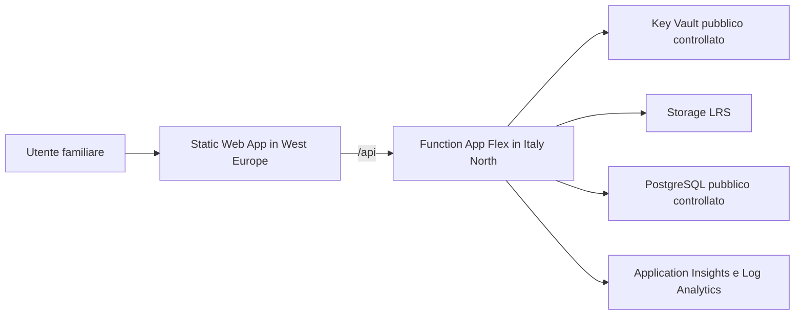

# DA.KinHub Infrastructure Guidelines

Questo documento raccoglie le linee guida da usare per analizzare, correggere e implementare l'infrastruttura e le pipeline del repository DA.KinHub.

Il documento non sostituisce i file Bicep o i workflow YAML. Definisce invece il comportamento che quei file devono ottenere e i controlli da applicare quando vengono modificati.

## 1. Decisioni definitive

Le decisioni seguenti sono requisiti del progetto, non semplici raccomandazioni:

- Il repository e' pubblico.
- Il repository e' un monorepo.
- La piattaforma CI/CD e' GitHub Actions.
- In questa fase viene gestito soltanto l'ambiente persistente `dev`.
- Il bootstrap iniziale viene eseguito manualmente dalla proprietaria prima dell'esecuzione delle GitHub Actions.
- Tutte le risorse sono nella regione Azure `Italy North`, salvo Azure Static Web Apps in `West Europe`.
- L'accesso di rete e' pubblico controllato; non si introduce una rete privata.
- Static Web Apps usa il piano Standard.
- Static Web Apps collega la Function App tramite `/api`.
- La Function App usa Azure Functions Flex Consumption, Linux, runtime Functions 4, .NET 10 e modello isolated worker.
- La Function App usa una managed identity assegnata dal sistema.
- PostgreSQL usa un approccio Code First con migrazioni applicate dalla pipeline.
- Blob Storage usa la ridondanza minima, senza ZRS o GRS.
- PostgreSQL non viene protetto da un piano di backup applicativo aggiuntivo.
- Non sono richieste alta disponibilita' o continuita' operativa da applicazione enterprise.
- Un downtime significativo della Function durante il deployment e' accettabile.
- Il controllo dopo il deployment deve verificare anche la raggiungibilita' applicativa, non soltanto la presenza delle risorse Azure.

Per l'ambiente `dev` i nomi concreti confermati sono mantenuti in `infra/environments/dev.bicepparam`; altri ambienti non devono riutilizzare quei nomi senza una nuova verifica.

Prima di scrivere o correggere Bicep:

1. cercare se la risorsa richiesta esiste gia' nella subscription e nel resource group individuati;
2. se esiste una sola risorsa compatibile, usare il suo nome reale e non crearne una seconda;
3. se esistono piu' risorse compatibili, chiedere all'utente quale usare;
4. se la risorsa non esiste, chiedere all'utente il nome da assegnare prima di crearla;
5. non inventare nomi, suffissi, resource group o risorse sostitutive per completare automaticamente il deployment.

Se una risorsa esistente non si trova nella regione richiesta, non spostarla automaticamente. Chiedere all'utente se riutilizzarla accettando l'eccezione, oppure chiedere il nome di una nuova risorsa nella regione corretta.

Il nome confermato dall'utente deve diventare un parametro o una configurazione esplicita dell'ambiente `dev`. Se una risorsa esistente deve essere soltanto letta o collegata, dichiararla come `existing` in Bicep. Se deve essere gestita da Bicep, adottare il nome esistente senza ricrearla o sostituirla.

La scelta di PostgreSQL "senza backup" va interpretata correttamente: Azure Database for PostgreSQL Flexible Server puo' mantenere backup automatici minimi obbligatori dal servizio. La pipeline non deve aggiungere export, replica o una strategia di backup separata. Se Azure non permette di disabilitare completamente il backup gestito, si accetta il minimo imposto dal servizio e non lo si considera una garanzia di ripristino applicativo.

## 2. Obiettivo operativo

L'infrastruttura deve essere:

- riproducibile da Bicep;
- isolata nell'ambiente `dev`;
- modificabile tramite pull request;
- verificabile prima del deployment con lint, compilazione, validazione Azure e what-if;
- autenticata tramite OIDC, senza client secret Azure persistenti nel repository;
- economica, evitando ridondanza, alta disponibilita', runner privati, slot e piattaforme di orchestrazione non necessarie;
- sufficientemente osservabile da capire se l'applicazione e' raggiungibile e funzionante dopo un rilascio.

Il criterio principale non e' ottenere un'infrastruttura enterprise. E' ridurre la probabilita' di rompere l'applicazione familiare mantenendo bassi costo e carico di manutenzione.

## 3. Topologia desiderata

### 3.1 Separazione degli ambienti

Usare il resource group esistente o confermato dall'utente per l'ambiente `dev`:

```text
Subscription Azure
|
`-- Resource group esistente o scelto dall'utente per l'ambiente dev
    |-- Log Analytics workspace
    |-- Application Insights
    |-- Key Vault
    |-- Storage account
    |-- PostgreSQL Flexible Server
    |-- Flex Consumption plan
    |-- Function App
    `-- Static Web App in West Europe
```

La Static Web App dell'ambiente `dev` puo' appartenere allo stesso resource group delle altre risorse oppure a un resource group esistente scelto dall'utente. Non spostarla o ricrearla automaticamente per uniformare i resource group.

### 3.2 Flusso applicativo



Il collegamento `/api` richiede che la Function App sia pubblicamente raggiungibile. L'accesso pubblico non significa accesso anonimo a ogni operazione: autenticazione applicativa, autorizzazioni, RBAC e regole PostgreSQL devono continuare a proteggere le risorse.

La differenza di regione tra Static Web Apps e Function App e' accettata. Durante l'implementazione va verificato che l'integrazione Azure supporti la combinazione scelta e che il controllo `/api` raggiunga effettivamente la Function. Non spostare automaticamente la Function in `West Europe` se una verifica regionale fallisce: fermarsi e registrare la decisione.

## 4. Regola di analisi del repository

Prima di modificare codice, Bicep o YAML, analizzare il repository nell'ordine seguente.

### 4.1 Inventario

Individuare:

- file `.bicep` e `.bicepparam`;
- workflow sotto `.github/workflows/`;
- file `global.json`, `Directory.Packages.props`, `packages.lock.json`, `package-lock.json`, `pnpm-lock.yaml` o equivalenti;
- progetto Function e relativo file `.csproj`;
- progetto Static Web App e `staticwebapp.config.json`;
- progetto database, migrazioni Code First e migration bundle o script SQL;
- impostazioni applicative che contengono URL, connection string o nomi ambiente;
- eventuali script manuali di bootstrap;
- documentazione che nomina subscription, resource group, regioni, secret o deployment token.

Non assumere che una risorsa Azure esistente sia corretta soltanto perche' esiste nel portale. Confrontare sempre il suo stato reale con il Bicep previsto.

### 4.2 Classificazione delle differenze

Per ogni problema trovato, classificarlo in una sola categoria principale:

- **infrastruttura:** risorsa, proprieta', API version, dipendenza o parametro Bicep;
- **sicurezza:** identita', RBAC, secret, token, permesso o workflow esposto;
- **pipeline:** trigger, job, artefatto, environment, concurrency o verifica;
- **rete:** endpoint pubblico, firewall, DNS o raggiungibilita';
- **dati:** migrazione, compatibilita' schema, perdita dati o accesso PostgreSQL;
- **osservabilita':** Application Insights, Log Analytics, log, cap o health check;
- **costo:** SKU, retention, ridondanza, istanze sempre pronte o servizio non necessario.

La classificazione impedisce di correggere un problema di pipeline modificando manualmente una risorsa Azure o di correggere un problema di dati con un rollback del codice.

### 4.3 Ordine di correzione

Correggere prima i problemi che possono compromettere la sicurezza o cancellare dati:

1. secret esposti e permessi troppo ampi;
2. accessi pubblici non controllati;
3. deployment distruttivi o in modalita' `complete`;
4. migrazioni incompatibili;
5. regioni e resource group errati;
6. deployment che ricompila invece di promuovere artefatti;
7. assenza di health check e telemetria;
8. ottimizzazioni di costo.

Non fare piu' correzioni indipendenti in un'unica modifica se il what-if diventerebbe difficile da leggere. Ogni pull request deve rendere chiaro che cosa cambia e perche'.

## 5. Struttura Bicep raccomandata

La struttura iniziale deve essere piccola e leggibile:

```text
infra/
|-- main.bicep
|-- environments/
|   `-- dev.bicepparam
`-- modules/
    |-- monitoring.bicep
    |-- data-security.bicep
    |-- functions.bicep
    `-- static-web-app.bicep
```

Non creare un modulo per ogni singola risorsa. Un modulo deve raggruppare risorse che cambiano insieme e hanno una responsabilita' riconoscibile.

### 5.1 Entry point e scope

L'entry point puo' essere a livello subscription se deve creare i resource group. Il deployment deve usare lo scope corretto e dichiarato:

- subscription scope per resource group e operazioni iniziali di subscription;
- resource group scope per risorse applicative e assegnazioni RBAC locali.

Non fare affidamento sul portale per creare manualmente risorse che Bicep dovrebbe possedere. Se una risorsa e' stata creata fuori da Bicep e deve restare gestita altrove, dichiararla come `existing` invece di ricrearla.

### 5.2 Parametri

I parameter file devono contenere soltanto differenze intenzionali:

- `environmentName`;
- `location = Italy North` per le risorse regionali;
- riferimenti alle risorse esistenti o nomi confermati dall'utente;
- SKU e limiti Flex;
- SKU PostgreSQL e dimensione minima compatibile;
- `storageRedundancy = LRS`;
- `staticWebAppLocation = West Europe`;
- `staticWebAppSku = Standard`;
- retention e cap iniziali della telemetria;
- flag di alta disponibilita' disattivato;
- flag di rete privata disattivato.

Non parametrizzare ogni proprieta' fissa. Un parametro deve rappresentare una decisione che puo' davvero differire tra ambienti.

### 5.3 API version e dipendenze

- Usare API version GA esplicite e versionate.
- Non usare `latest` o API version ottenute dinamicamente dal provider.
- Aggiornare una API version solo tramite pull request e dopo un nuovo what-if in `dev`.
- Preferire riferimenti tra risorse per creare dipendenze implicite.
- Usare `dependsOn` soltanto quando il riferimento non rende evidente l'ordine.
- Usare il nome reale della risorsa esistente oppure il nome confermato dall'utente.
- Non calcolare o aggiungere automaticamente suffissi con `uniqueString` per inventare nomi.
- Se Azure richiede unicita' globale e il nome scelto non e' disponibile, chiedere un nuovo nome all'utente.
- Applicare tag almeno per workload, environment, owner e cost classification.

### 5.4 Deployment mode

Usare modalita' `incremental`.

Il template non deve cancellare automaticamente risorse soltanto perche' non sono piu' presenti nel file. La modalita' `complete` e' vietata come scorciatoia per ripulire Azure: puo' eliminare risorse inattese.

Se una risorsa deve essere rimossa, la rimozione deve essere una modifica esplicita, revisionata e preceduta da what-if. Prima della rimozione verificare se contiene dati o secret.

## 6. Risorse Azure e configurazioni iniziali

### 6.1 Application Insights e Log Analytics

Usare Application Insights workspace-based con un Log Analytics workspace dedicato per ambiente.

Configurazione iniziale orientata al budget:

- workspace e Application Insights in `Italy North`;
- piano pay-as-you-go, senza commitment tier;
- retention iniziale di 30 giorni, la minima retention ordinaria documentata per Application Insights;
- nessun test di disponibilita' Azure a pagamento;
- nessun dashboard o workbook enterprise finche' non serve;
- logging applicativo non verboso nell'ambiente `dev` salvo necessita' di diagnosi;
- sampling dove il volume lo richiede;
- nessun body HTTP, password, token o dato familiare sensibile nei log;
- daily cap del workspace impostato come limite di sicurezza del budget, non cosi' basso da impedire di vedere gli errori essenziali.

La retention di 30 giorni e' una raccomandazione economica, non una garanzia di recupero. Application Insights e' utile per diagnosi recenti, non per conservare lo storico del progetto.

Il controllo di raggiungibilita' sara' eseguito dalla pipeline, quindi non introdurre Azure Availability Tests soltanto per avere un ping periodico. Se in futuro servira' monitoraggio continuo, rivalutare il costo.

### 6.2 Key Vault

Usare un Key Vault per ambiente con:

- modello di autorizzazione RBAC;
- soft delete;
- purge protection soltanto se richiesta da una policy o da una necessita' concreta; non introdurla automaticamente nell'ambiente `dev`;
- endpoint pubblico;
- accesso controllato tramite identita', non tramite secret condivisi;
- secret soltanto quando il servizio non supporta una identita' Azure.

La Function usa la propria system-assigned managed identity per leggere i secret indispensabili. Non trasferire i valori da Key Vault alla pipeline se il deployment non ne ha bisogno.

Con accesso pubblico, non considerare sufficiente una allowlist IP se l'origine e' una Function Flex o un runner GitHub-hosted con indirizzi non stabili. Il controllo principale deve essere l'identita' e il permesso RBAC. Le network ACL devono essere usate solo quando la loro compatibilita' con le origini reali e' stata verificata.

### 6.3 Storage

Usare un account Storage GPv2 Standard per ambiente, in `Italy North`, con:

- ridondanza `LRS`;
- HTTPS obbligatorio;
- TLS moderno;
- accesso Blob anonimo disabilitato;
- accesso tramite identita' dove supportato;
- Shared Key disabilitato soltanto dopo aver provato tutti gli accessi identity-based;
- nessuna policy generica di lifecycle sullo Storage usato dalla Function.

La ridondanza LRS protegge da alcuni guasti locali, ma non da cancellazione, errore applicativo o perdita dell'intero datacenter. Questa limitazione e' accettata dal requisito di budget.

Non aggiungere un secondo Storage account finche' non esiste una necessita' concreta di separare file applicativi, lifecycle e host storage di Functions.

### 6.4 Function App Flex Consumption

Configurare:

- Linux;
- piano Flex Consumption `FC1`;
- Functions runtime `~4`;
- worker `dotnet-isolated`;
- .NET 10;
- una sola Function App sul piano Flex;
- system-assigned managed identity;
- Storage di host e deployment configurato per identita' dove supportato;
- zero istanze always-ready, salvo una necessita' futura di latenza costante;
- limiti di memoria e istanze minimi compatibili con il carico familiare;
- strategia di aggiornamento `Recreate` inizialmente.

`Recreate` puo' causare downtime durante il deployment. E' la scelta piu' semplice per questo progetto e coerente con il requisito che un downtime alto sia accettabile. Non introdurre rolling update: richiede compatibilita' simultanea tra vecchio e nuovo codice e non elimina completamente il downtime.

Flex Consumption non offre deployment slot. Non implementare slot, swap, canary o blue/green copiando esempi di App Service.

Il deployment del codice deve usare il pacchetto pronto per l'esecuzione tramite One Deploy. Non attivare remote build o impostazioni legacy come `SCM_DO_BUILD_DURING_DEPLOYMENT`, `ENABLE_ORYX_BUILD` o `WEBSITE_RUN_FROM_PACKAGE` senza una verifica specifica della documentazione Flex corrente.

### 6.5 PostgreSQL Flexible Server

Configurare in `Italy North` con il profilo minimo compatibile con l'applicazione:

- alta disponibilita' disattivata;
- geo-redundancy disattivata;
- storage e compute minimi compatibili;
- backup aggiuntivo/export/PITR gestito dal progetto non previsto;
- accesso pubblico controllato;
- TLS obbligatorio;
- regole firewall limitate alle origini effettivamente necessarie;
- autenticazione Microsoft Entra preferita per la Function e per il job di migrazione.

Azure puo' mantenere backup automatici minimi obbligatori. Non dichiarare mai che il database e' recuperabile soltanto perche' esiste PostgreSQL Flexible Server.

Il server e lo schema sono responsabilita' diverse:

- Bicep crea server, configurazione, amministratore, rete pubblica e firewall;
- le migrazioni Code First creano o modificano schema, tabelle e indici;
- il job di deployment applica la migrazione;
- la Function non applica migrazioni all'avvio.

### 6.6 Static Web Apps

Creare una Static Web App per ambiente in `West Europe` con piano Standard.

Configurare il collegamento della Function esistente tramite `/api` soltanto dopo aver verificato:

- che la Function sia pubblicamente raggiungibile;
- che la Static Web App possa collegarsi a una Function in `Italy North`;
- che il percorso `/api` funzioni dal dominio pubblico della Static Web App;
- che il frontend usi la configurazione prevista per l'ambiente `dev`;
- che il deployment della Static Web App usi il token dell'environment `dev`.

Il token Static Web Apps e' separato dal login Azure OIDC usato per ARM e Functions. Non inserirlo in Bicep output, log o file del repository.

## 7. Identita' e bootstrap manuale

### 7.1 Cosa deve fare il bootstrap

Il bootstrap manuale deve creare e verificare almeno:

- resource group esistente per `dev`, oppure il resource group con il nome scelto manualmente dall'utente;
- identita' Azure usata da GitHub Actions per `dev`;
- federated credential OIDC per repository, workflow ed environment `dev`;
- permessi Azure per il provisioning di `dev`;
- eventuali permessi per creare role assignment;
- environment GitHub `dev`;
- token Static Web Apps nel secret dell'environment `dev`;
- principal PostgreSQL e permessi necessari per la migrazione, se si usa autenticazione Entra;
- eventuali secret iniziali del Key Vault.

Il bootstrap non deve diventare uno step automatico eseguito a ogni deployment. Deve essere documentato, eseguito una volta e ripetuto solo quando cambia il trust model o si ricrea un ambiente.

### 7.2 Separazione minima delle identita'

Usare almeno:

- identita' GitHub per `dev`;
- system-assigned managed identity della Function `dev`.

Per una prima versione e' accettabile che l'identita' GitHub di `dev` faccia sia provisioning sia deployment, purche' sia limitata al resource group dell'ambiente. Separare in futuro identita' infrastrutturale e identita' applicativa se il rischio o la complessita' aumentano.

Non usare `Owner` sull'intera subscription. Se Bicep deve creare role assignment, assegnare soltanto il permesso RBAC necessario nello scope minimo compatibile.

### 7.3 System-assigned identity della Function

La system-assigned identity viene creata insieme alla Function e viene eliminata quando la Function viene eliminata. Di conseguenza:

- i role assignment devono riferirsi al `principalId` della Function reale;
- Bicep deve creare le assegnazioni dopo la Function;
- dopo una ricreazione della Function, verificare che i role assignment puntino al nuovo principal;
- non trattare il `principalId` come un valore stabile da salvare in un parametro.

Permessi iniziali da valutare soltanto se servono davvero:

- Key Vault Secrets User sul Key Vault dell'ambiente;
- Storage Blob Data Contributor sul contenitore di deployment;
- ruoli Storage necessari al runtime host;
- ruolo per pubblicare telemetria se si usa autenticazione Entra per Application Insights;
- permessi database limitati allo schema applicativo.

Non assegnare alla Function permessi amministrativi sulla subscription.

## 8. GitHub Actions nel monorepo pubblico

### 8.1 Workflow consigliati

Usare pochi workflow con responsabilita' chiare:

```text
.github/workflows/
|-- ci.yml              # pull request: build, test, lint; nessun secret Azure
|-- infrastructure.yml # Bicep: validate, what-if, deploy dev
`-- release.yml         # build artefatti e deploy dev
```

Un workflow manuale separato per ripetere un deployment `dev` precedente puo' essere aggiunto se il primo rilascio dimostra che serve. Non creare subito reusable workflows, matrix complesse o un workflow per ogni micro-passaggio.

### 8.2 Regole per un repository pubblico

Una pull request puo' provenire da codice non affidabile. Per questo:

- i job `pull_request` non devono ricevere token Azure, secret Static Web Apps o credenziali PostgreSQL;
- non usare `pull_request_target` per eseguire il codice della pull request con privilegi;
- il deployment puo' partire soltanto da `main` protetto e da workflow revisionati;
- gli artefatti prodotti da una pull request non devono essere usati per il deployment dell'ambiente `dev`;
- la release deve ricompilare il commit gia' unito a `main`;
- proteggere `.github/workflows/` con CODEOWNERS;
- usare `contents: read` come permesso predefinito;
- concedere `id-token: write` soltanto al job che deve autenticarsi ad Azure;
- non stampare input, secret, token, connection string o variabili sensibili nei log.

Le action esterne devono essere fissate a un commit SHA completo. Il tag leggibile puo' essere mantenuto come commento per manutenzione, ma non deve essere l'unico riferimento di sicurezza. Usare Dependabot per proporre aggiornamenti delle action.

### 8.3 Trigger del monorepo

Usare path filter per evitare deployment infrastrutturali quando cambia soltanto il codice applicativo, ma includere sempre:

- `infra/**`;
- `.github/workflows/**`;
- script usati da Bicep o dalle migrazioni;
- file di lock e SDK condivisi;
- librerie condivise tra backend e frontend;
- configurazione che modifica il contratto `/api`.

Non separare i deployment di backend e frontend soltanto per risparmiare un job se possono cambiare lo stesso contratto. Un workflow saltato da un path filter puo' lasciare un check obbligatorio in stato pending: verificare la branch protection dopo aver configurato i filtri.

## 9. Pipeline infrastrutturale

### 9.1 Pull request

La pull request deve eseguire senza credenziali Azure:

1. controllo formattazione Bicep;
2. Bicep build e linter;
3. validazione della struttura dei parameter file;
4. controllo che non siano presenti secret nei file Bicep;
5. eventuali test degli script di naming e configurazione.

Il what-if contro Azure non deve essere eseguito automaticamente su codice arbitrario di pull request pubbliche con accesso privilegiato.

### 9.2 Merge su main

Quando cambia `infra/**` e il commit entra in `main`:

1. autenticarsi con OIDC sull'identita' `dev`;
2. eseguire validazione Azure nello scope corretto;
3. eseguire what-if immediatamente prima dell'applicazione;
4. bloccare errori certi, sostituzioni sospette, eliminazioni e modifiche a PostgreSQL o rete che richiedono revisione;
5. applicare Bicep in modalita' incremental;
6. attendere eventuale propagazione RBAC senza retry indiscriminati;
7. verificare risorse e configurazioni;
8. verificare la raggiungibilita' applicativa se il codice e' gia' presente;
9. rendere la revisione candidata alla promozione.

Il deployment `dev` deve essere serializzato con una concurrency group. Non cancellare un deployment gia' iniziato.

## 10. Pipeline applicativa

### 10.1 Build once, deploy many

Il codice deve essere compilato e testato una sola volta per release.

Artefatti minimi:

- pacchetto Function pronto per One Deploy;
- output statico gia' compilato per Static Web Apps;
- migration bundle o script SQL Code First, se la release modifica lo schema;
- file di metadata con commit SHA, run ID, versioni SDK e digest.

Il deployment dell'ambiente `dev` deve usare gli artefatti prodotti dal job di build della stessa release. Un eventuale rerun deve scaricare gli artefatti originali. Non eseguire una nuova `dotnet publish`, una nuova build frontend o una nuova generazione migrazioni per ripetere soltanto il deployment.

### 10.2 Ordine del deployment

Quando una release modifica anche lo schema PostgreSQL, usare l'ordine seguente:

1. applicare una migrazione espansiva compatibile con il codice precedente;
2. distribuire la Function;
3. verificare la Function direttamente;
4. distribuire Static Web Apps senza ricompilare;
5. verificare il flusso completo Static Web App -> `/api` -> Function -> PostgreSQL.

Una migrazione espansiva aggiunge elementi senza rimuovere subito quelli che il vecchio codice usa, per esempio una colonna nullable o una nuova tabella. La rimozione di colonne, indici o vincoli vecchi deve avvenire in una release successiva, quando non serve piu' il rollback del codice.

Non applicare migrazioni all'avvio della Function. In Flex possono esistere piu' istanze e il runtime non deve possedere permessi DDL permanenti sul database.

### 10.3 Raggiungibilita' del database dal runner

Con accesso pubblico controllato, il job di migrazione deve poter raggiungere PostgreSQL.

Preferenza:

1. autenticazione Microsoft Entra del principal GitHub abilitato al database, senza password permanente;
2. firewall PostgreSQL con regola temporanea limitata all'IP pubblico del runner durante il job;
3. rimozione della regola temporanea anche in caso di errore.

Gli indirizzi dei runner GitHub-hosted non sono una allowlist statica affidabile. Non aggiungere una regola permanente che permetta tutto Internet soltanto per far funzionare le migrazioni.

Se l'autenticazione Entra non e' immediatamente disponibile, usare un secret PostgreSQL soltanto come soluzione transitoria, conservarlo nell'environment corretto e non in repository o artefatti. La Function non deve ricevere il permesso DDL solo per evitare questo problema.

## 11. Health check e controllo applicativo

Il controllo post-deployment deve avere due livelli.

### 11.1 Controllo infrastrutturale

Verificare che:

- il deployment ARM sia riuscito;
- resource group e risorse attese esistano;
- Function App sia nel piano e nella regione corretti;
- runtime sia `~4` e worker `dotnet-isolated`;
- Static Web App sia Standard e in `West Europe`;
- collegamento `/api` sia configurato;
- Application Insights e Log Analytics siano collegati;
- identity e role assignment abbiano il principal atteso;
- PostgreSQL accetti la configurazione pubblica prevista;
- Storage sia `LRS`.

### 11.2 Controllo applicativo

Verificare da un runner esterno pubblico:

1. `GET` alla Static Web App e risposta HTTP di successo;
2. `GET` a un endpoint di health della Function, direttamente se previsto;
3. `GET` allo stesso health endpoint tramite Static Web App `/api`;
4. esito della Function quando legge una configurazione da Key Vault, se tale dipendenza e' necessaria;
5. esito della Function quando apre una connessione PostgreSQL;
6. presenza della richiesta e dell'eventuale errore in Application Insights, senza aspettarsi ingestione istantanea;
7. nessuna scrittura di dati familiari reali durante lo smoke test.

Lo health endpoint deve rispondere rapidamente e non deve restituire secret, connection string, schema interno o dettagli di errore sensibili.

Se il controllo diretto della Function riesce ma quello via `/api` fallisce, il problema e' probabilmente nel collegamento Static Web Apps, nel routing o nella configurazione pubblica, non nel pacchetto .NET.

## 12. Retention degli artefatti

### Raccomandazione

Impostare `retention-days: 30` per gli artefatti di release di GitHub Actions.

Motivazione:

- copre normalmente piu' rilasci di un progetto familiare;
- permette di ripetere il deployment in `dev` di una release provata anche dopo alcuni giorni;
- consente di ripetere un deployment o ripristinare l'ultimo artefatto noto senza ricompilare;
- riduce spazio e costo rispetto alla retention massima di 90 giorni normalmente disponibile;
- e' una scelta piu' pratica del default non controllato del repository.

La documentazione GitHub consente di impostare la retention per singolo artefatto tramite `retention-days`, entro il limite configurato a livello repository, organization o enterprise. GitHub non prescrive 30 giorni come valore universale: 30 giorni e' la raccomandazione proporzionata a questo progetto.

Applicare la retention cosi':

- artefatti di release Function, Static Web App e migrazione: 30 giorni;
- report temporanei di test e coverage: 7 giorni o il minimo utile;
- non includere secret negli artefatti;
- conservare commit SHA e digest nei metadata della release;
- se una release deve vivere oltre 30 giorni, creare una release esplicita o rivalutare la retention prima della scadenza;
- non ricostruire un commit scaduto fingendo che sia lo stesso artefatto.

La retention degli artefatti non e' un backup del database. Se una migrazione ha modificato o perso dati, il vecchio ZIP non li ripristina.

## 13. Errori, rollback e limiti accettati

### 13.1 Regola generale

Il deployment non e' atomico tra PostgreSQL, Function e Static Web Apps. Un errore puo' lasciare solo una parte della release applicata.

In caso di errore:

1. fermare la promozione successiva;
2. conservare log, commit, run ID e deployment ID;
3. identificare quali componenti sono gia' cambiati;
4. riprovare lo stesso artefatto soltanto se l'operazione e' sicura;
5. preferire una correzione in avanti quando lo schema e' gia' stato ampliato;
6. ridistribuire il precedente artefatto applicativo soltanto se resta compatibile con lo schema;
7. non eseguire automaticamente down-migration distruttive;
8. non usare rollback ARM automatico come se fosse una transazione.

### 13.2 Rischi accettati

Le seguenti limitazioni sono intenzionali:

- downtime durante `Recreate` della Function;
- nessuna deployment slot o release graduale;
- nessuna ridondanza ZRS/GRS per Storage;
- nessuna alta disponibilita' PostgreSQL;
- nessun backup applicativo PostgreSQL aggiuntivo;
- retention telemetria breve;
- possibile perdita di storico diagnostico oltre 30 giorni;
- dipendenza dalla disponibilita' pubblica di Function, PostgreSQL e Key Vault.

Se uno di questi rischi diventa inaccettabile, non aggiungere una singola impostazione isolata: rivalutare la decisione architetturale e il costo complessivo.

## 14. Checklist di accettazione

### Repository e sicurezza

- [ ] Il repository e' pubblico e nessun workflow di pull request usa secret Azure.
- [ ] `main` e' protetto.
- [ ] `.github/workflows/` e' protetto tramite CODEOWNERS.
- [ ] Le action sono fissate a SHA completi.
- [ ] OIDC e' usato al posto di `AZURE_CREDENTIALS` o client secret persistenti.
- [ ] Esiste un'identita' GitHub dedicata all'ambiente `dev`.
- [ ] I permessi sono limitati al resource group necessario.
- [ ] Il bootstrap manuale e' documentato e gia' eseguito.
- [ ] I nomi delle risorse esistenti sono stati rilevati e riutilizzati.
- [ ] Per ogni risorsa mancante il nome e' stato scelto dall'utente prima della creazione.

### Bicep

- [ ] Esiste un entry point chiaro.
- [ ] Esiste un parameter file per `dev`.
- [ ] Le API version sono esplicite e non `latest`.
- [ ] Il deployment mode e' `incremental`.
- [ ] Non ci sono password, token o chiavi negli input e output Bicep.
- [ ] Le dipendenze sono espresse da riferimenti, con `dependsOn` solo dove necessario.
- [ ] Tutte le risorse regionali sono in `Italy North`.
- [ ] Static Web Apps e' in `West Europe` e Standard.
- [ ] Storage usa LRS.
- [ ] Function usa Flex Consumption e system-assigned identity.
- [ ] PostgreSQL ha alta disponibilita' e geo-redundancy disattivate.
- [ ] Application Insights e Log Analytics usano 30 giorni e configurazione pay-as-you-go.

### Pipeline

- [ ] La pull request esegue lint e build Bicep senza Azure credentials.
- [ ] Il deployment `dev` parte solo da codice fidato su `main`.
- [ ] What-if viene eseguito subito prima del deployment.
- [ ] Il deployment `dev` usa una concurrency group dedicata.
- [ ] Un deployment gia' iniziato non viene cancellato automaticamente.
- [ ] Il codice viene compilato una volta e promosso tramite gli stessi artefatti.
- [ ] Gli artefatti di release hanno retention di 30 giorni.
- [ ] Un rerun di deployment non ricompila il codice.
- [ ] Le migrazioni non partono dall'avvio della Function.
- [ ] Il job di migrazione usa una connessione pubblica controllata e rimuove eventuali regole firewall temporanee.

### Verifica finale

- [ ] Il deployment ARM termina con successo.
- [ ] Le risorse attese esistono nelle regioni corrette.
- [ ] La Function risponde direttamente.
- [ ] Static Web Apps risponde dal proprio dominio pubblico.
- [ ] Static Web Apps raggiunge la Function tramite `/api`.
- [ ] La Function riesce a leggere Key Vault se necessario.
- [ ] La Function riesce a connettersi a PostgreSQL.
- [ ] Application Insights riceve telemetria senza dati sensibili.
- [ ] Il fallimento di un health check marca il deployment `dev` come fallito.

## 15. Fonti principali

Le fonti devono essere ricontrollate prima di implementare modifiche che dipendono da versioni o disponibilita' regionali.

- GitHub, [Store and share data with workflow artifacts](https://docs.github.com/en/actions/writing-workflows/choosing-what-your-workflow-does/storing-and-sharing-data-from-a-workflow).
- GitHub, [Deployments and environments](https://docs.github.com/en/actions/reference/workflows-and-actions/deployments-and-environments).
- GitHub, [Configuring OpenID Connect in Azure](https://docs.github.com/en/actions/security-for-github-actions/security-hardening-your-deployments/configuring-openid-connect-in-azure).
- GitHub, [Secure use reference](https://docs.github.com/en/actions/reference/security/secure-use).
- GitHub, [Control the concurrency of workflows and jobs](https://docs.github.com/en/actions/how-tos/write-workflows/choose-when-workflows-run/control-workflow-concurrency).
- Microsoft, [Authenticate to Azure from GitHub Actions by OpenID Connect](https://learn.microsoft.com/en-us/azure/developer/github/connect-from-azure-openid-connect).
- Microsoft, [Best practices for Bicep](https://learn.microsoft.com/en-us/azure/azure-resource-manager/bicep/best-practices).
- Microsoft, [Bicep what-if operation](https://learn.microsoft.com/en-us/azure/azure-resource-manager/bicep/deploy-what-if).
- Microsoft, [Azure Resource Manager deployment modes](https://learn.microsoft.com/en-us/azure/azure-resource-manager/templates/deployment-modes).
- Microsoft, [Azure Functions Flex Consumption plan hosting](https://learn.microsoft.com/en-us/azure/azure-functions/flex-consumption-plan).
- Microsoft, [Site update strategies in Flex Consumption](https://learn.microsoft.com/en-us/azure/azure-functions/flex-consumption-site-updates).
- Microsoft, [Guide for running C# Azure Functions in an isolated worker process](https://learn.microsoft.com/en-us/azure/azure-functions/dotnet-isolated-process-guide).
- Microsoft, [Deploy to Azure Functions by using GitHub Actions](https://learn.microsoft.com/en-us/azure/azure-functions/functions-how-to-github-actions).
- Microsoft, [Bring your own functions to Azure Static Web Apps](https://learn.microsoft.com/en-us/azure/static-web-apps/functions-bring-your-own).
- Microsoft, [Static Web Apps deployment token management](https://learn.microsoft.com/en-us/azure/static-web-apps/deployment-token-management).
- Microsoft, [Create a workspace-based Application Insights resource](https://learn.microsoft.com/en-us/azure/azure-monitor/app/create-workspace-resource).
- Microsoft, [Azure Monitor Logs cost calculations and options](https://learn.microsoft.com/en-us/azure/azure-monitor/logs/cost-logs).
- Microsoft, [Application Insights FAQ](https://learn.microsoft.com/en-us/azure/azure-monitor/app/application-insights-faq).
- Microsoft, [Create Azure Database for PostgreSQL with Bicep](https://learn.microsoft.com/en-us/azure/postgresql/development/create-server-bicep).
- Microsoft, [Connect with managed identity in Azure Database for PostgreSQL Flexible Server](https://learn.microsoft.com/en-us/azure/postgresql/security/security-connect-with-managed-identity).
- Microsoft, [Applying migrations in EF Core](https://learn.microsoft.com/en-us/ef/core/managing-schemas/migrations/applying).
