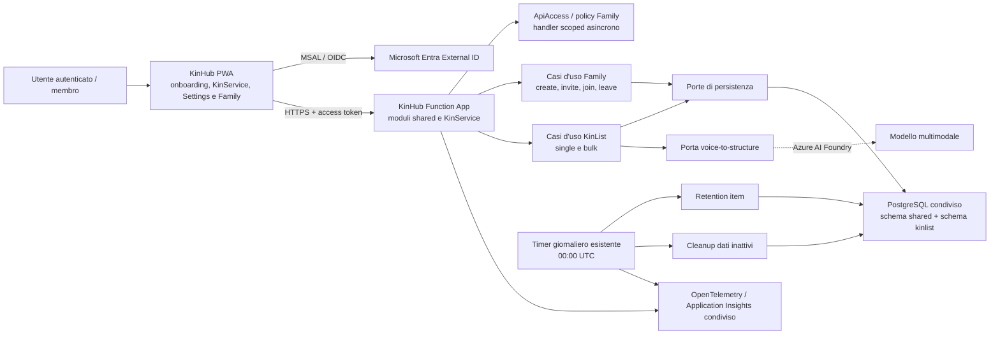

# Architettura — KinList

## 1. Scopo e contesto

KinList è un servizio di Kin Hub destinato a un uso familiare e a basso costo operativo. Offre una PWA React/Vite/TypeScript e un backend .NET ospitato nella Function App condivisa. I membri autenticati tramite Microsoft Entra External ID lavorano sulla stessa lista della famiglia; l'audio viene trasformato in item e categorie; PostgreSQL conserva stato e cronologia; un processo pianificato elimina gli item completati dopo 30 giorni.

Le decisioni esplicitamente approvate nelle fonti sono:

- client React, Vite e TypeScript, PWA mobile-first;
- MSAL sul client e Microsoft Entra External ID come provider di identità;
- identità applicativa locale collegata all'identificativo esterno;
- autorizzazione applicativa basata su appartenenza attiva alla famiglia e visibilità dei dati, senza ruoli differenziati;
- backend .NET come singola applicazione di dominio, organizzata secondo Clean Architecture e principi DDD proporzionati;
- Azure Static Web Apps, Azure Function App e database PostgreSQL condivisi con gli altri servizi Kin Hub;
- schema PostgreSQL dedicato a KinList e schema condiviso per famiglia, identità applicative e dati comuni;
- identità gestita per l'accesso della Function App a PostgreSQL, evitando credenziali applicative statiche;
- telemetria strutturata e audit funzionale, senza dati sensibili nei log;
- centralizzazione di configurazioni, testi e comportamenti comuni per evitare duplicazione e stringhe magiche;
- registrazione sincrona con durata massima di 60 secondi, dimensione massima stimata di 12 MB, supporto a Opus/MP3/AAC/WAV e audio soltanto in memoria;
- una sola operazione logica verso un deployment multimodale Azure AI Foundry configurabile per ambiente, con versione modello pinned, contratto/schema strict versionato e validazione semantica lato backend;
- timeout richiesta di 90 secondi, budget provider complessivo di 75 secondi, massimo un retry dopo un guasto transitorio senza risposta e nessun retry per output ricevuto ma invalido;
- massimo 1000 item generati da una registrazione;
- rilevamento automatico della lingua e risposta nella stessa lingua; per la UI italiano (`it`) predefinito e inglese (`en`) supportato e fallback tecnico, in coerenza con `AGENTS.md`;
- mantenimento degli elementi pronunciati come risultato base dell'estrazione;
- popup iniziale chiaro quando il permesso microfono non è ancora stato deciso, con spiegazione dell'uso della voce solo per generare tramite IA la lista; la concessione del permesso vale come consenso a questo uso;
- catalogo categorie per famiglia, senza predefiniti, con riuso se possibile e creazione altrimenti;
- salvataggio esplicito, nessun autosave;
- undo con finestra di 5 secondi piu margine server per latenza;
- timeline con evento `Riattivato` per l'undo;
- coda di snackbar individuali per completamenti ravvicinati;
- aggiornamento collaborativo con refresh manuale e concorrenza ottimistica;
- nessun dato personale applicativo in cache, IndexedDB, altre persistenze browser o code; la sola eccezione è la cache MSAL di account/token in `sessionStorage` per la sessione della scheda; API autenticate network-only e sola shell pubblica offline;
- browser primari Chrome desktop, Chrome Android, relative PWA installate ed Edge equivalente; Safari/iOS best effort secondario;
- cancellazione collegata dei dati coerenti alla retention;
- capacità uniformi per tutti i membri, senza ruoli o amministratori;
- risoluzione dei conflitti tramite ricarica e riapplicazione consapevole.
- identità esterna canonica `(iss, oid)`, con entrambi i claim obbligatori e nessun fallback su nome o email;
- accesso a ogni collezione mediante paginazione keyset e cursori opachi, limite di lettura iniziale e assoluto 5000 e nessun `Get All`;
- route Family canonica `/settings/family`, membri paginati con proiezione minima e fallback localizzati;
- inviti Crockford Base32 di 12 caratteri, massimo cinque attivi, HMAC versionato e rate limit iniziale approvato;
- un timer giornaliero alle 00:00 UTC che tenta retention e cleanup come casi applicativi distinti;
- bulk sull'intera pagina filtrata fino a 5000 item, eseguito dal repository in chunk da massimo 1000 nella stessa transazione e con unico esito.

Lo scope successivamente confermato integra inoltre:

- una sola famiglia attiva per utente, con nome, onboarding obbligatorio `crea`/`unisciti`, creatore come unico membro iniziale e nessun selettore famiglia;
- policy `ApiAccess` per stato onboarding, creazione famiglia e consumo del codice; policy con nome esattamente `Family` per ogni API che opera su una famiglia esistente, con `familyId` sempre in query string;
- verifica asincrona e scoped dell'associazione corrente user-famiglia nel database, seguita dallo stesso scope nei casi d'uso e repository;
- codici d'invito opachi, monouso, validi sette giorni, generabili e revocabili da tutti i membri, mostrati in chiaro una sola volta e gestiti con anti-enumeration e rate limit;
- accesso alle Impostazioni tramite ingranaggio rispettoso della safe area, riuso della `SettingsPage` esistente e aggiunta della voce `Famiglia` senza sostituire le preferenze esistenti;
- pagina Famiglia con nome, membri, inviti e uscita dalla famiglia, secondo i vincoli `PageScaffold`, help, i18n e route registry;
- uscita confermata: revoca degli inviti creati dal membro, soft delete dell'appartenenza e, se ultimo membro, soft delete atomico di famiglia e dati KinList, quindi ritorno all'onboarding;
- predisposizione del soft delete per utente, membership e famiglia, senza endpoint o UI di cancellazione account, e cleanup fisico dei dati inattivi da almeno 30 giorni;
- selezione multipla esplicita, selezione di tutti i soli item visibili dopo il filtro, completamento atomico e un unico `Annulla N` entro cinque secondi;
- `Visibility` con valori `Personal` e `Shared`, owner stabile e predicato server uniforme; tutte le creazioni correnti restano `Shared`, senza selettore o conversione.

Le regole funzionali restano descritte in `functional-analysis.md`; questo documento ne traduce l'impatto tecnico. I requisiti `FR-001`–`FR-055` e le decisioni `DEC-001`–`DEC-035` sono i riferimenti autorevoli, insieme ai vincoli di `AGENTS.md`.

## 2. Principi

1. **Semplicità corretta**: un solo frontend e una sola unità backend distribuibile; nessun microservizio o broker senza un requisito misurato.
2. **Dominio indipendente dall'hosting**: regole di lista, famiglia, ordinamento, completamento e conservazione non dipendono da Azure Functions, PostgreSQL o dal fornitore AI.
3. **Autorizzazione sul server**: il token identifica il chiamante; famiglia e permessi applicativi determinano cosa può fare.
4. **Transazioni sui confini reali**: item, categorie, associazioni e timeline cambiano insieme quando appartengono alla stessa intenzione.
5. **Idempotenza dove la rete può ripetere**: registrazioni, completamenti e annullamenti non producono effetti duplicati.
6. **Privacy per impostazione iniziale**: audio, trascrizioni, nomi e categorie non sono telemetria; la conservazione è minima.
7. **Osservabilità utile**: ogni operazione risponde a «cosa è successo, quanto è durata e perché è fallita» con metadati tecnici e aggregati.
8. **Riutilizzo intenzionale**: valori di dominio, configurazioni e comportamento realmente comune sono centralizzati; le astrazioni rappresentano una responsabilità stabile, non una possibilità futura.
9. **Costo condiviso e isolamento logico**: si riusano le risorse di Kin Hub mantenendo confini di codice, schema, autorizzazione e telemetria.
10. **Evoluzione compatibile**: contratti API e dati possono crescere senza obbligare una vecchia PWA già installata ad aggiornarsi nel mezzo di un'operazione.
11. **Difesa in profondità dello scope**: la policy blocca l'ingresso non autorizzato, ma casi d'uso, query e scritture continuano a usare `familyId`, visibilità e owner come predicati autorevoli.
12. **Cancellazioni esplicite e distinte**: soft delete di famiglia/membership/user, cleanup dopo 30 giorni di inattività e retention degli item `Completed` dopo 30 giorni da `CompletedAt` sono cicli diversi e non condividono il medesimo cutoff semantico.
13. **I/O sempre limitato**: ogni collezione usa filtri server, ordinamento univoco, cursori opachi e limiti validati; il business non dispone di un'operazione `Get All`.
14. **Budget end-to-end**: timeout e annullamento si propagano dal confine HTTP al provider e al database; retry e chunk non riavviano il budget né cambiano l'atomicità osservabile.

## 3. Architettura iniziale



### Confini iniziali

- La PWA acquisisce l'audio, gestisce stato e accessibilità, ma non contiene segreti, regole di autorizzazione o interpretazione AI.
- Il modulo shared di KinHub autentica e autorizza; ogni modulo KinService valida e orchestra i propri casi d'uso specifici.
- Il dominio contiene invarianti e transizioni; non conosce HTTP, timer, SDK AI o driver PostgreSQL.
- L'infrastruttura implementa persistenza, provider AI e orologio; identita e telemetria condivise appartengono a KinHub.
- PostgreSQL è condiviso fisicamente ma separa i dati comuni da KinList tramite schemi e privilegi.
- Il timer di retention riusa la stessa unità applicativa e gli stessi casi d'uso; non nasce un servizio autonomo.
- Stato onboarding, create e join sono autenticati con `ApiAccess`; tutte e sole le API su famiglia esistente applicano `Family` senza alias o varianti.
- `familyId` è un input di query string validato, non un claim né un valore dedotto dal client; l'identità utente arriva esclusivamente dai claim verificati.
- La coppia `(iss, oid)` è l'identità esterna canonica; claim mancanti falliscono chiusi e non sono sostituiti da dati di profilo.
- Repository di collezione espongono soltanto query paginabili; filtri e visibilità precedono paginazione e proiezione.
- Non vengono introdotti CQRS, mediator, event bus, microservizi o nuove risorse Azure.

## 4. Componenti e responsabilità

| Componente | Responsabilità | Input/output | Dipendenze autorizzate | Non gli compete | Requisiti |
|---|---|---|---|---|---|
| KinHub PWA | UI, routing, onboarding, famiglia, impostazioni, temi, i18n e shell dei KinService; KinList aggiunge audio in memoria, pagine/cursori, lista, bulk, drawer e filtro | Gesti/audio → richieste; pagine/esiti → stato visibile | Browser API, MSAL, client API tipizzato, route registry e UI esistente | Fidarsi del token, decidere permessi, chiamare AI, persistere audio/dati personali o interpretare cursori | FR-001, FR-006–FR-011, FR-017–FR-025, FR-027–FR-029, FR-031–FR-055 |
| Endpoint Functions | Confine HTTP, validazione sintattica, autenticazione token, mapping di errori, correlazione | HTTP → comandi/query; risultati → HTTP/Problem Details | Application layer, autenticazione configurata, telemetria | Regole di dominio, SQL, prompt AI | FR-001–FR-005, FR-012–FR-033, FR-036–FR-054 |
| Identity & Access | Risoluzione `(iss, oid)`, profilo, onboarding, policy `ApiAccess`/`Family`, membership attiva e contesto utente | Claim verificati + `familyId` → esito e identità applicativa | Handler scoped, servizio/repository async shared | Fallback su email/nome, user ID dal client, SQL nell'handler o sostituzione dello scope nei casi d'uso | FR-001–FR-005, FR-031, FR-032, FR-047 |
| Family Application | Creazione atomica, lettura famiglia/membri, inviti, join, leave e lifecycle soft delete | Comandi/query autenticati → contesto famiglia o Problem Details | Dominio, repository shared, orologio, generatore crittografico, unità transazionale | Email/notifiche, rimozione altri membri, ruoli aggiuntivi, cancellazione account | FR-031–FR-043, FR-054 |
| KinList Application | Casi d'uso per lista, registrazione, modifica, categorie, completamento singolo/bulk, undo e retention | Comandi/query validati e scoped → risultati applicativi | Dominio, porte di persistenza, provider AI, orologio, identità corrente | Dettagli dell'host Azure o della UI | FR-004–FR-026, FR-042–FR-053 |
| KinList Domain | Entità, value object, regole di stato, ordine, appartenenza e invarianti | Stato + intenzione → nuovo stato/eventi applicativi | Solo codice di dominio | I/O, logging, SDK, serializzazione HTTP | FR-004, FR-005, FR-012–FR-026, FR-042–FR-048 |
| Persistence Adapter | Query keyset scoped senza `Get All`, chunk bulk nella stessa transazione, soft delete, inviti, concorrenza e idempotenza | Operazioni applicative ↔ pagine/transazioni PostgreSQL | EF Core/Npgsql, PostgreSQL, managed identity | Decisioni UX, interpretazione AI o successo parziale tra chunk | FR-002–FR-005, FR-013–FR-026, FR-031–FR-051 |
| Voice Pipeline | Coordinare budget 90/75 secondi, schema strict versionato, retry ristretto, validazione semantica e rilascio buffer | Audio in memoria → massimo 1000 item/categorie candidati + lingua | Porta provider AI, contratto versionato, cancellation e orologio | Autorizzare, persistere audio/output grezzo o salvare dati non validati | FR-012–FR-014, FR-052, FR-053 |
| Multimodal AI Provider | Adattare Azure AI Foundry e isolare deployment per ambiente, versione pinned e Structured Output | Stream audio → output strutturato/stato | SDK/provider approvato e managed identity | Attribuire autore, timestamp, famiglia, RecordingId o fare fallback a chiavi | FR-012–FR-014, FR-052, FR-053 |
| Maintenance Timer | Alle 00:00 UTC tentare retention e cleanup come casi d'uso distinti, con pagine e chunk limitati | Schedule → due esiti e conteggi separati | Application layer, telemetria | SQL diretto, `RunOnStartup` o cancellazione fuori dalle regole | FR-026, FR-030, FR-042, FR-043, FR-049, FR-050 |
| Telemetry | Correlare richieste e job, misurare durata/errori, applicare redazione | Eventi tecnici → log, metriche e trace | OpenTelemetry/strumenti condivisi | Conservare audio, trascrizioni o contenuti della lista | FR-030, NFR-004, NFR-007 |

## 5. Organizzazione del codice

Struttura logica raccomandata, adattabile ai nomi già adottati dal repository quando il bootstrap verrà implementato:

```text
src/
  backend/
    KinHub.Functions/               host, endpoint HTTP, timer, composizione
    KinList.Domain/                 entità, value object, regole e transizioni
    KinList.Application/            casi d'uso, porte, validazione applicativa
    KinList.Infrastructure/         PostgreSQL e AI specifici di KinList
    KinHub.Infrastructure/          identita, famiglie, telemetria e adapter condivisi
    SharedKernel/                   solo primitive realmente comuni e stabili
  frontend/
    kinlist/
      app/                           route e provider specifici di KinList
      features/                      list, recording, item-detail, completion,
                                     bulk-completion
      shared/                        controlli riusabili, i18n, tema, API client
tests/
  unit/
  integration/
  e2e/
```

### Regole di dipendenza

- `Domain` non dipende da altri progetti applicativi.
- `Application` dipende da `Domain` e definisce le porte che usa.
- `Infrastructure` implementa le porte e dipende da `Application`/`Domain`.
- L'host Functions compone le dipendenze e traduce trigger/HTTP, senza logica di business.
- Il frontend è organizzato per feature; componenti condivisi contengono soltanto comportamento già comune.
- Contratti di rete sono versionabili e centralizzati. Non si condivide direttamente il modello di persistenza con la UI.
- L'handler `Family` è scoped perché dipende dal contesto richiesta e da I/O asincrono; riceve un servizio/repository mirato e propaga `CancellationToken`.
- Le entità shared rappresentano user, family, membership e invite; KinList mantiene item e dati collegati. I repository restano contratti di dominio, non generic repository.

### Duplicazione, astrazioni e stringhe

- Configurazioni variabili per ambiente passano da opzioni tipizzate/backend e configurazione build/runtime/frontend.
- Stati, codici errore, nomi permesso, claim applicativi, header e chiavi di telemetria sono definiti una volta nel rispettivo confine.
- Testi UI usano chiavi i18n; non vengono duplicati nei componenti.
- Durata invito di sette giorni, finestra undo di cinque secondi, codice Crockford Base32 di 12 caratteri, massimo cinque inviti, barriera per istanza 5/5 minuti per identità e 20/5 minuti per origine attendibile, lettura 5000 e chunk scrittura 1000 sono valori approvati e validati da opzioni tipizzate.
- Endpoint, deployment AI, versione modello pinned, versione contratto, limiti e timeout sono configurazioni esplicite; un cambio modello passa dalla pipeline e dalle verifiche, non da upgrade automatici runtime.
- Una classe base astratta è ammessa solo quando più componenti condividono davvero un protocollo e invarianti comuni. Per il riuso ordinario sono preferite composizione, funzioni e piccoli servizi, perché riducono l'accoppiamento.
- `SharedKernel` non diventa un contenitore generico: ogni elemento deve essere usato da più moduli e avere semantica stabile.

## 6. Flussi di dati e integrazioni

### 6.1 Accesso, onboarding e creazione famiglia

1. La PWA avvia MSAL verso Entra External ID.
2. Il client invia all'API un access token destinato all'audience del backend.
3. Il backend verifica firma, issuer, audience, scadenza e claim richiesti.
4. Un servizio applicativo richiede `iss` e `oid` dal token validato e cerca la coppia nello schema condiviso; claim mancanti falliscono chiusi senza fallback su nome o email.
5. Se assente, crea in modo idempotente il profilo applicativo; con `ApiAccess` legge l'unica membership attiva.
6. Se la membership esiste, restituisce il contesto famiglia; altrimenti restituisce lo stato onboarding e la PWA mostra soltanto `Crea famiglia` e `Unisciti con un codice`.
7. `Crea famiglia` riceve il nome, ricontrolla in transazione che non esista alcuna membership attiva e crea famiglia più membership del creatore in un unico commit. Il creatore è l'unico membro iniziale e resta metadato stabile, non un nuovo ruolo privilegiato.
8. Retry e richieste concorrenti non producono una seconda famiglia; il vincolo dati realizza una sola famiglia attiva per user.

### 6.1-bis Informativa iniziale sulla voce e permesso microfono

1. All'apertura dell'app, la PWA verifica se il permesso microfono non è ancora stato deciso dal browser.
2. In questo solo caso mostra un popup chiaro che spiega che la voce viene usata soltanto per generare tramite IA una lista.
3. La chiusura del popup non abilita la registrazione e non blocca le altre funzioni dell'app.
4. Quando il membro sceglie di registrare, il browser richiede il permesso microfono; la concessione del permesso vale come consenso all'uso descritto nel popup.
5. Se il permesso è già stato concesso o negato in precedenza, la PWA non ripresenta il popup come se fosse un nuovo consenso iniziale, ma guida l'utente con gli stati standard della registrazione.

### 6.2 Policy `Family`

1. Ogni endpoint su una famiglia esistente richiede `familyId` nella query string e applica la policy esattamente `Family`.
2. L'handler scoped legge `iss` e `oid` esclusivamente dal token verificato, risolve il profilo applicativo interno e chiama asincronicamente il servizio/repository user+family.
3. Associazione attiva trovata soddisfa il requisito; esito `false` produce `403 Forbidden` senza dettagli della famiglia. Claim o input mancanti e guasti repository falliscono chiusi, con la rispettiva categoria di errore.
4. Dopo la policy, il caso d'uso passa lo stesso `familyId` al repository e ogni query/scrittura continua a circoscrivere i dati: la policy non sostituisce lo scope dati.
5. Stato onboarding, create e join non possono richiedere una membership preesistente e usano `ApiAccess` con i controlli specifici del caso d'uso.

### 6.3 Caricamento, visibilità e filtro della lista

1. L'API ricava il perimetro famiglia dal contesto autorizzato e valida la dimensione richiesta; quella effettiva è `min(requestedPageSize, configuredReadMax)`, con `configuredReadMax` iniziale e assoluto 5000.
2. La query applica prima famiglia, stato `Active`, visibility (`Shared` oppure `Personal` del chiamante) ed eventuale `CategoryId`.
3. Ordina con chiavi stabili e univoche coerenti con la collezione; per la lista usa momento gruppo decrescente, chiave gruppo, posizione crescente e ID item finale.
4. Applica keyset pagination e restituisce proiezione minima più cursori opachi precedente/successivo. Nessun repository espone un percorso `Get All`.
5. Categorie, conteggi e aggregati usano lo stesso predicato visibile. Il client non decodifica il cursore; al cambio filtro riparte dalla prima pagina.
6. Un cursore invalido, stale o legato a filtro/direzione diversi produce Problem Details recuperabile senza dati; la PWA conserva la pagina corrente e può ripartire dalla prima.

### 6.4 Audio → item

```mermaid
sequenceDiagram
    actor U as Membro
    participant P as PWA
    participant A as KinList API
    participant M as Multimodal adapter
    participant D as PostgreSQL
    U->>P: termina registrazione
    P->>A: stream audio + RecordingId + formato; familyId in query
    A->>A: autentica, autorizza e valida
    A->>D: verifica RecordingId
    alt risultato già completato
        D-->>A: gruppo esistente
        A-->>P: stesso risultato
    else nuova registrazione
        A->>M: audio + schema strict versionato; budget provider totale 75s
        M-->>A: lingua rilevata + output strutturato o errore
        A->>A: valida schema, semantica e massimo 1000
        opt guasto transitorio senza risposta e budget residuo
            A->>M: unico retry
            M-->>A: output o errore
        end
        A->>A: assegna famiglia, owner, Shared, ordine e timestamp
        A->>D: transazione gruppo + item Shared + categorie + timeline
        D-->>A: commit
        A-->>P: gruppo creato entro 90s
    end
```

L'elaborazione resta sincrona e termina entro 90 secondi; il budget tecnico aggregato del provider, incluso l'eventuale unico retry, è 75 secondi. Il retry è ammesso soltanto dopo un guasto transitorio senza risposta; output ricevuto ma non conforme o semanticamente invalido fallisce senza retry. Audio e output grezzo restano in stream/buffer in memoria e sono rilasciati in successo, errore, annullamento e timeout: niente file locali o server, dischi temporanei, Blob, code o upload riprendibili. Ogni nuova registrazione riceve un nuovo `RecordingId`. Se il commit riesce ma la risposta si perde, il client esegue una richiesta di recupero con il solo `RecordingId`; non reinvia audio e il backend restituisce il gruppo già salvato. Il provider non stabilisce dati autorevoli; il backend assegna owner, `Shared`, ordine e metadati.

### 6.5 Modifica dell'item

1. Il drawer carica proiezione di dettaglio, prima pagina di timeline, prima pagina del catalogo categorie e token di versione; entrambe le collezioni usano cursori opachi e ordine stabile.
2. Il client invia soltanto nome, categorie modificabili, eventuale nuova categoria e versione attesa.
3. L'API riapplica policy famiglia, predicato di visibilità, permesso e validazione; modifica e completamento non cambiano l'owner.
4. Una transazione risolve/crea categorie nel catalogo della famiglia, aggiorna l'item e aggiunge l'evento solo in presenza di cambiamenti.
5. Un token non più corrente produce un conflitto esplicito; il dato non viene sovrascritto.

### 6.6 Completamento singolo, bulk e Annulla

- Il client nasconde ottimisticamente la riga e invia un comando con identificativo univoco e versione.
- La transazione condizionata cambia stato, `CompletedAt`, autore/metadati e timeline.
- Un retry restituisce l'esito registrato senza duplicare la transizione.
- Annulla è un secondo comando condizionato; il server accetta il comando solo entro la finestra approvata di cinque secondi piu un margine tecnico per la latenza.
- La reintegrazione usa la chiave d'ordine immutata, non un indice visuale memorizzato.
- In modalità bulk il membro seleziona esplicitamente gli item; `Seleziona tutti` include soltanto gli item della pagina filtrata corrente, fino a 5000, non record nascosti o di altre pagine.
- Il client invia un comando unico con ID distinti e versione attesa per ogni item a un endpoint protetto da `Family`.
- Il caso d'uso valida ogni elemento: stessa famiglia, visibilità (`Shared` o `Personal` del chiamante), permesso, stato `Active` e versione. Un solo elemento non valido causa rollback e nessun completamento.
- Il repository suddivide internamente gli ID distinti in chunk da `min(elementi residui, configuredWriteMax)`, con `configuredWriteMax` iniziale e assoluto 1000, ma esegue tutti i chunk nella stessa transazione. Cinque chunk da 1000 restano un solo comando da 5000, senza chiamate HTTP aggiuntive o commit intermedi.
- Un errore in qualunque chunk causa rollback completo. Il successo produce una sola azione atomica `Annulla N`, valida entro cinque secondi e riferita allo stesso comando.

### 6.7 Inviti e join

1. Un membro autorizzato con `Family` può generare inviti o richiedere e confermare la revoca; tutti i membri hanno questa capacità iniziale.
2. Se la famiglia ha meno di cinque inviti attivi, il server genera 12 caratteri Crockford Base32 con casualità crittografica, visualizzati `XXXX-XXXX-XXXX`, e conserva soltanto un HMAC deterministico e versionato. La chiave resta fuori dal database e la rotazione continua a validare inviti attivi; il chiaro è restituito una sola volta.
3. Il record persiste famiglia, creatore, creazione, scadenza a sette giorni, revoca e consumo; l'elenco espone soltanto metadati e stato, mai codice o impronta.
4. Join normalizza spazi, trattini e maiuscole, usa `ApiAccess` e risposta anti-enumeration. Il rate limit locale all'istanza è 5 tentativi/5 minuti per `(iss, oid)` e 20/5 minuti per origine di rete attendibile configurata; risponde con `Retry-After`. Nessun nome famiglia è mostrato prima del successo.
5. La transazione ricontrolla invito e assenza di altra membership attiva, consuma il singolo uso e crea oppure riattiva una membership storica soft-deleted. Due consumi concorrenti non possono riuscire entrambi.

### 6.8 Settings, pagina Famiglia e leave

1. L'ingranaggio frontend, separato dal microfono e dalle snackbar, somma lo spazio di design agli inset `safe-area` e apre la `SettingsPage` già esistente.
2. La pagina conserva lingua, tema e preferenze esistenti e aggiunge la voce `Famiglia`; non ricostruisce né sostituisce Settings.
3. La route canonica `/settings/family` è registrata nel route registry, coperta dal fallback SPA e usa `PageScaffold`, titolo, `PageHelpAccordion`, guida e chiavi `it`/`en`. URL diretto, refresh, Indietro e Avanti ricostruiscono lo stato; al ritorno a KinList il focus torna all'ingranaggio quando possibile.
4. Carica con `familyId` in query e policy `Family` il nome e pagine di membri/inviti. La proiezione membro contiene soltanto nome e iniziali, con fallback `Membro`/`Member` e `?`; la navigazione pagina ripristina un focus prevedibile.
5. `Lascia famiglia` richiede conferma UI. In transazione revoca gli inviti ancora utilizzabili creati dal membro e soft-delete la membership.
6. Se era l'ultimo membro attivo, la stessa transazione soft-delete famiglia e dati KinList collegati; altrimenti owner e dati restano stabili.
7. Dopo il commit il contesto locale viene invalidato e l'utente torna all'onboarding. Nessuna azione rimuove altri membri o cancella l'account.

### 6.9 Retention item e cleanup lifecycle

1. Un Timer Trigger con NCRONTAB `0 0 0 * * *`, `RunOnStartup` disabilitato, acquisisce una volta `nowUtc` alle 00:00 UTC e calcola i due cutoff.
2. Il coordinatore tenta retention e cleanup anche se uno dei due fallisce, mantiene esiti e metriche separati e considera fallita l'invocazione complessiva se almeno un caso fallisce.
3. La retention legge pagine keyset di massimo 5000 item `Completed` con `CompletedAt <= retentionCutoff`, poi elimina in chunk di massimo 1000 ricontrollando stato e soglia.
4. Item, timeline e dati collegati seguono la politica di cancellazione nello stesso confine transazionale limitato.
5. Il processo può elaborare più pagine e chunk entro il budget operativo; una nuova esecuzione riprende in modo idempotente gli elementi rimasti.

Il cleanup lifecycle seleziona con pagine keyset di massimo 5000 user, membership, family e dati collegati con `InactiveAt <= lifecycleCutoff`, ricontrolla inattività continuativa e assenza di collegamenti attivi, quindi elimina in chunk transazionali di massimo 1000 nell'ordine imposto dalle foreign key. Record riattivati vengono saltati. Non esiste endpoint/UI `delete account`; la predisposizione del soft delete user non lo rende invocabile dall'utente. I 30 giorni sono periodi continui di 24 ore: per il lifecycle decorrono da `InactiveAt`, per gli item da `CompletedAt`.

## 7. Gestione degli errori

| Categoria | Esempi | Comportamento osservabile | Logging e recupero |
|---|---|---|---|
| Input | nome vuoto, audio vuoto, formato o limite non valido | Errore vicino all'azione/campo, nessun effetto parziale | Codice errore, dimensione/durata aggregate; niente contenuto |
| Cursore/pagina | cursore invalido, stale o usato con altro filtro; configurazione oltre 5000 | Pagina corrente preservata, azione per ripartire dalla prima; configurazione rifiutata | Dimensione richiesta/effettiva e presenza cursore, mai il contenuto del cursore |
| Autenticazione | token assente, scaduto o non valido | Nuovo accesso o messaggio di sessione | Esito validazione e trace ID; mai token |
| Autorizzazione | altra famiglia, permesso mancante | Accesso negato senza rivelare il dato | ID applicativi tecnici e policy fallita secondo redazione |
| Onboarding/famiglia | seconda famiglia attiva, nome non valido, membership cambiata | Stato autorevole o Problem Details stabile; nessun record parziale | Codice applicativo, trace ID, nessun nome famiglia |
| Invito | codice indisponibile, revocato, scaduto o consumato | Un solo rifiuto pubblico anti-enumeration; `Retry-After` quando limitato | Esito aggregato; mai codice, HMAC o motivo distinguibile |
| Bulk | comando vuoto/oltre la pagina, item invisibile, stato/versione o chunk cambiati | Nessun item modificato; ricarica esplicita | Command ID, cardinalità, numero chunk, rollback e categoria, senza contenuti |
| Dominio | transizione non valida, categoria non ammessa | Messaggio specifico, stato autorevole preservato | Codice di dominio e correlazione |
| Concorrenza | versione item cambiata | Drawer informa del conflitto e offre dati aggiornati | Item ID tecnico, versione attesa/corrente |
| Dipendenza | Provider/PostgreSQL non disponibili, timeout | Un solo retry provider senza risposta e nel budget; altrimenti nuova registrazione o recupero con RecordingId se già committato | Dipendenza, durata, tentativo, versione contratto/deployment; no audio/output |
| Inatteso | eccezione non classificata | Problem Details generico con trace ID | Eccezione completa nel canale protetto e redatto |
| Job | lotto fallito o run in ritardo | Nessun messaggio all'utente; alert operativo | Run ID, cutoff, conteggi, durata, categoria errore |

Gli endpoint usano un formato coerente basato su Problem Details. Il client mappa codici stabili a testi localizzati e non interpreta messaggi tecnici liberi. I retry automatici sono limitati ai guasti transitori e richiedono idempotenza.

## 8. Sicurezza e privacy

### Autenticazione

- MSAL gestisce il flusso client con Entra External ID.
- L'API accetta soltanto token destinati alla propria audience e ne valida i parametri crittografici e temporali.
- La coppia canonica `(iss, oid)` viene collegata a un ID applicativo interno; entrambi i claim sono obbligatori e dati di profilo non fungono da fallback.

### Autorizzazione

- `ApiAccess` protegge stato onboarding, create e join. `Family` è l'unico nome di policy per tutte le API su famiglia esistente.
- L'handler `Family` scoped e asincrono usa claim verificati e `familyId` della query per controllare nel database la membership attiva; `false` restituisce `403` senza dati.
- Ogni query e comando continua a usare il perimetro server; `FamilyId`, user ID, owner, visibilità, `CreatedBy` e `UpdatedBy` del client non sono autorevoli.
- Tutti i membri hanno le stesse capacità; non sono predisposti gruppi, ruoli o permessi differenziati nello scope iniziale.
- Il predicato item è unico e server-side: stessa famiglia e (`Shared` oppure `Personal` posseduto dal chiamante), applicato a lista, dettaglio, timeline, categorie, aggregati, modifica, completamento e bulk.

### Dati e segreti

- La Function App usa managed identity verso PostgreSQL e Azure AI Foundry con privilegi minimi; l'identità amministrativa della pipeline è separata e non viene assegnata al runtime.
- Il browser non riceve chiavi di servizi AI, credenziali database o segreti di deploy.
- Eventuali segreti inevitabili restano nel sistema di configurazione sicuro già adottato da Kin Hub; mai nel repository o nel bundle.
- Audio e output AI esistono soltanto in buffer/stream della richiesta; vengono rilasciati in ogni esito e non transitano in file, dischi temporanei, Blob o code.
- Il testo informativo sulla voce vive nel frontend localizzato e anticipa la prima richiesta del permesso microfono; il consenso operativo coincide con la concessione del permesso browser, non con una persistenza separata di dati vocali.
- Il service worker usa un'allowlist di asset pubblici versionati. API autenticate sono network-only; Cache API, IndexedDB e altre persistenze browser non archiviano audio, item, categorie o risposte personali. MSAL può conservare esclusivamente account e token in `sessionStorage` per la sessione della scheda; non li copia in `localStorage`, URL, log, metriche o trace.
- Timeline applicativa e log tecnici sono separati: la prima serve all'utente, i secondi alla diagnosi.
- Il codice invito in chiaro vive solo nella risposta di generazione e nello stato UI transitorio. Impronta/HMAC, chiave e codici non sono loggati né restituiti negli elenchi.
- Il rate limit join è locale all'istanza: 5 tentativi/5 minuti per `(iss, oid)` e 20/5 minuti per origine attendibile. Gli header client non sono una fonte attendibile; non si introducono Redis o API Management.

### PostgreSQL condiviso

- Schema comune per profili, famiglie, appartenenze, inviti e autorizzazioni condivise, con timestamp/stato di soft delete e vincoli per una sola membership attiva per user.
- Schema `kinlist` per item, categorie, associazioni, registrazioni, comandi idempotenti e timeline.
- Ruolo database della Function App con privilegi minimi sugli schemi necessari.
- Il provisioning dell'utente database associato alla managed identity avviene in pipeline con identità amministrativa controllata, non a ogni avvio dell'applicazione.
- Le query ordinarie escludono record soft-deleted per default nel repository, ma i casi d'uso di join/cleanup usano accessi espliciti ai record storici; filtri globali non devono nascondere involontariamente la membership da riattivare.

## 9. Osservabilità

### Tracce

- Un trace collega richiesta HTTP, autorizzazione, chiamata multimodale, validazione JSON, repository e commit.
- I trace di famiglia collegano policy, verifica membership, caso d'uso e transazione senza registrare nome, membri o codice.
- `RecordingId`, command ID, run ID e item ID possono essere attributi tecnici dopo valutazione di classificazione; mai nomi, categorie, trascrizioni o token.
- Le chiamate repository e provider espongono durata ed esito senza loggare query con parametri sensibili.

### Metriche minime

- durata e tasso di errore di caricamento lista, modifica, completamento e undo;
- durata upload, provider multimodale, validazione e persistenza; tentativi e timeout entro i budget 75/90 secondi;
- registrazioni vuote/rifiutate, gruppi creati e numero item in forma aggregata;
- conflitti di concorrenza e comandi duplicati;
- verifiche onboarding, create/join/leave, `403` della policy distinti dai guasti repository;
- inviti generati/revocati/consumati/rifiutati, rate limit e picchi di tentativi in forma aggregata;
- cardinalità, durata, rollback, conflitti e undo dei bulk;
- esecuzioni retention, candidati, eliminati, falliti, `PastDue` ed età massima oltre soglia;
- esecuzioni cleanup lifecycle, candidati per tipo, eliminati, saltati per collegamenti attivi, falliti ed età massima oltre cutoff, separate dalla retention item;
- versione client/API per riconoscere incompatibilità dopo aggiornamenti PWA.
- dimensione pagina richiesta/effettiva, navigazioni e cursori invalidi senza registrarne il contenuto;
- cardinalità bulk, numero chunk, rollback e massimo effettivo;
- deployment, versione modello pinned e versione contratto/schema, senza output del provider;

### Log strutturati

- Eventi e proprietà hanno nomi centralizzati e stabili.
- Livelli coerenti: errori utente attesi non generano falsi allarmi; fallimenti sistemici ripetuti sì.
- Redazione e filtri impediscono l'ingresso accidentale di payload, claim completi e header di autorizzazione.
- Alert basati su tendenze o violazione della retention, non su una singola validazione fallita.

## 10. Strategia di test

| Livello | Rischi coperti | Esempi |
|---|---|---|
| Unitari dominio | Stati e regole deterministiche | ordine, transizioni, nome famiglia, invito sette giorni/monouso, visibility predicate, leave e cutoff distinti |
| Unitari applicazione | Orchestrazione e autorizzazione | `ApiAccess`/`Family`, false → 403, create atomica, invito/join/riattivazione, leave ultimo/non ultimo, bulk tutti-o-nessuno |
| Integrazione PostgreSQL reale | Query, vincoli, transazioni e concorrenza | una membership attiva, family+creator rollback, consumo concorrente singolo, filtri soft delete, no leak visibility, bulk/versioni, cleanup/retention condizionati |
| Contratto provider | Isolamento dagli SDK esterni | schema strict/versionato, modello pinned, massimo 1000, budget 75/90, unico retry senza risposta, no retry su output invalido e redazione |
| Contratto HTTP | Compatibilità PWA/API | `familyId` solo query, nomi policy, 401/403, anti-enumeration, rate limit, Problem Details e mapping codici |
| Componenti frontend | Macchina a stati e accessibilità | capability detection, shell offline, pagine/cursori, `/settings/family`, conferma revoca/leave, focus/history, selezione pagina e unico Undo N, parità `it`/`en` |
| End-to-end mirati | Percorsi a maggior rischio | login → create/join; invito/revoca/consumo; leave → onboarding; lista senza leak Personal; bulk atomico → undo; isolamento tra famiglie |
| Manuali dispositivi | Differenze browser/PWA | permesso e formato audio, installazione, Chrome e modalita installata prioritari, iOS/Safari come verifica secondaria, tema, zoom e tastiera |
| Job/operativi | Affidabilità retention/cleanup e telemetria | zero candidati, lotti, retry, ricontrollo condizioni, separazione cutoff/metriche e alert per job in ritardo |
| Contratto paginazione | Limiti, ordine e isolamento | avanti/indietro, filtro legato al cursore, inserimenti/cancellazioni tra pagine, configurazione 5000, assenza di `Get All` |
| Bulk a chunk | Atomicità oltre 1000 | comando da 5000, cinque chunk in una transazione, fallimento intermedio con rollback totale e unico undo |

Non si duplica ogni test a ogni livello: le regole pure restano nei test unitari; persistenza, browser e provider sono verificati dove il rischio esiste davvero.

## 11. Infrastruttura Azure iniziale

KinList deve riusare le risorse condivise di Kin Hub. Questo scope non richiede alcuna nuova risorsa Azure né modifiche verso un'architettura distribuita.

| Risorsa | Problema risolto | Configurazione iniziale proporzionata | Costo/complessità | Responsabilità fuori dalla logica | Alternativa più semplice |
|---|---|---|---|---|---|
| Azure Static Web Apps condivisa | Hosting HTTPS e distribuzione PWA React | Route/fallback SPA, asset versionati, HTML non cacheato a lungo, ambiente coerente con Kin Hub, nessuna persistenza locale di dati personali | Bassa; coordinare deploy/versioni | TLS, hosting statico | Hosting statico già esistente equivalente, se presente |
| Azure Function App condivisa | Endpoint .NET, policy, rate limit e timer | Moduli Family/KinList; timeout propagati; timer `0 0 0 * * *`, niente `RunOnStartup`; opzioni 5000/1000 validate | Cold start e rate limit locale per istanza | Runtime, scaling, trigger | Nessun nuovo host; riuso obbligatorio |
| Azure Database for PostgreSQL condiviso | Stato transazionale, relazioni, inviti e lifecycle | Schema shared + `kinlist`, vincoli/indici verificati, soft delete e transazioni locali | Migrazioni coordinate e costo indici | Durabilità, backup, connessioni | Database condiviso già approvato |
| Managed Identity della Function App | Accesso senza password a database e Azure AI | Privilegi minimi; identità pipeline separata per provisioning | Configurazione RBAC/DB | Emissione identità e token | Nessun fallback a password/chiavi per le dipendenze approvate |
| Microsoft Entra External ID | Autenticazione utenti esterni/familiari | Registrazione app, redirect PWA, scope API e claim minimi | Configurazione tenant e flussi | Login e token | Nessuna alternativa approvata |
| Application Insights/OpenTelemetry condiviso | Tracce, metriche, log e alert | Instrumentation server, telemetria client minima e redatta, sampling misurato | Ingestion da controllare | Raccolta e consultazione | Strumento condiviso equivalente, se già presente |
| Deployment Azure AI Foundry multimodale | Voce verso dati strutturati in una chiamata | Deployment per ambiente, modello pinned, schema strict/versionato, massimo 1000, budget provider 75 secondi | Token, latenza, governance | Inferenza | Provider isolato tramite porta |

### Risorse non necessarie inizialmente

- Blob Storage dedicato per la pipeline vocale.
- Service Bus, Event Grid, Durable Functions o orchestratore.
- Redis, motore di ricerca, database eventi o database dedicato a KinList.
- API Management dedicato, CDN personalizzata, multi-regione o alta disponibilità aggiuntiva.
- Function App separata per retention.
- Scheduler, storage, cache o servizio separato per inviti, autorizzazione, bulk o cleanup.

## 12. Decisioni architetturali

### ADR-001 — Applicazione .NET modulare in una singola Function App

- **Contesto**: KinList è un dominio contenuto e deve condividere le risorse di un ecosistema familiare economico.
- **Overview**: un solo deployment backend, con moduli e dipendenze interne esplicite.
- **Scelta**: Clean Architecture pragmatica con Domain, Application, Infrastructure e host Functions; DDD applicato a invarianti e linguaggio KinList.
- **Motivazione**: mantiene testabilità e confini senza costi distribuiti.
- **Pro**: deploy semplice, transazioni locali, debugging e riuso dell'hosting.
- **Contro**: disciplina necessaria per evitare accoppiamento tra moduli Kin Hub.
- **Limiti**: non isola scala e rilascio di KinList dagli altri moduli della Function App.
- **Alternative scartate**: microservizi e Function App dedicata, privi di requisito di scala o isolamento.
- **Problemi futuri prevenuti/semplificati**: moduli separati consentono estrazione futura se misure reali la giustificano.
- **Requisiti**: FR-004–FR-030, NFR-011.

### ADR-002 — PostgreSQL condiviso con separazione per schema

- **Contesto**: database unico per contenere costi, con dati comuni e servizi Kin distinti.
- **Overview**: schema condiviso per identità/famiglia/autorizzazioni e schema KinList per il dominio.
- **Scelta**: mantenere separazione logica, migrazioni e privilegi per schema nello stesso database.
- **Motivazione**: bilancia costo, relazioni comuni e confini del servizio.
- **Pro**: nessuna risorsa duplicata, transazioni coerenti, accesso semplice ai dati condivisi.
- **Contro**: coordinamento delle migrazioni e maggiore impatto potenziale di errori sul database comune.
- **Limiti**: non offre isolamento fisico delle prestazioni.
- **Alternative scartate**: database per servizio, troppo costoso ora; unico schema indistinto, troppo accoppiato.
- **Problemi futuri prevenuti/semplificati**: nomi, ownership e privilegi chiari facilitano un'eventuale separazione.
- **Requisiti**: FR-002–FR-005, FR-012–FR-026, FR-031–FR-043.

### ADR-003 — Identità esterna separata dall'identità e autorizzazione applicative

- **Contesto**: Entra autentica, mentre Kin Hub deve conoscere l'appartenenza attiva e il perimetro dati consentito.
- **Overview**: collegamento univoco tra `(iss, oid)` e user ID interno; autorizzazioni in dati applicativi.
- **Scelta**: token verificato con entrambi i claim obbligatori → profilo applicativo → appartenenza attiva → visibilità; nessun fallback su email o nome.
- **Motivazione**: evita che claim esterni diventino l'intero modello di dominio e consente evoluzioni applicative.
- **Pro**: controllo locale, audit stabile, cambio di claim/provider più gestibile.
- **Contro**: provisioning e coerenza dei dati applicativi da gestire.
- **Limiti**: il modello iniziale non rappresenta ruoli o permessi differenziati; ogni membro attivo ha le stesse capacità approvate.
- **Alternative scartate**: fidarsi del solo client o inserire tutta l'autorizzazione nei claim, troppo rigido e meno controllabile.
- **Problemi futuri prevenuti/semplificati**: cambi del provider di identità o dei claim senza cambiare gli identificativi applicativi e lo scope dei dati.
- **Requisiti**: FR-001–FR-005, FR-031, FR-032, FR-047.

### ADR-004 — Managed identity per PostgreSQL e servizi Azure

- **Contesto**: è richiesto evitare connection string con username/password.
- **Overview**: l'host ottiene token tramite la propria identità; il database riconosce un principal con privilegi minimi.
- **Scelta**: managed identity come percorso normale; provisioning del principal DB in pipeline controllata.
- **Motivazione**: riduce segreti, rotazioni manuali e rischio di esposizione.
- **Pro**: credenziali non persistenti, controllo centralizzato, audit dell'identità risorsa.
- **Contro**: bootstrap e sviluppo locale richiedono un flusso Entra coerente.
- **Limiti**: richiede corretta configurazione Entra/RBAC e un flusso locale coerente; per PostgreSQL e Azure AI approvati non esiste fallback silenzioso a segreti.
- **Alternative scartate**: password in app settings/connection string come soluzione principale.
- **Problemi futuri prevenuti/semplificati**: rotazione e gestione segreti in più ambienti.
- **Requisiti**: NFR-004, NFR-005.

### ADR-005 — Pipeline vocale sincrona con modello multimodale e validazione server-side

- **Contesto**: il flusso approvato richiede una sola operazione AI sincrona e nessuna fiducia diretta nell'output; un guasto senza risposta può causare un secondo e ultimo tentativo.
- **Overview**: l'API invia lo stream a un deployment configurato con modello pinned e valida uno Structured Output strict/versionato prima di qualsiasi scrittura.
- **Scelta**: audio in memoria → chiamata multimodale entro 75 secondi complessivi → massimo un retry solo senza risposta → massimo 1000 item validati → transazione entro 90 secondi → rilascio buffer.
- **Origine del budget tecnico**: i 75 secondi sono una decisione architetturale approvata dalla ricerca `voice-to-list-ai`; riservano tempo nel requisito end-to-end di 90 secondi per validazione, salvataggio e risposta.
- **Motivazione**: riduce latenza e complessità operativa mantenendo il backend come confine autorevole.
- **Pro**: meno round-trip, niente file/coda/storage intermedio, lingua rilevata automaticamente, contratto ripetibile e limiti misurabili.
- **Contro**: maggiore dipendenza dalla qualità del contratto JSON e dal timeout della singola chiamata.
- **Limiti**: non garantisce correttezza semantica; modello/versione/regione, MIME type, dataset e regole su duplicati/quantità/ambiguità devono essere chiusi prima del rilascio.
- **Alternative scartate**: interpretazione nel client; pipeline a due chiamate; orchestrazione asincrona iniziale.
- **Problemi futuri prevenuti/semplificati**: upgrade modello involontari, retry costosi su risposte invalide, persistenza audio e rami sincroni/asincroni divergenti.
- **Requisiti**: FR-012–FR-014, FR-052, FR-053.

### ADR-006 — Ordine persistente e deterministico

- **Contesto**: `CreatedAt DESC` non ordina stabilmente item con lo stesso timestamp.
- **Overview**: il backend salva gruppo e posizione pronunciata e usa chiavi stabili anche nei cursori keyset.
- **Scelta**: ordine completo per gruppo recente, ID gruppo stabile, posizione crescente e ID item finale; `UpdatedAt` escluso; ogni altra collezione definisce analogamente un ordine univoco.
- **Motivazione**: refresh e dispositivi diversi devono mostrare lo stesso ordine.
- **Pro**: modifica e undo non spostano righe; la navigazione keyset usa lo stesso ordine autorevole.
- **Contro**: campi e indice aggiuntivi.
- **Limiti**: la semantica di simultaneità tra due registrazioni resta tecnica ma stabile.
- **Alternative scartate**: ordine in memoria del client o solo timestamp.
- **Problemi futuri prevenuti/semplificati**: elementi duplicati o saltati durante navigazione avanti/indietro e cambiamenti concorrenti.
- **Requisiti**: FR-015, FR-025.

### ADR-007 — Stato corrente più timeline append-only, senza Event Sourcing

- **Contesto**: il drawer deve mostrare una timeline, ma KinList usa lo stato corrente per operare.
- **Overview**: item corrente e record evento essenziale scritti nella stessa transazione.
- **Scelta**: audit applicativo append-only per eventi approvati; concorrenza ottimistica sull'item.
- **Motivazione**: timeline affidabile senza ricostruire lo stato riproducendo eventi.
- **Pro**: letture semplici, storia coerente, conflitti rilevabili.
- **Contro**: duplicazione controllata tra stato corrente e descrizione dell'evento.
- **Limiti**: non è un audit forense completo; la timeline resta funzionale e non sostituisce un audit forense.
- **Alternative scartate**: Event Sourcing, database eventi e log tecnico usato come timeline.
- **Problemi futuri prevenuti/semplificati**: sovrascritture silenziose e timeline incoerente.
- **Requisiti**: FR-021–FR-025.

Nota: tra gli eventi approvati rientra `Riattivato` per rappresentare l'undo accettato.

### ADR-008 — Completamento immediato e retention esplicita da `CompletedAt`

- **Contesto**: il completamento scompare subito, è annullabile brevemente ed eliminato dopo 30 giorni.
- **Overview**: transizione persistita subito; il timer giornaliero legge pagine di massimo 5000 ed elimina chunk di massimo 1000 usando `CompletedAt`.
- **Scelta**: cutoff inclusivo dopo 30 periodi UTC di 24 ore, timer `0 0 0 * * *`, niente `RunOnStartup`, commit differito o TTL su ultima modifica.
- **Motivazione**: chiusure, retry e aggiornamenti tecnici non alterano lo stato o la scadenza.
- **Pro**: stato autorevole, cutoff verificabile, job ripetibile.
- **Contro**: Annulla richiede una seconda scrittura; monitoraggio del job necessario.
- **Limiti**: la cancellazione collegata vale nel dominio applicativo; copie di backup e politiche infrastrutturali restano esterne al caso d'uso.
- **Alternative scartate**: attendere cinque secondi prima di salvare; usare `UpdatedAt`; TTL opaca.
- **Problemi futuri prevenuti/semplificati**: perdita di completamenti alla chiusura e retention rinviata accidentalmente.
- **Requisiti**: FR-024–FR-026, FR-030.

### ADR-009 — Shell PWA offline, dati e voce online

- **Contesto**: installabilità PWA non equivale a pieno funzionamento offline.
- **Overview**: cache degli asset versionati; azioni remote disabilitate chiaramente senza rete.
- **Scelta**: precache allowlist dei soli asset pubblici; API autenticate network-only; cache MSAL limitata a account/token in `sessionStorage`; nessuna coda audio, Cache API/IndexedDB con dati personali o lista offline.
- **Motivazione**: mantiene avvio/installabilità senza introdurre persistenza sensibile e sincronizzazione complessa.
- **Pro**: comportamento onesto, service worker semplice, minori rischi privacy.
- **Contro**: la funzione principale non lavora offline.
- **Limiti**: offline è disponibile soltanto la shell; la parità browser è promessa ai target Chrome/Edge, non a Safari/iOS best effort.
- **Alternative scartate**: coda audio e replica offline completa; nessuna shell cache, che ridurrebbe il valore PWA.
- **Problemi futuri prevenuti/semplificati**: duplicati, conflitti e audio abbandonato sul dispositivo.
- **Requisiti**: FR-027–FR-029, NFR-014, NFR-015.

Nota: il target operativo iniziale privilegia Chrome e la modalita installata della PWA.

### ADR-010 — Centralizzazione intenzionale senza astrazioni speculative

- **Contesto**: è richiesta assenza di duplicazioni e stringhe magiche su frontend e backend.
- **Overview**: configurazioni tipizzate, value object/costanti di dominio, risorse i18n, componenti e funzioni condivise quando il concetto è stabile.
- **Scelta**: estrarre conoscenza unica e comportamento comune; evitare ereditarietà o livelli generici senza almeno una responsabilità concreta.
- **Motivazione**: una sola fonte di verità senza rendere ogni cambiamento dipendente da un'astrazione globale.
- **Pro**: modifiche localizzate, coerenza, test più semplici.
- **Contro**: richiede giudizio e revisioni per distinguere duplicazione accidentale da somiglianza.
- **Limiti**: non elimina la ripetizione strutturale quando i significati sono diversi.
- **Alternative scartate**: copia/incolla; base class universali e shared generico usato come contenitore.
- **Problemi futuri prevenuti/semplificati**: valori divergenti, traduzioni sparse e dipendenze circolari.
- **Requisiti**: FR-028–FR-030, NFR-008, NFR-009.

### ADR-011 — Una famiglia attiva e autorizzazione database con policy `Family`

- **Contesto**: un utente autenticato può non avere ancora una famiglia; le API su una famiglia esistente devono verificare l'associazione corrente e non fidarsi del browser o di claim di appartenenza potenzialmente obsoleti.
- **Overview**: `ApiAccess` copre onboarding/create/join; la policy `Family` copre le API su famiglia esistente risolvendo il profilo interno da `(iss, oid)`, con `familyId` dalla query e membership dal database.
- **Scelta**: identità `(iss, oid)` fail-closed, una sola membership attiva per user garantita anche da indice univoco parziale; handler scoped/asincrono; `false` produce `403`; casi d'uso e repository mantengono lo scope. Create ricontrolla e salva famiglia con il solo creatore in una transazione.
- **Motivazione**: separa autenticazione, bootstrap e autorizzazione della risorsa senza eccezioni nascoste nella policy e protegge anche richieste costruite fuori dalla PWA.
- **Pro**: regola uniforme, revoche immediatamente efficaci, test mirati, nessuna famiglia orfana o seconda famiglia concorrente.
- **Contro**: una lettura database su ogni richiesta `Family` e disciplina necessaria per passare sempre `familyId` fino alla persistenza.
- **Limiti**: codici Problem Details per input malformato/guasto repository seguono i contratti API definitivi; nessuna cache membership è prevista e va verificata l'emissione stabile di `oid` per l'issuer atteso.
- **Alternative scartate**: famiglia dal client o dal token; policy speciale che consente onboarding; controllo solo UI; middleware/servizio autorizzativo esterno; `404` per membership falsa, perché è confermato `403`.
- **Problemi futuri prevenuti/semplificati**: accesso cross-family, autorizzazioni stale, alias di policy divergenti e creazioni concorrenti duplicate.
- **Requisiti**: FR-001–FR-005, FR-031–FR-033, FR-047, NFR-005, NFR-006.

### ADR-012 — Inviti opachi monouso con impronta e consumo transazionale

- **Contesto**: tutti i membri devono poter invitare senza email o notifiche; il codice è una credenziale temporanea esposta a digitazione, furto, enumerazione e consumo concorrente.
- **Overview**: codice Crockford Base32 di 12 caratteri, mostrato `XXXX-XXXX-XXXX` una volta, rappresentato a riposo da HMAC versionato e accompagnato da metadati paginati.
- **Scelta**: massimo cinque inviti attivi; tutti i membri generano e revocano previa conferma con `Family`; join normalizza l'input, usa `ApiAccess`, anti-enumeration e limiti per istanza 5/5 minuti per identità e 20/5 minuti per origine attendibile. Consumo e membership sono transazionali.
- **Motivazione**: limita durata e riuso della credenziale, evita segreti recuperabili dal database e mantiene semplice il flusso manuale approvato.
- **Pro**: nessun canale di consegna da gestire, revoca immediata, un solo vincitore concorrente, database privo del codice in chiaro.
- **Contro**: gestione di una chiave HMAC/versione se adottata e minore dettaglio diagnostico pubblico per effetto dell'anti-enumeration.
- **Limiti**: il rate limit in memoria è per istanza, non globale; l'origine di rete deve provenire da proxy/configurazione attendibile e la rotazione HMAC deve mantenere verificabili gli inviti ancora attivi.
- **Alternative scartate**: codice permanente o multiuso; storage in chiaro; hash veloce non keyed senza valutare lo spazio dei codici; link/email/notifiche; Redis, API Management o servizio inviti dedicato senza abuso misurato.
- **Problemi futuri prevenuti/semplificati**: riuso accidentale, enumerazione informativa, doppio join e compromissione immediata da sola lettura del database.
- **Requisiti**: FR-036–FR-040, FR-054, NFR-004–NFR-007, NFR-011.

### ADR-013 — Soft delete del lifecycle famiglia e cleanup fisico separato

- **Contesto**: lasciare una famiglia deve rimuovere subito l'accesso, preservare la possibilità di riattivare una membership storica e, per l'ultimo membro, disattivare atomicamente famiglia e dati; user/membership/family devono essere predisposti alla cancellazione differita.
- **Overview**: soft delete autorevole e cleanup giornaliero dopo 30 periodi di 24 ore da `InactiveAt`, con pagine 5000 e chunk 1000 nel timer esistente.
- **Scelta**: leave revoca gli inviti creati e soft-delete la membership; se non restano membri attivi, soft-delete nella stessa transazione famiglia e dati KinList collegati. Il cleanup ricontrolla cutoff e assenza di legami attivi prima dell'hard delete. User soft delete è predisposto ma non esposto da endpoint/UI.
- **Motivazione**: rende immediata la revoca logica, consente il join con riattivazione storica e limita cancellazioni concorrenti o premature senza introdurre un servizio separato.
- **Pro**: operazioni atomiche, recupero tecnico durante la finestra, pulizia controllata, stesso database e stessa osservabilità.
- **Contro**: query e vincoli devono distinguere attivo/inattivo; i record restano nel database operativo fino al cleanup.
- **Limiti**: timeout host, retry/alert operativi, ordine fisico secondo foreign key e backup/PITR restano da verificare. Non esiste recupero utente della famiglia soft-deleted.
- **Alternative scartate**: hard delete sincrono durante leave; cascade non condizionata; nuovo servizio o database di cleanup; endpoint delete-account non richiesto.
- **Problemi futuri prevenuti/semplificati**: famiglie senza membri ancora accessibili, dati orfani, inviti del membro ancora validi e cancellazioni fisiche troppo lunghe nella richiesta utente.
- **Requisiti**: FR-041–FR-043, NFR-004, NFR-006, NFR-007, NFR-011.

La soglia lifecycle parte da `InactiveAt`. Non sostituisce ADR-008: la retention di un item `Completed` parte da `CompletedAt`, può avvenire in una famiglia attiva e conserva regole, metriche e query distinte.

### ADR-014 — Visibilità item e owner stabili applicati dal server

- **Contesto**: il modello predispone `Personal` e `Shared`; appartenere alla famiglia è sufficiente per gli item condivisi ma non per quelli personali.
- **Overview**: un solo predicato server combina famiglia, visibility e owner per ogni superficie diretta o indiretta.
- **Scelta**: enum chiuso `Personal`/`Shared`; owner applicativo immutabile assegnato alla creazione; tutte le creazioni correnti sono `Shared`; nessun selettore o conversione. Liste, categorie, aggregati, dettaglio, timeline, modifica, completamento e bulk applicano lo stesso predicato prima della proiezione.
- **Motivazione**: impedisce che dati personali arrivino al browser o trapelino tramite conteggi/categorie e separa ownership da `UpdatedBy`/`CompletedBy`.
- **Pro**: regola verificabile, nessun filtro di sicurezza client, comportamento coerente nelle operazioni singole e bulk.
- **Contro**: query e indici più articolati; richiede test negativi su ogni percorso dati.
- **Limiti**: lo scope non consente ancora di creare `Personal`, cambiare visibility o trasferire owner; il comportamento degli item personali storici quando l'owner lascia resta governato dal predicato e dal lifecycle confermato, senza nuova UI.
- **Alternative scartate**: filtro frontend; appartenenza famiglia come unico controllo; owner uguale all'ultimo modificatore; selector/conversione anticipati.
- **Problemi futuri prevenuti/semplificati**: esposizione di item personali, ownership trasferita accidentalmente e divergenza tra liste, categorie, aggregati e comandi.
- **Requisiti**: FR-004, FR-005, FR-047, FR-048, NFR-004–NFR-006.

### ADR-015 — Bulk completion atomico con unico undo di gruppo

- **Contesto**: la selezione multipla è una sola intenzione utente e ogni item può essere cambiato, invisibile o non autorizzato al momento del commit.
- **Overview**: selezione esplicita dell'intera pagina filtrata fino a 5000, comando HTTP unico e transazione tutti-o-nessuno eseguita in chunk repository.
- **Scelta**: il server valida ogni ID/versione; il repository suddivide in chunk da massimo 1000 dentro la stessa transazione. Un errore annulla tutto; il successo usa un command ID e un solo `Annulla N` entro cinque secondi.
- **Motivazione**: il risultato resta comprensibile e riconciliabile senza successi parziali o una coda rumorosa di snackbar.
- **Pro**: semantica semplice, nessuno stato misto, retry/idempotenza controllabili, undo coerente con l'intenzione.
- **Contro**: un solo conflitto richiede ricarica e nuova selezione; la transazione cresce con il batch.
- **Limiti**: il comando non supera la pagina di massimo 5000; ogni chunk non supera 1000; `Seleziona tutti` non attraversa pagine non caricate. La transazione da 5000 va verificata contro timeout e contesa.
- **Alternative scartate**: chiamate singole dal browser, successo parziale, validazione del solo sottoinsieme trovato, N snackbar e N undo indipendenti.
- **Problemi futuri prevenuti/semplificati**: esiti misti, leak di item personali, perdita di aggiornamenti concorrenti e undo ambiguo.
- **Requisiti**: FR-023–FR-025, FR-044–FR-047, NFR-005, NFR-006.

### ADR-016 — Integrazione minima nelle Impostazioni e localizzazione `it`/`en`

- **Contesto**: KinHub dispone già di `SettingsPage` e preferenze; il nuovo accesso deve restare mobile-first, non coprire microfono/snackbar e rispettare i vincoli documentali di ogni route.
- **Overview**: ingranaggio safe-area come accesso secondario, voce `Famiglia` aggiunta alla pagina esistente e route Family conforme al framework frontend del repository.
- **Scelta**: preservare le preferenze esistenti; registrare `/settings/family` con fallback SPA, URL diretto, refresh, Indietro/Avanti e ripristino focus; usare `PageScaffold`, `PageHelpAccordion`, guida e chiavi parallele.
- **Motivazione**: evita una seconda pagina impostazioni divergente e allinea il nuovo flusso alle regole di navigazione, accessibilità e i18n già obbligatorie.
- **Pro**: UX coerente, URL/Indietro/focus prevedibili, nessuna stringa hardcoded, nessun dato personale aggiunto alla cache.
- **Contro**: richiede coordinare safe area, microfono, snackbar e spazio di scroll ai breakpoint.
- **Limiti**: misure visuali e path dell'indice Settings restano al design/route registry; il path Family è approvato e non viene aggiunta analytics.
- **Alternative scartate**: sostituire Settings; menu o dialog; pagina senza help; solo italiano; endpoint server per restituire una voce statica.
- **Problemi futuri prevenuti/semplificati**: perdita delle preferenze esistenti, route non documentate, focus nascosto e divergenza delle traduzioni.
- **Requisiti**: FR-027–FR-029, FR-034–FR-036, NFR-001–NFR-003, NFR-009, NFR-010.

### ADR-017 — Accesso limitato alle collezioni con keyset pagination

- **Contesto**: lista, categorie, timeline, membri, inviti e candidati di manutenzione non devono richiedere assunzioni sul volume o materializzazioni integrali.
- **Overview**: ogni contratto di collezione restituisce una pagina limitata e cursori opachi legati a filtro, direzione e ordinamento stabile.
- **Scelta**: keyset pagination avanti/indietro, `effectivePageSize = min(requestedPageSize, configuredReadMax)`, valore iniziale e tetto assoluto 5000, configurazione invalida rifiutata e nessun metodo `Get All` nei repository applicativi.
- **Motivazione**: limita memoria, payload e tempo query in modo uniforme senza introdurre un'infrastruttura aggiuntiva.
- **Pro**: comportamento prevedibile, migliore stabilità con inserimenti/cancellazioni concorrenti e contratto riusabile tra UI e manutenzione.
- **Contro**: ogni collezione richiede un ordine totale, indici coerenti e gestione esplicita dei cursori stale.
- **Limiti**: formato, protezione e durata del cursore e ordine esatto di categorie, membri, inviti e tipi lifecycle devono essere chiusi nei relativi contratti tecnici.
- **Alternative scartate**: `Get All`, offset pagination e filtro client su dataset completo; virtualizzazione resta un'ottimizzazione UI distinta.
- **Problemi futuri prevenuti/semplificati**: payload incontrollati, salti/duplicati da offset e divergenza tra limiti delle diverse query.
- **Requisiti**: FR-015–FR-018, FR-020–FR-022, FR-036, FR-049–FR-051, NFR-013.

## 13. Evoluzioni future non implementate

| Evoluzione possibile | Segnale concreto per rivalutarla | Non incluso ora perché |
|---|---|---|
| Aggiornamento realtime tra membri | Gli utenti richiedono visibilità immediata oltre il refresh manuale o i conflitti misurati diventano frequenti | La scelta iniziale è refresh manuale con concorrenza ottimistica; un canale push aggiungerebbe complessità client/server |
| Operazione AI asincrona con storage/coda | Latenza supera stabilmente il budget della richiesta sincrona o il lavoro deve sopravvivere alla disconnessione | La scelta iniziale approvata è sincrona, senza code o storage temporaneo dedicato |
| Cache dati offline in sola lettura | Ricerca utente dimostra valore e privacy approva la persistenza locale | La scelta iniziale vieta la persistenza locale di dati personali |
| Virtualizzazione visuale delle pagine | Una singola pagina approvata produce rendering non sostenibile sui dispositivi target | La paginazione limita già I/O e la virtualizzazione non è un requisito corrente |
| Temi personalizzati | Esiste requisito prodotto oltre chiaro/scuro | Esplicitamente futuro nella trascrizione |
| Separazione Function App/database | Telemetria dimostra contesa, scala, ciclo di rilascio o isolamento normativo differenti | Il costo condiviso è un vincolo attuale |
| Modello di autorizzazione più ricco | Compaiono ruoli reali con permessi differenti | Non si introducono gruppi/permessi ipotetici |
| Più famiglie attive o cambio famiglia | Il prodotto approva esplicitamente membership multiple e un selettore | Lo scope confermato ammette una sola famiglia attiva per user |
| Creazione o conversione `Personal`/`Shared` | Sono approvati flusso UX, effetti su collaborazione/timeline e migrazione | Ora tutte le creazioni sono `Shared` e non esistono selector/conversione |
| Rate limit globale/distribuito degli inviti | Telemetria dimostra abuso o scale-out rende insufficiente la barriera per istanza | Redis/API Management/WAF non sono giustificati nello scope iniziale |
| Eliminazione account self-service | Prodotto, privacy e identity lifecycle approvano endpoint, conferme ed effetti | È predisposto soltanto il soft delete user; nessun endpoint/UI è richiesto |
| Ricerca, cache o motore eventi | Query/volume/consistenza dimostrano un problema non risolvibile con PostgreSQL | Nessun requisito attuale |

## 14. Rischi e mitigazioni

| Rischio | Probabilità/Impatto | Mitigazione proporzionata |
|---|---|---|
| `iss`/`oid` mancanti o non stabili | Bassa/Alta | Verifica configurazione Entra e test fail-closed; nessun fallback identificativo su profilo |
| Accesso accidentale tra famiglie | Bassa/Alta | Scope famiglia in ogni query/comando, test di isolamento e policy centralizzate |
| Policy `Family` applicata in modo incompleto o bypassata | Bassa/Alta | Nome unico, test endpoint/DI, handler scoped e scope ripetuto nei repository |
| Enumerazione o furto di codici invito | Media/Alta | Casualità crittografica, HMAC/impronta, sette giorni, monouso, anti-enumeration, rate limit e niente log |
| Doppio consumo o doppia creazione concorrente | Media/Alta | Vincoli, update condizionali e transazioni su membership/invito/famiglia |
| Soft delete escluso da una query o incluso per errore | Media/Alta | Repository mirati, test filtri/riattivazione, vincoli su record attivi e review migrazioni |
| Cleanup elimina dati ancora collegati | Bassa/Alta | Cutoff e assenza di legami attivi ricontrollati nella scrittura, lotti e metriche separate |
| Leak di item `Personal` tramite categoria/aggregato/bulk | Media/Alta | Predicato server unico prima della proiezione e test negativi su ogni percorso |
| Bulk da 5000 troppo lungo o conteso | Media/Media | Chunk da 1000 nella stessa transazione, rollback totale, indici e metriche per chunk/durata |
| Cursore o ordine non coerenti | Media/Alta | Ordine totale per collezione, cursore legato a filtro/direzione e test con modifiche concorrenti |
| Configurazione oltre i tetti 5000/1000 | Bassa/Alta | Validazione all'avvio e controllo difensivo prima dell'I/O |
| Controlli fissi coprono focus o snackbar | Media/Media | Layout safe-area coordinato, spazio di scroll e test mobile/zoom/tastiera |
| Output AI formalmente valido ma semanticamente errato | Alta/Media | Schema + validazione + modifica immediata; dataset di valutazione prima della scelta modello |
| Audio/trascrizione nei log | Media/Alta | Redazione, divieto di payload logging, test/sink review e accessi limitati |
| Latenza AI incompatibile con 75/90 secondi | Media/Alta | Verifica end-to-end dei proxy, cancellation e tempo residuo; unico retry senza risposta; asincronia solo con nuova decisione |
| Cold start/capacità della Function App condivisa | Media/Media | Telemetria per fase, query efficienti, nessuna inizializzazione pesante; separazione solo con evidenza |
| Contesa o migrazioni sul DB condiviso | Media/Alta | Schemi/ownership chiari, migrazioni versionate, test e deploy coordinato |
| Managed identity PostgreSQL configurata male | Media/Alta | Bootstrap in pipeline, privilegi minimi, test pre-deploy e niente fallback silenzioso a password |
| Undo non accessibile in cinque secondi | Alta/Media | Snackbar accessibile, focus coerente, validazione server della finestra e test tastiera/screen reader |
| Aggiornamenti concorrenti tra familiari | Media/Media | Token di versione, conflitto esplicito e refresh manuale chiaro |
| Retention incompleta o cancellazione eccessiva | Bassa/Alta | Query condizionata, lotti, dry-run/test, metriche, alert e cancellazione collegata verificata |
| Astrazioni eccessive per evitare ogni somiglianza | Media/Media | ADR-010, ownership per modulo e regola di responsabilità concreta |

## 15. Ipotesi e decisioni aperte

Le decisioni consolidate comprendono anche: identità `(iss, oid)`; sola shell offline; audio solo in memoria; richiesta AI 90 secondi con budget provider 75, modello pinned e schema strict versionato; limite 1000 item; recupero tramite `RecordingId`; paginazione keyset universale con tetto 5000; chunk scrittura 1000; timer giornaliero; `/settings/family`; formato, massimo e rate limit degli inviti.

Le decisioni condivise riusano gli identificatori autorevoli dell'analisi funzionale:

| ID | Ambito della decisione confermata |
|---|---|
| DEC-015–DEC-017 | Famiglia attiva unica, instradamento dopo login e creazione famiglia. |
| DEC-018, DEC-019 | Accesso alle Impostazioni e pagina Famiglia. |
| DEC-020, DEC-021 | Generazione, revoca, validità ed esposizione dei codici d'invito. |
| DEC-022–DEC-024 | Uscita, ultimo membro e ciclo di vita inattivo. |
| DEC-025 | Selezione e completamento multiplo atomico. |
| DEC-026, DEC-027 | Visibilità item e comportamento in caso di accesso negato. |
| DEC-028 | Paginazione e limiti di lettura delle collezioni. |
| DEC-029, DEC-030 | Pipeline vocale e recupero dell'esito senza persistenza audio. |
| DEC-031, DEC-032 | Identità esterna canonica e protezione dei tentativi join. |
| DEC-033 | Coordinamento giornaliero di retention e cleanup. |
| DEC-034 | Rilevamento automatico e mantenimento della lingua parlata. |
| DEC-035 | Informativa iniziale e consenso operativo per la voce. |

Non restano decisioni aperte condivise con l'analisi funzionale. Prima dei contratti esecutivi vanno comunque definiti modello/versione/regione concreti, formato/protezione/durata cursori, ordine totale di ogni collezione, timeout host e soglie operative di alert. Queste scelte non autorizzano nuove funzionalità o risorse.

Non è disponibile nelle fonti autorizzate la «carta delle risorse» citata nella trascrizione. Prima del backlog infrastrutturale vanno confrontati nomi, piano, regione, rete e risorse già esistenti di Kin Hub; questo documento non li inventa.

## 16. Tracciabilità

| Requisiti/vincoli | Componenti | ADR | Test principali |
|---|---|---|---|
| FR-001–FR-005 | PWA, Endpoint, Identity & Access, PostgreSQL shared | ADR-002, ADR-003, ADR-004, ADR-011 | claim `(iss, oid)`, contratto HTTP, integrazione DB, isolamento famiglie |
| FR-006–FR-011, FR-027–FR-029, FR-055 | PWA | ADR-009, ADR-010 | componenti frontend, popup informativo, manuali browser/accessibilità |
| FR-012–FR-014, FR-052, FR-053 | Endpoint, Application, Voice Pipeline, Multimodal AI Provider, PostgreSQL | ADR-005 | schema/versione, 75/90, retry, limite 1000, rilascio buffer e transazione |
| FR-015–FR-018, FR-049–FR-051 | Application, Domain, Persistence, PWA | ADR-006, ADR-017 | ordine, cursori, limiti, query filtrate e UI pagine |
| FR-019–FR-023 | PWA, Application, Domain, Persistence | ADR-007, ADR-010, ADR-017 | pagine timeline/categorie, no-op, concorrenza e drawer |
| FR-024–FR-026 | PWA, Domain, Persistence, Maintenance Timer | ADR-007, ADR-008 | transizioni, idempotenza, E2E undo, test job |
| FR-030, NFR-004, NFR-007 | Telemetry e tutti i confini I/O | ADR-004, ADR-008, ADR-010 | test redazione, tracing integration, alert/job |
| NFR-008, NFR-009, NFR-011 | Tutti i moduli | ADR-001, ADR-002, ADR-010 | analisi statica, review architetturale, build/localizzazione |
| FR-031–FR-033 | PWA onboarding, Endpoint, Identity & Access, Family Application, Persistence | ADR-003, ADR-011 | policy/DI, 403, create concorrente, rollback e E2E create/join |
| FR-036–FR-040, FR-054 | Family Application, Persistence, Telemetry | ADR-012 | casualità/impronta, anti-enumeration, rate limit per istanza, consumo/revoca concorrenti |
| FR-041–FR-043, FR-049, FR-050 | Family Application, KinList Application, Persistence, Maintenance Timer | ADR-013, ADR-017 | leave, riattivazione, pagine/chunk, cleanup condizionato e timer |
| FR-047, FR-048 | KinList Domain/Application, Persistence, Endpoint | ADR-014 | test no-leak lista/dettaglio/categorie/aggregati/comandi/bulk |
| FR-044–FR-046 | PWA, Endpoint, KinList Application, Persistence | ADR-015, ADR-017 | pagina fino a 5000, chunk 1000, rollback, concorrenza e undo atomico |
| FR-034–FR-036 | PWA, route/help/i18n | ADR-009, ADR-010, ADR-016, ADR-017 | `/settings/family`, pagine membri, focus/history, route/docs e parità `it`/`en` |

Ogni componente serve almeno un requisito o un vincolo approvato. L'integrazione AI resta isolata dietro una porta applicativa, ma la scelta iniziale approvata è un modello multimodale Azure AI Foundry con validazione JSON lato backend.

## 17. Criterio di approvazione

L'impostazione tecnica iniziale è coerente e proporzionata allo scope confermato: PWA React integrata nelle Impostazioni esistenti, backend .NET modulare nella Function App condivisa, policy `Family` e controlli applicativi scoped, PostgreSQL transazionale con soft delete/cleanup, External ID, managed identity, telemetria redatta e nessuna nuova risorsa o infrastruttura distribuita.

Il documento descrive l'architettura dello scope congelato senza introdurre feature: PWA con sola shell offline, popup iniziale informativo sulla voce, backend modulare, PostgreSQL paginato/transazionale, AI sincrona limitata, manutenzione giornaliera e risorse KinHub condivise. Il backlog può essere creato usando le decisioni funzionali chiuse e le selezioni tecniche elencate in sezione 15; nessuna di esse autorizza microservizi, CQRS, mediator, event bus, nuove risorse Azure, delete-account, ruoli, rimozione membri o UI Personal.
