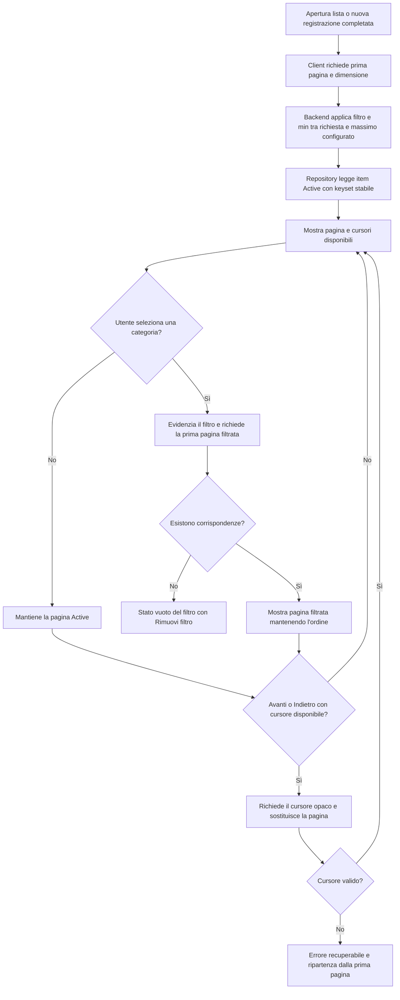

## description

Questo task copre la visualizzazione degli item `Active`, il loro ordine e il filtro per una categoria. Il problema concreto è rendere stabile ciò che «più recente in cima» significa anche quando molti item hanno lo stesso momento di creazione e provengono dalla stessa registrazione.

Il solo ordinamento `CreatedAt DESC` non garantisce l'ordine interno del gruppo: due righe possono condividere lo stesso timestamp e il database è libero di restituirle in ordine diverso. Per soddisfare il requisito servono almeno un ordine del gruppo e una posizione nell'audio. Una chiave di ordinamento concettuale è:

```text
RecordingCreatedAt DESC,
RecordingId (tie-breaker stabile),
PositionInRecording ASC,
ItemId (ultimo tie-breaker)
```

`PositionInRecording` è il numero 0, 1, 2… assegnato dal backend seguendo l'array prodotto dalla pipeline AI. `RecordingCreatedAt` è il momento in cui il gruppo viene accettato/salvato. `UpdatedAt` non partecipa all'ordine. L'input della UI è una pagina ordinata della lista attiva e una pagina delle categorie disponibili; l'output è una pagina dello stesso insieme oppure degli item associati alla categoria selezionata.

### Fatti noti

- Solo gli item `Active` sono visibili.
- I gruppi più recenti sono in cima; l'ordine pronunciato resta invariato nel gruppo.
- Modificare un item non lo sposta.
- Il filtro superiore è sempre presente quando esistono tag e seleziona una categoria alla volta secondo l'idea.
- Un item può avere più categorie.
- Ogni lettura di collezioni è paginata nel repository Infrastructure: non esiste un'operazione «Get All».
- Il backend limita la dimensione richiesta a `min(requestedPageSize, configuredReadMax)`; il valore iniziale configurato e il ceiling assoluto sono 5000 record.
- La paginazione usa cursori opachi e un ordinamento stabile, non offset numerici.

### Ipotesi prudenti

- La selezione di un tag è singola perché l'idea parla di «un tag» selezionato; la modifica nel drawer resta multipla.
- Il filtro non modifica i dati, ma viene applicato dal server prima della paginazione; il client può usarlo localmente solo per rendere immediata la presentazione dei dati già presenti nella pagina.

### Decisioni aperte

- Dimensioni di pagina offerte dalla UI entro `configuredReadMax`.
- Se il carosello mostra categorie presenti solo negli item attivi o l'intero catalogo.
- Persistenza del filtro tra riavvii e comportamento quando una nuova registrazione non corrisponde al filtro.
- Regola per nomi categoria equivalenti per maiuscole, accenti, spazi e lingua.
- Necessità di sincronizzazione in tempo reale tra più utenti.

## best practices microsoft ux

Il filtro deve essere percepito come un controllo selezionabile, non come testo decorativo. Ogni chip/tag ha nome, stato selezionato e area tattile adeguata; la selezione usa forma, bordo o segno oltre al colore. Un controllo «Tutte» esplicito all'inizio rende la rimozione immediata e comprensibile, più di un secondo tocco sul tag o di una piccola icona separata.

Fluent 2 descrive un tag come rappresentazione di un valore scelto e indica di non troncarne il testo; per informazioni generate dal sistema e non modificabili suggerisce un badge ([Fluent Tag](https://fluent2.microsoft.design/components/web/react/core/tag/usage)). Nel filtro di KinList l'aspetto può essere quello di un tag, ma il comportamento accessibile deve essere quello di un pulsante a selezione: `aria-pressed` comunica se è attivo. Nel drawer, dove le categorie vengono aggiunte/rimosse, i tag rappresentano invece valori modificabili.

Il carosello orizzontale deve permettere swipe/touch, scorrimento con trackpad e tastiera, senza intrappolare lo scorrimento verticale della pagina. Mostrare un accenno del tag successivo o un gradiente non interattivo aiuta a scoprire che la riga scorre. Non nascondere categorie dietro soli pulsanti freccia su mobile; su desktop le frecce possono essere un supporto aggiuntivo con nome accessibile.

Quando il filtro non produce risultati, non mostrare lo stato vuoto iniziale col microfono centrale: la lista può esistere ma non avere corrispondenze. Mostrare «Nessun item in questa categoria» e «Rimuovi filtro». Quando arrivano nuovi item mentre un filtro è attivo, non cambiare automaticamente selezione. Se non corrispondono, un annuncio breve può dire che sono stati aggiunti alla lista.

La modifica non deve spostare l'item perché l'ordine comunica creazione, non attività recente. Se la lista cambia da un altro client, preservare focus e posizione di scorrimento dove possibile.

Alternative considerate:

- **Filtro soltanto client:** sarebbe istantaneo, ma per essere completo richiederebbe di materializzare l'intero dataset nel browser; contraddice la paginazione obbligatoria e non è adatto.
- **Filtro server con feedback locale:** il server applica il filtro prima della paginazione e resta autorevole; il client aggiorna subito lo stato visivo del controllo mentre carica la prima pagina filtrata. È la soluzione raccomandata perché mantiene payload limitati senza lasciare il tocco privo di feedback.

Il frontend può scegliere la dimensione richiesta e deve offrire soltanto valori non superiori al limite configurato che gli viene esposto. Il backend non si fida però del controllo UI e applica sempre il minimo tra valore richiesto e `configuredReadMax`. Avanti e Indietro restano utilizzabili solo quando esiste il rispettivo cursore; una richiesta in errore conserva la pagina corrente e offre «Riprova», senza crash o azzeramenti.

## best practices microsoft backend

Il backend è responsabile dell'ordinamento autorevole e deve restituire campi sufficienti a mantenerlo. Affidare l'ordine al momento in cui React riceve gli item rende i risultati diversi dopo un refresh. `RecordingId` da solo raggruppa ma non ordina: è necessario `PositionInRecording`. Un timestamp UTC e un tie-breaker univoco rendono deterministico anche il caso di gruppi creati quasi insieme.

Il filtro deve usare l'identità della categoria, non il testo mostrato. Due categorie con lo stesso nome normalizzato devono essere impedite o risolte dal backend con un vincolo. L'item appare se possiede la categoria selezionata; le altre associazioni restano intatte.

Responsabilità separate ma semplici:

- query degli item attivi con ordinamento completo;
- query delle categorie disponibili nello stesso perimetro/autorizzazione;
- filtro tramite `CategoryId` validato;
- proiezione di soli campi necessari alla lista, lasciando metadati estesi al drawer.
- paginazione obbligatoria delle query di item e categorie nel repository Infrastructure.

Il cursore rappresenta in forma opaca l'ultima chiave stabile già letta: il client non la interpreta, ma la restituisce per chiedere gli elementi successivi o precedenti. Il nome tecnico è **paginazione keyset**, o a cursore. È preferibile all'offset («salta 40 righe») perché nuovi gruppi inseriti in cima non fanno saltare o ripetere item. Il repository applica lo stesso ordinamento completo sia in avanti sia all'indietro e restituisce i cursori disponibili. L'assenza di cursore significa che non esiste un'altra pagina in quella direzione; un cursore invalido o non più utilizzabile produce un errore client strutturato e recuperabile ripartendo dalla prima pagina, mai un'eccezione non gestita.

Ogni query di collezione richiede una dimensione positiva. Il backend usa `min(requestedPageSize, configuredReadMax)`. Il valore iniziale approvato di `configuredReadMax` è 5000 ed è anche il ceiling assoluto; la Function rifiuta configurazioni superiori.

Non serve il pattern CQRS, cioè modelli separati e infrastrutture diverse per letture e scritture. Una query/proiezione dedicata nello stesso backend risolve il problema senza duplicare sistemi.

Errori: categoria inesistente o non accessibile produce risposta strutturata; un filtro senza risultati è un successo con array vuoto, non un 404. Loggare durata e cardinalità della query, non nomi degli item.

## best practices microsoft infrastructure

Non servono nuove risorse Azure soltanto per ordinare, filtrare e paginare. Il database applicativo esistente deve essere il primo candidato. Un modello relazionale è naturale: `Items`, `Categories` e tabella di associazione molti-a-molti, con indici coerenti con stato, chiave d'ordinamento e categoria.

Indici da valutare con dati reali, non creare alla cieca:

- item attivi per gruppo/posizione;
- associazioni per `CategoryId` e `ItemId`;
- unicità del nome normalizzato della categoria nel perimetro corretto.

L'indice accelera letture ma costa spazio e lavoro ad ogni scrittura; va verificato con piani di esecuzione e telemetria. Se non esiste database e il carico è intermittente, Azure SQL serverless è una possibilità, ma il resume dopo pausa può peggiorare il primo caricamento. Microsoft lo raccomanda per carichi intermittenti che tollerano latenza di warm-up ([Azure SQL serverless](https://learn.microsoft.com/en-us/azure/azure-sql/database/serverless-tier-overview)).

Application Insights/OpenTelemetry può correlare caricamento lista e query backend, senza inviare i nomi degli item. Non sono giustificati un motore di ricerca, Redis, Cosmos DB o una pipeline eventi finché volume e misure non mostrano un problema reale.

Il massimo effettivo di lettura appartiene alla configurazione della Function App, ha valore iniziale 5000, viene associato a opzioni .NET validate all'avvio e non può superare il medesimo ceiling. La configurazione deve essere esposta al frontend in forma non sensibile per costruire scelte valide, ma il controllo server resta obbligatorio.

## flow chart



## user experience

La vista principale usa una sola riga scorrevole per categorie e una lista verticale. Il microfono rimane in basso al centro come descritto nell'idea.

```text
┌──────────────────────────────┐
│ [Tutte] [Spesa] [Casa]  ›   │
│                              │
│ □ Lamette                    │
│   Cura personale · Spesa    │
│ □ Pasta                      │
│   Spesa                      │
│ □ Latte                      │
│   Spesa                      │
│                              │
│ [Indietro]        [Avanti]   │
│                              │
│            ( 🎙 )             │
└──────────────────────────────┘
```

```text
┌──────────────────────────────┐
│ [Tutte] [Spesa] [Casa✓] ›   │
│                              │
│ Nessun item in Casa          │
│ [ Rimuovi filtro ]           │
│                              │
│            ( 🎙 )             │
└──────────────────────────────┘
```

- **Loading:** conservare la pagina precedente durante refresh o navigazione; indicatore locale e controlli temporaneamente non reinviabili.
- **Empty:** distinguere una prima pagina realmente vuota da filtro senza risultati; una pagina successiva vuota inattesa torna in modo sicuro all'ultima pagina valida.
- **Errore:** mantenere filtro e pagina selezionati e offrire «Riprova»; un cursore invalido propone di ripartire dalla prima pagina senza crash.
- **Successo:** selezione visibile e annunciata, ordine deterministico, cursori aggiornati e nessun salto dopo modifica.
