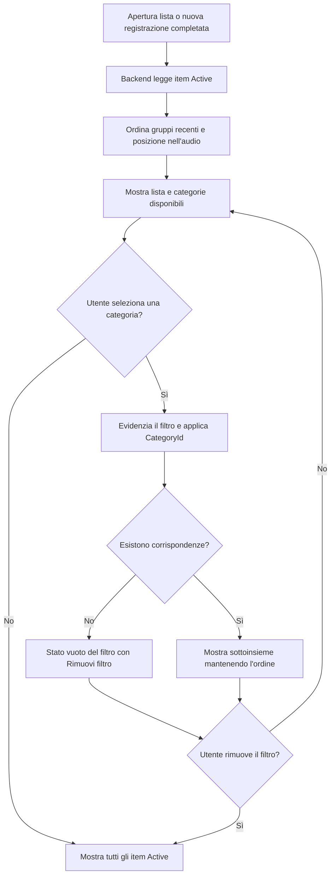

## description

Questo task copre la visualizzazione degli item `Active`, il loro ordine e il filtro per una categoria. Il problema concreto è rendere stabile ciò che «più recente in cima» significa anche quando molti item hanno lo stesso momento di creazione e provengono dalla stessa registrazione.

Il solo ordinamento `CreatedAt DESC` non garantisce l'ordine interno del gruppo: due righe possono condividere lo stesso timestamp e il database è libero di restituirle in ordine diverso. Per soddisfare il requisito servono almeno un ordine del gruppo e una posizione nell'audio. Una chiave di ordinamento concettuale è:

```text
RecordingCreatedAt DESC,
RecordingId (tie-breaker stabile),
PositionInRecording ASC,
ItemId (ultimo tie-breaker)
```

`PositionInRecording` è il numero 0, 1, 2… assegnato dal backend seguendo l'array prodotto dalla pipeline AI. `RecordingCreatedAt` è il momento in cui il gruppo viene accettato/salvato. `UpdatedAt` non partecipa all'ordine. L'input della UI è la lista attiva ordinata e l'elenco delle categorie disponibili; l'output è la stessa lista completa o il sottoinsieme associato alla categoria selezionata.

### Fatti noti

- Solo gli item `Active` sono visibili.
- I gruppi più recenti sono in cima; l'ordine pronunciato resta invariato nel gruppo.
- Modificare un item non lo sposta.
- Il filtro superiore è sempre presente quando esistono tag e seleziona una categoria alla volta secondo l'idea.
- Un item può avere più categorie.

### Ipotesi prudenti

- La selezione di un tag è singola perché l'idea parla di «un tag» selezionato; la modifica nel drawer resta multipla.
- Il filtro non modifica i dati e può essere applicato immediatamente ai dati già caricati.
- Il volume iniziale è abbastanza piccolo da mostrare una lista mobile senza paginazione; questa è un'ipotesi, non un requisito.

### Decisioni aperte

- Dimensione massima tipica della lista attiva e necessità di paginazione/virtualizzazione.
- Se il carosello mostra categorie presenti solo negli item attivi o l'intero catalogo.
- Persistenza del filtro tra riavvii e comportamento quando una nuova registrazione non corrisponde al filtro.
- Regola per nomi categoria equivalenti per maiuscole, accenti, spazi e lingua.
- Necessità di sincronizzazione in tempo reale tra più utenti.

## best practices microsoft ux

Il filtro deve essere percepito come un controllo selezionabile, non come testo decorativo. Ogni chip/tag ha nome, stato selezionato e area tattile adeguata; la selezione usa forma, bordo o segno oltre al colore. Un controllo «Tutte» esplicito all'inizio rende la rimozione immediata e comprensibile, più di un secondo tocco sul tag o di una piccola icona separata.

Fluent 2 descrive un tag come rappresentazione di un valore scelto e indica di non troncarne il testo; per informazioni generate dal sistema e non modificabili suggerisce un badge ([Fluent Tag](https://fluent2.microsoft.design/components/web/react/core/tag/usage)). Nel filtro di KinList l'aspetto può essere quello di un tag, ma il comportamento accessibile deve essere quello di un pulsante a selezione: `aria-pressed` comunica se è attivo. Nel drawer, dove le categorie vengono aggiunte/rimosse, i tag rappresentano invece valori modificabili.

Il carosello orizzontale deve permettere swipe/touch, scorrimento con trackpad e tastiera, senza intrappolare lo scorrimento verticale della pagina. Mostrare un accenno del tag successivo o un gradiente non interattivo aiuta a scoprire che la riga scorre. Non nascondere categorie dietro soli pulsanti freccia su mobile; su desktop le frecce possono essere un supporto aggiuntivo con nome accessibile.

Quando il filtro non produce risultati, non mostrare lo stato vuoto iniziale col microfono centrale: la lista esiste ma è nascosta dal filtro. Mostrare «Nessun item in questa categoria» e «Rimuovi filtro». Quando arrivano nuovi item mentre un filtro è attivo, non cambiare automaticamente selezione. Se non corrispondono, un annuncio breve può dire che sono stati aggiunti alla lista completa.

La modifica non deve spostare l'item perché l'ordine comunica creazione, non attività recente. Se la lista cambia da un altro client, preservare focus e posizione di scorrimento dove possibile.

Alternative considerate:

- **Filtro soltanto client:** istantaneo e semplice se tutti gli item attivi sono già caricati; espone al dispositivo l'intera lista attiva e non scala a dataset paginati.
- **Filtro soltanto server:** mantiene payload piccoli e regole centralizzate, ma ogni tocco dipende dalla rete e può sembrare lento.
- **Soluzione ibrida:** il server espone query autorevoli; il client filtra istantaneamente la pagina/dataset completo già disponibile e richiede il server quando i dati sono parziali. È la raccomandazione condizionata al volume.

## best practices microsoft backend

Il backend è responsabile dell'ordinamento autorevole e deve restituire campi sufficienti a mantenerlo. Affidare l'ordine al momento in cui React riceve gli item rende i risultati diversi dopo un refresh. `RecordingId` da solo raggruppa ma non ordina: è necessario `PositionInRecording`. Un timestamp UTC e un tie-breaker univoco rendono deterministico anche il caso di gruppi creati quasi insieme.

Il filtro deve usare l'identità della categoria, non il testo mostrato. Due categorie con lo stesso nome normalizzato devono essere impedite o risolte dal backend con un vincolo. L'item appare se possiede la categoria selezionata; le altre associazioni restano intatte.

Responsabilità separate ma semplici:

- query degli item attivi con ordinamento completo;
- query delle categorie disponibili nello stesso perimetro/autorizzazione;
- filtro tramite `CategoryId` validato;
- proiezione di soli campi necessari alla lista, lasciando metadati estesi al drawer.

Se la lista è paginata, usare un cursore costruito dalla chiave di ordinamento, non numeri di pagina basati su offset che possono saltare o ripetere righe mentre arrivano nuovi gruppi. Il nome tecnico è **paginazione a cursore**: il client chiede «gli elementi dopo questa ultima chiave» invece di «pagina 3». Costa un contratto leggermente più complesso e non serve finché il dataset resta piccolo.

Non serve il pattern CQRS, cioè modelli separati e infrastrutture diverse per letture e scritture. Una query/proiezione dedicata nello stesso backend risolve il problema senza duplicare sistemi.

Errori: categoria inesistente o non accessibile produce risposta strutturata; un filtro senza risultati è un successo con array vuoto, non un 404. Loggare durata e cardinalità della query, non nomi degli item.

## best practices microsoft infrastructure

Non servono nuove risorse Azure soltanto per ordinare e filtrare. Il database applicativo esistente deve essere il primo candidato. Un modello relazionale è naturale: `Items`, `Categories` e tabella di associazione molti-a-molti, con indici coerenti con stato, chiave d'ordinamento e categoria.

Indici da valutare con dati reali, non creare alla cieca:

- item attivi per gruppo/posizione;
- associazioni per `CategoryId` e `ItemId`;
- unicità del nome normalizzato della categoria nel perimetro corretto.

L'indice accelera letture ma costa spazio e lavoro ad ogni scrittura; va verificato con piani di esecuzione e telemetria. Se non esiste database e il carico è intermittente, Azure SQL serverless è una possibilità, ma il resume dopo pausa può peggiorare il primo caricamento. Microsoft lo raccomanda per carichi intermittenti che tollerano latenza di warm-up ([Azure SQL serverless](https://learn.microsoft.com/en-us/azure/azure-sql/database/serverless-tier-overview)).

Application Insights/OpenTelemetry può correlare caricamento lista e query backend, senza inviare i nomi degli item. Non sono giustificati un motore di ricerca, Redis, Cosmos DB o una pipeline eventi finché volume e misure non mostrano un problema reale.

## flow chart



## user experience

La vista principale usa una sola riga scorrevole per categorie e una lista verticale. Il microfono rimane in basso al centro come descritto nell'idea.

```text
┌──────────────────────────────┐
│ [Tutte] [Spesa] [Casa]  ›   │
│                              │
│ □ Lamette                    │
│   Cura personale · Spesa    │
│ □ Pasta                      │
│   Spesa                      │
│ □ Latte                      │
│   Spesa                      │
│                              │
│            ( 🎙 )             │
└──────────────────────────────┘
```

```text
┌──────────────────────────────┐
│ [Tutte] [Spesa] [Casa✓] ›   │
│                              │
│ Nessun item in Casa          │
│ [ Rimuovi filtro ]           │
│                              │
│            ( 🎙 )             │
└──────────────────────────────┘
```

- **Loading:** conservare la lista precedente durante un refresh; indicatore locale se il filtro richiede rete.
- **Empty:** distinguere lista realmente vuota da filtro senza risultati.
- **Errore:** mantenere filtro selezionato e offrire «Riprova»; non azzerare la lista per un errore di refresh.
- **Successo:** selezione visibile e annunciata, ordine deterministico, nessun salto dopo modifica.
