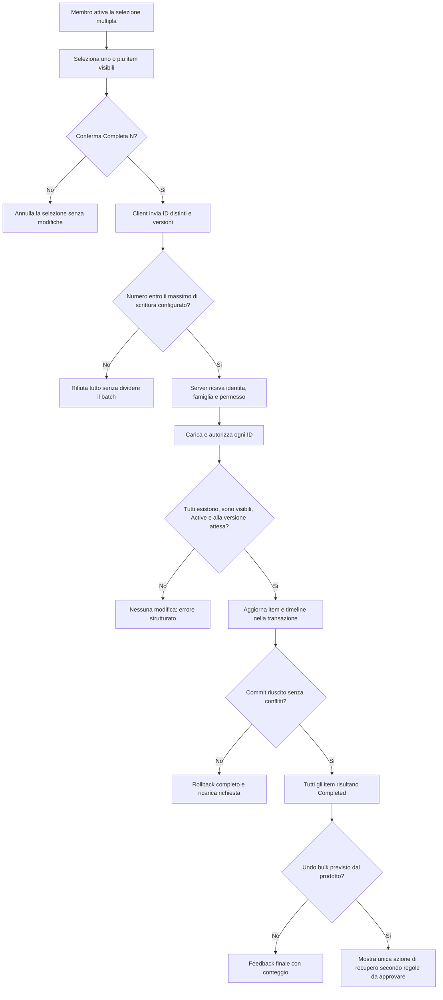

## description

Questo task studia la selezione multipla di item attivi e il loro completamento con una sola azione esplicita. Il problema concreto non e soltanto aggiornare piu righe: l'utente deve capire quali item sta selezionando, il server deve verificare ogni identificativo e l'esito deve restare comprensibile se nel frattempo un familiare modifica o completa uno degli item.

Input del flusso: un insieme senza duplicati di identificativi degli item selezionati e, per rilevare cambiamenti concorrenti, la versione osservata di ciascun item. Output: tutti gli item accettati passano da `Active` a `Completed`, con autore, data e timeline coerenti, oppure il server restituisce un errore strutturato senza fingere un successo. Il client non invia famiglia, autore o timestamp come valori autorevoli.

### Fatti noti

- KinList usa una lista familiare, aggiornamento collaborativo tramite refresh manuale e concorrenza ottimistica.
- Il completamento singolo e persistito subito, nasconde l'item e registra stato, `CompletedAt`, autore e timeline.
- Il completamento bulk produce un solo `Annulla N` atomico entro cinque secondi.
- Backend .NET, EF Core e PostgreSQL sono gia il confine transazionale previsto.
- Autenticazione e autorizzazione devono essere applicate dal server, non dedotte dalla UI.
- Il completamento bulk ha semantica tutti-o-nessuno.
- «Seleziona tutti» seleziona soltanto gli item visibili nella pagina corrente dopo il filtro e non materializza il dataset completo.
- Il massimo effettivo di scrittura bulk è configurato a 1000 record nella Function App, validato ed equivalente al ceiling assoluto.
- Una richiesta oltre il massimo configurato viene rifiutata interamente e non viene spezzata silenziosamente.

### Ipotesi prudenti

- Il bulk riguarda item attivi mostrati nella stessa vista KinList, non un processo lungo o una selezione che attraversa dataset non caricati.
- Ogni item conserva la propria chiave d'ordine, quindi un eventuale ripristino non richiede un indice visuale.

### Decisioni aperte

- Come si entra ed esce dalla modalita di selezione su mobile e desktop.
- Dettaglio visuale della modalità di selezione sui breakpoint mobile e desktop.
- Rappresentazione nella timeline: un evento per item e l'eventuale identificativo comune del comando, senza introdurre un nuovo tipo di evento non approvato.

## best practices microsoft ux

La selezione multipla deve essere una fase riconoscibile e reversibile prima del completamento. Fluent 2 descrive le checkbox come controlli adatti a scegliere piu opzioni e precisa che la selezione non dovrebbe produrre da sola l'effetto finale: serve un'azione di conferma, qui «Completa N» ([Fluent 2 Checkbox](https://fluent2.microsoft.design/components/web/react/core/checkbox/usage)). Questo separa due intenzioni: scegliere gli item e completarli.

Quando la modalita e attiva, ogni riga mostra un controllo con nome accessibile che include l'item, mentre una barra azioni comunica sempre il conteggio selezionato. Colore, segno di spunta e testo devono concordare; il solo cambio di colore non e sufficiente. Il focus non deve saltare quando una riga viene selezionata e l'azione bulk deve essere raggiungibile da tastiera senza percorrere nuovamente tutta la lista.

Stati necessari:

- **Nessuna selezione:** azione di completamento disabilitata o assente, senza barra vuota che aumenti l'inquinamento visivo.
- **Selezione attiva:** conteggio aggiornato e azioni essenziali «Annulla selezione» e «Completa N».
- **Seleziona tutti:** seleziona solo le righe visibili nella pagina filtrata corrente; cambio filtro o pagina rende esplicito il nuovo perimetro e non accumula item invisibili.
- **Invio:** controlli temporaneamente non modificabili; feedback indeterminato breve, senza percentuali inventate.
- **Successo:** gli item completati scompaiono insieme e un feedback annuncia il numero effettivo.
- **Conflitto o errore:** nessun messaggio generico; la UI ricarica lo stato autorevole e spiega che la lista e cambiata o che l'operazione non e riuscita.
- **Stato vuoto:** se il gruppo conteneva gli ultimi item visibili, mostrare il normale stato vuoto senza perdere l'eventuale feedback o azione di recupero approvata.

### Alternative di esito

Con **tutti o nessuno**, l'utente esprime una sola intenzione: se uno degli item non puo essere completato, nessuno cambia. Il vantaggio UX e un risultato facile da spiegare e da riconciliare; il costo e dover ripetere la selezione dopo un solo conflitto. Con **successo parziale**, gli item validi cambiano e gli altri restano: e utile per batch grandi o con alta contesa, ma richiede un riepilogo per item, una selezione residua e regole di undo piu complesse.

La decisione approvata per KinList e tutti-o-nessuno con dimensione limitata. KinList privilegia semplicità e una singola intenzione: il costo di ripetere una selezione breve è inferiore al costo cognitivo di un esito misto. Il successo parziale resta un'alternativa tecnica descritta per confronto, non il contratto corrente.

Fluent 2 usa i toast per feedback temporaneo non critico e raccomanda una posizione prevedibile e pochi messaggi simultanei ([Fluent 2 Toast](https://fluent2.microsoft.design/components/web/react/core/toast/usage)). Un successo complessivo usa quindi un solo feedback con `Annulla N` entro cinque secondi. Un errore che richiede una nuova scelta non deve sparire troppo rapidamente; una coda di N snackbar sarebbe rumorosa e contraria al contratto atomico approvato.

## best practices microsoft backend

Il server riceve gli ID selezionati e non presume che siano sicuri perche provenienti dalla lista mostrata. Per ogni ID deve verificare nello stesso flusso: esistenza, appartenenza alla famiglia corrente, visibilita per l'utente, permesso di completamento, stato `Active` e versione attesa. Un ID non autorizzato non puo essere ignorato silenziosamente in un'operazione tutti-o-nessuno, altrimenti il client potrebbe credere completato un insieme diverso da quello richiesto.

Prima di caricare gli item, il backend valida il numero di ID distinti contro `configuredWriteMax`, configurato inizialmente a 1000 e mai superiore al medesimo ceiling assoluto. Un batch oltre il massimo viene rifiutato senza modifiche; non viene diviso in più transazioni, perché lo spezzamento trasformerebbe silenziosamente un comando atomico in possibili successi parziali.

Il problema dell'autorizzazione dipende dai dati dell'item, non soltanto dal fatto che l'utente sia autenticato. Microsoft definisce questo controllo **autorizzazione basata sulla risorsa**: la decisione usa insieme utente, operazione e risorsa caricata ([ASP.NET Core resource-based authorization](https://learn.microsoft.com/en-us/aspnet/core/security/authorization/resource-based?view=aspnetcore-10.0)). Nel bulk la verifica va applicata a ogni risorsa, anche se una query gia circoscritta riduce il set candidato. Confrontare il numero di ID distinti richiesti con il numero di item autorizzati e validi impedisce di accettare accidentalmente un sottoinsieme.

Per l'esito tutti-o-nessuno, le modifiche di stato, `CompletedAt`, autore, metadati e un evento timeline per ciascun item appartengono alla stessa transazione EF Core. Una transazione applica tutte le scritture o nessuna; EF Core garantisce gia l'atomicita di una singola `SaveChanges` con provider relazionale, mentre una transazione manuale serve soltanto se il caso d'uso richiede piu salvataggi ([EF Core transactions](https://learn.microsoft.com/en-us/ef/core/saving/transactions)). La transazione deve essere breve: caricare e validare il batch, applicare le transizioni e salvare, senza attese utente o chiamate remote al suo interno.

La transazione non risolve da sola la concorrenza. Ogni item porta una versione osservata; l'update riesce soltanto se quella versione e ancora corrente. EF Core chiama questo meccanismo **concorrenza ottimistica** e segnala il conflitto quando una riga non corrisponde piu alla versione letta ([EF Core concurrency](https://learn.microsoft.com/en-us/ef/core/saving/concurrency)). Nell'opzione raccomandata, un conflitto su un solo item provoca rollback dell'intero bulk e restituisce un codice stabile che invita a ricaricare. Un retry automatico con dati nuovi cambierebbe implicitamente l'intenzione dell'utente e non e raccomandato.

### Concetti spiegati

- **Tutti-o-nessuno o atomicita:** tutte le transizioni del gruppo diventano visibili insieme oppure il database resta invariato.
- **Transazione:** confine breve nel database che realizza tale atomicita; non sostituisce autorizzazione o controllo delle versioni.
- **Concorrenza ottimistica:** non blocca gli item mentre l'utente sceglie; al salvataggio rileva se qualcuno li ha cambiati.
- **Successo parziale:** ogni item puo avere un esito diverso; richiede un contratto di risposta e una riconciliazione UI per elemento.

Il successo parziale e tecnicamente possibile, ma non fa parte del contratto approvato. Simularlo con piu chiamate indipendenti dal browser lascerebbe un esito difficile da ricostruire dopo una caduta di rete e moltiplicherebbe autorizzazione e feedback. KinList mantiene quindi un solo comando atomico entro il massimo configurato.

Gli errori devono distinguere input vuoto o oltre il massimo configurato, ID duplicati normalizzati, elemento non disponibile, accesso non consentito, transizione non valida e conflitto. I log possono includere command ID, numero richiesto, numero elaborato, durata e categoria d'errore; non nomi o categorie degli item. Un command ID puo rendere sicuro il retry dopo una risposta persa, ma la durata di conservazione dell'esito e una decisione tecnica successiva, non una nuova funzione utente.

## best practices microsoft infrastructure

Non servono nuove risorse Azure. Function App, PostgreSQL e Application Insights/OpenTelemetry condivisi sono sufficienti. Service Bus, Durable Functions, lock distribuiti e orchestratori aggiungerebbero stato e recupero per un'operazione breve che resta nello stesso database.

PostgreSQL deve essere l'arbitro tra istanze della Function App: condizioni su stato/versione, transazione e vincoli sono affidabili anche quando due richieste arrivano a istanze diverse. Lock in memoria e session affinity non lo sono. Indici su perimetro famiglia, ID e stato possono aiutare la lettura del batch, ma vanno verificati sui piani di esecuzione e sui volumi reali.

L'osservabilita minima comprende dimensione del batch, durata, esito atomico, conflitti, rifiuti per limite o autorizzazione e rollback, sempre in forma aggregata. Alert solo su crescita sostenuta di errori server o latenza, non su un singolo conflitto utente. Il massimo effettivo della Function App è configurato inizialmente a 1000 ed è validato all'avvio contro lo stesso ceiling.

## flow chart



## user experience

La vista principale resta riconoscibile. La modalita di selezione aggiunge soltanto controlli necessari e una barra azioni compatta; non apre una nuova schermata. Il filtro corrente rimane visibile e «Seleziona tutti» dichiara il proprio perimetro: solo gli item visibili nella pagina filtrata corrente.

```text
+--------------------------------+
| [Tutte] [Spesa] [Casa]         |
|                                |
| [x] Latte                      |
| [ ] Pasta                      |
| [x] Lamette                    |
|                                |
| [Seleziona pagina] 2 selezionati|
| [Annulla]        [Completa 2]  |
+--------------------------------+
```

```text
+--------------------------------+
| La lista e cambiata            |
| Nessun item e stato completato |
|                                |
| [Ricarica lista]               |
+--------------------------------+
```

- **Loading:** barra azioni in stato occupato, lista ancora leggibile e nessuna seconda conferma inviabile.
- **Empty:** se non esistono item attivi, la modalita di selezione non e disponibile; dopo successo sugli ultimi item compare lo stato vuoto normale.
- **Errore:** nell'esito tutti-o-nessuno si dichiara esplicitamente che nessun item e cambiato; dopo ricarica la selezione non viene riapplicata alla cieca.
- **Oltre limite:** il backend rifiuta l'intero comando con un messaggio recuperabile; il client non tenta batch nascosti multipli.
- **Successo:** le righe scompaiono insieme, il conteggio e annunciato e il focus passa a una posizione prevedibile.
- **Undo:** wireframe e comportamento finali dipendono dalla decisione aperta tra recupero aggregato, individuale o assente; non mostrare N snackbar individuali per impostazione predefinita senza una scelta prodotto.
