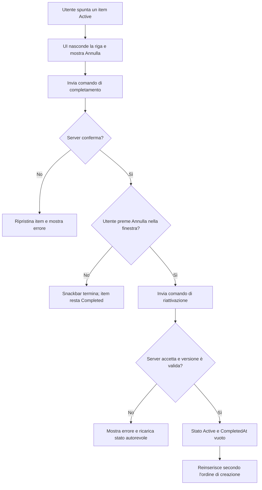

## description

Questo task copre la transizione `Active → Completed` e il suo annullamento entro cinque secondi. Il problema concreto è conciliare tre fatti: l'item deve sparire subito, il backend deve diventare autorevole sullo stato e un errore o un tocco su «Annulla» deve ripristinare esattamente l'item senza duplicati o salti di posizione.

Il flusso raccomandato è **ottimistico con riconciliazione**. “Ottimistico” significa che la UI mostra subito l'esito atteso senza aspettare la rete; “riconciliazione” significa che successivamente si adegua alla risposta del server. Esempio: il client nasconde «Latte», conserva temporaneamente i suoi dati e invia il comando di completamento. Se il server conferma, resta nascosto; se fallisce, ricompare con un errore. Se l'utente annulla, il client invia la transizione inversa e lo reinserisce usando la chiave d'ordine originale.

### Fatti noti

- Un item completato scompare immediatamente dalla lista principale.
- Lo stato passa da `Active` a `Completed` e viene valorizzato `CompletedAt`.
- Una snackbar con «Annulla» resta disponibile per cinque secondi.
- Entro la finestra, l'annullamento riporta l'item ad `Active` nella posizione precedente.
- Dopo la finestra non esiste una UI per recuperare item completati.

### Ipotesi prudenti

- Il completamento viene salvato subito sul server; non viene tenuto solo nel browser per cinque secondi.
- L'annullamento azzera `CompletedAt` perché l'item non è più completato.
- La posizione viene ricalcolata dagli immutati campi di creazione/gruppo, non memorizzata come indice visuale fragile.

### Decisioni aperte

- Se i cinque secondi sono un requisito rigido anche per tastiera, screen reader e utenti che richiedono più tempo.
- Comportamento per più completamenti ravvicinati: snackbar separate, accorpate o una sola azione per l'ultimo item.
- Evento cronologico dell'annullamento: rimuovere il completamento o aggiungere un evento «Riattivato». Per un audit veritiero è raccomandato aggiungere l'evento, ma non è tra i tipi iniziali elencati.
- Conflitto con una modifica/completamento proveniente da un'altra sessione.
- Comportamento se l'app viene chiusa o perde rete durante i cinque secondi.

## best practices microsoft ux

La riga deve sparire subito ma il movimento non deve disorientare. Spostare il focus a un elemento prevedibile: il prossimo item, il precedente oppure l'intestazione della lista se non resta altro. Annunciare «Item completato. Annulla disponibile» in modo accessibile. La snackbar appare sempre nella stessa posizione e non copre il microfono o gli ultimi item.

Fluent 2 definisce il toast come superficie temporanea per lo stato di un'azione, ammette una call to action e raccomanda posizione prevedibile, testo breve e semantica `aria-live` corretta ([Fluent 2 Toast](https://fluent2.microsoft.design/components/web/react/core/toast/usage)). La snackbar di KinList svolge la stessa funzione. «Annulla» deve essere un vero pulsante, raggiungibile da tastiera e con focus visibile.

Il limite di cinque secondi è critico perché, scaduto, non esiste altro recupero nell'interfaccia. WCAG richiede che i limiti di tempo imposti dal contenuto siano disattivabili, regolabili o estendibili salvo eccezioni ([WCAG 2.2, Timing Adjustable](https://www.w3.org/WAI/WCAG22/Understanding/timing-adjustable.html)). La decisione non va nascosta: mantenere cinque secondi esatti senza adattamento rischia di rendere l'unica azione di recupero inaccessibile. Raccomandazione minima: il conteggio si ferma quando la snackbar ha hover o focus e riparte quando l'interazione termina; valutare una durata più lunga configurabile. Se il prodotto impone cinque secondi assoluti, va accettato consapevolmente come scostamento.

Stati:

- **Completamento in invio:** riga già nascosta, snackbar visibile, comando identificato univocamente.
- **Completamento confermato:** nessun cambiamento visivo ulteriore.
- **Annullamento richiesto:** pulsante disabilitato dopo il primo tocco; l'item riappare quando il client può garantire o rappresentare lo stato.
- **Errore completamento:** item ripristinato e messaggio non temporaneo abbastanza da essere compreso.
- **Errore annullamento:** non fingere il ripristino definitivo; mostrare che l'annullamento non è riuscito e consentire un retry finché la politica server lo permette.

Per completamenti multipli, accorpare tutto in «3 item completati · Annulla» cambia il significato dell'azione e richiede un undo di gruppo non richiesto. La scelta più fedele è una coda breve di snackbar, una per comando, con limite visivo; il comportamento finale richiede test mobile e decisione di prodotto.

## best practices microsoft backend

Il backend applica transizioni condizionate:

- completamento: aggiorna solo se lo stato corrente è `Active`, imposta `CompletedAt` con UTC server, `UpdatedAt`/`UpdatedBy` e aggiunge l'evento;
- annullamento: aggiorna solo l'item completato dal comando atteso, torna `Active`, azzera `CompletedAt` e registra la compensazione secondo la decisione di audit.

Ogni comando ha un identificatore univoco. Se il client ritenta dopo una risposta persa, il backend restituisce l'esito già registrato senza applicare due volte la transizione. Questo è lo stesso principio di idempotenza usato per `RecordingId`, applicato a un'azione di stato.

La finestra di cinque secondi deve avere un'autorità chiara. Affidarsi soltanto all'orologio del browser permette risultati diversi e soffre cambi dell'ora locale. Il server salva il momento di completamento e decide se accetta l'annullamento, usando un piccolo margine per latenza se approvato dal prodotto. Il client usa un timer solo per la presentazione. Se la policy server rifiuta rigidamente ogni richiesta ricevuta dopo cinque secondi, un tap effettuato visivamente in tempo può fallire su rete lenta: la tolleranza è una decisione aperta importante.

Completamento e annullamento devono usare un concurrency token/versione per non sovrascrivere modifiche concorrenti. EF Core descrive la concorrenza ottimistica come update che riesce solo se il token letto non è cambiato ([EF Core concurrency](https://learn.microsoft.com/en-us/ef/core/saving/concurrency)). Non ritentare automaticamente un conflitto come se nulla fosse: ricaricare lo stato autorevole.

La posizione precedente non necessita di un campo «PreviousIndex». Poiché `CreatedAt`, `RecordingId` e `PositionInRecording` non cambiano al completamento, la query degli item attivi reinserisce naturalmente l'item nella posizione deterministica. Un indice UI sarebbe diverso tra filtri e dispositivi e diventerebbe obsoleto.

Il completamento immediato sul server è preferibile al commit differito di cinque secondi: se l'app viene chiusa, il dato resta coerente e parte correttamente il periodo di conservazione. Il commit differito eviterebbe la chiamata di undo, ma richiederebbe un job pendente, fallirebbe alla chiusura e renderebbe `CompletedAt` ambiguo.

Errori API strutturati devono distinguere comando duplicato, transizione non valida, conflitto e finestra scaduta. Log tecnici: item ID, command ID, versione, durata; mai il nome dell'item.

## best practices microsoft infrastructure

Non occorrono nuove risorse Azure. L'API e il database esistenti sono sufficienti; completamento, evento e command ID devono essere salvati nella stessa transazione. Se l'app è distribuita su più istanze, il vincolo univoco e la condizione di versione nel database restano l'arbitro, senza lock in memoria o session affinity.

Application Insights/OpenTelemetry deve misurare:

- completamenti riusciti/falliti;
- annullamenti richiesti, riusciti, scaduti e falliti;
- conflitti di concorrenza;
- latenza dal comando alla conferma.

Gli alert non devono reagire a singoli errori utente, ma a un aumento sostenuto di fallimenti server. Non sono giustificati Service Bus, Durable Functions, cache distribuita o una saga. Una **saga** coordina transazioni lunghe tra servizi tramite azioni compensative; qui una transazione nel medesimo database e un update inverso sono sufficienti.

## flow chart



## user experience

La snackbar è sopra la zona del microfono e non cambia posizione tra orientamenti. Il conto alla rovescia visivo non è indispensabile; se presente, non deve essere l'unico modo per capire che l'azione sta per scadere.

```text
┌──────────────────────────────┐
│ [Tutte] [Spesa] [Casa]      │
│                              │
│ □ Pasta                      │
│ □ Lamette                    │
│                              │
│ ┌──────────────────────────┐ │
│ │ Latte completato [Annulla]│ │
│ └──────────────────────────┘ │
│            ( 🎙 )             │
└──────────────────────────────┘
```

- **Loading:** nessuno spinner sull'intera lista; la snackbar rappresenta l'operazione pendente.
- **Empty:** se era l'ultimo item, mostrare lo stato vuoto ma lasciare la snackbar e la possibilità di ripristino.
- **Errore:** reinserire la riga se il completamento fallisce; preservare un messaggio leggibile oltre un lampo.
- **Successo:** dopo completamento la riga resta assente; dopo undo ricompare nella posizione determinata dai campi di creazione.
