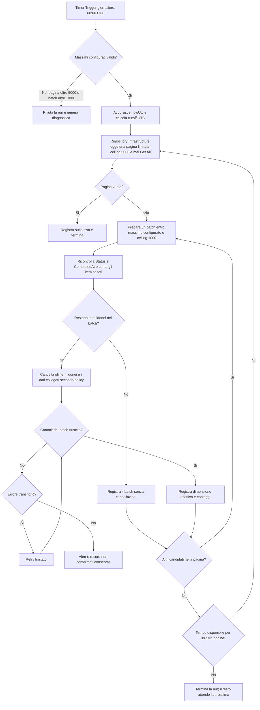

## description

Questo task copre il periodo successivo al completamento: un item `Completed` rimane nel database per 30 giorni e poi viene eliminato definitivamente da un processo pianificato. Non esiste UI per consultarlo dopo la finestra «Annulla». Il problema concreto è cancellare in modo affidabile in base alla data di completamento, senza spostare involontariamente la scadenza quando cambiano metadati tecnici e senza caricare in memoria tutti gli item idonei.

Una Azure Function con Timer Trigger parte una volta al giorno a mezzanotte, che in questo contratto significa esattamente `00:00 UTC`. Lo stesso trigger tenta sia questo caso d'uso sia il distinto cleanup lifecycle, ma non ne unifica regole o risultati. Per la retention acquisisce l'istante UTC e calcola il proprio cutoff sottraendo 30 giorni: sono candidati gli item con `Status = Completed` e `CompletedAt <= retentionCutoff`; usare `UpdatedAt` o il lifecycle `inactiveAt` sarebbe errato perché cambierebbe la scadenza approvata.

Il repository di Infrastructure legge i candidati per pagine e non offre a questo flusso un'operazione `Get All`. Il massimo configurato per una pagina non può superare il ceiling, cioè il limite invalicabile, di 5000 candidati. Le cancellazioni e le scritture collegate avvengono in batch: il massimo configurato per ciascun batch non può superare il ceiling di 1000. Una stessa esecuzione può leggere più pagine ed elaborare più batch, ma ogni singola lettura e ogni singola scrittura resta limitata.

Il **massimo configurato** è un limite superiore, non una quantità da raggiungere. I valori iniziali approvati sono 5000 per lettura e 1000 per scrittura e coincidono con i ceiling. La **dimensione effettiva** è quanto viene davvero letto o scritto in quel passaggio e può essere inferiore. Per esempio, una pagina restituisce solo 230 item se ne esistono 230; dopo il ricontrollo concorrente, un batch di scrittura può contenerne ancora meno.

### Fatti noti

- Gli item hanno solo gli stati `Active` e `Completed`.
- `CompletedAt`, non `UpdatedAt`, determina la conservazione; la durata è 30 giorni e il confronto usa un cutoff UTC inclusivo.
- La cancellazione è definitiva ed è avviata da Azure Functions Timer Trigger una volta al giorno alle `00:00 UTC`.
- `RunOnStartup` non viene usato: un riavvio o uno scale-out non deve avviare una cancellazione fuori pianificazione.
- Dopo cinque secondi dal completamento non esiste recupero tramite UI.
- Il repository Infrastructure legge i candidati in modo paginato, mai tramite `Get All`; il massimo configurato per pagina ha hard ceiling 5000.
- Ogni batch di cancellazione e delle scritture collegate ha un massimo configurato e hard ceiling 1000; una singola esecuzione può elaborare più batch limitati.
- La configurazione della Function viene validata dal backend e i valori superiori ai ceiling vengono rifiutati, non corretti silenziosamente.

### Ipotesi prudenti

- «30 giorni» significa 30 periodi di 24 ore calcolati in UTC; l'avvio a mezzanotte non trasforma la regola in 30 giorni di calendario locale.
- La cancellazione definitiva riguarda il database operativo; backup e log seguono politiche separate.
- Le relazioni categorie e la cronologia dell'item vengono eliminate o rese anonime in modo coerente con il modello dati, da decidere esplicitamente.
- Il lavoro termina quando non restano candidati per il cutoff della run oppure quando timeout o cancellazione dell'host impongono di lasciare il resto alla run successiva.

### Decisioni aperte

- Timeout della singola esecuzione, politica di retry limitato e soglie degli alert.
- Requisiti legali, privacy, audit o conservazione che possono impedire l'eliminazione di autore e storia.
- Politica di backup, point-in-time restore e tempi entro cui i dati scompaiono anche dalle copie.
- Comportamento delle categorie rimaste senza item.
- Eliminazione fisica immediata, anonimizzazione parziale o soft delete tecnico: l'idea richiede eliminazione definitiva, quindi alternative diverse necessitano conferma.

## best practices microsoft ux

Il task non ha una nuova superficie UI: inventare una schermata «Completati» contraddirebbe lo scope. L'esperienza utente pertinente avviene prima, nel completamento. La snackbar deve far capire che dopo la finestra l'item non è recuperabile dall'interfaccia; non serve spiegare ogni volta la conservazione tecnica di 30 giorni, che riguarda privacy e backend, non un'azione disponibile.

Se la Function è in ritardo o fallisce, la lista principale non cambia perché mostra solo `Active`. Non mostrare errori infrastrutturali agli utenti che non possono intervenire. Gli operatori, invece, hanno bisogno di metriche e alert nel portale di monitoraggio esistente. Il monitoraggio deve distinguere il massimo configurato dalla dimensione effettiva: mostrare soltanto «batch 1000» sarebbe ambiguo, perché potrebbe indicare un limite oppure mille cancellazioni realmente avvenute.

Stati operatore:

- **nessun item idoneo:** esecuzione riuscita con conteggio zero, non errore;
- **cancellazione in corso:** pagine lette, batch completati, quantità effettive e durata;
- **errore di configurazione:** esecuzione rifiutata prima di leggere dati se un massimo supera 5000 o 1000;
- **errore parziale:** numero eliminato e numero rimasto, con nuova esecuzione sicura;
- **successo:** cutoff UTC, ultimo completamento della Function e totale cancellato;
- **Function in ritardo:** alert quando il più vecchio item idoneo supera una tolleranza concordata.

Non è necessaria una conferma per ogni item: l'utente ha già confermato implicitamente completando e lasciando scadere Annulla. Aggiungere dialoghi o notifiche dopo 30 giorni sarebbe una nuova funzionalità.

## best practices microsoft backend

La Function Timer è il punto di ingresso condiviso: riceve il segnale pianificato e invoca separatamente retention e cleanup lifecycle. Un fallimento viene registrato senza impedire il tentativo dell'altro caso d'uso; dopo entrambi i tentativi, la Function deve comunque risultare fallita se almeno uno è fallito. Il caso d'uso di retention conserva il proprio cutoff `CompletedAt`, le proprie metriche e il proprio esito, mentre il repository di Infrastructure traduce la richiesta paginata in query al database. Questa separazione evita di mettere regole di conservazione nel trigger o dettagli SQL nel Business; non richiede un nuovo pattern o un orchestratore dedicato.

Prima di iniziare, la configurazione deve essere validata in modo esplicito. I valori iniziali sono 5000 per la pagina candidati e 1000 per il batch di scrittura. Devono essere positivi e non superiori ai rispettivi ceiling. Un valore oltre il ceiling è un errore di configurazione che impedisce l'esecuzione: ridurlo automaticamente nasconderebbe una configurazione sbagliata e renderebbe le prestazioni imprevedibili.

Flusso raccomandato:

1. validare i massimi configurati e interrompere con diagnostica se superano i ceiling;
2. acquisire una sola volta `nowUtc` all'inizio e calcolare il cutoff UTC;
3. chiedere al repository Infrastructure una pagina ordinata e limitata di item ancora `Completed` con `CompletedAt <= cutoff`, senza mai caricare tutti i risultati;
4. suddividere i candidati in uno o più batch di scrittura, ciascuno non oltre il massimo configurato e comunque mai oltre 1000;
5. ricontrollare stato e data al momento della cancellazione e applicare nello stesso confine transazionale la politica approvata su associazioni e timeline;
6. salvare il batch, emettere metriche e proseguire con altri batch e pagine limitati;
7. terminare con successo a zero risultati oppure lasciare gli elementi restanti alla run successiva se viene raggiunto un limite operativo previsto.

Il job deve essere sicuro da eseguire più volte. In parole semplici, se si interrompe dopo aver cancellato metà del lavoro, l'esecuzione successiva rilegge solo ciò che esiste ancora e continua. Questo comportamento è **idempotente**: ripetere la scansione con la stessa regola non ricancella record assenti né corrompe il risultato.

La pagina deve avere un ordinamento stabile, per esempio data di completamento e identificatore come spareggio, così il repository può continuare senza duplicare o saltare candidati mentre le righe vengono eliminate. Questa è **paginazione**, cioè lettura di una porzione per volta; una continuazione basata sugli ultimi valori ordinati evita i costi e gli spostamenti tipici degli offset su insiemi che cambiano. Il contratto restituisce al massimo il limite richiesto, ma può restituire meno righe se ce ne sono meno disponibili.

Anche il batch di scrittura usa il massimo come limite superiore. La sua dimensione effettiva è il minore tra candidati disponibili, candidati ancora idonei dopo il ricontrollo e massimo configurato validato. La condizione sull'update/delete protegge una riattivazione concorrente: se un item non è più `Completed`, non viene cancellato. Non basta selezionare gli ID e poi eliminarli senza ricontrollo.

Letture e scritture limitate evitano memoria e transazioni senza limite, lock lunghi e picchi del log database. Un indice su `(Status, CompletedAt)` con un criterio stabile per gli elementi a pari data evita la scansione completa, al costo di aggiornare l'indice a ogni transizione. Non usare la TTL nativa di un database senza verificarne la semantica: alcune TTL si basano sull'ultima modifica e riprodurrebbero proprio l'errore vietato. Un flusso esplicito basato su `CompletedAt` rende la regola leggibile e testabile.

Errori transitori possono essere ritentati con numero e attesa limitati. Errori permanenti, come vincoli referenziali inattesi, devono lasciare il record e produrre un alert diagnostico; non disabilitare i vincoli o cancellare dati collegati alla cieca. I log non contengono nomi, categorie o autori: bastano run ID, cutoff UTC, massimi configurati, quantità effettive, conteggi, durata e codici d'errore.

La cancellazione dal database primario non cancella automaticamente backup già creati. La definizione di «definitiva» deve includere la politica di backup e ripristino approvata dall'organizzazione; è una decisione di governance, non un dettaglio della Function.

## best practices microsoft infrastructure

Non serve una nuova risorsa di scheduling: la Function App backend già prevista ospita una Azure Function con Timer Trigger. La pianificazione è giornaliera con espressione NCRONTAB `0 0 0 * * *`, cioè secondo, minuto e ora tutti a zero ogni giorno. Il contratto interpreta la pianificazione nel fuso UTC e non applica conversioni locali. La documentazione Microsoft del Timer Trigger è la fonte primaria per formato della schedule, comportamento del monitor, `IsPastDue` e avvertenza su `RunOnStartup` ([Azure Functions Timer Trigger](https://learn.microsoft.com/azure/azure-functions/functions-bindings-timer)).

`RunOnStartup` deve restare disattivato: Microsoft avverte che può causare esecuzioni in momenti imprevedibili, per esempio durante riavvii o scale-out, e ne sconsiglia l'uso in produzione. Il monitor della pianificazione consente al runtime di rilevare una ricorrenza dovuta; `IsPastDue` segnala una partenza in ritardo e va registrato come dato operativo, non usato per calcolare un cutoff diverso o avviare una seconda strategia di cancellazione.

La configurazione espone i due massimi senza confonderli con le quantità effettivamente elaborate. Il deployment imposta inizialmente 5000 per la pagina candidati e 1000 per il batch di scrittura; il backend della Function li valida prima dell'I/O e rifiuta valori superiori. Bicep e impostazioni ambiente non devono poter aggirare questo controllo.

Configurazione e osservabilità proporzionate:

- schedule giornaliera `0 0 0 * * *`, interpretata come `00:00 UTC`;
- nessun `RunOnStartup`;
- identità gestita con i soli permessi necessari per accedere al database;
- query paginata con massimo configurato e ceiling 5000, mai `Get All`;
- batch transazionale con massimo configurato e ceiling 1000, ripetibile più volte nella stessa esecuzione;
- timeout, cancellazione e retry limitati, con alert dopo fallimenti secondo soglie ancora da approvare;
- Application Insights/OpenTelemetry collegato all'osservabilità esistente.

Metriche minime della retention, mantenute separate da quelle del cleanup lifecycle: ultima esecuzione riuscita, `IsPastDue`, `retentionCutoff` basato su `CompletedAt`, durata, massimi configurati, dimensione effettiva di ogni pagina e batch, candidati, cancellati, saltati e falliti, numero di pagine e batch, età del più vecchio item idoneo. Un alert utile è «esistono item oltre 30 giorni più tolleranza e nessuna esecuzione riuscita», non «la Function ha cancellato zero elementi».

Non sono giustificati Durable Functions, Service Bus, Event Grid, multi-regione o un servizio di retention autonomo. Blob lifecycle management riguarda eventuali file audio, non le righe del database; inoltre le sue condizioni si basano su creazione, ultima modifica o accesso e non sostituiscono la regola applicativa `CompletedAt` ([Blob lifecycle management](https://learn.microsoft.com/azure/storage/blobs/lifecycle-management-overview)).

## flow chart



## user experience

Non esiste wireframe dell'app per questo task perché nessuna UI di retention è prevista. L'esperienza pertinente è quella dell'operatore nel monitoraggio, rappresentata senza introdurre un pannello applicativo nuovo. I campi separano deliberatamente limite e quantità effettiva.

```text
Monitoraggio operativo
┌──────────────────────────────────────────────────┐
│ Retention item completati                        │
│ Schedule:              ogni giorno, 00:00 UTC    │
│ Ultimo successo:       16/07/2026 00:00 UTC      │
│ Cutoff:                16/06/2026 00:00 UTC      │
│                                                  │
│ Max pagina configurato: [valore]  ceiling: 5000  │
│ Ultima pagina effettiva: 124                     │
│ Max batch configurato:  [valore]  ceiling: 1000  │
│ Ultimo batch effettivo:  124     batch totali: 1 │
│                                                  │
│ Candidati: 124  Eliminati: 124  Saltati: 0       │
│ Falliti: 0      Past due: no                     │
└──────────────────────────────────────────────────┘
```

- **Loading:** la Function lavora in background; il monitor può mostrare l'esecuzione in corso, pagine e batch completati senza bloccare KinList.
- **Empty:** zero candidati è un successo normale e le dimensioni effettive sono zero.
- **Errore di configurazione:** il monitor mostra quale massimo viola il relativo ceiling e conferma che nessun dato è stato letto o scritto.
- **Errore operativo:** alert con run ID, cutoff e conteggi, senza esposizione di contenuto personale; un errore parziale distingue batch confermati e lavoro restante.
- **Successo:** timestamp UTC, massimo configurato, dimensioni effettive e metriche verificabili; nessun messaggio nell'app utente.
