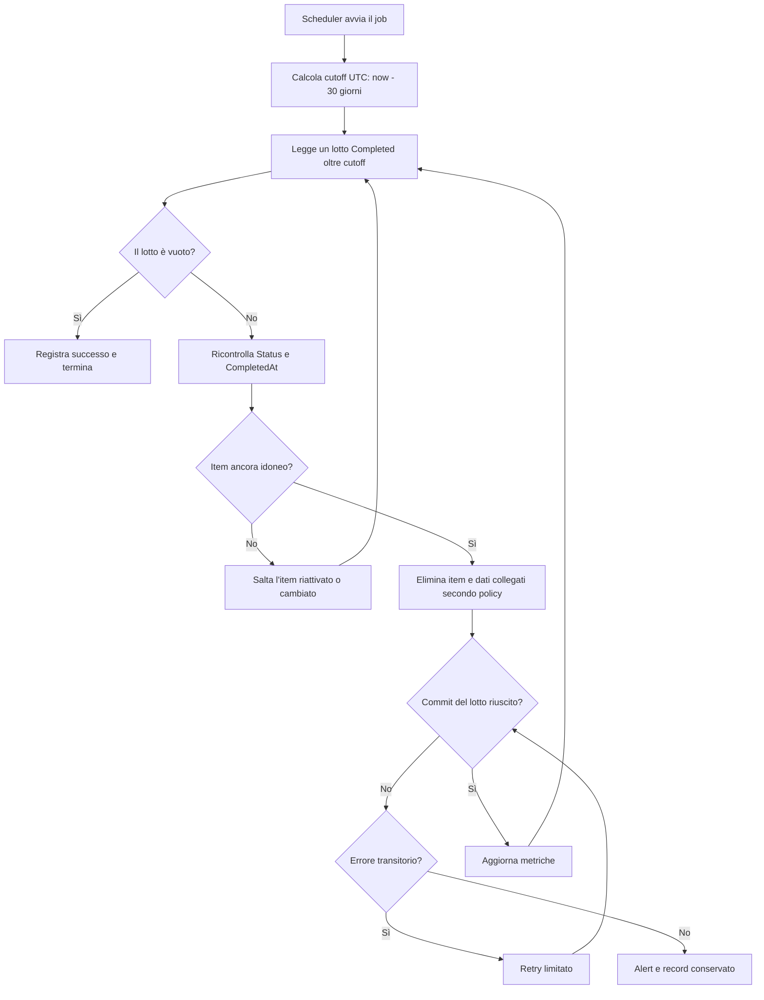

## description

Questo task copre il periodo successivo al completamento: un item `Completed` rimane nel database per 30 giorni e poi viene eliminato definitivamente da un processo pianificato. Non esiste UI per consultarlo dopo la finestra «Annulla». Il problema concreto è cancellare in modo affidabile in base alla data di completamento, senza spostare involontariamente la scadenza quando cambiano metadati tecnici.

Il processo calcola un limite UTC, per esempio `nowUtc - 30 giorni`, seleziona item con `Status = Completed` e `CompletedAt <= limite`, li elimina in lotti e registra soltanto conteggi e identificatori tecnici necessari. Usare `UpdatedAt` sarebbe errato perché un aggiornamento successivo rinvierebbe la cancellazione; questa distinzione è già un requisito esplicito dell'idea.

### Fatti noti

- Gli item hanno solo gli stati `Active` e `Completed`.
- `CompletedAt`, non `UpdatedAt`, determina la conservazione.
- La durata è 30 giorni.
- La cancellazione è definitiva e svolta da un processo pianificato.
- Dopo cinque secondi dal completamento non esiste recupero tramite UI.

### Ipotesi prudenti

- «30 giorni» significa 30 periodi di 24 ore calcolati in UTC, non «alla mezzanotte locale del trentesimo giorno».
- La cancellazione definitiva riguarda il database operativo; backup e log seguono politiche separate.
- Le relazioni categorie e la cronologia dell'item vengono eliminate o rese anonime in modo coerente con il modello dati, da decidere esplicitamente.

### Decisioni aperte

- Semantica esatta dei 30 giorni e frequenza del job.
- Requisiti legali, privacy, audit o conservazione che possono impedire l'eliminazione di autore e storia.
- Politica di backup, point-in-time restore e tempi entro cui i dati scompaiono anche dalle copie.
- Comportamento delle categorie rimaste senza item.
- Database e scheduler già disponibili in Kin Hub.
- Eliminazione fisica immediata, anonimizzazione parziale o soft delete tecnico: l'idea richiede eliminazione definitiva, quindi alternative diverse necessitano conferma.

## best practices microsoft ux

Il task non ha una nuova superficie UI: inventare una schermata «Completati» contraddirebbe lo scope. L'esperienza utente pertinente avviene prima, nel completamento. La snackbar deve far capire che dopo la finestra l'item non è recuperabile dall'interfaccia; non serve spiegare ogni volta la conservazione tecnica di 30 giorni, che riguarda privacy e backend, non un'azione disponibile.

Se il job è in ritardo o fallisce, la lista principale non cambia perché mostra solo `Active`. Non mostrare errori infrastrutturali agli utenti che non possono intervenire. Gli operatori, invece, hanno bisogno di metriche e alert nel portale di monitoraggio esistente.

Stati operatore:

- **nessun item idoneo:** esecuzione riuscita con conteggio zero, non errore;
- **cancellazione in corso:** conteggio per lotto e durata;
- **errore parziale:** numero eliminato e numero rimasto, con nuova esecuzione sicura;
- **successo:** watermark temporale o ultimo completamento del job e totale cancellato;
- **job in ritardo:** alert quando il più vecchio item idoneo supera una tolleranza concordata.

Non è necessaria una conferma per ogni item: l'utente ha già confermato implicitamente completando e lasciando scadere Annulla. Aggiungere dialoghi o notifiche dopo 30 giorni sarebbe una nuova funzionalità.

## best practices microsoft backend

Il job deve essere sicuro da eseguire più volte. In parole semplici, se si interrompe dopo aver cancellato metà lotto, l'esecuzione successiva rilegge solo ciò che esiste ancora e continua. Questo comportamento è **idempotente**: ripetere la stessa scansione non causa un risultato diverso o un errore sui record già eliminati.

Flusso raccomandato:

1. acquisire una sola volta `nowUtc` all'inizio e calcolare il cutoff;
2. cercare un lotto limitato di item ancora `Completed` con `CompletedAt <= cutoff`;
3. eliminare con una condizione che ricontrolla stato e data al momento della scrittura;
4. applicare nello stesso confine transazionale la politica su associazioni e timeline;
5. salvare il commit, emettere metriche e continuare fino al limite di tempo o a zero risultati;
6. lasciare gli elementi restanti alla prossima esecuzione senza considerare il job fallito se è stato raggiunto un limite operativo previsto.

La condizione sull'update/delete protegge una riattivazione concorrente: se un item non è più `Completed`, non viene cancellato. Non basta selezionare gli ID e poi eliminarli senza ricontrollo. L'annullamento normale dura solo cinque secondi, ma questa garanzia protegge anche interventi amministrativi o future modifiche.

La cancellazione a lotti evita transazioni molto lunghe, lock e picchi di log. La dimensione non va indovinata come requisito: si sceglie inizialmente piccola e si regola con misure. Un indice su `(Status, CompletedAt)` evita la scansione completa, al costo di aggiornare l'indice a ogni transizione.

Non usare la TTL nativa di un database senza verificarne la semantica. Alcune TTL si basano sull'ultima modifica e riprodurrebbero proprio l'errore che l'idea vieta. Un job esplicito basato su `CompletedAt` rende la regola leggibile e testabile.

Errori transitori possono essere ritentati con numero e attesa limitati. Errori permanenti, come vincoli referenziali inattesi, devono lasciare il record e produrre un alert diagnostico; non disabilitare i vincoli o cancellare dati collegati alla cieca. I log non contengono nomi, categorie o autori: bastano run ID, cutoff, conteggi, durata e codici d'errore.

La cancellazione dal database primario non cancella automaticamente backup già creati. La definizione di «definitiva» deve includere la politica di backup e ripristino approvata dall'organizzazione; è una decisione di governance, non un dettaglio del job.

## best practices microsoft infrastructure

Prima scelta: riutilizzare uno scheduler già affidabile nel backend Kin Hub. Creare una Function separata solo se non esiste un processo pianificato ospitato e monitorato. Azure Functions Timer Trigger esegue una funzione secondo una pianificazione; Microsoft documenta monitoraggio della schedule, esecuzione singola anche con scale-out e raccomanda il modello isolated worker per C# moderno ([Azure Functions Timer Trigger](https://learn.microsoft.com/en-us/azure/azure-functions/functions-bindings-timer)).

Configurazione iniziale proporzionata se si usa Functions:

- schedule in UTC letta da configurazione, per esempio giornaliera; il requisito non richiede precisione al secondo;
- `UseMonitor` attivo per una ricorrenza almeno al minuto e `RunOnStartup` disattivo in produzione;
- identità gestita con soli permessi necessari a leggere/cancellare gli item;
- timeout e batch limitati;
- retry esplicito e alert dopo fallimenti consecutivi;
- Application Insights/OpenTelemetry collegato all'osservabilità esistente.

Microsoft avverte che `RunOnStartup` può eseguire in momenti imprevedibili e aumentare costi, e il timer espone `IsPastDue` quando un'esecuzione è in ritardo. Questi segnali vanno monitorati, non trasformati in una seconda cancellazione speciale.

Metriche minime: ultima esecuzione riuscita, durata, candidati, cancellati, falliti, età del più vecchio item idoneo e numero di run `PastDue`. Un alert utile è «esistono item oltre 30 giorni + tolleranza e nessun job riuscito», non «il job ha cancellato zero elementi».

Non sono giustificati Durable Functions, Service Bus, Event Grid, multi-regione o un servizio di retention autonomo. Blob lifecycle management riguarda eventuali file audio, non le righe del database; inoltre le sue condizioni si basano su creazione/ultima modifica/accesso e non sostituiscono la regola applicativa `CompletedAt` ([Blob lifecycle management](https://learn.microsoft.com/en-us/azure/storage/blobs/lifecycle-management-overview)).

## flow chart



## user experience

Non esiste wireframe dell'app per questo task perché nessuna UI di retention è prevista. L'esperienza pertinente è quella dell'operatore nel monitoraggio, rappresentata senza introdurre un pannello applicativo nuovo.

```text
Monitoraggio operativo
┌────────────────────────────────────┐
│ Retention item completati          │
│ Ultimo successo: 16/07/2026 02:00  │
│ Cutoff UTC:       16/06/2026 02:00  │
│ Candidati: 124   Eliminati: 124    │
│ Falliti: 0       Past due: no      │
│ Età max oltre soglia: 0            │
└────────────────────────────────────┘
```

- **Loading:** il job lavora in background; il monitor può mostrare esecuzione in corso senza bloccare KinList.
- **Empty:** zero candidati è successo normale.
- **Errore:** alert operativo con run ID e conteggi, nessuna esposizione di contenuto personale.
- **Successo:** timestamp e metriche verificabili; nessun messaggio nell'app utente.
