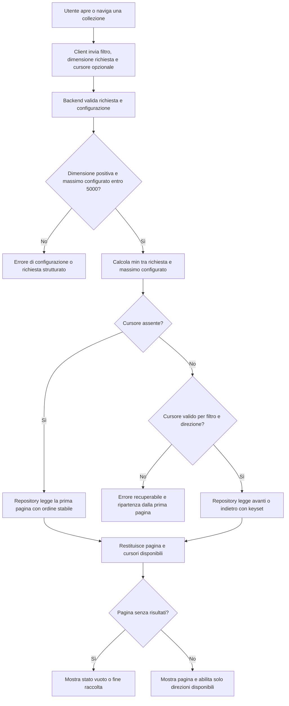
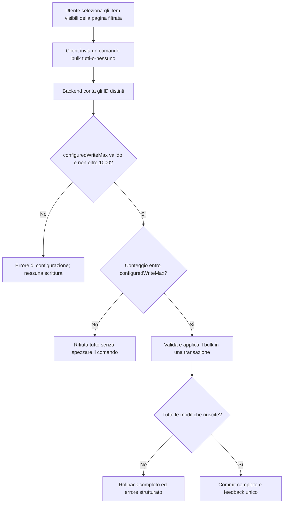

## description

Questo task definisce un contratto comune per leggere collezioni e inviare scritture bulk senza caricare o modificare quantità non controllate di dati. Il problema concreto è evitare query «Get All», payload troppo grandi e transazioni eccessive, mantenendo al tempo stesso una navigazione semplice tra pagine.

Sono coinvolti il frontend React, le API Azure Functions, i repository Infrastructure e PostgreSQL. Per una lettura, il client invia la dimensione desiderata e, tranne alla prima richiesta, un cursore ricevuto dal server. Il backend restituisce una pagina, il cursore per andare avanti e, quando disponibile, quello per tornare indietro. Per una scrittura bulk, il client invia un solo comando con gli elementi selezionati e il backend lo accetta o lo rifiuta interamente in base al massimo configurato.

Un **cursore** è un segnalibro prodotto dal server. Esempio: dopo l'ultimo item della pagina, il server codifica le parti della sua chiave di ordinamento; il browser conserva quel valore ma non prova a leggerlo o costruirlo. Questa tecnica si chiama paginazione **keyset**, perché la pagina successiva parte dalla chiave stabile dell'ultimo record, e usa cursori **opachi**, cioè privi di significato per il client. È preferibile all'offset («salta i primi 20») perché inserimenti o rimozioni non spostano artificialmente il punto di partenza.

### Fatti noti

- Non esiste «Get All»: ogni lettura di collezioni è paginata nel repository Infrastructure.
- Il ceiling assoluto di lettura è 5000 record e quello di scrittura bulk è 1000 record.
- I massimi effettivi iniziali risiedono nella configurazione della Function App: 5000 record per lettura e 1000 record per scrittura bulk. La configurazione viene validata e non può superare i rispettivi ceiling.
- Il backend applica `min(requestedPageSize, configuredReadMax)`; il frontend sceglie la richiesta ma non è autorevole.
- Il frontend non offre dimensioni di pagina superiori al limite configurato esposto dall'applicazione.
- La paginazione raccomandata usa cursori keyset opachi coerenti con un ordinamento stabile, non offset.
- «Seleziona tutti» riguarda solo gli item visibili nella pagina corrente dopo il filtro e non materializza tutto il dataset.
- Un bulk tutti-o-nessuno oltre `configuredWriteMax` viene rifiutato e non viene diviso silenziosamente.

### Ipotesi prudenti

- I cursori sono legati almeno a ordinamento, direzione e filtri della query, così non vengono riutilizzati accidentalmente in una ricerca diversa.
- La configurazione effettiva può variare tra ambienti purché resti entro i ceiling.
- La navigazione non promette di saltare direttamente a un numero di pagina arbitrario, perché il requisito approvato è avanti/indietro robusto.

### Decisioni aperte

- Dimensioni di pagina che la UI deve offrire entro `configuredReadMax`.
- Durata di validità e formato protetto del cursore, purché resti opaco e validabile dal server.
- Testo finale localizzato degli errori per cursore invalido o stale e per bulk oltre limite.

## best practices microsoft ux

La UI deve far scegliere solo dimensioni realmente supportate. Il valore configurato può essere pubblicato come metadata non sensibile e usato per costruire le opzioni; questo previene errori ordinari, ma non sostituisce il controllo backend perché richieste manuali o client non aggiornati possono inviare valori diversi.

Avanti e Indietro descrivono meglio il comportamento rispetto a numeri di pagina che il keyset non conosce. Il controllo Avanti è disabilitato o assente quando manca il cursore successivo; Indietro segue la stessa regola. Durante il caricamento la pagina corrente rimane leggibile, i controlli evitano invii duplicati e uno stato occupato viene annunciato alle tecnologie assistive.

Stati necessari:

- **Loading iniziale:** indicatore o skeleton senza mostrare una falsa lista vuota.
- **Loading di navigazione:** dati correnti conservati finché la nuova pagina non arriva.
- **Empty iniziale:** messaggio che spiega che la collezione o il filtro non ha risultati.
- **Fine raccolta:** assenza del cursore nella direzione terminata, senza trattarla come errore.
- **Errore di rete o server:** pagina corrente preservata e azione «Riprova».
- **Cursore invalido o stale:** spiegazione semplice, per esempio «La lista è cambiata», e azione per ripartire dalla prima pagina.
- **Successo:** nuova pagina, focus prevedibile e conteggio della selezione aggiornato senza crash.

«Seleziona tutti» deve essere etichettato come selezione della pagina, oppure accompagnato da testo che dica «elementi visibili». Agisce dopo il filtro corrente e non accumula in segreto gli item di altre pagine. Questo rende comprensibile il numero che verrà inviato al bulk e impedisce che una singola azione materializzi l'intero dataset.

L'alternativa con offset e numeri di pagina è familiare, ma mentre altri membri aggiungono o completano item può mostrare duplicati o saltarne alcuni. L'alternativa di caricare tutto semplificherebbe il filtro client, ma viola il limite di accesso, aumenta memoria e rete e rende «Seleziona tutti» pericolosamente ampio. Per KinList è quindi raccomandata la navigazione keyset avanti/indietro.

Fluent 2 raccomanda uno skeleton quando si carica contenuto dalla struttura nota senza bloccare la UI e un indicatore indeterminato soltanto per attese brevi dalla durata ignota ([Fluent 2 - Progress](https://fluent2.microsoft.design/components/web/react/core/progressbar/usage)). Per KinList questo sostiene la distinzione tra prima apertura e navigazione con pagina già visibile.

## best practices microsoft backend

Il repository Infrastructure deve richiedere sempre parametri di paginazione per una collezione. Non deve esporre un metodo alternativo che materializza tutte le righe, perché sarebbe facile usarlo per errore da un nuovo caso d'uso. Il Business passa filtro, ordinamento, dimensione effettiva e cursore; il repository traduce questi dati in una query limitata.

Per ogni ordinamento serve una chiave stabile e univoca. Esempio: una lista ordinata per data usa anche `ItemId` come ultimo spareggio. Il cursore rappresenta entrambe le parti e la query successiva chiede record dopo quella chiave. Per tornare indietro, il repository inverte confronto e ordine durante la lettura, poi restituisce gli elementi nell'ordine visuale corretto. Microsoft descrive questa soluzione come keyset pagination e raccomanda un ordinamento completamente univoco ([EF Core pagination](https://learn.microsoft.com/en-us/ef/core/querying/pagination)).

Il cursore deve essere opaco, associato ai filtri e validato prima della query. Nessun cursore indica la prima pagina o la fine nella direzione corrispondente. Un valore malformato, usato con filtri diversi o non più valido produce un errore client stabile; non deve causare un'eccezione non gestita. «Stale» significa che il segnalibro non è più utilizzabile con lo stato o contratto corrente: la risposta invita a ripartire dalla prima pagina invece di inventare una posizione.

Il client invia `requestedPageSize`, ma il backend calcola sempre `min(requestedPageSize, configuredReadMax)` dopo avere verificato che la richiesta sia positiva. Il valore iniziale approvato di `configuredReadMax` è 5000. È anche un hard ceiling, cioè una barriera che nessuna configurazione può oltrepassare; una riduzione futura resta possibile senza modificare il contratto.

Per le scritture bulk, il valore iniziale approvato di `configuredWriteMax` è 1000 ed è anche il ceiling assoluto. In un comando tutti-o-nessuno il server conta gli identificativi distinti prima di caricare e modificare le righe. Se il totale supera il massimo configurato, rifiuta tutto con Problem Details e un codice stabile. Suddividere il comando in batch nascosti è errato: dopo un errore intermedio alcuni item sarebbero modificati e altri no, violando l'intenzione atomica.

I log registrano tipo di collezione, dimensione richiesta ed effettiva, direzione, durata, presenza del cursore ed esito; non registrano il cursore completo o contenuti degli item. Per il bulk registrano conteggio ed esito aggregato. Metriche su richieste limitate, cursori invalidi, latenza e rifiuti oltre limite aiutano a correggere configurazione o query senza esporre dati personali.

Microsoft Options consente di associare configurazione a classi tipizzate e validarla all'avvio ([Options pattern in .NET](https://learn.microsoft.com/en-us/dotnet/core/extensions/options)). Non servono CQRS, generic repository o un servizio di paginazione separato: un contratto paginato coerente nei repository esistenti risolve il problema con meno astrazioni.

## best practices microsoft infrastructure

Non servono nuove risorse Azure. Function App, PostgreSQL e Application Insights/OpenTelemetry esistenti sono sufficienti. I massimi effettivi devono essere impostazioni della Function App, distribuite per ambiente e associate alle opzioni .NET validate all'avvio. Azure Functions espone le app settings come variabili di ambiente e raccomanda di gestirle senza inserirle nel codice sorgente ([Azure Functions app settings](https://learn.microsoft.com/en-us/azure/azure-functions/functions-how-to-use-azure-function-app-settings)).

La configurazione iniziale usa 5000 per letture e 1000 per scritture bulk. La validazione deve impedire l'avvio con valori non positivi o superiori a questi ceiling; una configurazione può essere ridotta intenzionalmente per un ambiente senza richiedere modifiche al client. Il frontend può ricevere `configuredReadMax` da metadata pubblici, ma non credenziali o altre impostazioni della Function App.

PostgreSQL richiede indici allineati a filtro e chiave di ordinamento stabile. Gli indici non si scelgono solo perché esiste la paginazione: vanno verificati con piani di esecuzione e telemetria, considerando il costo aggiunto alle scritture. Offset molto grandi non è una soluzione di fallback, perché il database deve comunque elaborare le righe saltate e i dati concorrenti possono spostare i risultati.

Application Insights deve misurare latenza per dimensione effettiva, errori di cursore e rifiuti oltre limite. Non sono giustificati Redis, Service Bus, Durable Functions o un database separato: la pagina è una query breve e il bulk atomico resta una transazione PostgreSQL breve.

## flow chart





## user experience

La pagina della lista contiene filtro, righe della sola pagina corrente, selezione visibile e navigazione essenziale. L'utente non deve conoscere il contenuto del cursore: vede soltanto se può andare avanti o indietro.

```text
+--------------------------------+
| [Tutte] [Spesa] [Casa]         |
|                                |
| [ ] Latte                      |
| [x] Pasta                      |
| [x] Lamette                    |
|                                |
| [Seleziona pagina]             |
| 2 selezionati   [Completa 2]   |
|                                |
| [Indietro]          [Avanti]   |
| Elementi per pagina: [valore]  |
+--------------------------------+
```

Durante la navigazione la pagina corrente resta leggibile e i controlli mostrano lo stato occupato. Se manca il cursore successivo, Avanti non è disponibile; lo stesso vale per Indietro. La scelta «Elementi per pagina» contiene soltanto valori entro il massimo configurato comunicato dal backend.

```text
+--------------------------------+
| La lista è cambiata            |
| Non è possibile continuare da  |
| questa posizione.              |
|                                |
| [Riprova] [Torna all'inizio]   |
+--------------------------------+
```

- **Loading:** prima apertura con skeleton; navigazione con pagina precedente conservata e invii duplicati bloccati.
- **Empty:** messaggio distinto per nessun risultato iniziale, filtro senza risultati e fine della raccolta.
- **Errore:** rete o server consentono «Riprova»; cursore invalido o stale consente «Torna all'inizio»; nessun caso causa crash.
- **Successo lettura:** pagina sostituita, focus riportato a un punto prevedibile e controlli coerenti con i cursori restituiti.
- **Successo bulk:** tutte le righe selezionate scompaiono insieme e il feedback comunica il numero completato.
- **Bulk oltre limite:** nessuna riga cambia e il messaggio spiega che la selezione deve essere ridotta; il browser non avvia più richieste nascoste.
