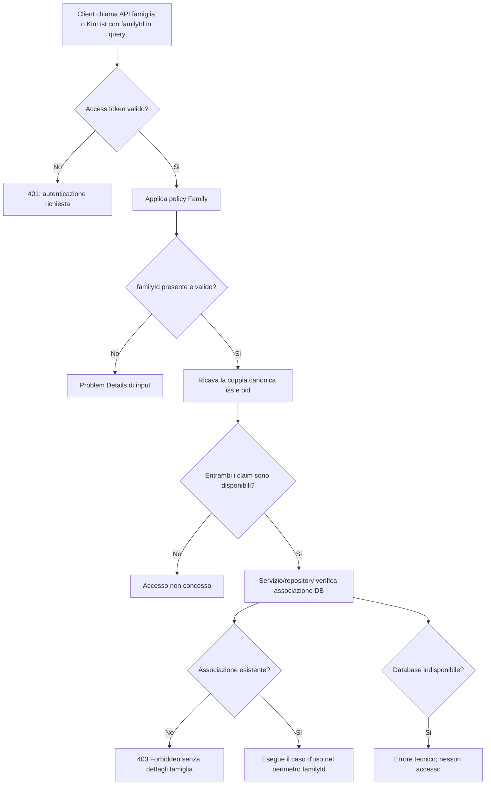
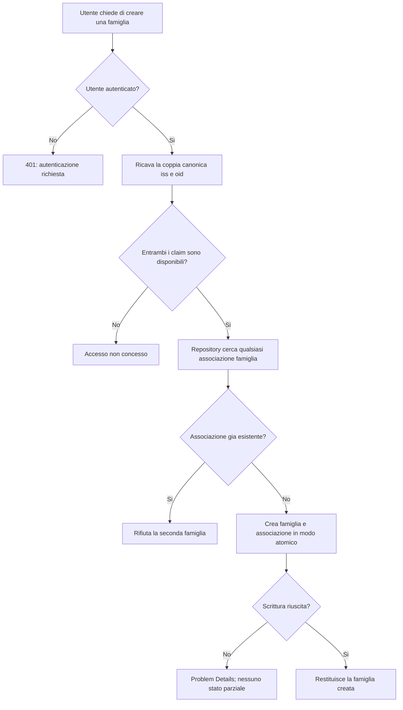

## description

Questo task studia il confine di autorizzazione per tutte le API di famiglia e KinList. Il problema concreto e distinguere due domande che non sono equivalenti: «chi sta chiamando?» e «questa persona appartiene alla famiglia indicata?». Microsoft Entra External ID e la validazione dell'access token rispondono alla prima; l'associazione conservata nel database applicativo risponde alla seconda.

Il client invia sempre `familyId` nella query string. Per esempio, una richiesta concettuale usa `...?familyId=<id>`, non una route con l'identificativo e non un valore di famiglia dedotto dal browser. L'handler della policy ricava l'identita esterna canonica esclusivamente dalla coppia `(iss, oid)` del token validato: `iss` identifica l'autorita che ha emesso il token e `oid` identifica stabilmente l'oggetto utente presso quell'autorita. Poi chiede a un servizio/repository se nel database esiste l'associazione tra quel riferimento esterno e il `familyId` richiesto. Soltanto una risposta positiva soddisfa la policy; se uno dei due claim manca, il controllo fallisce in modo chiuso.

La policy deve chiamarsi esattamente `Family` ed e applicata a tutte le API di famiglia e KinList, senza affiancarle nomi alternativi. L'unica eccezione e la creazione della famiglia: l'eccezione riguarda il controllo di appartenenza a una famiglia gia esistente, non l'autenticazione. La creazione rimane quindi accessibile solo a un utente autenticato e deve verificare nel database che l'utente non appartenga gia a una famiglia. Questa lettura risolve l'ambiguita di «tranne creazione famiglia»: una persona anonima non puo creare una famiglia, mentre una persona gia associata non puo crearne una seconda.

### Fatti noti

- Tutte le API che operano nel perimetro di una famiglia esistente usano la policy con nome esattamente `Family`.
- `familyId` e sempre nella query string.
- L'identita esterna canonica e la coppia `(iss, oid)` ricavata dal token validato, mai dal body, dalla query string o da un header scelto dal client.
- Email e nome non identificano l'utente: possono cambiare, non sono necessariamente univoci e non sostituiscono `(iss, oid)`.
- Se `iss` oppure `oid` manca, l'accesso fallisce in modo chiuso e il caso d'uso non parte.
- Un servizio/repository verifica nel database l'associazione user-famiglia; esito falso significa `403 Forbidden`.
- La creazione della famiglia richiede autenticazione e rifiuta un utente gia associato a una famiglia.
- KinList condivide dati soltanto tra membri della stessa famiglia.
- La verifica iniziale dell'onboarding e il consumo del codice devono essere invocabili da un utente autenticato ancora privo di famiglia e quindi non possono soddisfare il requisito ordinario della policy `Family`.

### Ipotesi prudenti

- La coppia `(iss, oid)` viene risolta nell'identita applicativa stabile gia prevista dall'architettura.
- Ogni utente può appartenere al massimo a una famiglia attiva; il database applica questa regola anche alle richieste concorrenti.
- Un `familyId` assente o sintatticamente non valido e un errore di input distinto da un'associazione inesistente.

### Decisioni aperte

- Stato HTTP e codice Problem Details per `familyId` assente o malformato.
- Stato HTTP e codice applicativo quando la creazione trova un'appartenenza gia esistente, per esempio conflitto `409` oppure richiesta non valida.
- Comportamento in caso di indisponibilita del repository durante l'autorizzazione: deve fallire in modo chiuso, ma va definito il Problem Details operativo.

## best practices microsoft ux

Questo task non introduce una nuova schermata: definisce il comportamento osservabile quando una pagina KinList o Famiglia chiama l'API. La UI non deve decidere l'autorizzazione nascondendo controlli; nascondere un'azione puo ridurre confusione, ma il server resta il confine autorevole perche richieste HTTP possono essere costruite fuori dall'interfaccia.

Gli stati rilevanti sono distinti:

- **Sessione assente o non valida:** chiedere un nuovo accesso senza mostrare dati familiari.
- **Verifica in corso:** mantenere la pagina in caricamento, senza far apparire per un istante dati della famiglia precedente.
- **`403 Forbidden`:** mostrare un messaggio essenziale di accesso negato e non rappresentarlo come famiglia o lista vuota.
- **Errore tecnico:** offrire `Riprova` senza affermare che l'utente non appartiene alla famiglia.
- **Creazione consentita:** mostrare il flusso di creazione soltanto dopo autenticazione; il controllo server sull'appartenenza viene comunque ripetuto al comando.
- **Creazione rifiutata per appartenenza esistente:** indirizzare l'utente alla propria famiglia, se la navigazione e disponibile, senza suggerire che possa crearne un'altra.

Microsoft raccomanda nomi accessibili, uso da tastiera, focus visibile e messaggi comprensibili anche senza il solo colore ([Microsoft Accessibility overview](https://learn.microsoft.com/en-us/windows/apps/design/accessibility/accessibility-overview)). Per KinList significa che «Accesso negato» e testo leggibile, riceve focus quando sostituisce il contenuto e non e soltanto un'icona o un colore rosso.

Alternative considerate:

- **UI come unico controllo:** evita una chiamata che fallira, ma non protegge dati o comandi. Non e valida come autorizzazione.
- **`404 Not Found` anti-enumeration:** nasconde se una famiglia esiste a chi non vi appartiene e puo essere appropriato quando l'esistenza della risorsa e sensibile. Non e la scelta presa qui perche il requisito stabilisce esplicitamente `403` quando l'associazione e falsa.
- **`403 Forbidden` richiesto:** comunica che una richiesta autenticata non e autorizzata e permette alla UI di distinguere accesso negato da dato mancante. Il costo e che conferma l'esistenza del confine famiglia con maggiore chiarezza rispetto al `404`; per ridurre enumerazione, la risposta non deve includere nome, membri o altri dettagli.

La scelta `403` deve restare coerente su letture e scritture. Restituire a volte lista vuota o `404` produrrebbe stati indistinguibili e renderebbe piu difficile spiegare e testare il prodotto.

## best practices microsoft backend

Il token identifica il chiamante, ma non dimostra che appartenga al `familyId` richiesto. Microsoft spiega che i claim sono coppie nome-valore sull'identita e che una policy combina requisiti e handler per prendere una decisione riusabile e testabile ([claim in ASP.NET Core](https://learn.microsoft.com/en-us/aspnet/core/security/authentication/claims?view=aspnetcore-10.0), [policy-based authorization](https://learn.microsoft.com/en-us/aspnet/core/security/authorization/policies?view=aspnetcore-10.0)). Nel caso concreto:

1. l'API valida l'access token per firma, issuer, audience e scadenza;
2. la richiesta espone `familyId` dalla query string;
3. la policy `Family` avvia il proprio requisito;
4. l'handler ricava dai claim verificati la coppia canonica `(iss, oid)`;
5. il servizio/repository risolve il profilo e interroga il database per l'associazione profilo-famiglia;
6. solo l'associazione esistente soddisfa il requisito; il valore `false` produce `403`;
7. il caso d'uso parte soltanto dopo l'esito positivo e continua a limitare query e scritture allo stesso `familyId`.

Questo e un controllo basato sulla risorsa richiesta: l'identita da sola non basta, perche la decisione dipende dalla famiglia. Microsoft descrive l'**autorizzazione basata su risorsa** come la verifica congiunta di utente e risorsa tramite `IAuthorizationService`/handler ([resource-based authorization](https://learn.microsoft.com/en-us/aspnet/core/security/authorization/resource-based?view=aspnetcore-10.0)). Qui il dato necessario e il `familyId`, non l'intera famiglia caricata con i suoi dettagli.

### Concetti spiegati

- **Claim:** informazione emessa da un'identita attendibile. Qui `iss` indica l'emittente e `oid` l'oggetto utente; soltanto la coppia forma l'identita esterna canonica. Email e nome non vengono usati come chiavi.
- **Policy:** regola nominata applicata uniformemente agli endpoint. `Family` evita che ogni Function riscriva il controllo in modo diverso.
- **Handler:** componente che valuta il requisito. Legge il chiamante e il `familyId`, delegando l'accesso dati a un servizio/repository invece di contenere SQL.
- **Fail closed:** se `iss`, `oid`, `familyId` o database non permettono di provare l'accesso, la richiesta non procede. Un claim mancante o un guasto tecnico non deve trasformarsi in autorizzazione.

La coppia `(iss, oid)` non deve arrivare dal client: accettarla consentirebbe a chi chiama di scegliere l'identita da verificare. Usare email o nome come sostituti introdurrebbe collisioni e cambi di identita quando quei valori vengono modificati. Analogamente, un claim contenente un `familyId` non sostituisce il database, perche l'appartenenza puo cambiare prima della scadenza del token. Microsoft indica che e la Web API a validare l'access token e che il client deve trattarlo come opaco ([access token Microsoft identity platform](https://learn.microsoft.com/en-us/entra/identity-platform/access-tokens)).

La creazione famiglia segue un controllo diverso perche per definizione non esiste ancora un `familyId` a cui appartenere. Il backend autentica l'utente, risolve il profilo dalla coppia `(iss, oid)` e interroga il repository con la domanda inversa: «esiste gia una qualsiasi associazione?». Se si, non crea; se no, crea famiglia e associazione nello stesso confine transazionale, cosi due richieste concorrenti non possono produrre due famiglie. Se uno dei claim canonici manca, anche questo percorso fallisce in modo chiuso.

La stessa impossibilita logica riguarda due chiamate dell'onboarding: chiedere se l'utente possiede gia un'appartenenza e consumare un codice quando non la possiede. Applicare loro la policy `Family` ordinaria le renderebbe sempre inaccessibili, perche manca proprio l'associazione che devono verificare o creare. La soluzione piu piccola e mantenerle autenticate con `ApiAccess` e far eseguire ai rispettivi casi d'uso controlli specifici: la query di stato legge soltanto il profilo corrente; il join valida il codice e crea l'associazione. Inserire eccezioni dentro l'handler `Family` lo renderebbe dipendente dal nome dell'endpoint e piu facile da applicare in modo errato.

Le risposte usano Problem Details con `code` e `traceId`. `403` non include informazioni sulla famiglia. I log possono contenere esito policy, identificativi tecnici redatti, durata repository e correlation ID, ma non token, claim completi, nome famiglia o dati dei membri. Non servono CQRS, mediator o un motore autorizzativo esterno: un requisito, un handler e un repository risolvono il problema in modo proporzionato.

## best practices microsoft infrastructure

Non servono nuove risorse Azure. La policy vive nella Function App .NET isolata esistente, mentre la verifica riusa PostgreSQL condiviso e il modulo di identita/famiglia. Il modello isolated worker consente dependency injection e configurazione ASP.NET Core tramite `ConfigureFunctionsWebApplication()`, quindi handler e servizi possono essere composti senza un servizio separato ([Azure Functions .NET isolated worker](https://learn.microsoft.com/en-us/azure/azure-functions/dotnet-isolated-process-guide)).

La persistenza deve supportare una ricerca efficiente del profilo tramite `(iss, oid)` e dell'associazione tramite profilo e `familyId`. Un indice univoco parziale sulle appartenenze attive garantisce una sola famiglia attiva per utente anche con due creazioni concorrenti; nomi e colonne fisiche vengono definiti nella migration e verificati su PostgreSQL reale.

Sicurezza e affidabilita iniziali:

- riusare managed identity della Function App verso PostgreSQL con privilegi minimi;
- non conservare appartenenze in cache distribuite o nel token finche non esiste un requisito misurato, evitando autorizzazioni stale;
- propagare `CancellationToken` alla verifica I/O;
- misurare durata, successo, `403`, claim mancanti ed errori repository senza PII;
- distinguere nelle metriche un rifiuto atteso da un guasto del database;
- mantenere CORS restrittivo e HTTPS, senza considerare CORS una misura di autorizzazione.

Application Insights/OpenTelemetry gia condiviso e sufficiente. Non sono giustificati Azure API Management, Redis, Service Bus, un microservizio identita o una Function App separata. Un eventuale aumento della latenza di autorizzazione va prima osservato e corretto con query/indici; una cache di appartenenza richiederebbe invalidazione affidabile e introdurrebbe una finestra di accesso non piu valido.

## flow chart





## user experience

La superficie rappresentata e lo stato di una pagina che necessita dati familiari. Non viene aggiunta una pagina di amministrazione. Loading, accesso negato ed errore tecnico non devono mai essere resi come una lista vuota.

```text
CARICAMENTO                    ACCESSO NEGATO
┌──────────────────────────┐   ┌──────────────────────────┐
│ Famiglia                 │   │ Famiglia                 │
│                          │   │                          │
│ Verifico l'accesso...    │   │ Accesso non consentito   │
│          [....]          │   │ Nessun dato mostrato     │
│                          │   │                          │
└──────────────────────────┘   └──────────────────────────┘
```

```text
ERRORE TECNICO
┌──────────────────────────┐
│ Famiglia                 │
│                          │
│ Impossibile verificare   │
│ l'accesso in questo      │
│ momento                  │
│                          │
│ [ Riprova ]              │
└──────────────────────────┘
```

- **Loading:** nessun dato familiare precedente appare prima dell'autorizzazione.
- **Empty:** non esiste uno stato vuoto che sostituisca il `403`; assenza di dati e accesso negato hanno significati diversi.
- **Errore:** `401`, `403`, input non valido e indisponibilita tecnica producono recuperi distinti.
- **Successo:** soltanto dopo la policy `Family` la pagina riceve dati circoscritti al `familyId` richiesto.
