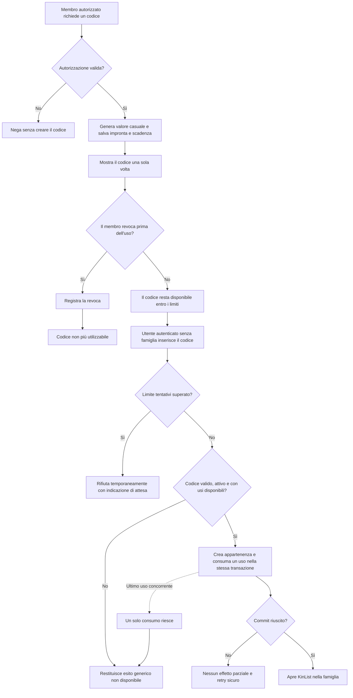

## description

Questo task copre l'invito pragmatico a una famiglia mediante codice. Il problema concreto è permettere a un utente già autenticato ma senza famiglia di aderire al perimetro corretto senza introdurre ricerca persone, email o notifiche. Il sistema genera un codice, lo mostra a un membro autorizzato e lascia che sia quella persona a condividerlo fuori da KinList con il canale che preferisce. KinList non invia messaggi e non deve conoscere il canale usato.

Un codice d'invito è una credenziale temporanea: chi lo presenta dimostra di possedere il valore, ma il codice da solo non sostituisce il login. Il backend deve verificare insieme identità autenticata, stato del codice e regole di appartenenza. L'input è la richiesta autorizzata di generare, revocare o consumare un codice; l'output è un codice mostrato una volta al generatore, uno stato revocato oppure una nuova appartenenza atomica alla famiglia.

Scadenza, revoca, consumo e protezione dai tentativi sistematici sono raccomandazioni di sicurezza, non valori di prodotto già approvati. **Scadenza** significa che il codice smette di essere accettato dopo un istante stabilito. **Revoca** significa che un membro autorizzato lo disattiva prima della scadenza. **Consumo** significa che l'uso riuscito registra in modo autorevole che il codice non ha più gli utilizzi disponibili. L'**anti-enumeration** evita che risposte diverse rivelino se un codice esiste, è scaduto, è revocato o è già stato usato.

### Fatti noti

- L'unione a una famiglia avviene tramite codice ed è disponibile dopo il login a chi non appartiene a una famiglia.
- Il meccanismo deve essere sicuro e pragmatico.
- Non sono richiesti inviti via email, notifiche, rubrica, ricerca utenti o recapiti.
- Famiglia e appartenenza sono dati applicativi; Microsoft Entra External ID autentica l'identità ma non consuma l'invito.
- I dati delle famiglie devono rimanere isolati e il codice non deve consentire accesso a una famiglia diversa da quella associata.
- La generazione e la revoca operano su una famiglia esistente e richiedono la policy `Family`; il consumo e rivolto a un utente autenticato senza famiglia e usa `ApiAccess` con i controlli specifici del codice.

### Ipotesi prudenti

- Il codice è opaco: non contiene nome, identificativo o altre informazioni leggibili sulla famiglia.
- Il codice viene condiviso manualmente fuori dall'applicazione; KinList si limita a visualizzarlo.
- La prima raccomandazione è un codice a uso singolo, perché riduce la finestra di abuso e rende il consumo inequivocabile. Se deve invitare più persone, il numero massimo di usi diventa una decisione esplicita.
- L'app non mostra il nome della famiglia prima del consumo riuscito, così un tentativo non può essere usato per scoprirne l'esistenza.

### Decisioni aperte

- Chi può generare e revocare codici, dato che il ruolo iniziale approvato è soltanto `Membro`.
- Durata del codice e comportamento esatto al raggiungimento della scadenza.
- Uso singolo oppure numero massimo di consumi maggiore di uno.
- Numero massimo di codici contemporaneamente attivi per famiglia e per membro.
- Alfabeto e lunghezza che bilancino digitazione manuale ed entropia, cioè quantità di combinazioni difficili da indovinare.
- Se mostrare un elenco minimo dei codici attivi e quali metadati non sensibili includere.
- Se un membro possa lasciare o cambiare famiglia; questi flussi non sono parte del task.

### Concetti spiegati

- **Credenziale temporanea:** valore segreto valido solo entro limiti di tempo e utilizzo.
- **Consumo:** aggiornamento che rende indisponibile un uso nello stesso momento in cui crea l'appartenenza.
- **Anti-enumeration:** risposte progettate per non confermare quale stato interno abbia un codice non accettato.

## best practices microsoft ux

La generazione e l'uso sono esperienze diverse e non devono essere mescolate. Il membro autorizzato vede un'azione «Crea codice d'invito» nel contesto della famiglia; l'utente senza famiglia vede soltanto il campo per inserire un codice. Non serve mostrare una directory di persone o chiedere un indirizzo. Dopo la generazione, il codice deve essere ben leggibile, selezionabile e accompagnato dalla scadenza localizzata; un'azione «Copia codice» è una raccomandazione pragmatica, non un meccanismo di invio.

Il campo di unione usa un'etichetta persistente «Codice», non soltanto un placeholder. Se il formato visivo contiene separatori o lettere maiuscole, l'interfaccia può normalizzare spazi, trattini e maiuscole per evitare errori di trascrizione, ma il backend ripete sempre la normalizzazione. Fluent 2 raccomanda helper text sempre disponibile per spiegare il formato e messaggi di validazione brevi che indichino come procedere ([Fluent 2 Field](https://fluent2.microsoft.design/components/web/react/core/field/usage)). Incollare il codice deve funzionare senza trasformazioni sorprendenti.

Per non facilitare l'enumerazione, assente, scaduto, revocato e consumato ricevono lo stesso messaggio pubblico, per esempio «Codice non disponibile. Controllalo o chiedine uno nuovo». Il testo è meno diagnostico, ma impedisce a chi prova molti valori di distinguere codici reali. Il limite di tentativi usa un messaggio separato e onesto, con attesa comprensibile, senza confermare nulla sul codice.

Stati necessari:

- **Generazione in corso:** una sola richiesta attiva, senza produrre codici duplicati con doppi tocchi.
- **Codice pronto:** valore, scadenza e azioni Copia e Revoca se autorizzate.
- **Revoca in corso/riuscita:** conferma esplicita perché rende inutilizzabile il codice; lo stato aggiornato non deve sembrare ancora copiabile.
- **Inserimento:** etichetta, formato e azione Unisciti.
- **Validazione locale:** soltanto errori di forma, senza affermare che il codice esista.
- **Rifiuto generico:** input preservato o selezionato per una correzione rapida.
- **Limite tentativi:** azione temporaneamente non disponibile con indicazione su quando riprovare, se il server fornisce `Retry-After`.
- **Successo:** accesso diretto a KinList, senza mostrare il codice usato.

Revocare richiede una conferma breve perché interrompe una possibilità di accesso ancora valida. Generare e copiare non richiedono dialoghi. Il codice non va annunciato automaticamente per intero da uno screen reader in un'area live; deve avere un'etichetta chiara ed essere leggibile su richiesta. Focus, tastiera, zoom, contrasto e messaggi non basati solo sul colore seguono le raccomandazioni Microsoft sull'accessibilità ([panoramica accessibilità Microsoft](https://learn.microsoft.com/en-us/windows/apps/design/accessibility/accessibility-overview)).

Alternative considerate:

- **Link magico inviato dall'app:** riduce la digitazione, ma richiede canale, recapito e consegna non approvati; non viene introdotto.
- **Codice permanente di famiglia:** è facile da ricordare ma, una volta copiato o osservato, resta una porta d'ingresso indefinita. Non è raccomandato.
- **Codice con anteprima del nome famiglia:** rassicura prima dell'adesione, ma crea un oracolo per scoprire famiglie valide. Non è raccomandato senza un requisito più forte e una mitigazione specifica.
- **Codice temporaneo e revocabile, inizialmente monouso:** è la raccomandazione perché limita l'impatto di una condivisione accidentale con poche regole visibili.

## best practices microsoft backend

Il codice deve essere generato sul server con byte casuali crittograficamente forti, poi codificato in un alfabeto adatto alla digitazione. Un normale generatore pseudo-casuale pensato per simulazioni può produrre valori prevedibili; `RandomNumberGenerator.GetBytes` produce invece una sequenza crittograficamente forte ([API .NET `RandomNumberGenerator.GetBytes`](https://learn.microsoft.com/en-us/dotnet/api/system.security.cryptography.randomnumbergenerator.getbytes?view=net-10.0)). Lunghezza e alfabeto non vanno scelti soltanto per estetica: determinano quante combinazioni un attaccante deve provare e restano una decisione da misurare contro usabilità e rate limit.

Il database non dovrebbe conservare il codice in chiaro dopo averlo mostrato. Il problema è che una lettura non autorizzata del database trasformerebbe tutti i codici attivi in accessi immediatamente utilizzabili. Una soluzione semplice è conservare un'impronta deterministica del codice e cercare quella ricevuta. Se lo spazio dei codici è abbastanza piccolo da consentire prove offline, è preferibile un'impronta con chiave server-side, per esempio un codice di autenticazione del messaggio basato su hash, abbreviato **HMAC**: il backend combina codice e segreto custodito fuori dal database. Questo riduce il valore di una sola copia del database, ma introduce gestione e rotazione della chiave; la scelta finale dipende da entropia e threat model.

Il record concettuale necessita soltanto di famiglia, impronta, creatore, creazione, scadenza, revoca e stato/contatore di consumo. Il valore chiaro viene restituito una sola volta. Codice, impronta e payload non entrano nei log. Gli identificativi di famiglia e autore derivano dal contesto autenticato, non dalla richiesta libera del client.

Il consumo deve avvenire come una singola decisione server-side:

1. normalizzare e trasformare il codice ricevuto nella stessa impronta usata alla creazione;
2. verificare che esista, non sia scaduto o revocato e abbia usi disponibili;
3. verificare che il profilo autenticato possa ancora aderire;
4. creare l'appartenenza e consumare un uso nella stessa transazione;
5. restituire il contesto famiglia soltanto dopo il commit.

Se due persone presentano contemporaneamente un codice monouso, una sola deve poterlo consumare. Un aggiornamento condizionato o un controllo di concorrenza nella transazione impedisce che entrambe leggano «disponibile» prima di scrivere. EF Core descrive le transazioni come il confine in cui tutte le operazioni vengono applicate oppure nessuna ([transazioni EF Core](https://learn.microsoft.com/en-us/ef/core/saving/transactions)). Non servono lock distribuiti, code o un orchestratore perché invito e appartenenza risiedono nello stesso database.

La protezione anti-enumeration richiede più misure, non soltanto un messaggio generico:

- stessa categoria di risposta per codice assente, scaduto, revocato o consumato;
- nessun nome famiglia, stato interno o data associata prima del successo;
- percorso di confronto e tempi ragionevolmente uniformi, evitando rami palesemente più rapidi per codici assenti;
- limite dei tentativi per identità autenticata e, come segnale aggiuntivo, origine di rete, senza fidarsi di una sola intestazione fornita dal client;
- metriche e alert su picchi di tentativi, senza registrare i codici.

ASP.NET Core offre politiche di rate limiting applicabili agli endpoint e partizionabili per identità o indirizzo; Microsoft raccomanda di configurarle, testarle sotto carico e monitorarne le metriche ([rate limiting ASP.NET Core](https://learn.microsoft.com/en-us/aspnet/core/performance/rate-limit?view=aspnetcore-10.0)). Il limite in memoria di una singola istanza non è un limite globale quando la Function App scala: è una prima barriera proporzionata, non una garanzia contro un attacco distribuito. Soglie, finestra e necessità futura di un controllo condiviso restano guidate da rischio e telemetria.

Gli errori HTTP usano Problem Details con codici applicativi stabili e `traceId`. Il client può distinguere forma non valida, invito non disponibile, troppi tentativi, appartenenza già esistente e guasto tecnico, ma non riceve il motivo interno per cui un invito non è disponibile. Generazione e revoca richiedono autorizzazione esplicita; il ruolo che la possiede è una decisione aperta.

### Concetti spiegati

- **Entropia:** numero effettivo di combinazioni possibili; più è alto, più tentativi servono per indovinare il codice.
- **HMAC:** impronta calcolata con una chiave segreta del server, utile affinché il solo database non basti a verificare rapidamente ipotesi sui codici.
- **Controllo di concorrenza:** scrittura condizionata che consente a un solo richiedente di consumare l'ultimo uso disponibile.
- **Rate limiting:** limite al numero di tentativi in una finestra temporale; rallenta l'abuso ma non sostituisce codici robusti e risposte non rivelatrici.

## best practices microsoft infrastructure

Non servono nuove risorse Azure per il percorso iniziale. Il modulo backend nella Function App condivisa genera e verifica i codici; PostgreSQL condiviso conserva inviti e appartenenze; Application Insights osserva esiti aggregati. Microsoft Entra External ID continua a gestire il login, non il ciclo di vita del codice applicativo.

PostgreSQL è adatto perché consumo e creazione dell'appartenenza devono essere atomici. Un indice univoco sull'impronta permette la ricerca senza scansione, mentre condizioni su scadenza, revoca e usi disponibili proteggono il consumo concorrente. Un processo pianificato per cancellare immediatamente i record scaduti non è necessario per far rispettare la scadenza: il backend confronta sempre l'istante autorevole durante l'uso. Una pulizia periodica può diventare una necessità di conservazione, ma frequenza e durata di retention dei metadati sono decisioni separate.

Se viene scelta un'impronta HMAC, la chiave deve restare nel Key Vault condiviso già previsto e arrivare alla Function App tramite identità gestita e privilegi minimi. Non va inserita nel database, nel repository, negli app setting in chiaro o nel bundle frontend. La rotazione richiede una strategia di versione delle chiavi per non invalidare accidentalmente tutti i codici attivi; se questo costo è sproporzionato rispetto a codici ad alta entropia e brevissima durata, la decisione va rivalutata esplicitamente, non nascosta nell'implementazione.

Application Insights/OpenTelemetry deve misurare generazioni, revoche, consumi riusciti, rifiuti aggregati, rate limit e latenze. Codici, impronte, nomi famiglia, token e indirizzi completi non devono essere proprietà ordinarie di telemetria. Microsoft documenta l'uso di OpenTelemetry per trace, metriche, log ed eccezioni in Application Insights ([Azure Monitor OpenTelemetry](https://learn.microsoft.com/en-us/azure/azure-monitor/app/opentelemetry-enable?tabs=aspnetcore)).

Il rate limiter della singola istanza è il punto di partenza più semplice. API Management dedicato, Front Door/WAF, Redis o un contatore distribuito non sono giustificati senza esposizione, scala o abuso misurati che richiedano un limite globale. HTTPS, policy `ApiAccess`, CORS ristretto e nessuna cache API autenticata restano requisiti dell'infrastruttura esistente.

## flow chart



## user experience

Il membro autorizzato gestisce il codice in una superficie essenziale della famiglia. Il valore compare soltanto dopo una generazione riuscita; scadenza e stato sono testo, non sole icone. Non esiste un campo destinatario e KinList non promette di inviare nulla.

```text
+--------------------------------+
| Invita nella famiglia          |
|                                |
| Crea un codice da condividere  |
| con la persona che vuoi unire. |
|                                |
| [ Crea codice ]                |
|                                |
+--------------------------------+
```

```text
+--------------------------------+
| Codice d'invito                |
|                                |
|          K7MP-4QTX             |
| Scade: data e ora localizzate  |
|                                |
| [ Copia codice ] [ Revoca ]    |
|                                |
+--------------------------------+
```

Chi non appartiene a una famiglia usa il modulo dell'onboarding. Il messaggio di rifiuto non distingue la causa interna.

```text
+--------------------------------+
| Unisciti con un codice         |
|                                |
| Codice                         |
| [ K7MP-4QTX_______________ ]   |
|                                |
| [ Unisciti ]                   |
|                                |
| Codice non disponibile.        |
| Controllalo o chiedine uno     |
| nuovo.                         |
+--------------------------------+
```

- **Loading:** durante generazione, revoca o consumo il controllo interessato è occupato e non produce richieste duplicate; il resto resta leggibile.
- **Empty:** nessun codice attivo mostra soltanto l'azione di generazione; non viene inventato un elenco destinatari.
- **Errore:** i problemi di forma sono locali e specifici; gli stati interni dell'invito confluiscono nel rifiuto generico; i guasti tecnici offrono Riprova senza dichiarare un consumo riuscito.
- **Limite tentativi:** l'azione è temporaneamente disabilitata e comunica quando riprovare, senza cancellare il valore inserito.
- **Revoca:** una conferma breve precede l'azione; dopo il successo codice e Copia non sono più disponibili.
- **Successo:** il codice non viene conservato nella UI e l'utente entra direttamente in KinList con la nuova appartenenza.
