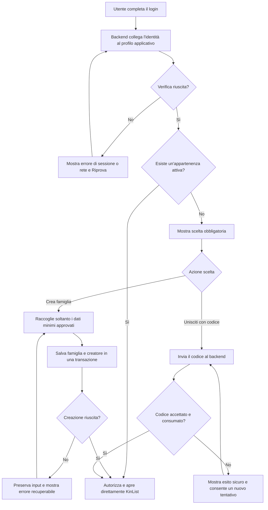

## description

Questo task copre il passaggio obbligatorio tra il login riuscito e l'accesso a KinList. Il problema concreto è distinguere un'identità autenticata da un membro già autorizzato a lavorare nel perimetro di una famiglia. Microsoft definisce **autenticazione** la verifica di chi è l'utente e **autorizzazione** la decisione su ciò che può fare; la seconda dipende dalla prima ma non coincide con essa ([introduzione all'autorizzazione ASP.NET Core](https://learn.microsoft.com/en-us/aspnet/core/security/authorization/introduction?view=aspnetcore-10.0)).

Dopo il login, KinList riceve un'identità verificata da Microsoft Entra External ID e chiede al backend se il profilo applicativo appartiene a una famiglia. Se appartiene, il risultato atteso è l'accesso diretto al servizio. Se non appartiene, il risultato atteso è una scelta obbligatoria tra creare una famiglia e unirsi mediante codice. Creare una famiglia associa soltanto il creatore: in questo passaggio non si cercano, selezionano o aggiungono altri membri. L'uso sicuro del codice è studiato separatamente in `family-invite-code`.

Gli attori sono l'utente autenticato, la PWA KinList, il backend Kin Hub e PostgreSQL. L'input autorevole è l'identità ricavata dal token; appartenenza e permessi provengono dai dati applicativi, non dal browser. L'output è una famiglia associata al profilo oppure lo stato esplicito «onboarding necessario». Il servizio KinList non deve essere mostrato finché uno dei due percorsi non termina con successo.

### Fatti noti

- Microsoft Entra External ID e MSAL gestiscono il login; il profilo, la famiglia e i permessi sono dati applicativi di Kin Hub.
- Chi appartiene già a una famiglia entra direttamente in KinList.
- Chi non appartiene a una famiglia deve creare una famiglia oppure unirsi con un codice; non può saltare questo passaggio per usare KinList.
- La creazione non include l'aggiunta di altri membri.
- L'esperienza deve essere minimale, mobile-first, accessibile e localizzata in italiano e inglese secondo le regole correnti del repository.

### Ipotesi prudenti

- «Appartiene a una famiglia» indica una sola appartenenza attiva rilevante per KinList. Se sono ammesse più famiglie, il reindirizzamento diretto non basta e servirebbe una scelta non richiesta.
- Il profilo applicativo può esistere prima dell'appartenenza; la sua creazione idempotente al primo accesso resta distinta dalla creazione della famiglia.
- Il controllo avviene online perché appartenenza e autorizzazione non devono dipendere da dati conservati nel browser.

### Decisioni aperte

- Se una persona possa appartenere a una sola famiglia o a più famiglie.
- Quali dati minimi siano obbligatori per creare una famiglia, in particolare se serva un nome visibile e con quali regole di validazione.
- Quale azione sia consentita se un'appartenenza viene rimossa mentre KinList è aperta.
- Se l'onboarding riguardi soltanto KinList o sia un passaggio condiviso da tutti i servizi Kin Hub.
- Quale testo di prodotto distingua «famiglia» da eventuali gruppi tecnici senza confondere l'utente.

## best practices microsoft ux

Il controllo iniziale deve avere uno stato di caricamento dedicato: mostrare per un istante la lista e sostituirla con l'onboarding esporrebbe una superficie non autorizzata e produrrebbe uno sfarfallio. Durante la verifica è sufficiente un indicatore breve con testo accessibile; non va mostrata una percentuale inventata. Se la verifica fallisce, lo stato non deve sembrare «nessuna famiglia»: un errore di rete offre `Riprova`, mentre una sessione non valida riporta al login.

Per chi non appartiene a una famiglia, due azioni primarie comprensibili sono preferibili a un modulo che mostri contemporaneamente tutti i campi. «Crea una famiglia» e «Unisciti con un codice» descrivono risultati diversi e riducono gli errori di scelta. Dopo la selezione si mostra soltanto il modulo pertinente, con un'azione Indietro che torna alla scelta senza perdere il contesto. Il percorso di creazione non deve contenere ricerca persone, indirizzi, elenco membri o inviti impliciti.

I campi devono avere etichette persistenti sopra il controllo, istruzioni brevi e validazione vicino al campo. Il placeholder non sostituisce l'etichetta, perché scompare durante la digitazione e può essere difficile da ricordare. Fluent 2 raccomanda etichette brevi, helper text per il formato e messaggi di validazione che spieghino come proseguire ([Fluent 2 Field](https://fluent2.microsoft.design/components/web/react/core/field/usage)). Il primo errore riceve focus o viene annunciato; il successo sposta il focus sul titolo di KinList senza richiedere una conferma aggiuntiva.

Stati necessari:

- **Verifica iniziale:** indicatore non ambiguo, nessuna lista visibile.
- **Scelta obbligatoria:** due azioni e una spiegazione essenziale del perché.
- **Creazione:** soltanto gli eventuali dati minimi della famiglia e l'azione di conferma.
- **Unione:** campo codice, formato sempre visibile e azione di conferma.
- **Invio in corso:** impedire doppi invii mantenendo leggibili etichette e valori.
- **Errore recuperabile:** input preservato e azione per riprovare.
- **Successo:** ingresso diretto nel servizio, senza schermata celebrativa o passaggio intermedio.

L'interfaccia deve funzionare con tastiera, screen reader, zoom e alto contrasto; stato e selezione non possono dipendere soltanto dal colore. Microsoft raccomanda nomi accessibili, ordine di focus prevedibile e più indizi per le informazioni essenziali ([panoramica accessibilità Microsoft](https://learn.microsoft.com/en-us/windows/apps/design/accessibility/accessibility-overview)).

Alternative considerate:

- **Creare automaticamente una famiglia:** elimina una scelta ma impedisce a chi ha già ricevuto un codice di unirsi al perimetro corretto e genera famiglie accidentali. Non è raccomandato.
- **Permettere di entrare in una lista vuota e chiedere dopo:** appare più rapido, ma confonde assenza di item con assenza di autorizzazione e viola il passaggio obbligatorio.
- **Chiedere subito di aggiungere membri durante la creazione:** può sembrare completo, ma amplia il flusso, richiede meccanismi di ricerca o contatto non approvati ed è esplicitamente escluso.
- **Scelta progressiva in una sola pagina:** è la raccomandazione iniziale; mantiene un unico contesto e mostra soltanto i dati necessari all'azione scelta.

## best practices microsoft backend

Il browser può decidere quale vista mostrare, ma non può decidere se l'utente appartiene a una famiglia. Un client modificato potrebbe saltare l'onboarding o inviare un identificativo di famiglia arbitrario. Per questo ogni endpoint che opera in una famiglia esistente deve ricavare il profilo dall'identità autenticata e verificare appartenenza e permesso lato server. Le chiamate di stato onboarding, creazione e unione sono casi particolari autenticati: non possono richiedere un'appartenenza che devono ancora trovare o creare. Microsoft Entra External ID gestisce identità e token, mentre la logica di famiglia resta nel sistema applicativo ([panoramica External ID per clienti](https://learn.microsoft.com/en-us/entra/external-id/customers/overview-customers-ciam)).

Il flusso più semplice è:

1. verificare il token e collegarlo a un solo profilo applicativo;
2. leggere l'eventuale appartenenza attiva;
3. restituire il contesto KinList se esiste, altrimenti lo stato di onboarding;
4. alla creazione, salvare famiglia e appartenenza del creatore come un'unica operazione;
5. all'unione, delegare validazione e consumo al caso d'uso del codice d'invito.

Creare la famiglia e poi, in una scrittura separata, aggiungere il creatore può lasciare una famiglia senza membri se la seconda operazione fallisce. Le due scritture devono quindi riuscire entrambe oppure nessuna. Questa proprietà si chiama **atomicità**; una transazione di database la realizza applicando tutte le modifiche al commit o annullandole al rollback ([transazioni EF Core](https://learn.microsoft.com/en-us/ef/core/saving/transactions)). È utile qui perché esiste un unico confine dati; non serve coordinare servizi distribuiti.

Due schede o un retry possono inviare la stessa creazione quasi insieme. Il backend deve ricontrollare l'appartenenza nella transazione e appoggiarsi a vincoli coerenti con la decisione «una famiglia per profilo». Se la prima richiesta ha già completato, la seconda restituisce il contesto esistente invece di creare un duplicato. Questo comportamento, chiamato **idempotenza**, significa che ripetere la stessa intenzione non moltiplica l'effetto; può essere ottenuto con vincoli e ricontrollo senza introdurre un framework dedicato.

Validazione e errori devono restare stabili:

- dati mancanti o non validi producono Problem Details con `code` e `traceId`;
- appartenenza già esistente produce un esito coerente con lo stato autorevole, non una seconda famiglia;
- accesso non autorizzato non restituisce dati di altre famiglie;
- guasti transitori non lasciano record parziali;
- il backend non accetta dal client `FamilyId`, ruolo, autore o timestamp come valori autorevoli.

La telemetria deve indicare durata ed esito di verifica, creazione e unione, usando identificativi tecnici redatti. Non deve includere token, nome della famiglia, codice d'invito o dati personali non necessari. Non serve un design pattern nominato oltre ai normali casi d'uso del monolite modulare: mediator, eventi, code o una saga aggiungerebbero passaggi senza risolvere un problema presente.

### Concetti spiegati

- **Autorizzazione:** controllo server-side di ciò che l'identità autenticata può fare nel perimetro della famiglia.
- **Atomicità:** famiglia e appartenenza iniziale vengono salvate insieme oppure non vengono salvate.
- **Idempotenza:** un retry non crea una seconda famiglia o una seconda appartenenza.

## best practices microsoft infrastructure

Non sono necessarie nuove risorse Azure per questo task. La PWA su Azure Static Web Apps, la Function App .NET, PostgreSQL, Microsoft Entra External ID e Application Insights già previsti da Kin Hub coprono hosting, identità, persistenza e osservabilità. Duplicare Function App o database soltanto per l'onboarding aumenterebbe costo, migrazioni e punti di guasto senza fornire isolamento richiesto.

PostgreSQL deve conservare profilo, famiglia e appartenenza nel perimetro condiviso già previsto. Vincoli e indici devono riflettere le decisioni di dominio: collegamento univoco tra identità esterna e profilo, unicità dell'appartenenza ammessa e ricerca efficiente dell'appartenenza attiva. La forma esatta del vincolo resta condizionata alla decisione aperta su una o più famiglie. Le migrazioni seguono il processo controllato del repository e non vengono applicate durante il cold start negli ambienti condivisi.

La Function App usa la policy `ApiAccess` e l'identità gestita già prevista per PostgreSQL. Non sono necessari segreti aggiuntivi nel browser. External ID autentica l'utente, ma non deve essere trasformato in un database della famiglia: mantenere l'appartenenza in PostgreSQL evita di dipendere da claim del token che potrebbero essere vecchi o non adatti alle regole applicative.

Application Insights/OpenTelemetry deve riusare la configurazione condivisa per misurare tasso di utenti già associati, esiti tecnici e latenze, senza trasformare questi dati in analytics di prodotto e senza contenuti sensibili. Microsoft documenta la raccolta di trace, metriche, log ed eccezioni tramite Azure Monitor OpenTelemetry ([abilitare OpenTelemetry in Application Insights](https://learn.microsoft.com/en-us/azure/azure-monitor/app/opentelemetry-enable?tabs=aspnetcore)). Un alert è giustificato per errori sistemici ripetuti; non per una singola validazione utente.

Non sono giustificati Service Bus, Durable Functions, Redis, un database dedicato, API Management dedicato o un servizio di provisioning separato. Il flusso è breve, sincrono e transazionale nello stesso database.

## flow chart



## user experience

La prima superficie dopo il login è uno stato di verifica, non la lista. Se l'appartenenza esiste, l'utente non vede l'onboarding. Se non esiste, una pagina essenziale presenta la scelta e spiega che serve per accedere alla lista condivisa.

```text
+--------------------------------+
| KinList                        |
|                                |
| Verifica della famiglia...     |
|            [ attesa ]          |
|                                |
+--------------------------------+
```

```text
+--------------------------------+
| Configura la tua famiglia      |
|                                |
| Per usare KinList, crea una    |
| famiglia oppure usa un codice. |
|                                |
| [ Crea una famiglia ]          |
| [ Unisciti con un codice ]     |
|                                |
+--------------------------------+
```

Il modulo di creazione mostra solo i dati minimi che verranno approvati. Non contiene una sezione membri.

```text
+--------------------------------+
| Crea una famiglia              |
|                                |
| [ Dati minimi da definire ]    |
|                                |
| [ Crea ]                       |
| [ Indietro ]                   |
|                                |
+--------------------------------+
```

```text
+--------------------------------+
| Unisciti con un codice         |
|                                |
| Codice                         |
| [__________________________]   |
| Formato e aiuto sempre visibili|
|                                |
| [ Unisciti ]                   |
| [ Indietro ]                   |
+--------------------------------+
```

- **Loading:** nessun contenuto KinList appare prima della verifica; il messaggio è annunciato senza rubare ripetutamente il focus.
- **Empty:** l'assenza di appartenenza mostra la scelta obbligatoria, non una lista vuota.
- **Errore:** sessione, rete, dati di creazione e codice non valido hanno recuperi distinti; i dettagli sul codice restano volutamente generici.
- **Successo:** l'utente entra direttamente in KinList; il creatore è l'unico membro aggiunto dal percorso di creazione.
- **Conferma:** non serve un dialogo prima della creazione, che non è descritta come distruttiva; il pulsante esplicito conferma l'intenzione.
