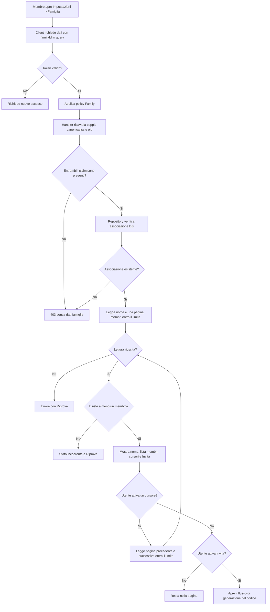

## description

Questo task studia la pagina `Famiglia` alla route canonica `/settings/family` nelle Impostazioni di KinHub/KinList. Il problema concreto e permettere a un membro di riconoscere il proprio nucleo condiviso, vedere chi ne fa parte e avviare un invito, mantenendo l'interfaccia essenziale e senza trasformarla in una console amministrativa.

La pagina mostra soltanto tre contenuti funzionali: nome della famiglia, lista dei membri e azione `Invita`. Non vengono introdotti rimozione dei membri, assegnazione o visualizzazione di ruoli, cambio proprietario o altre azioni amministrative. `Invita` avvia la generazione del codice condiviso manualmente studiato in `family-invite-code`; questa ricerca rappresenta il punto di ingresso senza duplicarne sicurezza e ciclo di vita.

La richiesta dei dati include sempre `familyId` nella query string ed e protetta dalla policy esattamente `Family`. Il server ricava la coppia canonica `(iss, oid)` dal token validato e verifica tramite servizio/repository l'associazione nel database. Se uno dei claim manca, il controllo fallisce in modo chiuso; email e nome non sono chiavi di identita. Un'associazione falsa restituisce `403`; la UI non puo sostituire questo controllo mostrando la pagina soltanto agli utenti che ritiene membri.

Input: identita autenticata e `familyId` della famiglia corrente. Output: nome e membri minimi necessari alla visualizzazione, oppure uno stato di caricamento, vuoto anomalo, accesso negato o errore. Risultato atteso: il membro comprende a quale famiglia appartiene e chi condivide KinList, con una sola azione primaria pertinente.

### Fatti noti

- Nelle Impostazioni esiste la voce `Famiglia`.
- La destinazione canonica della voce e `/settings/family` e deve supportare URL diretto, refresh e cronologia avanti/indietro del browser.
- La pagina mostra nome della famiglia, lista membri e azione `Invita`.
- Non sono richieste azioni di rimozione e non sono richiesti ruoli.
- Ogni membro e mostrato soltanto con nome e iniziali; se il nome manca, i fallback localizzati sono `Membro` in italiano, `Member` in inglese e `?` per le iniziali. Email, claim e ruoli non vengono mostrati ne inviati alla pagina.
- Tutti i membri autorizzati della famiglia condividono gli item KinList.
- La lettura usa la policy `Family`, `familyId` in query string e verifica dell'associazione nel database.
- Associazione falsa significa `403 Forbidden`.
- Tutti i membri possono generare e revocare inviti monouso validi sette giorni; l'elenco mostra soltanto creatore, creazione, scadenza e stato attivo.

### Ipotesi prudenti

- Ogni membro associato puo vedere il nome e l'elenco dei membri della propria famiglia.
- L'azione `Invita` apre il flusso separato di generazione del codice d'invito.
- Il nome visualizzato e un dato applicativo gia autorizzato, non un fallback ricavato al volo dai claim del token.

### Decisioni aperte

- Ordinamento della lista membri.
- Testo e destinazione UI definitivi dopo un `403`; nessun dato familiare viene comunque mostrato.

## best practices microsoft ux

La pagina deve privilegiare riconoscimento e scansione. Il nome della famiglia e il contenuto principale; sotto, una lista verticale paginabile di persone con struttura ripetuta. Fluent 2 descrive una lista come una raccolta di elementi simili facile da scorrere e raccomanda il ruolo semantico `list` quando non esiste selezione ([Fluent 2 List](https://fluent2.microsoft.design/components/web/react/core/list/usage)). Qui le righe non sono selezionabili e non aprono azioni: non devono sembrare pulsanti. Ogni riga contiene solo nome e iniziali; il fallback testuale e localizzato (`Membro` in italiano) e l'avatar usa `?`, senza recuperare email, claim o ruolo.

`Invita` e l'unica azione della pagina e puo avere evidenza primaria senza aggiungere menu o icone per riga. Fluent 2 raccomanda un solo pulsante primario per layout e un'etichetta attiva che descriva l'azione ([Fluent 2 Button](https://fluent2.microsoft.design/components/web/react/core/button/usage)). La label localizzata `Invita` e breve; se il contesto non e sufficiente per tecnologie assistive, il nome accessibile puo esplicitare `Invita un membro`.

Stati necessari:

- **Loading iniziale:** scheletro breve per nome e righe, senza mostrare dati di una famiglia precedentemente visitata.
- **Successo:** nome come heading, conteggio solo se utile e lista semantica dei membri.
- **Pagina successiva o precedente:** i controlli dichiarano la direzione e lo stato disabilitato; il focus si sposta all'inizio della nuova porzione senza perdere il contesto.
- **Lista vuota anomala:** non inventare un invito come soluzione automatica; il chiamante autorizzato dovrebbe comparire tra i membri, quindi offrire `Riprova` e registrare l'incoerenza.
- **`403 Forbidden`:** nessun nome o membro visibile; messaggio di accesso negato distinto dall'empty state.
- **Errore tecnico:** messaggio essenziale e `Riprova`, conservando soltanto dati gia autorizzati se la strategia del prodotto lo consente.
- **Invito:** il pulsante apre la generazione del codice; se l'utente non possiede il permesso ancora da definire, non deve promettere un'azione che il server rifiutera sistematicamente.

Microsoft considera nomi accessibili, tastiera, screen reader, zoom, contrasto e piu indizi oltre al colore requisiti di base ([Microsoft Accessibility overview](https://learn.microsoft.com/en-us/windows/apps/design/accessibility/accessibility-overview)). Gli avatar con iniziali sono quindi decorativi se il nome e gia testo; non possono essere l'unico modo per identificare la persona. Su mobile la lista resta a una colonna; su desktop non serve una tabella, perche non esistono colonne di ruolo o azioni. Apertura diretta di `/settings/family`, refresh e navigazione browser indietro/avanti devono ricostruire pagina e porzione corrente senza una schermata bianca; dopo una navigazione il focus va al titolo o, nel cambio pagina membri, all'inizio della lista aggiornata.

Alternative considerate:

- **Card per ogni membro:** offre spazio per molte azioni, ma qui aumenterebbe l'inquinamento visivo senza dati o comandi che lo giustifichino.
- **Tabella con ruoli e menu:** utile in una console amministrativa, ma ruoli e rimozione non sono nello scope.
- **Lista semplice con un solo pulsante Invita:** raccomandata perche corrisponde esattamente ai dati e alle azioni richiesti.
- **`404` per accesso estraneo:** riduce la possibilita di enumerare famiglie, ma non e la scelta adottata; il contratto richiesto usa `403`, senza includere dettagli della famiglia nella risposta.

## best practices microsoft backend

La UI ha bisogno di una proiezione minima: nome famiglia, membri con soltanto nome e iniziali e metadati di paginazione. Una **proiezione** e una risposta costruita per la schermata invece di esporre tutte le colonne del database. Nel caso concreto non invia identificativi del membro, email, claim, ruoli, associazioni o permessi. Quando il nome applicativo manca, la presentazione usa i18n per mostrare `Membro` in italiano o `Member` in inglese e usa `?` come iniziali, senza sostituirli con dati del token.

Il flusso autorevole e:

1. il client autenticato richiede le impostazioni con `familyId` nella query string;
2. l'endpoint applica la policy esattamente `Family`;
3. l'handler ricava la coppia canonica `(iss, oid)` dai claim verificati e fallisce in modo chiuso se uno dei due manca;
4. il servizio/repository conferma l'associazione nel database;
5. se l'associazione e falsa, la richiesta termina con `403` e nessun dato;
6. se e vera, il caso d'uso legge nome e una pagina di membri limitandosi allo stesso `familyId`;
7. la risposta include cursori per muoversi avanti e indietro e non include email, claim, ruoli o azioni di rimozione.

Microsoft descrive una policy ASP.NET Core come un insieme di requisiti valutati da handler riusabili; tutti i requisiti devono riuscire prima di autorizzare ([policy-based authorization](https://learn.microsoft.com/en-us/aspnet/core/security/authorization/policies?view=aspnetcore-10.0)). L'appartenenza non va dedotta dal fatto che il client conosce il `familyId`, ne da un riferimento profilo liberamente inviato. La coppia `(iss, oid)` identifica il chiamante, mentre il database prova l'associazione corrente.

L'azione `Invita` deve essere separata dalla query di lettura: leggere la pagina non deve generare alcun codice. L'attivazione avvia il caso d'uso descritto in `family-invite-code`, senza destinatario interno e senza invio automatico. Prima dell'implementazione va confermato se tutti i membri possano invitare; la sola appartenenza soddisfatta dalla policy `Family` non inventa automaticamente quel permesso di prodotto.

La lista membri e una collezione paginabile: il contratto del repository espone una lettura limitata e cursori sia avanti sia indietro, mentre l'implementazione concreta risiede in Infrastructure. Non deve esistere un metodo `Get All` per questa collezione. Il limite effettivo di ogni lettura non supera il minore tra massimo configurato e hard ceiling di 5000 record, cosi un errore di configurazione o una richiesta anomala non puo caricare una collezione illimitata. Il task trasversale `data-access-limits-pagination` approfondisce il contratto condiviso; qui resta vincolante che la pagina membri lo usi.

La lista deve inoltre usare un ordinamento deterministico una volta scelta la regola, cosi refresh, cursori e dispositivi non cambiano casualmente la sequenza. Se il nome manca, il display usa soltanto il fallback localizzato `Membro` e le iniziali `?`: non ricava email, claim o ruoli. Un insieme vuoto per una famiglia autorizzata segnala incoerenza, perche l'associazione appena verificata implica almeno il chiamante; non va presentato come normale successo vuoto.

Errori coerenti in Problem Details distinguono input non valido, `403`, incoerenza dati e dipendenza indisponibile, includendo `code` e `traceId`. Log e trace usano identificativi tecnici redatti secondo la classificazione concordata, correlation ID, durata e conteggio membri; non registrano nomi, email, token o claim completi. Non serve un generic repository, CQRS o un servizio membri separato: un caso d'uso di lettura e repository di dominio/infrastruttura sono sufficienti.

## best practices microsoft infrastructure

Non sono necessarie nuove risorse Azure. La pagina riusa Azure Static Web Apps per la SPA, la Function App .NET condivisa per l'API, PostgreSQL per famiglia/appartenenze e Application Insights/OpenTelemetry per telemetria. Il modello Functions isolated supporta dependency injection standard, utile per comporre handler, servizio e repository senza accoppiarli all'endpoint ([Azure Functions .NET isolated worker](https://learn.microsoft.com/en-us/azure/azure-functions/dotnet-isolated-process-guide)).

Configurazione iniziale proporzionata:

- accesso PostgreSQL tramite managed identity e privilegi minimi sugli schemi condivisi necessari;
- indice coerente con ricerca associazione e lettura membri, da definire sul modello fisico reale;
- query paginate nell'implementazione repository Infrastructure, con limite configurato, hard ceiling 5000 e cursori avanti/indietro; nessuna scansione `Get All`;
- nessuna cache di membri nel service worker, in coerenza con il divieto di dati personali nelle cache applicative;
- HTTPS, CORS per origini note e token validati dall'API;
- metriche per durata, `403`, errori e cardinalita aggregata, senza nomi o recapiti;
- alert su errori sistemici ripetuti, non sul singolo accesso negato atteso.

Una cache distribuita non e giustificata: il dataset familiare e piccolo e l'appartenenza deve essere corrente. Una cache introdurrebbe invalidazione quando un membro viene associato o quando cambia nome, pur senza un problema prestazionale misurato. Non servono Microsoft Graph per leggere i membri applicativi, API Management dedicato, Service Bus, realtime o una risorsa separata per gli inviti prima che il flusso invito sia definito.

## flow chart



## user experience

La voce Famiglia e una pagina essenziale dentro Impostazioni. Non contiene selettori di ruolo, menu contestuali, pulsanti di rimozione o dettagli amministrativi. Il `PageHelpAccordion` previsto dalle regole generali resta subito dopo il titolo quando la route verra progettata, senza duplicarne qui l'implementazione.

```text
MOBILE
┌──────────────────────────────┐
│ Famiglia                     │
│ [ Aiuto                         ]│
│                              │
│ Casa Rossi                   │
│                              │
│ Membri                       │
│ (MR) Martina Rossi           │
│ (?)  Membro                  │
│ (AR) Anna Rossi              │
│                              │
│ [ Precedenti ] [ Successivi ]│
│ [ Invita ]                   │
└──────────────────────────────┘
```

```text
LOADING                        ACCESSO NEGATO
┌──────────────────────────┐   ┌──────────────────────────┐
│ Famiglia                 │   │ Famiglia                 │
│ [ Aiuto              ]   │   │ [ Aiuto              ]   │
│                          │   │                          │
│ ███████████              │   │ Accesso non consentito   │
│ ○ ████████               │   │ Nessun membro mostrato   │
│ ○ ██████████             │   │                          │
└──────────────────────────┘   └──────────────────────────┘
```

```text
STATO INCOERENTE / ERRORE
┌──────────────────────────┐
│ Famiglia                 │
│ [ Aiuto              ]   │
│                          │
│ Impossibile caricare i   │
│ membri in questo momento │
│                          │
│ [ Riprova ]              │
└──────────────────────────┘
```

- **Loading:** scheletro locale e nessun dato di un'altra famiglia.
- **Empty:** zero membri non e uno stato normale; viene trattato come incoerenza recuperabile.
- **Errore:** `403` separato dal guasto tecnico; nessun dettaglio familiare esposto.
- **Successo:** nome e lista leggibili, righe non interattive, cursori avanti/indietro quando disponibili e una sola azione `Invita`; email, claim e ruoli non compaiono.
- **Navigazione:** `/settings/family` funziona da URL diretto e dopo refresh; Indietro/Avanti ripristinano route e stato rappresentabile, con focus prevedibile sul titolo o sulla lista aggiornata.
