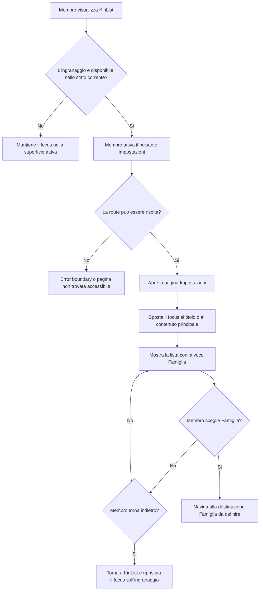

## description

Questo task studia un punto di accesso sempre disponibile alle impostazioni di KinList. Il problema concreto e offrire un'azione secondaria riconoscibile senza competere con il microfono, che resta l'azione principale, e senza coprire contenuto o messaggi temporanei su smartphone.

Il flusso parte dall'attivazione di un pulsante flottante con icona a ingranaggio, fissato in basso a destra. Il pulsante apre una pagina Impostazioni che presenta una lista di voci; nella prima versione la sola voce e `Famiglia`. Il risultato atteso e una navigazione comprensibile e reversibile verso una pagina dedicata, mantenendo minimale la vista principale.

Per **safe area** si intende la parte dello schermo in cui i controlli essenziali restano visibili e raggiungibili nonostante angoli arrotondati, indicatori di sistema o ritagli del dispositivo. Il browser espone gli scostamenti dai bordi tramite variabili CSS come `safe-area-inset-bottom` e `safe-area-inset-right`; il margine ordinario del prodotto va sommato a tali valori, non sostituito da essi. La specifica CSS definisce anche un valore di fallback per `env()`, utile sui browser o nei contesti in cui l'inset non e disponibile ([CSS Environment Variables, safe area insets](https://www.w3.org/TR/css-env-1/#safe-area-insets)).

### Fatti noti

- Il controllo e un'icona a ingranaggio flottante, fissa in basso a destra.
- Il controllo deve rispettare la safe area degli smartphone.
- L'attivazione apre una pagina Impostazioni composta da una lista di voci.
- La lista contiene inizialmente la sola voce `Famiglia`.
- KinList e mobile-first, minimale e priva di pulsanti o testi superflui.
- Nella lista popolata il microfono occupa il basso al centro; una snackbar con `Annulla` puo apparire per cinque secondi dopo il completamento di un item.
- Nel repository ogni pagina usa `PageScaffold`, include il relativo help localizzato ed e registrata nel route registry. Questi sono vincoli gia definiti dal repository, non oggetto di implementazione in questa ricerca.

### Ipotesi prudenti

- L'ingranaggio e disponibile nella pagina principale di KinList sia con lista vuota sia con lista popolata, salvo gli stati in cui una superficie modale impedisce correttamente l'interazione sottostante.
- La lista delle voci Impostazioni e definita dal frontend e non richiede una chiamata di rete per essere mostrata.
- `Famiglia` e una voce di navigazione, non un'impostazione modificabile direttamente nella riga.
- La route Impostazioni puo essere aperta anche da URL diretto e dal pulsante Indietro del browser o della PWA.

### Decisioni aperte

- Percorso URL definitivo della pagina Impostazioni e della destinazione `Famiglia`.
- Destinazione e operazioni offerte dalla voce `Famiglia`; il requisito attuale definisce solo la sua presenza nella lista.
- Visibilita dell'ingranaggio nella stessa pagina Impostazioni, nelle pagine secondarie, durante registrazione/elaborazione e quando un drawer o un dialog e aperto.
- Spaziatura visiva, dimensione finale del target e regola di coordinamento verticale tra ingranaggio, microfono e snackbar ai diversi breakpoint.
- Comportamento della snackbar: spostamento sopra i controlli fissi, area dedicata o altra composizione che non li copra.

## best practices microsoft ux

### Gerarchia e scelta della superficie

Il microfono e l'azione primaria di KinList; l'ingranaggio deve quindi avere peso visivo secondario, pur mantenendo contrasto, focus e area tattile adeguati. Un pulsante circolare discreto e coerente con i temi evita di aggiungere testo permanente alla lista. L'icona da sola, tuttavia, non comunica un nome alle tecnologie assistive: il controllo deve avere un nome accessibile localizzato, per esempio `Apri impostazioni` in italiano e l'equivalente inglese previsto dalle regole del repository. Microsoft raccomanda nomi accessibili, tastiera, screen reader e segnali visivi non dipendenti dal solo colore ([Microsoft Accessibility overview](https://learn.microsoft.com/en-us/windows/apps/design/accessibility/accessibility-overview)).

Il controllo deve essere un vero `button`, non un `div` cliccabile: cosi ruolo, focus e attivazione con Invio e Barra spaziatrice sono forniti dal browser. Questa scelta soddisfa il requisito esplicito del pulsante. Fluent distingue normalmente i pulsanti, che avviano un'azione, dai link, che portano altrove; qui il pulsante avvia l'azione applicativa «apri Impostazioni», mentre la destinazione resta una route ([Fluent 2 Button](https://fluent2.microsoft.design/components/web/react/core/button/usage)). Se in futuro l'ingranaggio diventasse un normale elemento di navigazione visibile con destinazione dichiarata, un link semantico sarebbe l'alternativa da rivalutare.

Il minimo WCAG 2.2 per un target e 24 x 24 CSS pixel, salvo eccezioni di spaziatura. Per un controllo mobile importante e isolato conviene scegliere un'area attiva piu comoda del minimo, senza ingrandire necessariamente l'icona. Il focus deve essere visibile in tema chiaro, scuro e ad alto contrasto; icona e indicatore del controllo richiedono contrasto non testuale sufficiente. Le fonti normative pertinenti sono [WCAG 2.2, Target Size (Minimum), 2.5.8](https://www.w3.org/TR/WCAG22/#target-size-minimum), [Focus Visible, 2.4.7](https://www.w3.org/TR/WCAG22/#focus-visible), [Focus Not Obscured, 2.4.11](https://www.w3.org/TR/WCAG22/#focus-not-obscured-minimum), [Non-text Contrast, 1.4.11](https://www.w3.org/TR/WCAG22/#non-text-contrast) e [Name, Role, Value, 4.1.2](https://www.w3.org/TR/WCAG22/#name-role-value).

### Route, dialog e menu a confronto

| Alternativa | Come funziona in questo task | Vantaggi | Costi e limiti | Valutazione |
|---|---|---|---|---|
| Route dedicata | L'ingranaggio cambia URL e mostra la pagina Impostazioni con titolo, help e lista. | Corrisponde al requisito di una pagina; supporta URL diretto, cronologia, Indietro, refresh e crescita ordinata delle voci. | Richiede gestione del focus dopo la navigazione e registrazione della route secondo le regole repo. | Raccomandata. |
| Dialog modale | La lista appare sopra la pagina corrente e trattiene il focus finche viene chiusa. | Mantiene visibile il contesto sottostante ed e adatto a un compito breve che deve essere concluso prima di tornare. | Aggiunge chiusura, focus trap e rischio di affollamento mobile; non rappresenta naturalmente una pagina e scala male se `Famiglia` apre contenuti piu ampi. | Non raccomandato dato il requisito pagina. |
| Menu ancorato | Un piccolo elenco si apre vicino all'ingranaggio e si chiude dopo la scelta. | Rapido per poche azioni immediate e non persistenti. | Un menu serve a scegliere comandi, non a rappresentare una pagina Impostazioni; con una sola voce aggiunge un passaggio e puo sovrapporsi a microfono o snackbar. | Non raccomandato nello scope attuale. |

La route e quindi la scelta proporzionata: non occorre nominare o introdurre un design pattern ulteriore. Un dialog diventerebbe appropriato per una decisione breve e modale; un menu per piu comandi immediati. Nessuna delle due condizioni e presente nel requisito attuale.

### Focus e sovrapposizioni

All'attivazione, il focus non deve restare su un controllo scomparso. Dopo il cambio route va portato in modo prevedibile al contenuto della pagina, preferibilmente al titolo gestito da `PageScaffold` o al contenitore principale con un'etichetta chiara. Al ritorno tramite navigazione Indietro, il focus dovrebbe tornare all'ingranaggio quando il controllo esiste ancora. Questo rende comprensibile il cambio di contesto senza annunciare l'intera pagina due volte.

La posizione fissa crea quattro rischi distinti:

- **Safe area:** distanza inferiore e destra devono combinare spazio del design e `env(safe-area-inset-bottom, 0px)` / `env(safe-area-inset-right, 0px)`; un valore fisso da solo non protegge tutti i dispositivi.
- **Microfono:** centro e destra devono avere aree attive separate anche su viewport strette; non basta che le icone non si tocchino visivamente.
- **Snackbar:** la notifica temporanea non deve coprire il pulsante, il suo indicatore di focus o il microfono. Lo spazio per le superfici inferiori va coordinato come layout, non risolto aumentando lo `z-index`.
- **Contenuto:** la pagina deve riservare spazio di scorrimento in basso e a destra affinche l'ultima riga e il suo focus possano essere portati interamente in vista. WCAG 2.4.11 richiama esplicitamente il rischio di footer e contenuti fissi che nascondono controlli focalizzati.

Loading, errore ed empty state non servono per aprire una lista statica con la voce `Famiglia`. Se in futuro la disponibilita delle voci dipendesse da rete o permessi, gli stati andrebbero progettati allora: introdurli ora produrrebbe complessita senza un problema reale. L'attivazione riuscita e comunicata dal cambio di pagina, titolo e focus, senza toast ridondante.

## best practices microsoft backend

Il backend non ha responsabilita nel posizionamento dell'ingranaggio, nel rispetto della safe area, nel cambio route o nella lista statica delle voci. Questi comportamenti avvengono nel browser e non richiedono dati, credenziali, segreti o traffico di rete. Collocarli sul server aumenterebbe latenza e dipendenza dalla connessione senza migliorare sicurezza o coerenza.

Il confronto tra collocazioni e quindi semplice:

- **Frontend:** mostra sempre la voce approvata e naviga localmente; funziona anche se la shell PWA e avviata senza rete, non espone nuovi dati e si testa come comportamento UI. E la raccomandazione per questo task.
- **Backend:** potrebbe restituire dinamicamente le voci, ma richiederebbe un endpoint, gestione loading/errori e una policy di cache per un elenco inizialmente costante. Non e giustificato.
- **Ibrido:** avrebbe senso solo se alcune voci future dipendessero da permessi autorevoli. Il client potrebbe conoscere le destinazioni, mentre il server autorizzerebbe comunque ogni dato o operazione. Questo requisito futuro non va anticipato.

La voce `Famiglia` non autorizza da sola l'accesso ai dati familiari. La destinazione usa autenticazione e policy `Family`, con `familyId` nella query string, verifica dell'associazione lato server e Problem Details previsti dal repository. Nascondere una voce nel frontend puo semplificare l'interfaccia, ma non sostituisce l'autorizzazione backend.

Non servono nuovi endpoint, entita, log applicativi o pattern. In particolare, non e utile registrare ogni apertura delle Impostazioni: sarebbe analytics di prodotto, gia fuori dallo scope KinList, e aggiungerebbe telemetria senza una necessita operativa. Gli errori di routing appartengono all'error boundary e alla pagina 404 esistenti; eventuali errori dei futuri contenuti `Famiglia` appartengono al relativo flusso, non a questo punto di ingresso.

## best practices microsoft infrastructure

Non servono nuove risorse Azure. Il pulsante, la route e la lista iniziale sono asset della SPA distribuita dalla Azure Static Web Apps gia prevista; non richiedono Function aggiuntive, database, Storage, Key Vault, code o servizi di osservabilita dedicati.

La configurazione infrastrutturale pertinente e quella gia esistente:

- il fallback di routing della SPA deve consentire apertura diretta e refresh della route Impostazioni;
- il pacchetto frontend deve mantenere CSP, temi e risorse localizzate gia previsti;
- la shell PWA puo rendere disponibile la pagina e la sua lista statica dalla cache degli asset, senza conservare dati personali;
- la destinazione futura `Famiglia`, se usa dati, resta online e protetta secondo l'architettura KinList esistente.

La safe area non e una funzione di Azure: e informazione fornita dal browser al CSS. Va verificata su browser, modalita installata e dispositivi rappresentativi, perche il valore puo cambiare con orientamento e interfacce di sistema. La specifica Web primaria e [CSS Environment Variables Module Level 1](https://www.w3.org/TR/css-env-1/); i controlli accessibili vanno verificati secondo [WCAG 2.2](https://www.w3.org/TR/WCAG22/). Non sono giustificati monitoraggio o alert specifici per la posizione del pulsante; verifiche responsive, tastiera, screen reader e screenshot nei temi sono piu adatte del monitoraggio server.

## flow chart



Il ramo in cui l'ingranaggio non e disponibile rappresenta, per esempio, una superficie modale che ha correttamente preso il focus. Gli stati esatti in cui nasconderlo o disabilitarlo restano una decisione aperta; il diagramma non li assume come gia approvati.

## user experience

La vista principale conserva il microfono come elemento dominante. L'ingranaggio occupa l'angolo inferiore destro, dentro la safe area e fuori dall'area attiva del microfono. Lo spazio tratteggiato nel wireframe rappresenta una fascia di layout riservata alle azioni fisse, non un nuovo pannello visibile.

```text
KINLIST - LISTA POPOLATA
+--------------------------------+
| [Tutte] [Spesa] [Casa]         |
|                                |
| [ ] Latte                      |
| [ ] Pasta                      |
| [ ] Lamette                    |
|                                |
|                                |
| . . . area riservata . . . .  |
|          (microfono)     (gear)|
+--------------------------------+
             ^              ^
       azione primaria   Impostazioni
                          safe area
```

Quando compare una snackbar, questa non deve sovrapporsi ai due controlli fissi. Il wireframe mostra una possibile relazione spaziale, non decide la misura o il componente finale.

```text
KINLIST - SNACKBAR ATTIVA
+--------------------------------+
|                                |
| [ ] Pasta                      |
| [ ] Lamette                    |
|                                |
| +----------------------------+ |
| | Item completato  [Annulla] | |
| +----------------------------+ |
|          (microfono)     (gear)|
+--------------------------------+
```

La pagina Impostazioni e una destinazione autonoma. Usa il titolo e l'help previsti dal repository, quindi presenta una lista semplice. La riga `Famiglia` deve essere interamente attivabile, avere un nome comprensibile e indicare visivamente che porta a un'altra destinazione senza affidarsi alla sola freccia.

```text
IMPOSTAZIONI
+--------------------------------+
| < Indietro                     |
| Impostazioni                   |
| [ Help, chiuso per default ]   |
|                                |
| +----------------------------+ |
| | Famiglia                  > | |
| +----------------------------+ |
|                                |
+--------------------------------+
```

- **Caricamento:** nessun caricamento remoto per la lista iniziale statica; il cambio route deve essere immediato.
- **Stato vuoto:** non previsto, perche `Famiglia` e obbligatoriamente presente. Un array vuoto indicherebbe una configurazione errata, non un normale empty state utente.
- **Errore:** una route non risolta passa alla gestione 404/error boundary esistente; non lascia una pagina bianca e non mantiene il focus su un elemento rimosso.
- **Successo:** pagina Impostazioni visibile, titolo annunciabile, help disponibile e focus collocato in modo prevedibile; il pulsante Indietro riporta alla vista precedente.
- **Responsive e zoom:** il pulsante e l'ultima riga restano visibili senza scorrimento orizzontale al reflow; safe area, testo ingrandito e tastiera virtuale non devono produrre sovrapposizioni.
