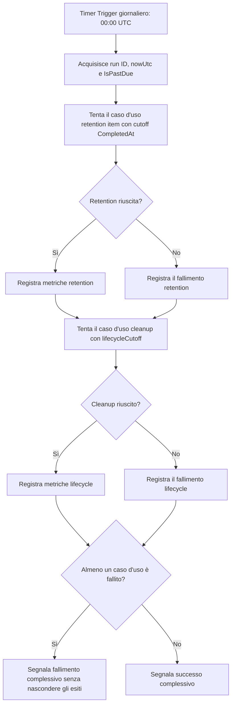
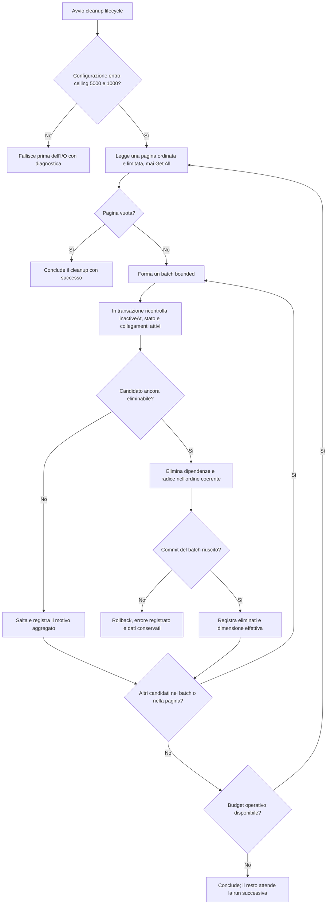

## description

Questo task studia il cleanup fisico di user, membership, family e dati KinList già soft-deleted o inattivi da almeno 30 giorni. Il problema concreto è rimuovere definitivamente dati che non servono più al funzionamento ordinario senza cancellare un elemento riattivato, un utente ancora collegato a dati attivi o una famiglia che ha nuovamente membri attivi. Il task non introduce il comando che rende inattivi questi dati: parte dallo stato lifecycle già consolidato nel brainstorming.

Il **soft delete** conserva la riga nel database ma la marca come inattiva, per esempio con `inactiveAt`; le query ordinarie la escludono, mentre flussi espliciti possono ancora riattivarla. Il **cleanup fisico**, chiamato anche hard delete, rimuove invece la riga dal database operativo. Esempio: una membership resa inattiva il 1 luglio può essere riattivata prima del cutoff; se al momento della cancellazione è di nuovo attiva, il cleanup deve saltarla. La finestra rende reversibile l'inattivazione prevista, ma non crea una nuova funzione di recupero per l'utente.

Un solo Azure Functions Timer Trigger avvia la manutenzione ogni giorno alle `00:00 UTC` con schedule NCRONTAB `0 0 0 * * *` e senza `RunOnStartup`. La stessa invocazione tenta due casi d'uso distinti:

- **retention item completati:** usa `CompletedAt` per eliminare item rimasti `Completed` per 30 giorni, anche dentro una famiglia attiva;
- **cleanup lifecycle:** usa `inactiveAt` per eliminare user, membership, family e dati KinList inattivi o soft-deleted da almeno 30 giorni, solo se non esistono collegamenti attivi che ne impediscano la rimozione.

I due periodi durano entrambi 30 giorni, ma non sono lo stesso cutoff. Un item completato il 1 luglio e una famiglia resa inattiva il 10 luglio hanno scadenze diverse e appartengono a query, regole e metriche diverse. Il trigger può acquisire una volta `nowUtc`, ma passa a ogni caso d'uso il cutoff nominato e calcolato per la propria semantica.

Sono coinvolti il Timer Trigger come ingresso tecnico, due casi d'uso Business indipendenti, repository Infrastructure paginati, PostgreSQL e il responsabile del servizio che osserva Application Insights. L'input del cleanup è `nowUtc`, il `lifecycleCutoff`, la configurazione validata e un token di cancellazione. L'output è un esito aggregato con pagine, batch, candidati per tipo, eliminati, saltati e falliti; il risultato atteso è che restino nel database tutti e soli i dati non ancora eliminabili o non elaborati entro i limiti della run.

### Fatti noti

- Il cleanup considera soltanto user, membership, family e dati KinList soft-deleted o inattivi con `inactiveAt <= lifecycleCutoff` e almeno 30 giorni continuativi di inattività.
- Una riattivazione prima della cancellazione interrompe l'idoneità, anche se la riga era comparsa in una pagina di candidati.
- Cutoff, query, conteggi, metriche ed esito del cleanup lifecycle restano distinti dalla retention basata su `CompletedAt`.
- Il repository Infrastructure legge pagine limitate e non espone `Get All` al caso d'uso.
- `configuredReadMax` parte da 5000 e non può superare il ceiling 5000; `configuredWriteMax` parte da 1000 e non può superare il ceiling 1000.
- Una run può elaborare più pagine e più batch, ma ogni lettura e transazione resta entro il proprio limite validato.
- Prima della cancellazione si ricontrollano cutoff, stato inattivo e assenza di collegamenti attivi; i dati dipendenti e principali vengono rimossi in un ordine transazionale coerente.
- Il fallimento di uno dei due casi d'uso viene registrato e non impedisce di tentare l'altro; la Function non dichiara successo complessivo se almeno uno è fallito.
- Non esistono endpoint o UI `delete account`, né una nuova UI operativa per il cleanup.
- Si riusano Function App, PostgreSQL, Application Insights e managed identity esistenti; non servono Durable Functions, Service Bus o nuove risorse Azure.

### Ipotesi prudenti

- `inactiveAt` indica un istante UTC autorevole e viene azzerato o reso non idoneo quando l'elemento torna attivo.
- «30 giorni» indica 30 periodi di 24 ore in UTC, non giorni di calendario locale.
- Ogni batch contiene un insieme abbastanza piccolo da cancellare dati collegati e radice nella stessa transazione senza superare `configuredWriteMax`.
- I dati non conclusi per timeout, cancellazione dell'host o errore restano coerenti e vengono rivalutati dalla run successiva.

### Decisioni aperte

- Timeout massimo della run, numero e attesa dei retry transitori e soglie degli alert.
- Ordine fisico esatto di tabelle e vincoli, da derivare dal modello PostgreSQL definitivo mantenendo il principio dipendenti-prima-del-principale.
- Politica di backup e point-in-time restore: l'eliminazione dal database operativo non rimuove immediatamente dati dalle copie già create.
- Eventuali obblighi legali o di audit che richiedano anonimizzazione o conservazione selettiva prima dell'eliminazione fisica.

## best practices microsoft ux

Questo task non ha una superficie UI utente. Aggiungere una pagina «Elimina account», una conferma o un pannello di cleanup sarebbe una nuova funzionalità e confonderebbe l'inattivazione prodotta dai flussi approvati con un'azione self-service che non è nello scope. L'utente percepisce soltanto gli effetti già previsti: una membership inattiva non concede accesso e una riattivazione valida prima del cutoff evita la cancellazione.

Il responsabile del servizio usa gli strumenti Azure esistenti, non una nuova UI KinList. L'esperienza operativa deve separare chiaramente tre livelli:

- **invocazione Timer:** mostra se la Function condivisa è partita in orario e se l'esito complessivo è riuscito o fallito;
- **retention item:** mostra il cutoff `CompletedAt` e le metriche degli item completati;
- **cleanup lifecycle:** mostra `lifecycleCutoff`, candidati per tipo, eliminati, saltati per riattivazione o collegamenti attivi, falliti, pagine, batch e durata.

Questa separazione previene un errore di lettura importante: «retention riuscita» non significa che anche il cleanup sia riuscito. Se retention fallisce, il monitor deve comunque mostrare il tentativo e l'esito del cleanup; se cleanup riesce, il riepilogo complessivo resta fallito perché esiste un problema da correggere. Non bisogna mostrare nomi, email, codici invito o contenuti degli item: run ID, tipo di entità, conteggi, durata, cutoff e codici d'errore sono sufficienti.

Stati operativi necessari:

- **in corso:** caso d'uso corrente, pagine e batch completati;
- **vuoto:** zero candidati è un successo normale, non un errore;
- **successo parziale della manutenzione:** un caso d'uso riesce e l'altro fallisce, con esito complessivo fallito;
- **errore di configurazione:** nessun I/O per il caso d'uso se i massimi non sono positivi o superano 5000/1000;
- **errore di batch:** transazione non confermata, conteggi precedenti conservati e lavoro restante rinviato;
- **successo:** entrambi i casi d'uso tentati e riusciti, anche con zero cancellazioni.

La guida Microsoft di Application Insights descrive l'uso di telemetry, metriche e analisi degli errori per osservare applicazioni senza costruire un pannello applicativo dedicato ([Application Insights overview](https://learn.microsoft.com/azure/azure-monitor/app/app-insights-overview)). Qui è proporzionata perché la risorsa esiste già e l'utente finale non può agire sul job.

## best practices microsoft backend

Il Timer Trigger deve fare poco: acquisire il contesto della run, invocare i due casi d'uso e comporre l'esito. Il problema da evitare è che un'eccezione della retention interrompa il metodo prima del cleanup, oppure che l'eccezione venga assorbita e la Function risulti riuscita. In parole semplici, il trigger registra separatamente l'esito del primo tentativo, tenta comunque il secondo e, alla fine, segnala fallimento se uno dei due non è riuscito. Questo è un coordinamento sequenziale molto piccolo; non serve introdurre un orchestratore distribuito o un design pattern aggiuntivo.

Il caso d'uso cleanup possiede le regole lifecycle: calcola o riceve il proprio `lifecycleCutoff`, chiede pagine limitate, forma batch limitati e decide se un candidato può essere cancellato. Il repository Infrastructure possiede query, ordinamento, continuazione e cancellazioni PostgreSQL. Il dominio esprime gli stati e i collegamenti che rendono un'entità attiva o inattiva. Questa divisione impedisce sia SQL nel trigger sia regole di cancellazione nascoste nel repository.

Prima di leggere dati, il backend valida `configuredReadMax` e `configuredWriteMax`. I valori iniziali sono rispettivamente 5000 e 1000 e coincidono con i ceiling. Un massimo configurato è un limite superiore, non una quantità obbligatoria: una pagina può contenere 120 candidati e un batch può scendere a 117 dopo i ricontrolli. Correggere silenziosamente un valore oltre ceiling sarebbe fragile perché nasconderebbe una configurazione errata.

Flusso raccomandato del cleanup:

1. acquisire `nowUtc` e il `lifecycleCutoff` distinto dal cutoff `CompletedAt` della retention;
2. leggere dal repository una pagina ordinata e limitata di candidati lifecycle, mai tutti i record;
3. suddividere la pagina in batch non superiori a `configuredWriteMax` e al ceiling 1000;
4. aprire il confine transazionale del batch e ricontrollare `inactiveAt <= lifecycleCutoff`, stato ancora inattivo e assenza di membership, family o dati collegati ancora attivi;
5. saltare un candidato riattivato o con collegamenti attivi, registrandone soltanto la categoria aggregata;
6. eliminare prima le righe dipendenti previste e poi la radice, seguendo i vincoli reali, e confermare l'intero batch insieme;
7. pubblicare metriche lifecycle e continuare con altri batch e pagine finché non restano candidati o termina il budget operativo della run.

Il ricontrollo dentro la transazione chiude la finestra tra lettura e scrittura. Esempio: la pagina contiene una membership inattiva, ma prima del batch un nuovo invito la riattiva; la condizione di cancellazione non è più vera e la riga viene saltata. Controllare soltanto durante la lettura potrebbe cancellare dati tornati validi. Una transazione rende indivisibili le cancellazioni del batch: o l'ordine coerente viene confermato, oppure PostgreSQL annulla quel batch. Microsoft spiega questo comportamento e l'uso dei savepoint nella documentazione sulle [transazioni EF Core](https://learn.microsoft.com/ef/core/saving/transactions).

La paginazione richiede un ordinamento stabile, per esempio `inactiveAt`, tipo e identificatore come spareggio. Una continuazione basata sugli ultimi valori ordinati evita offset costosi e instabili mentre le righe vengono eliminate. Questa tecnica si chiama **keyset pagination**: la pagina successiva parte dall'ultima chiave vista invece di contare righe che possono scomparire. Microsoft raccomanda un ordinamento completamente univoco e descrive il vantaggio rispetto agli offset in [EF Core pagination](https://learn.microsoft.com/ef/core/querying/pagination).

Il job è ripetibile perché ogni run rilegge solo dati ancora presenti e ancora idonei. Questa proprietà viene chiamata **idempotenza**: dopo un'interruzione, ripetere il controllo non duplica l'effetto già confermato. Non significa ignorare gli errori; i batch falliti restano da elaborare e l'esito della run segnala il problema.

### Concetti spiegati

- **Cutoff:** istante limite; per il lifecycle deriva da `inactiveAt`, per la retention da `CompletedAt`.
- **Transazione:** gruppo di modifiche confermato interamente oppure annullato, utile per non lasciare metà dei dati dipendenti.
- **Keyset pagination:** lettura della pagina successiva a partire da una chiave stabile, senza `Get All` e senza grandi offset.
- **Idempotenza:** possibilità di ripetere il job ottenendo lo stesso stato corretto, senza ripetere effetti già conclusi.

Errori transitori possono avere retry limitati solo quando la ripetizione è sicura. Un vincolo referenziale inatteso o un collegamento attivo non va aggirato disabilitando vincoli o applicando cascade indiscriminate: il batch resta non confermato, il problema viene registrato e gli altri casi d'uso mantengono il proprio esito. I log non contengono dati personali; usano run ID, nome del caso d'uso, cutoff, configurazione validata, quantità effettive, durata e categoria d'errore.

## best practices microsoft infrastructure

Non servono nuove risorse Azure. La Function App esistente ospita un solo Timer Trigger con espressione NCRONTAB `0 0 0 * * *`, interpretata come ogni giorno alle `00:00 UTC`. `RunOnStartup` resta disattivato: Microsoft avverte che abilitarlo può avviare la Function durante riavvii o scale-out in momenti imprevedibili. La documentazione del [Timer Trigger di Azure Functions](https://learn.microsoft.com/azure/azure-functions/functions-bindings-timer) conferma il formato a sei campi, il default UTC, `IsPastDue`, il monitor della schedule e il fatto che il trigger non esegue automaticamente un retry dopo il fallimento.

Il mancato retry automatico rende importanti due scelte già approvate: ogni caso d'uso lascia dati non confermati alla run successiva e il trigger non nasconde un fallimento complessivo. Un eventuale retry applicativo deve essere limitato e osservabile; Durable Functions e Service Bus non sono giustificati perché non esiste una pipeline distribuita, una coda da assorbire o uno stato di orchestrazione da conservare.

PostgreSQL e la managed identity esistenti sono sufficienti. La Function ottiene un token Microsoft Entra invece di conservare una password applicativa; il ruolo database associato deve avere soltanto i privilegi necessari sugli schemi coinvolti. Microsoft documenta autenticazione e creazione del principal database in [Connect with Managed Identity in Azure Database for PostgreSQL Flexible Server](https://learn.microsoft.com/azure/postgresql/security/security-connect-with-managed-identity). Il provisioning del principal resta un'attività controllata di deployment, non lavoro del Timer a ogni avvio.

Configurazione iniziale e limiti:

- schedule unica `0 0 0 * * *`, in UTC, senza `RunOnStartup`;
- `configuredReadMax = 5000`, con ceiling invalicabile 5000;
- `configuredWriteMax = 1000`, con ceiling invalicabile 1000;
- più pagine e batch consentiti nella stessa run, ciascuno bounded;
- cancellazione richiesta dall'host e timeout rispettati, lasciando il resto alla run successiva;
- indici da verificare su stato lifecycle, `inactiveAt` e chiavi dell'ordinamento, senza inventare l'indice fisico prima del modello definitivo.

Application Insights esistente raccoglie una operation per l'invocazione Timer e telemetry figlia distinta per `completed-item-retention` e `inactive-data-cleanup`. Le metriche lifecycle minime sono: ultima esecuzione riuscita, `IsPastDue`, `lifecycleCutoff`, durata, pagina e batch effettivi, pagine e batch totali, candidati per tipo, eliminati, saltati perché riattivati, saltati per collegamenti attivi, falliti ed età massima oltre cutoff. Nessuna metrica lifecycle deve essere sommata a quella degli item basata su `CompletedAt`.

Un alert utile segnala un fallimento del caso d'uso o dati lifecycle oltre cutoff e tolleranza senza una run riuscita. Zero candidati è invece un successo. Backup e point-in-time restore rimangono separati: il cleanup garantisce l'eliminazione dal database operativo, mentre la scadenza nelle copie dipende dalla politica di conservazione approvata.

## flow chart





## user experience

Non esistono schermate KinList per questo task. L'utente non vede un pulsante di cancellazione account, uno stato di avanzamento o una notifica dopo 30 giorni. Se un flusso approvato rende inattiva una membership o una family, l'accesso cambia subito secondo quel flusso; il cleanup successivo è un dettaglio backend. Una riattivazione valida prima della cancellazione rende nuovamente attivo il dato e lo esclude dal cleanup.

L'esperienza pertinente è il riepilogo nell'Application Insights esistente. Il seguente wireframe rappresenta le informazioni, non una nuova pagina da implementare:

```text
+----------------------------------------------------------+
| Manutenzione giornaliera                                 |
| Run: [run-id]       Schedule: 00:00 UTC   Past due: no   |
| Esito complessivo: FALLITO                               |
|                                                          |
| Retention item                                           |
| Esito: fallito      Cutoff: CompletedAt <= [istante]     |
| Candidati: 80       Eliminati: 0          Falliti: 80    |
|                                                          |
| Cleanup lifecycle                                        |
| Esito: riuscito     Cutoff: inactiveAt <= [istante]      |
| Read max: 5000/5000   Write max: 1000/1000               |
| Candidati: 24       Eliminati: 20         Saltati: 4     |
| Pagine: 1           Batch: 1              Falliti: 0     |
+----------------------------------------------------------+
```

- **Loading:** l'operation indica quale caso d'uso è in corso e i batch confermati; KinList non viene bloccato.
- **Empty:** zero candidati lifecycle è un successo con conteggi a zero.
- **Errore di configurazione:** il caso d'uso indica il massimo non valido e conferma che non ha eseguito I/O.
- **Errore operativo:** il riepilogo distingue batch confermati, batch in rollback, lavoro restante ed esito dell'altro caso d'uso.
- **Riattivazione o collegamento attivo:** il candidato è contato come saltato, non come cancellato o errore tecnico.
- **Successo:** entrambi i casi d'uso sono stati tentati e sono riusciti; cutoff e metriche restano separati e non viene mostrato alcun contenuto personale.
