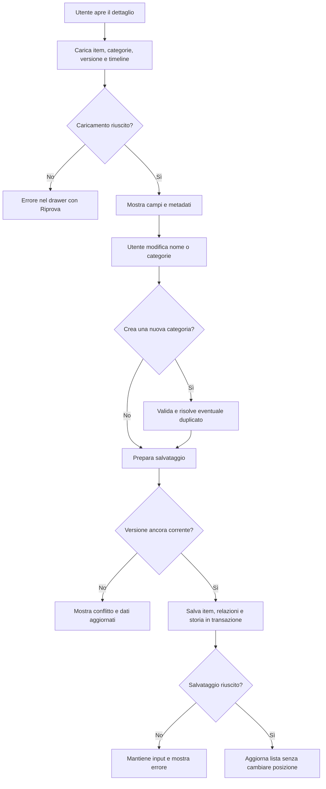

## description

Questo task copre l'apertura del dettaglio di un item `Active`, la modifica di nome e categorie, la creazione di una categoria e la consultazione dei metadati e della timeline. Il problema concreto è permettere correzioni rapide senza perdere il contesto della lista e senza sovrascrivere silenziosamente una modifica effettuata nel frattempo da un'altra sessione.

Il drawer è una superficie secondaria che entra dal bordo e mantiene un legame visivo con la pagina principale. Fluent 2 lo raccomanda per informazioni supplementari e azioni semplici collegate al contenuto principale; distingue drawer inline e overlay e richiede almeno header e body ([Fluent 2 Drawer](https://fluent2.microsoft.design/components/web/react/core/drawer/usage)). Per KinList, su smartphone è appropriato un drawer overlay da destra, anche a larghezza piena; su schermi più ampi può restare laterale lasciando riconoscibile la lista.

Input: item selezionato e sua versione corrente. Output: item aggiornato con `UpdatedAt`/`UpdatedBy`, associazioni categoria coerenti e nuovo evento di modifica quando esiste una variazione effettiva. La timeline mostra eventi in ordine cronologico e non è la sorgente usata per ricostruire ogni stato dell'item.

### Fatti noti

- Non sono previsti popup tradizionali; dettaglio, modifica e cronologia condividono un drawer laterale.
- Nome e categorie sono modificabili; autore e date sono in sola lettura.
- La selezione categorie è multipla e una nuova categoria può essere confermata, per esempio, con Invio.
- La timeline verticale mostra creazione, modifica e completamento con autore e data/ora.
- Modificare un item non cambia la sua posizione nella lista.

### Ipotesi prudenti

- L'item può essere visto da più sessioni, perché il modello contiene autori di creazione e modifica; non è però confermata una lista collaborativa.
- L'identità dell'autore arriva dall'autenticazione del backend e non da un campo modificabile inviato dal client.
- La timeline conserva eventi applicativi essenziali, non ogni dettaglio tecnico o chiamata API.

### Decisioni aperte

- Salvataggio esplicito con pulsante oppure salvataggio automatico campo per campo.
- Comportamento alla chiusura del drawer con modifiche non salvate.
- Regole per nome vuoto, lunghezza, spazi, emoji e duplicati.
- Normalizzazione e unicità delle categorie, perimetro del catalogo e autorizzazione a crearle.
- Quali valori precedenti mostrare in un evento «Modificato»; l'idea richiede solo tipo, autore e data/ora.
- Strategia in caso di conflitto tra due modifiche contemporanee.

## best practices microsoft ux

Il drawer deve avere un titolo breve che identifichi lo scopo, un pulsante Chiudi con nome accessibile, body scorrevole e una sola azione primaria chiaramente riconoscibile se viene scelto il salvataggio esplicito. Fluent 2 avverte che i drawer overlay sono modali per impostazione predefinita, bloccano il contenuto sottostante e devono restare rapidi; per contenuti lunghi il body deve scorrere e gli errori vanno collocati vicino alla sezione interessata ([Fluent 2 Drawer](https://fluent2.microsoft.design/components/web/react/core/drawer/usage)).

Stati e comportamento raccomandati:

- **Apertura:** focus sul titolo o sul primo campo utile; il resto della pagina non è raggiungibile finché il drawer overlay è aperto.
- **Nome:** etichetta visibile, valore corrente, errore inline e nessun affidamento al solo placeholder.
- **Categorie selezionate:** tag leggibili e non troncati. Fluent 2 usa i tag per valori scelti e abilita la rimozione per annullare una scelta ([Fluent 2 Tag](https://fluent2.microsoft.design/components/web/react/core/tag/usage)).
- **Catalogo categorie:** controlli a selezione multipla con stato percepibile anche senza colore. Non usare un carosello che nasconde la tastiera: deve poter scorrere e rifluire su zoom elevato.
- **Nuova categoria:** campo etichettato; Invio crea/seleziona solo un valore valido. Aggiungere un controllo visibile «Aggiungi» evita che l'azione sia scopribile soltanto da tastiera.
- **Metadati:** testo secondario ma leggibile, con date localizzate; memorizzazione sempre UTC sul server.
- **Timeline:** linea e nodi sono decorativi; tipo, autore e data rimangono testo strutturato per screen reader.

Il salvataggio esplicito è la raccomandazione iniziale perché nome e più categorie formano un'unica intenzione, il drawer contiene cronologia e un conflitto può richiedere una scelta. L'autosave riduce un tocco, ma produce più eventi «Modificato», rende incerto quando l'operazione è conclusa e complica la chiusura. È valido solo se il prodotto accetta questi effetti e raggruppa le modifiche in modo comprensibile.

Se l'utente chiude con dati sporchi, la soluzione più semplice è mantenere un'indicazione «Modifiche non salvate» e chiedere conferma prima di scartare. Dato il vincolo «niente popup tradizionali», la decisione deve essere confermata: una conferma accessibile può essere integrata nel drawer, senza aprire un secondo drawer. Fluent raccomanda di avvisare quando la chiusura può far perdere input.

In caso di conflitto non mostrare un generico errore 500. Dire che l'item è cambiato, mostrare i dati aggiornati e permettere di riapplicare consapevolmente la modifica. Un merge automatico è rischioso per categorie e nome e non è necessario nella prima versione.

## best practices microsoft backend

Il backend riceve soltanto campi modificabili e ricava autore e timestamp dalla sessione e dall'orologio server. Deve validare il nome, verificare che ogni categoria sia accessibile, creare l'eventuale nuova categoria secondo una regola di unicità e applicare item, associazioni e storia in una sola transazione. Se non cambia alcun valore, non aggiornare `UpdatedAt` e non aggiungere un evento vuoto.

Due utenti possono aprire la stessa versione e salvarne due diverse. L'ultimo salvataggio non deve cancellare il primo senza avviso. La **concorrenza ottimistica** risolve questo problema senza bloccare l'item mentre il drawer è aperto: il client riceve un token di versione; l'update riesce solo se il token è ancora corrente. EF Core supporta concurrency token e, con SQL Server, `rowversion`; quando il dato è cambiato l'update non trova la versione attesa e l'app può chiedere all'utente di ricaricare ([EF Core concurrency](https://learn.microsoft.com/en-us/ef/core/saving/concurrency)). È utile qui se esistono più sessioni; sarebbe superflua soltanto con una garanzia reale di uso singolo.

La cronologia può essere una tabella append-only `ItemHistory`: ogni modifica aggiunge un record con item, tipo evento, autore e timestamp. “Append-only” significa che gli eventi già scritti non vengono modificati durante una normale operazione. È un **audit log applicativo** semplice. Non serve Event Sourcing, un'architettura in cui lo stato viene ricostruito riproducendo tutti gli eventi: per KinList lo stato corrente può restare nella tabella item e la timeline è una vista informativa.

Per la creazione categorie, normalizzare sul backend per evitare «Spesa», « spesa » e «SPESA» come duplicati accidentali, ma conservare un nome di visualizzazione. La normalizzazione dipende dalla lingua e dal perimetro del catalogo: non va decisa implicitamente nel frontend. Un vincolo univoco nel database risolve anche due creazioni simultanee; il secondo tentativo recupera la categoria già creata.

Le risposte errore devono distinguere validazione, categoria duplicata/risolta, item non più attivo, conflitto di versione e autorizzazione. ASP.NET Core può produrre Problem Details coerenti senza esporre stack trace ([errori API ASP.NET Core](https://learn.microsoft.com/en-us/aspnet/core/fundamentals/error-handling-api?view=aspnetcore-10.0)). Nei log usare item ID, versione e trace ID, non nome o categorie in chiaro.

## best practices microsoft infrastructure

Non occorrono nuove risorse Azure per il drawer o la timeline. Riutilizzare API, database, identità e Application Insights di Kin Hub. Il database deve supportare:

- transazione tra item, associazioni categoria e storia;
- vincolo univoco per il nome normalizzato della categoria nel perimetro deciso;
- indice della timeline per `ItemId` e timestamp;
- token di concorrenza adatto al provider.

Un database relazionale è una scelta pragmatica per relazioni molti-a-molti e scritture atomiche. Se non esiste alcun database, Azure SQL è candidato, ma la scelta del tier dipende dal carico; il serverless introduce latenza di ripresa e va usato solo se il prodotto la tollera ([Azure SQL serverless](https://learn.microsoft.com/en-us/azure/azure-sql/database/serverless-tier-overview)).

Sicurezza: l'API autorizza sia lettura sia modifica dell'item, non accetta `UpdatedBy` dal browser e limita i campi aggiornabili per evitare *over-posting*, cioè la modifica involontaria di proprietà non esposte nella UI. Telemetria: durata caricamento/salvataggio, percentuale conflitti, errori validazione e query timeline; nessun valore funzionale nei log ordinari.

Non sono giustificati database eventi separato, Event Hubs, cache distribuita, ricerca full-text o un servizio categorie autonomo.

## flow chart



## user experience

Su mobile il drawer può occupare tutta la larghezza; su desktop rimane laterale. Header e chiusura sono sempre visibili, body scorrevole, azione primaria prevedibile.

```text
┌──────────────────────────────┐
│ Modifica item           [×]  │
├──────────────────────────────┤
│ Nome                         │
│ [ Lamette________________ ]  │
│                              │
│ Categorie                    │
│ [Spesa✓] [Bagno✓] [Casa]    │
│ [Nuova categoria________] [+]│
│                              │
│ Creato da Martina · 18:42    │
│ Modificato da … · …          │
│                              │
│ ● Creato · Martina · 18:42   │
│ │                            │
│ ● Modificato · Martina · …   │
│                              │
├──────────────────────────────┤
│ [Annulla]        [Salva]     │
└──────────────────────────────┘
```

- **Loading:** scheletro nel drawer, senza svuotare la lista sottostante.
- **Empty:** timeline vuota è anomala perché ogni item ha almeno la creazione; mostrare stato tecnico recuperabile, non inventare eventi.
- **Errore:** validazione vicino al campo; errore globale in alto; input dell'utente preservato.
- **Successo:** conferma breve, versione aggiornata, timeline aggiornata e posizione della riga invariata.
