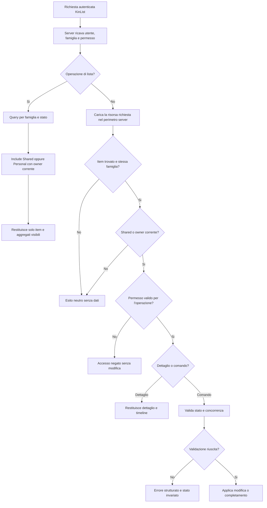
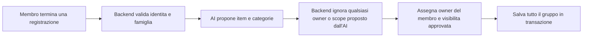

## description

Questo task studia il perimetro di visibilita degli item KinList. Il tipo `Personal`/`Shared` e gia predisposto e la creazione usa attualmente `Shared` come valore predefinito. La regola richiesta e semplice da enunciare ma trasversale: un item `Personal` e accessibile soltanto al suo autore stabile; un item `Shared` e accessibile ai membri autorizzati della stessa famiglia. Il problema concreto e applicare la stessa regola a ogni lettura e modifica, senza affidarsi a un filtro nel browser.

Per **owner stabile** si intende l'identita applicativa assegnata alla creazione e non sostituita quando un altro membro modifica o completa l'item. Esempio: Martina crea un item personale; una successiva modifica aggiorna `UpdatedBy`, ma non cambia l'owner. Questa separazione evita che una normale operazione trasferisca involontariamente la visibilita.

Input del flusso: identita applicativa autenticata, famiglia corrente, operazione richiesta e dati autorevoli dell'item. Output: solo gli item leggibili oppure l'esito consentito/negato per dettaglio, modifica, completamento e bulk. Per gli item generati dalla voce, owner e visibilita vengono assegnati dal backend al gruppo salvato; non provengono dal modello AI, dalla trascrizione o da campi liberamente scelti nel payload.

### Fatti noti

- Il tipo `Personal`/`Shared` e gia predisposto.
- Il default di creazione attuale e `Shared`.
- `Personal` significa accesso del solo autore; `Shared` significa accesso dell'intera famiglia autorizzata.
- I controlli devono coprire liste, dettagli, modifica, completamento e bulk sul server, non essere un semplice filtro client.
- KinList dispone gia di identita applicativa, famiglia, autorizzazione per azione e item generati tramite voce.
- Il brainstorming precedente considerava solo la lista condivisa; questo task introduce esplicitamente un'estensione di quel perimetro e non va reinterpretato come comportamento gia approvato in ogni dettaglio.

### Ipotesi prudenti

- «Autore» della regola Personal coincide con l'identita applicativa che crea l'item e viene conservata come owner immutabile.
- Tutti gli item prodotti dalla stessa registrazione ricevono owner e visibilita coerenti nella stessa transazione.
- Finche non esiste una scelta UI approvata, il percorso vocale continua a usare il default corrente `Shared`.

### Decisioni aperte

- Se e dove l'utente puo scegliere `Personal` o `Shared` prima della creazione vocale.
- Se la visibilita puo cambiare dopo la creazione, chi puo cambiarla e quali effetti ha sulla timeline.
- Come migrare item esistenti: confermare `Shared` e verificare che `CreatedBy` sia sufficientemente stabile per inizializzare l'owner.
- Comportamento se l'owner lascia la famiglia, viene disabilitato o il profilo viene eliminato.
- Se un item personale puo essere completato o modificato da amministratori futuri; il ruolo iniziale noto resta `Membro`.
- Se categorie create o usate soltanto da item personali devono apparire nel catalogo familiare, nei filtri o nei conteggi aggregati.
- Se una richiesta diretta a un item non visibile restituisce lo stesso esito di un ID inesistente per evitare rivelazioni.
- Impatto della visibilita su retention, timeline e strumenti operativi oltre ai controlli utente ordinari.

## best practices microsoft ux

La UI deve comunicare il perimetro senza aumentare il rumore visivo. Un indicatore breve e non basato soltanto sul colore puo distinguere un item personale, mentre `Shared`, essendo il default corrente, puo non richiedere un badge ripetuto su ogni riga se il contesto della pagina e gia chiaro. Questa e una raccomandazione da verificare con test di comprensione, non una decisione sul design finale.

La lista ricevuta dal server contiene gia soltanto gli item visibili. Il client puo separare o filtrare localmente `Personal` e `Shared` per comodita solo tra dati che l'utente e gia autorizzato a vedere; non deve mai ricevere gli item personali degli altri membri per poi nasconderli. Un filtro client risolve la presentazione, non la riservatezza: dati nel payload restano accessibili tramite strumenti del browser, cache e log di rete.

Stati necessari:

- **Caricamento lista:** nessun contenuto precedente appartenente a un'altra sessione o famiglia; il risultato server e autorevole.
- **Lista vuota:** significa che non esistono item visibili attivi, non che gli item della famiglia siano assenti in assoluto.
- **Dettaglio non disponibile:** messaggio neutro e ritorno alla lista, senza mostrare nome, categorie, owner o timeline.
- **Operazione negata:** nessun aggiornamento ottimistico definitivo; la UI riconcilia con la risposta server.
- **Successo:** l'indicatore di visibilita resta coerente tra riga e dettaglio.

Se il prodotto introduce la scelta di visibilita, le due opzioni devono spiegare il risultato in parole concrete: «Solo io» e «Famiglia», con `Personal` e `Shared` come termini di dominio interni se non aiutano l'utente. Una scelta implicita nascosta e rischiosa per contenuti personali; d'altra parte aggiungere una conferma a ogni registrazione contrasta il flusso «Parla → Ottieni la lista». Le alternative da approvare sono quindi:

- mantenere `Shared` implicito e non offrire ancora creazioni personali;
- rendere persistente una scelta visibile prima della registrazione;
- chiedere il perimetro per ogni registrazione, con maggiore attrito ma intenzione esplicita.

Nessuna delle tre e deducibile dal solo fatto che il tipo sia predisposto. Se in futuro la visibilita cambia, passare da `Personal` a `Shared` espone contenuto a tutta la famiglia e richiede un'azione esplicita e chiaramente etichettata; il percorso inverso potrebbe sottrarre un item collaborativo agli altri membri e richiede una regola prodotto separata.

## best practices microsoft backend

La regola autorevole puo essere espressa in parole semplici: prima il server circoscrive alla famiglia corrente; poi accetta l'item se e `Shared` oppure, se e `Personal`, se l'owner coincide con l'utente corrente; infine verifica il permesso richiesto. Questa condizione deve entrare nelle query di lista e categorie e deve essere riapplicata alle operazioni su singola risorsa.

Microsoft distingue l'autenticazione dalla decisione su una risorsa concreta. Quando il permesso dipende da proprieta dell'item, come owner e visibilita, serve **autorizzazione basata sulla risorsa**: il server valuta utente, operazione e risorsa insieme ([ASP.NET Core resource-based authorization](https://learn.microsoft.com/en-us/aspnet/core/security/authorization/resource-based?view=aspnetcore-10.0)). Un attributo generale sull'endpoint puo richiedere l'accesso all'API, ma non puo da solo sapere se quello specifico item personale appartiene al chiamante.

Copertura minima del controllo:

- **Liste:** la query esclude alla fonte gli item personali altrui prima di proiezione, ordinamento, conteggio e paginazione.
- **Dettagli e timeline:** il server applica lo stesso predicato prima di restituire qualsiasi campo collegato.
- **Modifica e completamento:** carica l'item nel perimetro autorizzato e verifica anche il permesso dell'operazione e la versione concorrente.
- **Bulk:** valida ogni ID; un solo ID personale altrui non deve essere trattato come autorizzato perche gli altri appartengono alla famiglia.
- **Categorie e aggregati:** conteggi, filtri e categorie derivate non devono rivelare indirettamente item personali non visibili.

Il controllo solo client e da escludere. Attraverso la rete passerebbero nomi, categorie e metadati non autorizzati; il browser non contiene segreti utili a proteggere quei dati; dispositivi e versioni PWA potrebbero applicare filtri diversi; testare e osservare tutti i percorsi diventerebbe fragile. Il server possiede gia identita, famiglia e persistenza e puo applicare una regola unica a HTTP, bulk e futuri trigger senza duplicarla nella UI.

L'owner non deve essere ricavato ogni volta dall'ultimo autore. `CreatedBy` descrive chi creo l'item; `UpdatedBy` e `CompletedBy` descrivono azioni successive. Se `CreatedBy` e garantito immutabile e riferisce un'identita applicativa stabile, puo rappresentare l'owner concettuale; un campo owner separato e preferibile solo se trasferimento, migrazione o cancellazione dell'autore richiedono una semantica distinta. La scelta fisica va confermata dopo aver verificato il modello esistente, senza duplicare dati per precauzione.

Per la generazione vocale il backend assegna lo stesso owner autenticato e la stessa visibilita approvata a tutti gli item della registrazione, insieme a famiglia, `RecordingId`, ordine e timestamp. Il modello AI non deve poter produrre o cambiare questi campi. Il default `Shared` va applicato in un solo confine autorevole: il client puo mostrarlo, ma omettere o alterare il valore nel payload non deve aggirare la regola.

Microsoft raccomanda, nei sistemi con perimetri condivisi, di conoscere sia l'utente sia il tenant e di autorizzare ogni richiesta anche quando il tenant e gia identificato ([Azure Architecture Center, tenant mapping and request validation](https://learn.microsoft.com/en-us/azure/architecture/guide/multitenant/considerations/map-requests)). In KinList la famiglia svolge il ruolo di perimetro condiviso: appartenere alla famiglia e necessario per gli item `Shared`, ma non basta per quelli `Personal`.

Errori e telemetria devono evitare rivelazioni. Una richiesta non autorizzata non registra nome o categorie e non comunica quanti item personali esistono. Log utili: item ID tecnico, tipo operazione, esito della policy, trace ID e durata, con accesso limitato. La scelta tra `404` neutro e `403` esplicito per una risorsa non visibile resta aperta, ma deve essere coerente in dettaglio, modifica, completamento e bulk.

## best practices microsoft infrastructure

Non servono nuove risorse Azure. La regola appartiene all'applicazione e alle query PostgreSQL gia ospitate nella Function App condivisa. Entra External ID autentica il membro, ma owner e visibilita restano dati applicativi: spostarli interamente nei claim renderebbe i token obsoleti quando un item cambia e non consentirebbe decisioni per singola risorsa.

Il database deve sostenere query che combinano famiglia, stato, visibilita e owner. Gli indici vanno progettati dopo avere osservato le query e la distribuzione `Personal`/`Shared`: ogni indice accelera letture ma aumenta costo di scrittura e spazio. Se viene introdotto o popolato un owner, la migrazione deve evitare valori nulli o proprietari inventati e deve avere verifica e rollback secondo le regole del repository.

Application Insights/OpenTelemetry puo misurare letture consentite/negate, tentativi per operazione, durata delle query e anomalie bulk, senza registrare contenuto o identificativi esterni. Non sono giustificati cache distribuita, database separato per item personali, API Management dedicato o cifratura applicativa distinta soltanto per realizzare questo scope. Eventuali requisiti normativi ulteriori potrebbero cambiare la valutazione, ma non sono fatti noti.

## flow chart





## user experience

La lista non mostra mai placeholder per item personali altrui: quei dati non arrivano al browser. Un item personale visibile al proprietario puo avere un indicatore discreto; il dettaglio ripete il perimetro per evitare modifiche inconsapevoli. Il wireframe rappresenta la comprensione dello scope, non decide se il selettore sia gia disponibile.

```text
+--------------------------------+
| [Tutte] [Spesa] [Casa]         |
|                                |
| [Solo io] Visita medica        |
|            Salute              |
|                                |
| Latte                          |
| Spesa                          |
|                                |
|             (microfono)        |
+--------------------------------+
```

```text
+--------------------------------+
| Item non disponibile           |
|                                |
| Potrebbe essere stato          |
| modificato o non essere        |
| accessibile.                   |
|                                |
| [Torna alla lista]             |
+--------------------------------+
```

- **Loading:** mostrare uno stato neutro finche il server non restituisce il perimetro autorizzato; non riusare dati personali di una sessione precedente.
- **Empty:** «nessun item visibile» non deve rivelare l'esistenza di item personali altrui.
- **Errore:** dettaglio e comandi non mostrano contenuto residuo dopo un rifiuto; il messaggio resta coerente con la decisione futura `404`/`403`.
- **Successo:** riga, dettaglio e feedback mantengono lo stesso significato di «Solo io» o «Famiglia».
- **Voce:** con il default attuale, una registrazione genera item `Shared`; una scelta diversa richiede prima una decisione UX esplicita, non un comportamento nascosto nel modello AI.
