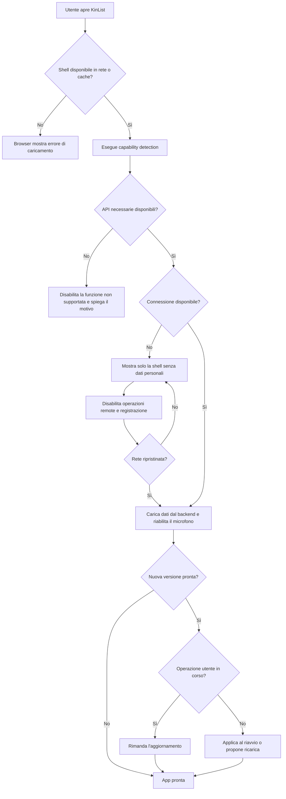

## description

KinList deve essere una Progressive Web App (PWA): un'applicazione realizzata con tecnologie Web che può essere usata nel browser e, sui dispositivi che lo consentono, installata con una propria icona. Il problema concreto è garantire un avvio rapido e comprensibile senza promettere funzioni offline non previste. Soltanto la shell, cioè HTML, CSS, JavaScript, icone e manifest, è disponibile dalla cache; dati personali, lista, registrazione, interpretazione AI e operazioni remote richiedono la rete e non vengono accodati.

Il flusso coinvolge l'utente, il browser o PWA installata, il service worker e il backend. Un *service worker* è un processo Web separato dalla pagina che può intercettare richieste e servire asset statici già salvati sul dispositivo. Per KinList serve ad aprire l'involucro dell'interfaccia con rete assente; non memorizza risposte API, lista, audio, token o altri dati personali. Microsoft conferma che una PWA usa manifest e service worker, richiede HTTPS in produzione e può adattarsi alle capacità del dispositivo ([panoramica PWA](https://learn.microsoft.com/en-us/microsoft-edge/progressive-web-apps/), [guida iniziale PWA](https://learn.microsoft.com/en-us/microsoft-edge/progressive-web-apps/how-to/)).

### Fatti noti

- Frontend React, Vite e TypeScript, mobile-first e responsive.
- La PWA deve essere usabile dal browser e installabile.
- La funzione principale è vocale e l'audio deve essere elaborato da AI.
- L'interfaccia deve restare minimale.
- I browser primari sono Chrome desktop, Chrome Android e la PWA installata; Edge è equivalente.
- Safari/iOS è sottoposto a verifica secondaria best effort e non definisce la baseline funzionale.
- Offline è disponibile soltanto la shell: nessun dato personale, operazione remota o audio viene conservato o accodato.

### Ipotesi prudenti

- L'elaborazione AI e la lettura o scrittura della lista persistente richiedono rete.
- Il frontend è una Single Page Application, cioè una pagina Web che aggiorna le viste senza ricaricare un documento per ogni azione.
- Il service worker usa un elenco esplicito di soli asset pubblici della shell.

### Decisioni aperte

- Versioni minime dei browser primari, da fissare in base alle API effettivamente usate.
- Strategia di aggiornamento: applicare la nuova versione al prossimo avvio oppure chiedere all'utente di ricaricare quando non sta registrando.

## best practices microsoft ux

L'interfaccia distingue tre condizioni che altrimenti sembrerebbero identiche: app pronta, shell aperta ma offline e app da aggiornare. Una UI completamente muta quando la funzione primaria non può partire crea un errore difficile da comprendere. La minimalità va conservata nello stato normale, non a costo di nascondere informazioni operative.

- **Avvio normale:** caricare la lista dal backend senza bloccare l'intera pagina con uno splash non necessario.
- **Offline:** mostrare la sola shell, senza lista o altri dati personali, disabilitare il microfono e spiegare «Serve una connessione per usare KinList». Non usare solo colore o un'icona barrata.
- **Riconnessione:** richiedere nuovamente i dati al backend, riabilitare le azioni disponibili e comunicare il ripristino senza un dialogo modale.
- **Aggiornamento disponibile:** non ricaricare durante registrazione, elaborazione o modifica. Proporre un'azione breve quando l'utente è in uno stato sicuro oppure applicare l'update al riavvio.
- **Installazione:** non mostrare un grande invito permanente. L'app resta usabile nel browser; un invito contestuale e dismissibile può apparire solo quando il browser espone una possibilità d'installazione.

L'accessibilità non è decorativa. Microsoft raccomanda nomi accessibili, uso completo da tastiera, supporto a zoom e contrasto e più indizi oltre al colore ([Accessibility overview](https://learn.microsoft.com/en-us/windows/apps/design/accessibility/accessibility-overview)). La transizione del microfono dal centro al fondo rispetta la preferenza di riduzione del movimento: se l'utente richiede meno animazioni, usa un cambio di layout immediato o una dissolvenza breve senza perdere il focus.

La PWA applica *capability detection*: prima di mostrare un'azione come disponibile controlla le API necessarie, per esempio service worker, accesso al microfono, `MediaRecorder` e formati audio condivisi con il backend. Questo evita di assumere che tutti i browser con lo stesso nome o sistema operativo abbiano le stesse capacità. Chrome desktop, Chrome Android, PWA installata ed Edge devono superare i flussi primari; Safari/iOS viene verificato in modo secondario e, se manca una capacità, mostra uno stato non supportato invece di fallire dopo il tocco.

La shell offline con azioni remote disabilitate è la decisione approvata. Conservare la lista in sola lettura o accodare audio e modifiche richiederebbe dati personali sul dispositivo, sincronizzazione e gestione dei conflitti: queste alternative sono incompatibili con il perimetro e non vengono mantenute come opzioni aperte.

## best practices microsoft backend

La shell PWA non conosce segreti né endpoint interni dei servizi AI. Il backend resta il confine autorevole che autentica l'utente, applica autorizzazioni, valida le richieste e chiama servizi protetti. Il service worker memorizza soltanto asset pubblici e versionati inclusi in una lista esplicita; richieste e risposte API, audio, output AI, token e dati personali usano sempre la rete e non entrano nella Cache API, in IndexedDB o in altre persistenze browser.

Per evitare che una vecchia shell chiami un contratto API incompatibile, frontend e backend evolvono con compatibilità temporanea: aggiungono campi senza cambiare il significato di quelli esistenti e rimuovono un contratto solo dopo che i client precedenti non sono più serviti. Non serve introdurre un'architettura a microservizi; una singola API modulare è sufficiente.

Lo stato `navigator.onLine` è solo un indizio della connettività locale, non garantisce che il backend sia raggiungibile. La UI combina questo segnale con l'esito reale delle richieste. Gli errori di rete devono essere distinguibili da quelli di validazione e da quelli interni. ASP.NET Core supporta risposte *Problem Details*, un formato JSON coerente che descrive tipo, stato e dettaglio dell'errore senza esporre stack trace ([gestione errori nelle API ASP.NET Core](https://learn.microsoft.com/en-us/aspnet/core/fundamentals/error-handling-api?view=aspnetcore-10.0)).

Osservabilità minima:

- tracciare caricamento della shell e chiamate API con un identificatore di correlazione;
- misurare errori di rete, versioni del client e tempi delle operazioni;
- non registrare audio, output AI, nomi degli item o token;
- separare telemetria tecnica da dati funzionali.

Non è necessario un design pattern nominato oltre alla normale separazione tra UI statica e API. La cache del service worker risolve soltanto l'avvio della shell; non esistono sincronizzazione differita, background sync o coda audio.

## best practices microsoft infrastructure

Serve obbligatoriamente un endpoint HTTPS: Microsoft indica che parti fondamentali delle PWA, compresi i service worker, richiedono HTTPS in produzione. KinHub dispone già di hosting, dominio, API e monitoraggio; riusarli evita risorse duplicate.

La base proporzionata usa:

- **Azure Static Web Apps** per gli asset React/Vite, il certificato TLS e il fallback della Single Page Application ([panoramica Azure Static Web Apps](https://learn.microsoft.com/en-us/azure/static-web-apps/overview));
- la Function App esistente per dati e AI;
- Application Insights/OpenTelemetry esistente per la sola osservabilità tecnica ([Application Insights](https://learn.microsoft.com/en-us/azure/azure-monitor/app/app-insights-overview)).

La configurazione iniziale usa una precache esplicita dei soli asset della shell, cache con nomi e versioni espliciti, eliminazione delle cache obsolete in fase di attivazione, `Cache-Control` lungo per asset con hash e breve o `no-cache` per HTML e manifest. Le API dinamiche sono *network-only*, cioè vengono sempre richieste al backend, e nessuna risposta autenticata viene memorizzata dal service worker.

Non servono CDN personalizzata, multi-regione, sincronizzazione offline, background sync, coda audio, push notification o gateway API dedicato.

## flow chart



## user experience

Schermate e stati coinvolti: caricamento iniziale breve, lista vuota online, lista attiva online, shell offline, capacità non supportata e aggiornamento disponibile. Offline non viene mostrata una copia della lista: lo stato spiega che i dati saranno richiesti di nuovo alla riconnessione, senza suggerire che siano stati persi.

```text
ONLINE
┌──────────────────────────────┐
│                              │
│                              │
│            (mic)             │
│       Registra voce          │
│                              │
│                              │
└──────────────────────────────┘
```

```text
OFFLINE: SOLA SHELL
┌──────────────────────────────┐
│ Connessione assente          │
│                              │
│ KinList è offline.           │
│ Dati e registrazione non     │
│ sono disponibili.            │
│                              │
│            (mic)             │  disabilitato
│ Riproverò alla riconnessione │
└──────────────────────────────┘
```

- **Loading:** online, usare lo scheletro durante la richiesta della lista; niente animazione infinita senza messaggio d'errore.
- **Empty:** microfono centrale online; offline, spiegazione breve invece di un controllo apparentemente funzionante.
- **Errore:** azione «Riprova» per errori recuperabili; nessuna promessa di dati o operazioni accodati.
- **Successo:** lista o stato vuoto disponibili dal backend; il microfono è attivo e ha uno stato percepibile anche senza animazione.
