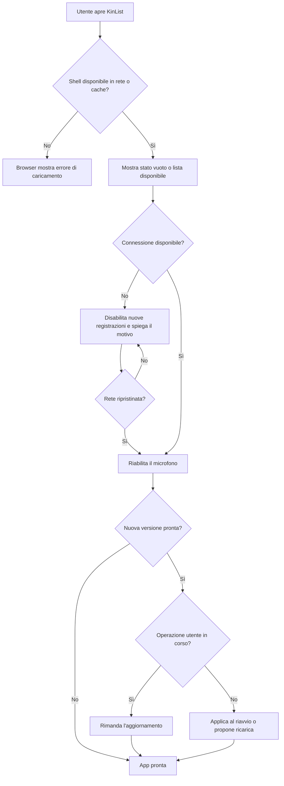

## description

KinList deve essere una Progressive Web App (PWA): un'applicazione realizzata con tecnologie Web che può essere usata nel browser e, sui dispositivi che lo consentono, installata con una propria icona. Il problema concreto è garantire un avvio rapido e comprensibile senza promettere che ogni funzione lavori offline. La shell — HTML, CSS, JavaScript, icone e manifest — può essere disponibile dalla cache; registrazione da inviare, trascrizione, interpretazione AI e sincronizzazione della lista dipendono invece da servizi remoti.

Il flusso coinvolge l'utente, il browser/PWA installata, il service worker e il backend. Un *service worker* è un processo Web separato dalla pagina che può intercettare le richieste e servire file già salvati sul dispositivo. Per KinList è utile per aprire l'interfaccia anche con rete debole; non rende automaticamente disponibili offline API, database o AI. Microsoft conferma che una PWA usa manifest e service worker, richiede HTTPS in produzione e può adattarsi alle capacità del dispositivo ([panoramica PWA](https://learn.microsoft.com/en-us/microsoft-edge/progressive-web-apps/), [guida iniziale PWA](https://learn.microsoft.com/en-us/microsoft-edge/progressive-web-apps/how-to/)).

### Fatti noti

- Frontend React, Vite e TypeScript, mobile-first e responsive.
- La PWA deve essere usabile dal browser e installabile.
- La funzione principale è vocale e l'audio deve essere elaborato da AI.
- L'interfaccia deve restare minimale.

### Ipotesi prudenti

- L'elaborazione AI e la lista persistente richiedono rete; non è specificata una modalità offline completa.
- Il frontend è una Single Page Application, cioè una pagina Web che aggiorna le viste senza ricaricare un documento per ogni azione.
- Non esiste ancora un'infrastruttura Azure da riusare, perché nel workspace è presente solo il documento dell'idea.

### Decisioni aperte

- Browser e versioni minime da supportare, in particolare Safari/iOS e modalità installata.
- Se mostrare dati della lista già sincronizzati in sola lettura quando manca la rete.
- Strategia di aggiornamento: applicare la nuova versione al prossimo avvio oppure chiedere all'utente di ricaricare quando non sta registrando.
- Hosting Azure già disponibile in Kin Hub e autenticazione condivisa con gli altri componenti.

## best practices microsoft ux

L'interfaccia deve distinguere tre condizioni che altrimenti sembrerebbero identiche: app pronta, app aperta ma offline, app da aggiornare. Una UI completamente muta quando la funzione primaria non può partire crea un errore difficile da comprendere. La minimalità va quindi conservata nello stato normale, non a costo di nascondere informazioni operative.

- **Avvio normale:** mostrare subito lo stato vuoto o la lista locale già disponibile; non bloccare l'intera pagina con uno splash non necessario.
- **Offline:** mantenere visibile la lista già caricata, se prevista dalla decisione di prodotto, ma disabilitare il microfono con nome accessibile e breve messaggio «Serve una connessione per creare nuovi item». Non usare solo colore o un'icona barrata.
- **Riconnessione:** riabilitare l'azione automaticamente e comunicare il ripristino senza un dialogo modale.
- **Aggiornamento disponibile:** non ricaricare durante registrazione, elaborazione o modifica. Proporre un'azione breve quando l'utente è in uno stato sicuro, oppure applicare l'update al riavvio.
- **Installazione:** non mostrare un grande invito permanente. L'app resta pienamente usabile nel browser; un invito contestuale e dismissibile può apparire solo quando il browser espone una possibilità d'installazione.

L'accessibilità non è un'aggiunta decorativa. Microsoft raccomanda nomi accessibili, uso completo da tastiera, supporto a zoom/contrasto e più indizi oltre al colore ([Accessibility overview](https://learn.microsoft.com/en-us/windows/apps/design/accessibility/accessibility-overview)). La transizione del microfono dal centro al fondo deve rispettare la preferenza di riduzione del movimento: se l'utente richiede meno animazioni, usare un cambio di layout immediato o una dissolvenza breve, senza perdere il focus.

Alternative considerate:

- **App sempre vuota offline:** è la più semplice, ma può far sembrare persi gli item già visti. È valida solo se il prodotto decide esplicitamente che nessun dato viene conservato sul dispositivo.
- **Intera esperienza offline con coda di audio:** evita il blocco, ma conserva registrazioni sensibili sul dispositivo, richiede sincronizzazione, gestione dei duplicati e spiegazioni di privacy. Non è giustificata dall'idea iniziale.
- **Shell offline, azioni remote disabilitate:** è la raccomandazione iniziale perché rende l'app avviabile e onesta sui limiti senza introdurre una coda offline.

## best practices microsoft backend

La shell PWA non deve conoscere segreti né endpoint interni dei servizi AI. Il backend resta il confine che autentica l'utente, applica autorizzazioni e chiama servizi protetti. Il service worker deve memorizzare soltanto asset versionati e risposte espressamente giudicate sicure; non deve mettere indiscriminatamente in cache richieste API, audio, token o risposte personali.

Per evitare che una vecchia shell chiami un contratto API incompatibile, frontend e backend devono evolvere con compatibilità temporanea: aggiungere campi senza cambiare il significato di quelli esistenti e rimuovere un contratto solo dopo che i client precedenti non sono più serviti. Non serve introdurre un'architettura a microservizi. Una singola API modulare è sufficiente finché scala e team non dimostrano il contrario.

Gli errori di rete devono essere distinguibili da quelli di validazione e da quelli interni. ASP.NET Core supporta risposte *Problem Details*, un formato JSON coerente che descrive tipo, stato e dettaglio dell'errore senza esporre stack trace ([gestione errori nelle API ASP.NET Core](https://learn.microsoft.com/en-us/aspnet/core/fundamentals/error-handling-api?view=aspnetcore-10.0)). Il client può così scegliere un messaggio corretto invece di mostrare sempre «Qualcosa è andato storto».

Osservabilità minima:

- tracciare caricamento della shell e chiamate API con un identificatore di correlazione;
- misurare errori di rete, versioni del client e tempi delle operazioni;
- non registrare audio, trascrizioni, nomi degli item o token nei log per impostazione predefinita;
- separare telemetria tecnica da dati funzionali.

Non è necessario un design pattern nominato oltre alla normale separazione tra UI statica e API. La cache del service worker risolve un problema specifico di avvio e affidabilità della shell; trasformarla in un archivio dati generale complicherebbe inutilmente il prodotto.

## best practices microsoft infrastructure

Serve obbligatoriamente un endpoint HTTPS: Microsoft indica che parti fondamentali delle PWA, compresi i service worker, richiedono HTTPS in produzione. Se Kin Hub possiede già hosting, dominio, API, database e monitoraggio, riusarli è preferibile a creare risorse duplicate.

In assenza di infrastruttura esistente, una base proporzionata è:

- **Azure Static Web Apps** per gli asset React/Vite: distribuisce contenuto statico, fornisce certificati TLS e può collegarsi a un'API esistente o a Functions ([panoramica Azure Static Web Apps](https://learn.microsoft.com/en-us/azure/static-web-apps/overview));
- un backend separato soltanto per dati e AI;
- **Application Insights tramite OpenTelemetry** se Kin Hub non dispone già di osservabilità. Microsoft raccomanda la distribuzione Azure Monitor OpenTelemetry per la maggior parte degli scenari server-side ([Application Insights](https://learn.microsoft.com/en-us/azure/azure-monitor/app/app-insights-overview)).

Configurazione iniziale ragionevole: cache con nomi/versioni espliciti, eliminazione delle cache obsolete in fase di attivazione, `Cache-Control` lungo per asset con hash e breve/no-cache per HTML e manifest, HTTPS obbligatorio e ambiente di staging. Non mettere l'API dinamica in una strategia cache-first.

Non sono ancora giustificati CDN personalizzata, multi-regione, sincronizzazione offline, push notification o un gateway API dedicato. La decisione tra Static Web Apps e hosting già presente deve essere presa solo dopo aver mappato Kin Hub.

## flow chart



## user experience

Schermate/stati coinvolti: caricamento iniziale molto breve, lista vuota, lista attiva, stato offline e aggiornamento disponibile. Il caricamento non deve sostituire dati già disponibili; lo stato vuoto normale non va confuso con un errore di rete.

```text
┌──────────────────────────────┐
│                              │
│                              │
│             ◉                │
│       [ Registra voce ]      │  nome per screen reader,
│                              │  etichetta visiva opzionale
│                              │
└──────────────────────────────┘
```

```text
┌──────────────────────────────┐
│  Connessione assente         │
│                              │
│  Lista già disponibile       │
│  □ Latte                     │
│  □ Pasta                     │
│                              │
│             ◉                │  disabilitato
│ Serve una connessione per    │
│ creare nuovi item            │
└──────────────────────────────┘
```

- **Loading:** usare lo scheletro solo se non esiste contenuto da mostrare; niente animazione infinita senza messaggio d'errore.
- **Empty:** microfono centrale; se offline, spiegazione breve invece di un controllo apparentemente funzionante.
- **Errore:** azione «Riprova» per errori recuperabili; nessuna perdita silenziosa dello stato locale.
- **Successo:** lista o stato vuoto disponibili; il microfono è attivo e ha uno stato percepibile anche senza animazione.
