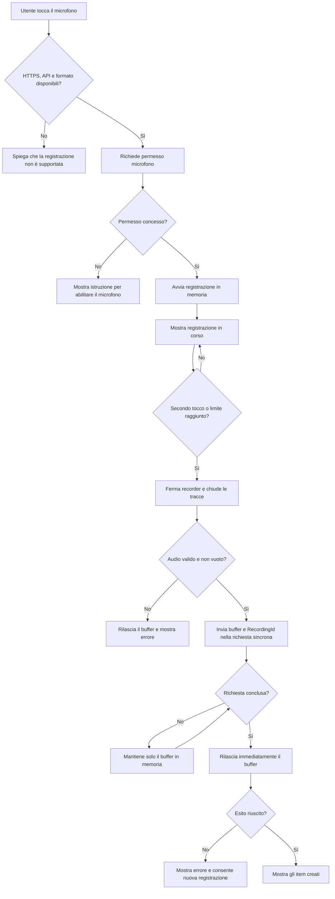

## description

Questo task copre il gesto «tocca per iniziare, tocca di nuovo per terminare» e termina quando il buffer o flusso audio in memoria è stato consegnato alla richiesta sincrona. Non comprende l'interpretazione AI o la generazione degli item. Il problema è ottenere consenso, segnalare senza ambiguità quando il microfono è attivo e gestire differenze reali tra browser e dispositivi senza conservare la voce.

Il browser chiede accesso al microfono tramite `getUserMedia`. L'utente può accettare, rifiutare, ignorare la richiesta o non avere un dispositivo disponibile. La chiamata richiede HTTPS e restituisce un flusso audio. `MediaRecorder` trasforma quel flusso in blocchi in memoria; contenitore e codec possono variare, quindi `MediaRecorder.isTypeSupported()` verifica i formati prima di iniziare ([getUserMedia](https://developer.mozilla.org/en-US/docs/Web/API/MediaDevices/getUserMedia), [MediaRecorder](https://developer.mozilla.org/en-US/docs/Web/API/MediaRecorder), [specifica MediaStream Recording](https://w3c.github.io/mediacapture-record/)).

Input: un tocco intenzionale dell'utente. Output: audio non vuoto con MIME type dichiarato, durata e `RecordingId`, mantenuto soltanto in memoria per la richiesta corrente. Risultato atteso: le tracce del microfono vengono chiuse allo stop, il buffer viene rilasciato appena la richiesta termina o fallisce e la UI mostra l'esito senza creare file locali, file temporanei server-side o code audio.

### Fatti noti

- Un tocco avvia e un secondo tocco ferma; non si tiene premuto.
- Durante l'ascolto l'icona cambia o si anima.
- Non viene mostrata né riprodotta un'anteprima audio.
- La progettazione è mobile-first.
- I browser primari sono Chrome desktop, Chrome Android e la PWA installata da questi ambienti; Edge è trattato come equivalente.
- Safari e iOS ricevono una verifica secondaria best effort, senza promessa di parità con i browser primari.
- Audio e altri dati grezzi esistono solo come buffer o stream in memoria durante la richiesta HTTP sincrona; sono esclusi file temporanei, Blob Storage e code asincrone.

### Ipotesi prudenti

- L'utente parla nella lingua configurata per l'app, ma la lingua effettiva non è ancora definita.
- Il limite di durata viene scelto in modo coerente con dimensione massima, memoria disponibile e timeout del flusso sincrono.

### Decisioni aperte

- Durata massima, dimensione massima e comportamento al raggiungimento del limite.
- Piccola lista di formati accettati dal backend, ricavata dai formati realmente prodotti dai browser primari.
- Se offrire «Annulla registrazione» oltre al secondo tocco che la conclude.
- Testo della richiesta privacy e base giuridica per inviare voce al servizio cloud.
- Lingua fissa, selezionabile o rilevata automaticamente.

## best practices microsoft ux

La richiesta del permesso deve avvenire dopo il tocco sul microfono, non all'apertura: così il prompt del browser è collegato a un'intenzione comprensibile. Prima del primo prompt può bastare una frase breve che spieghi lo scopo, senza creare un secondo dialogo a ogni uso.

Stati necessari del singolo controllo:

1. **Non disponibile:** se mancano le API necessarie o un formato comune con il backend, il controllo resta disabilitato e spiega il limite.
2. **Pronto:** pulsante microfono con nome accessibile «Avvia registrazione».
3. **Richiesta permesso:** controllo temporaneamente disabilitato e stato «Attendo il permesso del microfono».
4. **In ascolto:** icona distinta, bordo o forma e testo accessibile «Registrazione in corso; tocca per terminare». Non affidarsi solo al rosso o all'animazione.
5. **Arresto e invio:** impedisce doppi tocchi mentre arrivano gli ultimi dati e mentre l'unica richiesta è in corso.
6. **Errore:** messaggio specifico per permesso negato, nessun microfono, dispositivo occupato, registrazione vuota, rete assente o funzionalità non supportata.

L'animazione deve comunicare attività, non decorare, e deve ridursi quando il sistema richiede meno movimento. Il controllo resta un vero pulsante raggiungibile da tastiera, con area tattile comoda, focus visibile e nome accessibile. Le indicazioni Microsoft richiedono supporto a tastiera e screen reader, contrasto e segnali multipli oltre al colore ([Accessibility overview](https://learn.microsoft.com/en-us/windows/apps/design/accessibility/accessibility-overview)).

Prima di abilitare il controllo, la PWA verifica `mediaDevices.getUserMedia`, `MediaRecorder` e almeno un MIME type accettato dal backend. Questa *capability detection* controlla le funzioni disponibili invece di dedurle dal nome del browser. Per esempio, se Chrome Android non espone un formato comune, la registrazione non parte e l'utente riceve subito una spiegazione. È utile anche nella verifica secondaria Safari/iOS, ma non sostituisce i test sui browser primari.

Tenere premuto contraddice il gesto approvato e penalizza l'accessibilità motoria. Conservare l'audio per un invio successivo renderebbe possibile una coda offline, ma introdurrebbe dati sensibili persistenti e un secondo ciclo di vita: è escluso. La soluzione proporzionata è registrare in memoria, inviare una volta nella richiesta sincrona e, dopo un fallimento definitivo, chiedere una nuova registrazione.

## best practices microsoft backend

Il backend non si fida dell'estensione o del MIME type dichiarato dal client. Valida autenticazione, dimensione, durata quando ricavabile, formato realmente decodificabile e presenza di audio. Un input troppo grande viene rifiutato prima di chiamare il provider AI.

`RecordingId` viene generato prima dell'invio e identifica l'unica richiesta. Il backend lo usa per impedire che una consegna duplicata a livello di trasporto crei due gruppi di item. Rendere l'operazione **idempotente** significa che lo stesso identificatore non produce due effetti. Non autorizza il browser a conservare o accodare l'audio: chiusa la richiesta, il buffer viene rilasciato e un nuovo tentativo utente produce una nuova registrazione.

Per il formato, il client seleziona tra i MIME type supportati dal browser e il backend dichiara una piccola lista accettata. Imporre un solo codec senza capability detection renderebbe fragile soprattutto il supporto mobile. Una conversione, se indispensabile per il provider configurato, deve avvenire soltanto in memoria e rispettare gli stessi limiti della richiesta; non crea file temporanei.

Errori e osservabilità:

- restituire codici distinti per formato non supportato, audio vuoto, limite superato, timeout e servizio non disponibile;
- associare `RecordingId` e trace tecnico senza scrivere audio, nomi o output AI nei log;
- chiudere tutte le tracce del microfono subito dopo stop, errore o annullamento;
- rilasciare buffer e stream in blocchi di pulizia garantiti dopo successo, errore, annullamento o timeout.

La richiesta resta sincrona fino all'esito AI e al salvataggio. Il backend è autorevole: decide se l'audio è accettabile e non delega al client validazione, interpretazione o scrittura. Non serve un protocollo di upload riprendibile, perché implicherebbe persistenza e sessioni incompatibili con il flusso approvato.

## best practices microsoft infrastructure

HTTPS è obbligatorio per accedere al microfono in produzione. Le credenziali del deployment Azure AI Foundry non devono mai essere incluse nel bundle React. Il browser parla soltanto con il backend, che usa la propria managed identity.

Non servono Blob Storage, code o dischi temporanei. Browser, backend e client del provider lavorano con buffer o stream in memoria e li rilasciano immediatamente quando la richiesta sincrona si conclude, viene annullata o supera il timeout. Questa scelta riduce la superficie privacy, ma richiede limiti prudenti di durata e dimensione per proteggere la memoria del processo.

Metriche iniziali: percentuale aggregata di permessi negati osservabile lato client, errori per formato, limite di dimensione o durata, tempo di upload e tasso di registrazioni vuote. Audio e dati funzionali non entrano nella telemetria.

Complessità escluse: streaming media dedicato, CDN per audio, archiviazione permanente, file temporanei, Blob, coda asincrona e conversione preventiva in più formati.

## flow chart



## user experience

Il controllo mantiene la stessa posizione durante la registrazione per evitare tocchi errati. La sua trasformazione visiva non sposta l'area premibile. Dopo lo stop passa allo stato di elaborazione studiato nel task AI.

```text
PRONTO                         IN ASCOLTO
┌──────────────────┐          ┌──────────────────┐
│                  │          │      00:08       │
│       (mic)      │          │      ((o))       │
│                  │          │ Tocca per fermare│
└──────────────────┘          └──────────────────┘
```

```text
PERMESSO NEGATO
┌──────────────────────────────┐
│ Microfono non disponibile    │
│ Abilitalo nelle impostazioni │
│ del sito e riprova.          │
│                              │
│ [ Riprova ]                  │
└──────────────────────────────┘
```

- **Loading:** attesa permesso, arresto e richiesta sincrona hanno feedback breve; nessuna percentuale inventata.
- **Empty:** coincide con lo stato pronto; nessun audio precedente viene mostrato o conservato.
- **Errore:** messaggio specifico e azione recuperabile; non chiedere il permesso in un ciclo automatico e non promettere un audio accodato.
- **Successo:** tracce del microfono già chiuse allo stop, controllo non più in stato «ascolto» e buffer rilasciato al termine della richiesta.
