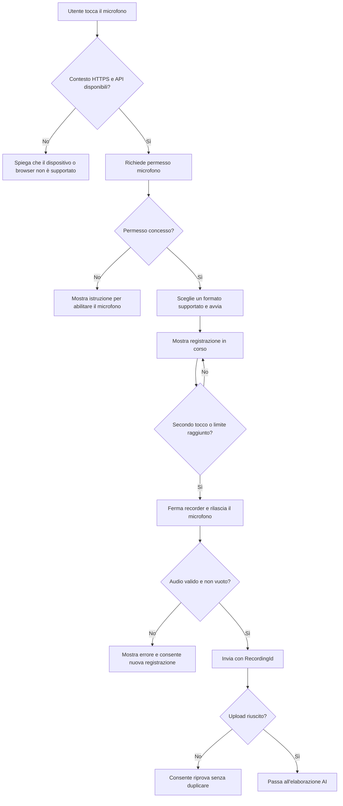

## description

Questo task copre il gesto «tocca per iniziare, tocca di nuovo per terminare» e termina quando esiste un file o flusso audio pronto per essere inviato. Non comprende trascrizione o generazione degli item. Il problema è ottenere consenso, segnalare senza ambiguità quando il microfono è attivo e gestire differenze tra browser e dispositivi.

Il browser chiede accesso al microfono tramite `getUserMedia`. L'utente può accettare, rifiutare, ignorare la richiesta o non avere un dispositivo disponibile. La chiamata è permessa in un contesto sicuro HTTPS e restituisce un flusso audio. `MediaRecorder` trasforma quel flusso in blocchi di dati e consente di fermare la registrazione. Le API sono ampiamente disponibili, ma il contenitore e il codec supportati possono variare; il browser espone `MediaRecorder.isTypeSupported()` proprio per verificarli ([getUserMedia](https://developer.mozilla.org/en-US/docs/Web/API/MediaDevices/getUserMedia), [MediaRecorder](https://developer.mozilla.org/en-US/docs/Web/API/MediaRecorder), [specifica MediaStream Recording](https://w3c.github.io/mediacapture-record/)).

Input: un tocco intenzionale dell'utente. Output: audio non vuoto con MIME type dichiarato, durata e `RecordingId`. Risultato atteso: il microfono viene rilasciato e la UI passa all'elaborazione una sola volta.

### Fatti noti

- Un tocco avvia e un secondo tocco ferma; non si tiene premuto.
- Durante l'ascolto l'icona cambia o si anima.
- Non viene mostrata né riprodotta un'anteprima audio.
- La progettazione è mobile-first.

### Ipotesi prudenti

- L'audio viene registrato nel browser e poi consegnato al backend.
- L'utente parla nella lingua configurata per l'app, ma la lingua effettiva non è definita.
- L'audio grezzo non viene conservato oltre il tempo necessario all'elaborazione, salvo decisione esplicita contraria.

### Decisioni aperte

- Durata massima, dimensione massima e comportamento al raggiungimento del limite.
- Browser/dispositivi supportati e formati accettati dal backend.
- Se offrire «Annulla registrazione» oltre al secondo tocco che la conclude.
- Testo della richiesta privacy e base giuridica per inviare voce a un servizio cloud.
- Lingua fissa, selezionabile o rilevata automaticamente.

## best practices microsoft ux

La richiesta del permesso deve avvenire dopo il tocco sul microfono, non all'apertura: così il prompt del browser è collegato a un'intenzione comprensibile. Prima del primo prompt può bastare una frase breve che spieghi lo scopo, senza creare un secondo dialogo ogni volta.

Stati necessari del singolo controllo:

1. **Pronto:** pulsante microfono, nome accessibile «Avvia registrazione».
2. **Richiesta permesso:** controllo temporaneamente disabilitato e stato «Attendo il permesso del microfono».
3. **In ascolto:** icona distinta, bordo/forma e testo accessibile «Registrazione in corso; tocca per terminare». Non affidarsi solo al rosso o all'animazione.
4. **Arresto:** breve passaggio che impedisce doppi tocchi mentre arrivano gli ultimi dati.
5. **Errore:** messaggio specifico per permesso negato, nessun microfono, dispositivo occupato o registrazione vuota.

L'animazione deve comunicare attività, non decorare. Deve poter essere ridotta quando il sistema chiede meno movimento. Il controllo deve restare un vero pulsante raggiungibile da tastiera, con area tattile comoda, focus visibile e nome accessibile. Le indicazioni Microsoft includono supporto a tastiera e screen reader, nomi accessibili, contrasto e segnali multipli ([Accessibility overview](https://learn.microsoft.com/en-us/windows/apps/design/accessibility/accessibility-overview)).

Non mostrare un'anteprima è un fatto di prodotto, ma l'utente deve poter riconoscere e correggere i fallimenti prima dell'invio. Una forma d'onda non è necessaria; un semplice timer visibile e un'indicazione «In ascolto» riducono l'incertezza. Se il requisito «priva di testi non necessari» viene interpretato in modo assoluto, i nomi possono restare accessibili ai lettori di schermo e apparire visivamente solo negli stati eccezionali.

Alternative considerate:

- **Tenere premuto:** dà controllo continuo, ma contraddice il requisito e penalizza accessibilità motoria.
- **Riconoscimento diretto in streaming dal browser:** può ridurre un upload finale, ma aumenta dipendenza dal supporto SDK, richiede token temporanei e lega acquisizione e trascrizione. Non è la scelta iniziale raccomandata.
- **Registrazione locale, invio al backend:** separa responsabilità, consente feature detection e mantiene i segreti fuori dal browser; è la raccomandazione iniziale.

## best practices microsoft backend

Il backend non deve fidarsi dell'estensione o del MIME type dichiarato dal client. Deve validare autenticazione, dimensione, durata quando ricavabile, formato realmente decodificabile e presenza di audio. Deve rifiutare presto input troppo grandi con un errore strutturato e non passarli al servizio AI.

`RecordingId` va generato prima dell'invio e riutilizzato se la rete cade e il client riprova. Il problema concreto è evitare che lo stesso audio crei due gruppi di item perché la prima risposta è andata persa. Rendere l'operazione **idempotente** significa che ripetere la stessa richiesta con lo stesso identificatore produce lo stesso risultato e non duplica gli effetti. Qui è proporzionato; non richiede un sistema distribuito complesso, ma un vincolo univoco e una risposta coerente.

Per il formato, il client seleziona tra i MIME type supportati dal browser e il backend dichiara una piccola lista accettata. Se il servizio di trascrizione richiede altro, la conversione avviene sul server solo quando necessaria. Imporre un solo codec al client senza rilevamento rende fragile soprattutto il supporto mobile.

Errori e log:

- restituire codici distinti per formato non supportato, audio vuoto, limite superato e servizio non disponibile;
- associare `RecordingId` e trace tecnico, senza scrivere il contenuto audio nei log;
- chiudere sempre le tracce del microfono sul client dopo stop o errore;
- cancellare buffer e file temporanei dopo consegna o fallimento definitivo.

Non serve un pattern di streaming a blocchi per la prima versione se viene scelto un limite breve e misurabile. Diventa utile solo se la durata ammessa produce file troppo grandi o se serve trascrizione durante il parlato, funzionalità che l'idea non richiede.

## best practices microsoft infrastructure

HTTPS è obbligatorio per accedere al microfono in produzione. Le chiavi di Speech o di altri servizi non devono mai essere incluse nel bundle React. Microsoft raccomanda Microsoft Entra ID e identità gestite per le applicazioni Azure; se si usano chiavi, vanno protette in Key Vault e non nel codice ([quickstart Speech to text](https://learn.microsoft.com/en-us/azure/ai-services/speech-service/get-started-speech-to-text)).

Non serve Blob Storage se il backend può inoltrare il buffer al servizio e scartarlo. Se il flusso asincrono richiede persistenza temporanea, usare un container privato, accessibile soltanto dall'identità gestita del backend, cifrato dal servizio e con cancellazione automatica breve. Azure Blob Storage permette regole di ciclo di vita che eliminano oggetti, ma l'esecuzione è periodica e può iniziare con ritardo: è una rete di sicurezza, non la cancellazione immediata dopo il consumo ([Blob lifecycle management](https://learn.microsoft.com/en-us/azure/storage/blobs/lifecycle-management-overview)).

Metriche iniziali: percentuale di permessi negati osservabile solo lato client in forma aggregata, errori per formato, dimensione/durata, tempo di upload e tasso di registrazioni vuote. Non raccogliere trascrizioni o audio in telemetria.

Complessità non giustificate: streaming media dedicato, CDN per audio, archiviazione permanente, conversione in più formati preventivi o account Storage separato senza un requisito di isolamento.

## flow chart



## user experience

Il controllo mantiene la stessa posizione durante la registrazione per evitare tocchi errati. La sua trasformazione visiva non deve spostare l'area premibile. Dopo lo stop passa allo stato di elaborazione studiato nel task AI.

```text
PRONTO                         IN ASCOLTO
┌──────────────────┐          ┌──────────────────┐
│                  │          │      00:08       │
│       ( 🎙 )      │          │     (( ● ))      │
│                  │          │ Tocca per fermare│
└──────────────────┘          └──────────────────┘
```

```text
PERMESSO NEGATO
┌──────────────────────────────┐
│ Microfono non disponibile    │
│ Abilitalo nelle impostazioni │
│ del sito e riprova.          │
│                              │
│ [ Riprova ]                  │
└──────────────────────────────┘
```

- **Loading:** attesa permesso e arresto hanno feedback breve; se il prompt resta senza risposta, la pagina non deve apparire bloccata per sempre.
- **Empty:** coincide con stato pronto; nessun file audio precedente viene mostrato.
- **Errore:** messaggio specifico e azione recuperabile; non chiedere il permesso in un ciclo automatico.
- **Successo:** microfono rilasciato, controllo non più in stato «ascolto», audio inoltrato una sola volta.
