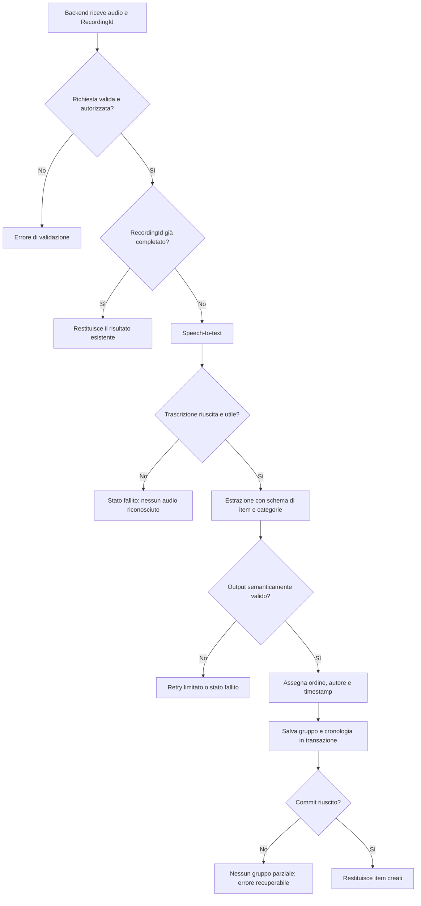
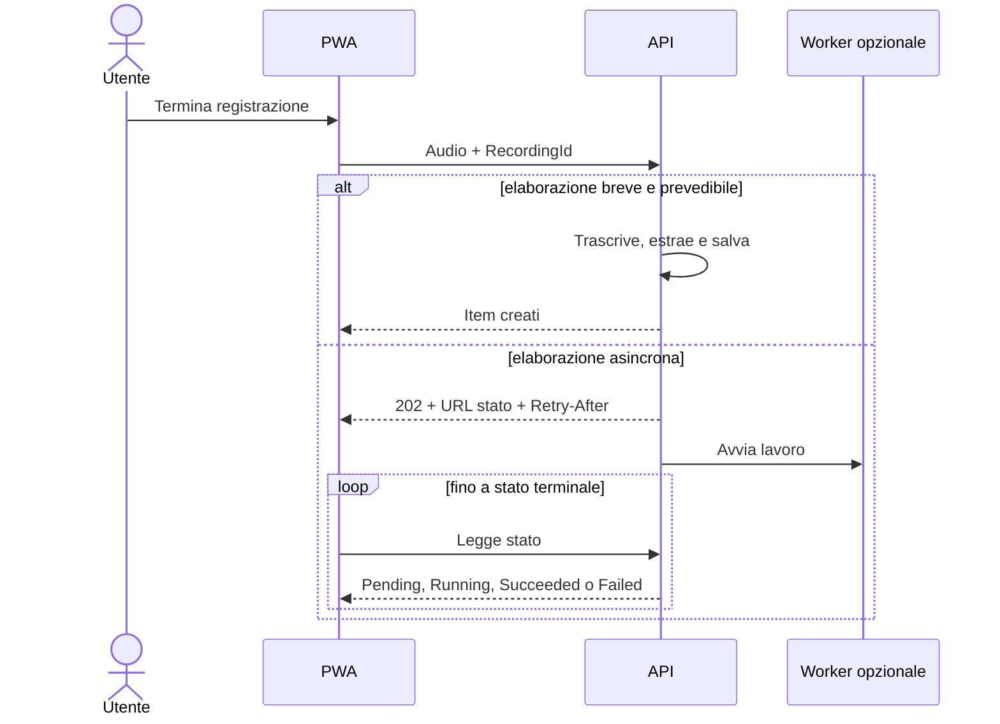

## description

Questo task inizia quando il backend riceve un audio valido e termina quando un gruppo ordinato di item con categorie è stato salvato oppure quando viene prodotto un errore comprensibile. Il problema ha due passaggi distinti: trasformare suoni in testo e trasformare quel testo in dati di KinList. Il primo è *speech-to-text*; il secondo è estrazione strutturata tramite un modello linguistico.

Esempio concreto: «Devo comprare latte, pasta e lamette» diventa prima una trascrizione; successivamente il modello restituisce tre oggetti ordinati, ciascuno con un nome e un elenco di categorie. Il backend valida questi oggetti, associa lo stesso `RecordingId`, assegna una posizione crescente nel gruppo e li salva insieme. La UI non deve interpretare testo libero né decidere quali campi fidarsi.

Microsoft Azure Speech offre trascrizione in tempo reale, rapida per file e batch; il quickstart indica che l'API per audio breve riconosce file fino a 60 secondi, mentre i casi asincroni hanno API diverse ([Speech to text](https://learn.microsoft.com/en-us/azure/ai-services/speech-service/get-started-speech-to-text)). Azure OpenAI Structured Outputs fa aderire la risposta a uno schema JSON, diversamente dalla sola modalità JSON che non garantisce lo schema ([Structured Outputs](https://learn.microsoft.com/en-us/azure/foundry/openai/how-to/structured-outputs)).

### Fatti noti

- L'AI deve individuare item distinti, assegnare una o più categorie e mantenere l'ordine pronunciato.
- Gli item vengono creati direttamente, senza anteprima intermedia.
- Registrazioni successive aggiungono item alla lista.
- `RecordingId` raggruppa gli item della stessa registrazione.
- Il meccanismo AI non è ancora deciso.

### Ipotesi prudenti

- L'audio e la trascrizione possono contenere dati personali; si minimizzano conservazione e logging.
- Il backend è l'unico componente autorizzato a chiamare i servizi AI e a scrivere nel database.
- Una singola registrazione viene salvata come unica unità: o tutti gli item validi del gruppo, o nessuno.

### Decisioni aperte

- Lingue supportate e criterio per selezionare la lingua di trascrizione.
- Limite audio, latenza attesa e quindi flusso HTTP sincrono o lavoro asincrono.
- Catalogo categorie: libero, normalizzato, limitato a categorie esistenti o combinazione delle due modalità.
- Regole per duplicati, frasi ambigue, audio senza item e parole con quantità.
- Regione Azure, modello/versione, budget, requisiti di residenza e conservazione dati.
- Se audio e trascrizione debbano essere conservati per diagnosi: la raccomandazione predefinita è no.

## best practices microsoft ux

Dopo il secondo tocco l'utente ha già espresso l'intenzione di creare item. Poiché non è prevista anteprima, il sistema deve offrire uno stato di avanzamento onesto e un esito esplicito. Non mostrare percentuali inventate: trascrizione e inferenza non forniscono necessariamente un progresso lineare. Un indicatore indeterminato con testo breve, per esempio «Creo la lista», comunica che il lavoro continua.

Stati richiesti:

- **Invio audio:** impedire una nuova registrazione sullo stesso controllo finché l'audio non è stato accettato; non bloccare la lettura della lista esistente.
- **Elaborazione:** mantenere il contesto e il microfono in stato non disponibile; se il backend è asincrono, la UI legge lo stato con intervalli indicati dal server.
- **Nessun item riconosciuto:** non creare righe vuote; dire «Non ho trovato elementi da aggiungere» e offrire una nuova registrazione.
- **Errore recuperabile:** «Non riesco a elaborare l'audio. Riprova» senza accusare l'utente; riutilizzare `RecordingId` se si riprende lo stesso lavoro.
- **Successo:** inserire il gruppo in cima, annunciare il numero di item aggiunti tramite una regione `aria-live` non invasiva e spostare il microfono nella posizione prevista senza perdere il focus.

L'assenza di anteprima rende più importante la modificabilità immediata: un nome o una categoria errati devono poter essere corretti dal drawer già previsto, non da una nuova schermata. Tuttavia non aprire automaticamente più drawer: l'utente deve prima vedere il risultato complessivo.

Alternative considerate:

- **Trascrizione visibile da confermare:** riduce errori ma aggiunge un passaggio espressamente escluso dall'esperienza «Parla → Ottieni la lista».
- **Correzione automatica silenziosa dopo la creazione:** rende instabile la lista e la cronologia; non raccomandata.
- **Creazione diretta con errori correggibili:** rispetta l'idea e mantiene il flusso breve; è la raccomandazione.

## best practices microsoft backend

### Dal file audio al salvataggio

1. Il backend autentica, valida audio e `RecordingId` e verifica che lo stesso identificatore non sia già stato completato.
2. Speech-to-text produce testo e uno stato di riconoscimento. Un fallimento non deve essere trasformato in lista vuota.
3. Il modello linguistico riceve solo la trascrizione e istruzioni strettamente necessarie. Deve restituire uno schema con `items[]`, e per ogni item `name` e `categories[]`.
4. Structured Outputs riduce risposte fuori formato, ma non garantisce che il contenuto sia corretto. Il backend applica ancora limiti di lunghezza, normalizzazione, valori vuoti, numero massimo di item e regole sulle categorie.
5. Il backend assegna `RecordingId`, `PositionInRecording`, timestamp e autore; questi valori non vengono affidati al modello.
6. Una transazione salva recording, item, relazioni con categorie ed eventi di creazione. Se il salvataggio fallisce, non deve restare un gruppo parziale.

### Concetti spiegati

- **Schema JSON:** descrive la forma esatta della risposta, per esempio un array di oggetti con campi obbligatori. Serve a evitare parsing fragile; non sostituisce la validazione del significato.
- **Idempotenza:** la stessa richiesta identificata da `RecordingId` può essere ripetuta senza creare duplicati. Serve quando il client non sa se una risposta persa nasconda un successo.
- **Transazione:** il database applica tutte le scritture collegate o nessuna. Qui evita gruppi con solo alcuni item o cronologia mancante.

La trascrizione e l'estrazione vanno separate anche se in futuro un singolo modello potesse fare entrambe: consente di misurare quale passaggio fallisce, cambiare fornitore/modello e non confondere testo riconosciuto male con interpretazione sbagliata. Una pipeline a due passaggi costa una chiamata in più, ma offre un confine diagnostico utile. La scelta a chiamata unica può essere rivalutata solo con test reali di qualità, latenza e costo.

Il prompt deve trattare la trascrizione come dati non affidabili. Frasi pronunciate dall'utente non devono modificare le regole di sistema né autorizzare campi diversi. Registrare versione di prompt, modello e schema come metadati tecnici aiuta a confrontare regressioni; non registrare la trascrizione nei log ordinari.

### Sincrono o asincrono

Il caso più semplice è mantenere aperta la richiesta finché AI e salvataggio finiscono. È proporzionato solo con durata audio limitata, latenza misurata sotto i timeout di browser/gateway e volume basso. Se il lavoro dura alcuni secondi in modo imprevedibile o deve sopravvivere a disconnessioni, Microsoft descrive il flusso Asynchronous Request-Reply: risposta `202 Accepted`, URL di stato, `Retry-After` e stati `Pending/Running/Succeeded/Failed` ([pattern asincrono](https://learn.microsoft.com/en-us/azure/architecture/patterns/asynchronous-request-reply)).

La raccomandazione è condizionata: iniziare sincrono solo dopo avere fissato un limite breve e un obiettivo di latenza; altrimenti adottare subito l'operazione asincrona. Non introdurre una coda soltanto per “best practice”: essa aggiunge storage dello stato, worker, retry e pulizia.

Errori API devono usare un contratto coerente come Problem Details e distinguere input rifiutato, audio non riconosciuto, output AI non valido, limite/costo e dipendenza temporaneamente indisponibile. I retry automatici devono essere limitati ai guasti transitori e non moltiplicare chiamate costose o item.

## best practices microsoft infrastructure

Risorse realmente candidate, da confermare contro Kin Hub:

- una risorsa Speech/Foundry per trascrizione;
- un deployment Azure OpenAI compatibile con Structured Outputs;
- il backend esistente o, se assente, un host .NET/Functions;
- il database esistente; in assenza di vincoli, un database relazionale è coerente con item, categorie molti-a-molti, utenti e cronologia;
- Storage e coda soltanto se il flusso asincrono li richiede.

Le credenziali non attraversano il browser. In Azure, assegnare al backend un'identità gestita con il ruolo minimo necessario; Microsoft raccomanda Entra ID/managed identity per evitare credenziali nelle applicazioni cloud ([Speech quickstart](https://learn.microsoft.com/en-us/azure/ai-services/speech-service/get-started-speech-to-text)). Limitare rete e regioni secondo requisiti di residenza ancora da definire.

Per un carico iniziale intermittente e senza database esistente, Azure SQL Database serverless può ridurre gestione e costo, ma la ripresa dopo pausa introduce latenza. Microsoft lo indica per utilizzo intermittente e imprevedibile che tollera il warm-up; il tier provisioned è preferibile quando la risposta immediata è essenziale ([Azure SQL serverless](https://learn.microsoft.com/en-us/azure/azure-sql/database/serverless-tier-overview)). Non scegliere il tier prima di definire l'obiettivo di latenza.

Osservabilità: trace unico da `RecordingId` attraverso upload, Speech, modello e database; metriche di durata per fase, errori per categoria, numero di item e consumo token aggregato. Application Insights/OpenTelemetry permette mappe, failure e performance ([Application Insights](https://learn.microsoft.com/en-us/azure/azure-monitor/app/app-insights-overview)). Applicare campionamento e redazione: nomi, voce e trascrizioni non appartengono alla telemetria tecnica.

Non sono giustificati orchestratori, microservizi separati per ogni passaggio, multi-regione attiva/attiva o conservazione permanente dell'audio. Una pipeline applicativa in un backend modulare è la base più semplice.

## flow chart





## user experience

La lista esistente resta leggibile durante l'elaborazione. Se non esistono ancora item, il controllo centrale diventa stato di avanzamento; al successo il layout transita alla lista e il microfono va in basso.

```text
┌──────────────────────────────┐
│                              │
│        Creo la lista…        │
│             ◌                │
│                              │
└──────────────────────────────┘
```

```text
┌──────────────────────────────┐
│ Non ho trovato elementi      │
│ da aggiungere.               │
│                              │
│ [ Registra di nuovo ]        │
└──────────────────────────────┘
```

- **Loading:** indicatore indeterminato e testo breve; niente percentuali fittizie.
- **Empty:** se il risultato non contiene item, resta lo stato vuoto con possibilità di riprovare.
- **Errore:** messaggio specifico e recuperabile; il doppio tocco su «Riprova» non duplica il gruppo.
- **Successo:** gruppo completo in cima, ordine pronunciato preservato e annuncio «N item aggiunti».
