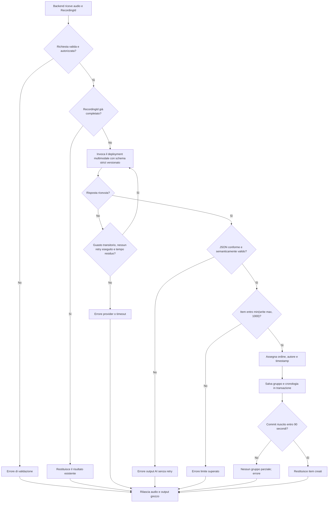
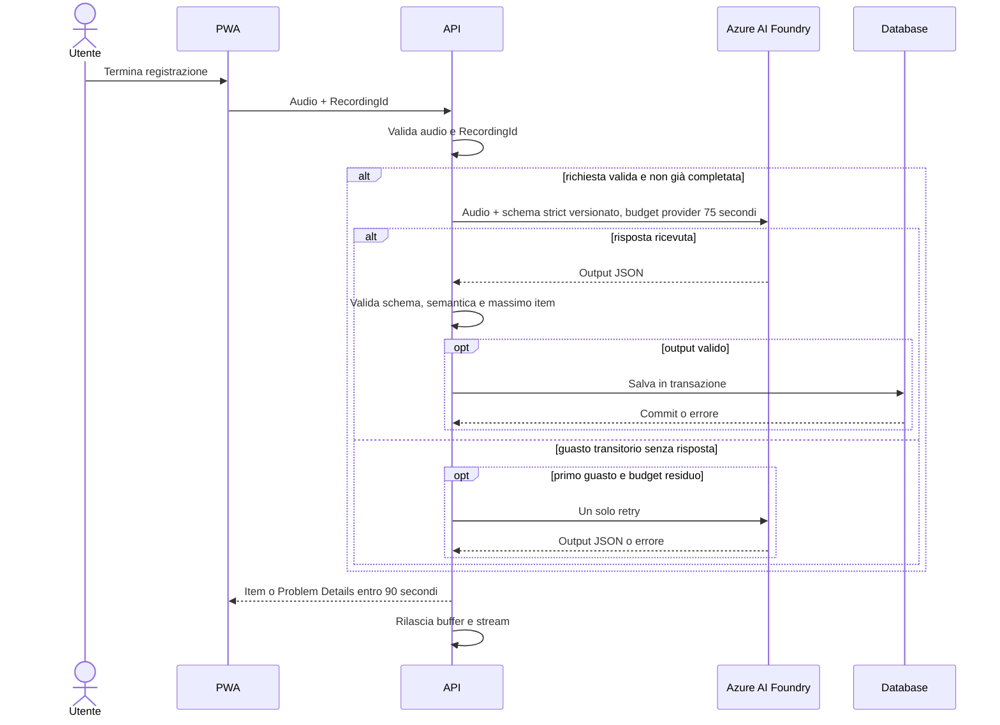

## description

Questo task inizia quando il backend riceve un audio valido e termina, nella stessa richiesta HTTP, quando un gruppo ordinato di item con categorie è stato salvato oppure quando viene prodotto un errore comprensibile. Il problema è trasformare direttamente la voce in dati affidabili di KinList senza affidare al browser o al modello l'autorità di scrittura.

Esempio concreto: il backend invia l'audio «Devo comprare latte, pasta e lamette» a un deployment multimodale Azure AI Foundry, cioè un modello capace di ricevere audio e restituire dati strutturati. Il modello restituisce tre oggetti ordinati, ciascuno con nome e categorie. Il backend valida forma e significato, applica i propri limiti, associa `RecordingId`, assegna la posizione e salva tutto insieme. La UI non interpreta testo libero e il modello non genera identificatori, autore, timestamp o comandi di database.

Il deployment è configurabile per ambiente, ma la versione del modello è fissata esplicitamente (*pinned*) e non segue automaticamente una versione nuova. Questo rende ripetibili test e diagnosi pur consentendo di cambiare deployment tramite configurazione controllata. Gli Structured Outputs di Azure AI Foundry vincolano la forma della risposta a uno schema JSON; il backend deve comunque validarne il significato ([Structured Outputs](https://learn.microsoft.com/en-us/azure/foundry/openai/how-to/structured-outputs)).

### Fatti noti

- L'AI individua item distinti, assegna una o più categorie e mantiene l'ordine pronunciato.
- Gli item vengono creati direttamente, senza anteprima intermedia.
- Registrazioni successive aggiungono item alla lista.
- `RecordingId` raggruppa gli item della stessa registrazione.
- Il flusso usa un deployment multimodale Azure AI Foundry configurabile con versione pinned.
- Il contratto e lo schema JSON sono strict e versionati; il backend è l'autorità finale su validazione e scrittura.
- Audio e output grezzo del provider restano soltanto in buffer o stream in memoria per la richiesta sincrona e vengono rilasciati immediatamente.
- Il timeout del provider è 75 secondi e quello complessivo della richiesta è 90 secondi.
- È ammesso al massimo un retry del provider, soltanto dopo un guasto transitorio senza risposta; una risposta JSON semanticamente invalida non viene ritentata.
- Il numero massimo di item in output è il minore tra `configuredWriteMax`, configurato inizialmente a 1000, e il tetto assoluto di 1000.

### Ipotesi prudenti

- Audio, nomi e categorie possono contenere dati personali; non vengono inseriti in log o telemetria.
- Una singola registrazione viene salvata come unica unità: o tutti gli item validi del gruppo, o nessuno.
- Il deployment configurato supporta insieme l'input audio e lo Structured Output richiesto; questa compatibilità viene verificata prima del rilascio.

### Decisioni aperte

- Dataset di valutazione e soglie qualitative per italiano, inglese e rilevamento automatico della lingua parlata.
- Regole per duplicati, frasi ambigue, audio senza item e parole con quantità.
- Regione Azure, modello e versione pinned da configurare, budget e requisiti di residenza dei dati.

## best practices microsoft ux

Dopo il secondo tocco l'utente ha già espresso l'intenzione di creare item. Poiché non è prevista anteprima, il sistema offre uno stato di avanzamento onesto e un esito esplicito. Non mostra percentuali inventate: l'inferenza non fornisce necessariamente un progresso lineare. Un indicatore indeterminato con testo breve, per esempio «Creo la lista», comunica che il lavoro continua.

Stati richiesti:

- **Invio ed elaborazione:** impedire una nuova registrazione sullo stesso controllo finché la richiesta sincrona non termina; non bloccare la lettura della lista esistente.
- **Nessun item riconosciuto:** non creare righe vuote; dire «Non ho trovato elementi da aggiungere» e offrire una nuova registrazione.
- **Errore recuperabile:** «Non riesco a elaborare l'audio. Registra di nuovo» senza accusare l'utente. Il buffer non viene conservato per un retry successivo.
- **Successo:** inserire il gruppo in cima, annunciare il numero di item aggiunti tramite una regione `aria-live` non invasiva e spostare il microfono nella posizione prevista senza perdere il focus.

L'assenza di anteprima rende più importante la modificabilità immediata: un nome o una categoria errati devono poter essere corretti dal drawer già previsto, non da una nuova schermata. Il sistema non apre automaticamente più drawer, perché l'utente deve prima vedere il risultato complessivo.

La trascrizione visibile da confermare aggiungerebbe un passaggio escluso dall'esperienza «Parla → Ottieni la lista». La creazione diretta con errori correggibili rispetta il flusso approvato; una correzione automatica successiva renderebbe invece instabile una lista già mostrata e non viene introdotta.

## best practices microsoft backend

### Dall'audio al salvataggio

1. Il backend autentica, valida audio e `RecordingId` e verifica che lo stesso identificatore non sia già stato completato.
2. Legge da configurazione il deployment multimodale e la versione pinned, quindi invia audio e istruzioni strettamente necessarie senza scrivere file.
3. Richiede uno Structured Output conforme alla versione dichiarata del contratto, con `items[]` e, per ogni item, `name` e `categories[]`. Uno schema *strict* non ammette proprietà inattese e rende espliciti campi obbligatori e limiti rappresentabili.
4. Il backend valida anche il significato: valori non vuoti, lunghezze, categorie, ordine e numero di item. Il massimo effettivo è `min(configured write max, 1000)`; il modello non può aumentarlo.
5. Il backend assegna `RecordingId`, `PositionInRecording`, timestamp e autore. Questi dati autorevoli non vengono chiesti al modello.
6. Una transazione salva recording, item, relazioni con categorie ed eventi di creazione. Se il salvataggio fallisce, non resta un gruppo parziale.
7. In ogni esito, audio e output grezzo vengono rilasciati immediatamente dalla memoria.

### Concetti spiegati

- **Contratto e schema JSON versionati:** il contratto definisce il significato condiviso, mentre lo schema descrive la forma esatta, per esempio un array di oggetti con campi obbligatori. La versione consente di riconoscere cambi incompatibili; la modalità strict evita campi inattesi, ma non sostituisce la validazione semantica del backend.
- **Idempotenza:** lo stesso `RecordingId` non può creare due gruppi. Serve contro duplicazioni di trasporto o una risposta persa, ma non implica conservare l'audio per tentativi successivi.
- **Transazione:** il database applica tutte le scritture collegate o nessuna. Qui evita gruppi con solo alcuni item o cronologia mancante.

La chiamata multimodale unica evita una trascrizione intermedia da conservare e rispetta la decisione approvata. Per mantenere osservabilità senza esporre contenuto, si misurano durata, esito, versione del contratto e deployment, non audio o risposta grezza.

Il prompt tratta l'audio come input non affidabile. Frasi pronunciate dall'utente non possono modificare le regole di sistema né autorizzare campi diversi. Versione di prompt, deployment, modello pinned, contratto e schema sono metadati tecnici utili per confrontare regressioni; il contenuto grezzo non entra nei log.

### Timeout e retry

La richiesta complessiva ha un limite di 90 secondi. Dentro quel limite, il tempo totale concesso al provider è 75 secondi; validazione, eventuale retry, salvataggio e costruzione della risposta devono rispettare il tempo residuo. I timeout vengono propagati con annullamento fino al client del provider e al database, così il processo non continua inutilmente dopo la scadenza.

È consentito al massimo un retry e solo se il primo tentativo termina con un guasto transitorio senza alcuna risposta, per esempio una connessione interrotta prima di ricevere dati. Il retry usa soltanto il tempo rimasto nei budget di 75 e 90 secondi. Se arriva una risposta JSON ma fallisce lo schema o la validazione semantica, il backend restituisce un errore controllato senza retry: ripetere la stessa inferenza aumenterebbe costo e latenza senza correggere una risposta già ricevuta.

Gli errori API usano Problem Details e distinguono input rifiutato, audio non interpretabile, output AI non valido, massimo item superato, timeout e dipendenza temporaneamente indisponibile. Non servono una coda, un worker o un orchestratore: una funzione applicativa nel backend modulare coordina l'unica richiesta.

## best practices microsoft infrastructure

Risorse necessarie, riusando quelle già presenti in KinHub:

- un deployment multimodale Azure AI Foundry compatibile con Structured Outputs, selezionato da configurazione e con versione pinned;
- la Function App .NET esistente come backend autorevole;
- il database PostgreSQL esistente per il salvataggio transazionale;
- Application Insights già previsto, limitato a telemetria tecnica.

Le credenziali non attraversano il browser. A runtime la Function App usa una managed identity con il solo ruolo necessario a invocare il deployment e ad accedere alle dipendenze applicative. La pipeline usa un'identità separata per amministrazione, configurazione e migration, con permessi concessi solo alle fasi che ne hanno bisogno. Non esiste fallback con password, chiavi applicative o connection string basate su password: un errore di identità fallisce in modo esplicito, senza cambiare silenziosamente metodo di autenticazione.

La configurazione rende espliciti endpoint, nome deployment, versione modello pinned, versione del contratto e limiti. Un cambio di versione passa dalla pipeline e dalle verifiche previste, non dall'identità runtime. Il ruolo amministrativo della pipeline non viene assegnato alla managed identity dell'applicazione.

Osservabilità: trace unico da `RecordingId` attraverso upload, provider e database; metriche di durata per fase, tentativi provider, timeout, errori per categoria, numero di item e consumo aggregato. Application Insights/OpenTelemetry permette mappe, failure e performance ([Application Insights](https://learn.microsoft.com/en-us/azure/azure-monitor/app/app-insights-overview)). Applicare campionamento e redazione: nomi, voce e output grezzo non appartengono alla telemetria tecnica.

Non servono Storage, file temporanei, code, worker, orchestratori, microservizi separati o conservazione dell'audio. Buffer e stream in memoria sono rilasciati immediatamente in successo, errore, annullamento e timeout.

## flow chart





## user experience

La lista esistente resta leggibile durante l'elaborazione. Se non esistono ancora item, il controllo centrale diventa stato di avanzamento; al successo il layout transita alla lista e il microfono va in basso.

```text
┌──────────────────────────────┐
│                              │
│        Creo la lista...      │
│             ( )              │
│                              │
└──────────────────────────────┘
```

```text
┌──────────────────────────────┐
│ Non ho trovato elementi      │
│ da aggiungere.               │
│                              │
│ [ Registra di nuovo ]        │
└──────────────────────────────┘
```

- **Loading:** indicatore indeterminato e testo breve; niente percentuali fittizie o polling asincrono.
- **Empty:** se il risultato non contiene item, resta lo stato vuoto con possibilità di registrare di nuovo.
- **Errore:** messaggio specifico; l'azione proposta è registrare di nuovo, perché nessun audio viene conservato dopo la richiesta.
- **Successo:** gruppo completo in cima, ordine pronunciato preservato e annuncio «N item aggiunti».
